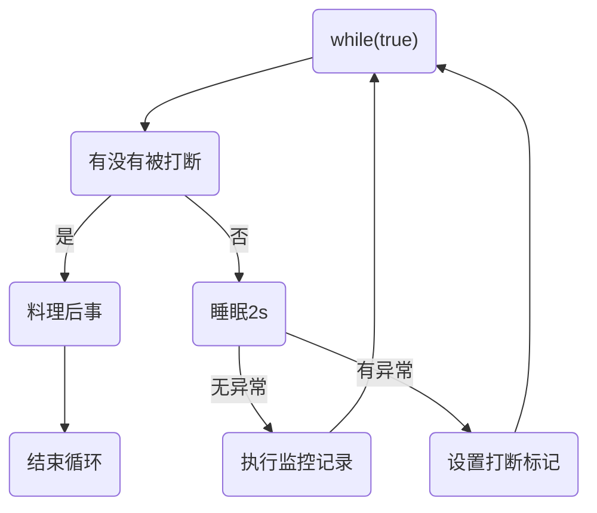
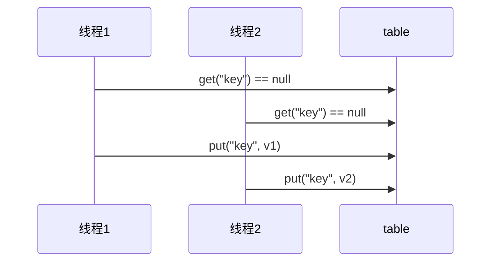

# **Java并发编程**

## **并发编程基础-线程**

**进程是资源分配的最小单位，线程是CPU调度的最小单位**。线程则是进程的一个执行路径，一个进程里至少有一个线程，进程中的多个线程共享进程的资源。

例子：在Java中，当我们运行一个main函数时就启动了一个JVM进程，而main函数所在的线程就是这个进程中的一个线程，也称为主线程。如果一个JVM进程有多个线程，那么他们就会共享JVM中的堆和方法区，但是每个进程又有自己私有的资源，比如程序计数器，虚拟机栈和本地方法栈

> **通常pc计数器指向的是当前线程下一条指令的地址，但是如果执行的native方法，pc计数器记录的是undefined地址**

### **线程的创建**

多线程的实现

- 继承Thread类并重写run方法
- 实现Runnable接口run方法

#### **继承Thread**

> ```java
> /**
>  * @author Wenjie FU
>  * @create 2021-07-21 20:46
>  */
> public class Cat extends Thread {
> 
>     @Override
>     public void run() {
>         int i = 0;
>         while (i != 10) {
>             System.out.println("miao miao");
>             i++;
>             try {
>                 Thread.sleep(100);
>             } catch (InterruptedException e) {
>                 e.printStackTrace();
>             }
> 
>         }
>     }
> 
>   //main函数会启动一个main线程  
>   public static void main(String[] args) {
>         Thread cat = new Cat(); //main线程创建一个子线程Thread-0，但是它并没有启动
>         cat.start(); //调用star方法，子线程启动。 此时main线程不会被阻塞，会继续与子线程交替执行直到结束（多核并行，单核并发）
>     		//等到程序的进程内所有的线程都结束后，进程被销毁，应用结束
>     }
> }
> 
> - 我们在程序里面调用了start()方法后，线程没有马上执行而是处于就绪状态，然后等到这个线程第一次得到时间片时再调用run()方法。
> ```
>

线程的启动为什么是调用start()方法而不是重写的run()方法

如果实例直接调用run()方法，其实就是直接调用一个实例的方法，是普通的串行化的执行。调用start才会真正的启动线程

****

```java
(1)
public synchronized void start() {
  ....
  start0();
  ....

}
(2)
这是一个本地方法，由JVM调用。
private native void start0();

```

#### **实现Runnable接口**

实现一个自定义的线程类，可以有继承`Thread`类或者实现`Runnable`接口这两种方式，它们之间有什么优劣呢？

- 由于Java“单继承，多实现”的特性，Runnable接口使用起来比Thread更灵活。如果继承了Thread类就不能继承其他类了
- 使用Runnable接口，可以将同一个类（任务）给多个线程同时运行，方便线程之间的资源共享。解而使用Thread类继承的方式将线程对象和线程任务耦合，不能够实现多个线程执行同一个任务。
- Runnable接口出现更符合面向对象，将线程单独进行对象的封装。
- Runnable接口出现，降低了线程对象和线程任务的耦合性。
- 如果使用线程时不需要使用Thread类的诸多方法，显然使用Runnable接口更为轻量。

所以，我们通常优先使用“实现`Runnable`接口”这种方式来自定义线程类。

```java
public class Thread2 {
    public static void main(String[] args) {
        Runnable dog = new Dog();
        Thread thread = new Thread(dog); //静态代理模式
        thread.start();
    }
}

class Dog implements Runnable {
    int i = 0;
    @Override
    public void run() {
        while (++i < 100) {
            System.out.println(Thread.currentThread().getName() + "" + i);
        }
    }
}
```

#### **Callable、Future与FutureTask接口**

##### **Callable接口**

Callable 与 Runnable 类似，同样是只有⼀个抽象⽅法的函数式接⼝。不同的 是， Callable 提供的⽅法是有返回值的，⽽且⽀持泛型。

```java
@FunctionalInterface
public interface Callable<V> {
    /**
     * Computes a result, or throws an exception if unable to do so.
     *
     * @return computed result
     * @throws Exception if unable to compute a result
     */
    V call() throws Exception;
}
```

##### Future接口

```
public interface Future<V> {
    boolean cancel(boolean mayInterruptIfRunning);
    boolean isCancelled();
    boolean isDone();
    V get() throws InterruptedException, ExecutionException;
    V get(long timeout, TimeUnit unit)
        throws InterruptedException, ExecutionException, TimeoutException;
}

```

##### FutureTask类

 Future 接⼝。这个接⼝有⼀个实现类叫 FutureTask 。 FutureTask 是 实现的 RunnableFuture 接⼝的，⽽ RunnableFuture 接⼝同时继承了 Runnable 接⼝ 和 Future 接⼝：

```
public class FutureTask<V> implements RunnableFuture<V>

public interface RunnableFuture<V> extends Runnable, Future<V> 
```

 Future 只是⼀个接⼝，⽽它⾥⾯的 cancel ， get ， isDone 等⽅法要⾃⼰实现 起来都是⾮常复杂的。所以JDK提供了⼀个 FutureTask 类来供我们使⽤。**

```
@Slf4j(topic = "c.Test1")
public class Test1 {
    public static void main(String[] args) throws ExecutionException, InterruptedException {
        FutureTask<Integer> task = new FutureTask<>(new Callable<Integer>() {
            @Override
            public Integer call() throws Exception {
                log.debug("running");
                Thread.sleep(1000);
                return 100;
            }
        });

       Thread t1 =  new Thread(task,"t1");
       t1.start();
		//调用get方法，调用线程被会阻塞，等待到子线程返回后继续进行
       log.debug("{}", task.get());

    }

}

23:00:48.136 [t1] DEBUG c.Test1 - running
23:00:49.142 [main] DEBUG c.Test1 - 100
```


#### **静态代理模式**

[代理模式](https://link.segmentfault.com/?url=https%3A%2F%2Fzh.wikipedia.org%2Fwiki%2F%E4%BB%A3%E7%90%86%E6%A8%A1%E5%BC%8F)是一种设计模式，提供了对目标对象额外的访问方式，即通过代理对象访问目标对象，这样可以在不修改原目标对象的前提下，提供额外的功能操作，扩展目标对象的功能。


优点：可以在不修改目标对象的前提下扩展目标对象的功能。

缺点：

1. 冗余。由于代理对象要实现与目标对象一致的接口，会产生过多的代理类。
2. 不易维护。一旦接口增加方法，目标对象与代理对象都要进行修改。

```java
//接口类： IUserDao
package com.proxy;

public interface IUserDao {
    public void save();
}

//目标对象：UserDao
package com.proxy;

public class UserDao implements IUserDao{

    @Override
    public void save() {
        System.out.println("保存数据");
    }
}

//静态代理对象：UserDapProxy 需要实现IUserDao接口！
package com.proxy;

public class UserDaoProxy implements IUserDao{

    private IUserDao target;
    public UserDaoProxy(IUserDao target) {
        this.target = target;
    }
    
    @Override
    public void save() {
        System.out.println("开启事务");//扩展了额外功能
        target.save();
        System.out.println("提交事务");
    }
}

//测试类：TestProxy
package com.proxy;

import org.junit.Test;

public class StaticUserProxy {
    @Test
    public void testStaticProxy(){
        //目标对象
        IUserDao target = new UserDao();
        //代理对象
        UserDaoProxy proxy = new UserDaoProxy(target);
        proxy.save();
    }
}
//输出结果
开启事务
保存数据
提交事务
```

#### **Thread类**

`Thread`类是一个`Runnable`接口的实现类，我们来看看`Thread`类的源码。

查看`Thread`类的构造方法，发现其实是简单调用一个私有的`init`方法来实现初始化。`init`的方法签名：

```java
// Thread类源码 

// 片段1 - init方法
private void init(ThreadGroup g, Runnable target, String name,
                      long stackSize, AccessControlContext acc,
                      boolean inheritThreadLocals)

// 片段2 - 构造函数调用init方法
public Thread(Runnable target) {
    init(null, target, "Thread-" + nextThreadNum(), 0);
}
```


#### **常用方法**

- currentThread()：静态方法，返回对当前正在执行的线程对象的引用；
- start()：开始执行线程的方法，java虚拟机会调用线程内的run()方法；
- sleep()：静态方法，使当前线程睡眠一段时间；
- join()：使当前线程等待另一个线程执行完毕之后再继续执行，内部调用的是Object类的wait方法实现的；
- interrupt()：用于中断线程，但并没有真正结束线程。抛出异常中断线程，一般用catch捕获中断，唤醒正在休眠的线程

- join()：线程插队。插队的线程一旦插队成功，则肯定先执行完插入的线程的所有任务
- yield()：这里的yield()指的是当前线程愿意让出对当前处理器的占用。这里需要注意的是，就算当前线程调用了yield()方法，程序在调度的时候，也还有可能继续运行这个线程的；


#### **Thread的构造器**

#### **用户线程和守护线程**

1. **用户线程：也叫做工作线程，结束方式为：当线程的任务执行网完成或通知方式结束**
2. **守护线程：一般是为工作线程服务，当所有的用户线程结束，守护线程自动结束（比如，垃圾回收机制，或者可以将一个线程设置为守护线程）**


### **线程的状态转换**

#### **操作系统中的线程状态**

首先我们来看看操作系统中的线程状态转换。

****

操作系统线程主要有以下三个状态：

- 就绪状态(ready)：线程正在等待使用CPU，经调度程序调用之后可进入running状态。
- 执行状态(running)：线程正在使用CPU。
- 等待状态(waiting): 线程经过等待事件的调用或者正在等待其他资源（如I/O）。

#### **Java的线程状态**

****

```java
// Thread.State 源码
public enum State {
    NEW,
    
        /**
         * Thread state for a runnable thread.  A thread in the runnable
         * state is executing in the Java virtual machine but it may
         * be waiting for other resources from the operating system
         * such as processor.
         */    
    RUNNABLE,
    BLOCKED,
    WAITING,
    TIMED_WAITING,
    TERMINATED;
}
```

> Java线程的RUNNABLE状态其实是包括了传统操作系统线程的ready和 running两个状态的。
>
> 同时，当线程内进行类似文件读取的操作时，需要在操作系统层面上阻塞当前线程才能进行读取操作，但是这种情况也认为是runnable状态                                  

### **线程通知与等待**

#### **Object下相关方法**

##### **wait()方法**

当一个线程调用了wait()方法，该线程会被阻塞挂起并释放当前共享对象的锁（当前线程持有的其他共享对象的监视器锁并不会释放），直到

1. 其他线程调用了该共享对象的notify()或者notifyAll()方法
2. 其他线程调用了该线程的interrupt()方法，该线程抛出InterruptedException异常返回

如果调用wait()方法的线程没有事先获取该对象的监视锁，则调用wait()方法时调用线程会抛出IllegalMonitorStateException异常

```java
Exception in thread "main" java.lang.IllegalMonitorStateException
	at java.lang.Object.wait(Native Method)
	at java.lang.Object.wait(Object.java:502)
	at multipleThreadLearning.waitTest.main(waitTest.java:13)
```

为了防止虚假唤醒（上述条件不满足但线程仍然从挂起转换到运行状态），我们在实践中会不停去测试线程被唤醒的条件

```java
synchronized (obj){
	while (条件不满足){
		obj.wait
	}
}
```

当一个线程调用共享对象的wait()方法被阻塞挂起后，如果其他线程中断了该线程，则该线程会抛出Interruptedexception异常并返回。

##### **notify()函数**

一个线程调用共享对象的notify()方法后，会随机唤醒一个在该共享对象上调用wait系列方法后被挂起的线程。

**当执行notify/notifyAll方法时，会唤醒一个处于等待该 对象锁 的线程，然后继续往下执行，直到执行完退出对象锁锁住的区域（synchronized修饰的代码块）后再释放锁。**

被唤醒的线程不一定能够马上从wait系列方法之后执行，会先处于ready状态。需要该线程获取到了共享变量的监视器锁之后才可以继续执行。

类似于wait系列方法，如果当前线程没有获取到共享变量的监视器锁，并调用共享变量的notify()方法，会抛出IllegalMonitorStateException。

##### **notifyAll()函数**

会唤醒所有共享变量上调用wait()系列方法而被挂起的线程。但是不会唤醒在notifyAll()之后被挂起的线程。

#### **Thread下相关方法**

##### **join()方法**

t.join()方法阻塞调用此方法的线程(calling thread)，直到线程t完成，此线程再继续；通常用于在main()主线程内，等待其它线程完成再结束main()主线程

如果线程A调用线程B的join方法被阻塞后，其他线程调用了线程A的interrupt()方法中断线程A，线程A会抛出InterruptedException异常返回

##### sleep()方法

> 抱着锁睡觉

Thread下的一个静态类，当执行中的静态类调用sleep()方法，调用的线程被阻塞挂起，就不参与CPU调度，但是该线程所持有的监视器资源并不让出。在sleep期间如果有其他线程调用了该线程的interrupt()方法中断该线程，则该线程会在调用sleep方法的地方抛出IterruptedException异常返回

建议使用TimeUnit类提供的sleep方法代替Thread的sleep方法，进而提高程序的可读性

```java
TimeUnit.SECONDS.sleep(1);
```

**案例-防止CPU 占用100%**

在没有进行计算时，防止while(true)这类判断空转浪费CPU空间，可以使用yield或者sleep让出cpu的使用权

```java
public static void main(String[] args) {
    while (true) {
        try {
            TimeUnit.SECONDS.sleep(1);
        } catch (InterruptedException e) {
            e.printStackTrace();
        }
    }
}
```

sleep()并不会让出当前线程已经占有的锁，所以这只适合无需锁同步的方案。


##### **yield方法**

静态类yield告诉线程调度器，当前线程让出占有的剩下的时间片，处于就绪状态（并非阻塞）排入调度队列中。


> sleep()方法不会释放锁但是wait会

#### **线程中断**

- 处于阻塞状态的线程（因为sleep，wait，joint进入阻塞状态），被中断后，会自动将中断标记清空，为false
- 打中断处于运行状态的线程

Java中线程中断是一种线程间的协作模式，通过设置线程的中断标志并不能直接终止该线程的执行，而是被中断的线程根据中断状态自行处理

中断一个线程非常简单，只需要在其他线程中对目标线程调用`interrupt()`方法，目标线程需要反复检测自身状态是否是interrupted状态，如果是，就立刻结束运行。

```java
public class Main {
    public static void main(String[] args) throws InterruptedException {
        Thread t = new MyThread();
        t.start();
        Thread.sleep(1); // 暂停1毫秒
        t.interrupt(); // 中断t线程
        t.join(); // 等待t线程结束
        System.out.println("end");
    }
}

class MyThread extends Thread {
    public void run() {
        int n = 0;
        while (! isInterrupted()) {
            n ++;
            System.out.println(n + " hello!");
        }
    }
}

```

java.lang.Thread 类提供了几个方法来操作这个中断状态，这些方法包括：

| public static boolean interrupted | 测试当前线程是否已经中断。线程的中断状态 由该方法清除。换句话说，如果连续两次调用该方法，则第二次调用将返回 false（在第一次调用已清除了其中断状态之后，且第二次调用检验完中断状态前，当前线程再次中断的情况除外）。 |
| --------------------------------- | ------------------------------------------------------------ |
| public boolean isInterrupted()    | 测试线程是否已经中断。线程的中断状态不受该方法的影响。       |
| public void interrupt()           | 中断线程，将中断状态设置为true。                             |

#### **两阶段终止模式**



> 如果在睡眠时被打断，抛出异常然后主动设置打断标记为ture
>
> 如果在运行时被打断，打断标记自动为true，然后继续执行当前程序

```java
package itcast.test;

import lombok.extern.slf4j.Slf4j;

import java.util.concurrent.TimeUnit;

/**
 * @author Wenjie FU
 * @create 2021-11-01 11:01
 */
@Slf4j(topic = "c.TwoPhaseTermination")
public class TwoPhaseTermination {

    public static void main(String[] args) throws InterruptedException {
        TwoPhaseTermination twoPhaseTermination = new TwoPhaseTermination();
        twoPhaseTermination.start();

        Thread.sleep(3500);
        twoPhaseTermination.stop();


    }

    private Thread monitor;

    //启动监控线程
    public void start() {
        monitor = new Thread(() -> {
            while (true) {
                Thread current = Thread.currentThread();

                if (current.isInterrupted()) {
                    log.debug("料理后事");
                    break;
                } else {
                    try {
                        TimeUnit.MILLISECONDS.sleep(1000);//被中断情况1
                        log.debug("执行监控任务");//被中断情况2，在这里被中断，自然中断标志位为true
                    } catch (InterruptedException e) {
                        e.printStackTrace();
                        //对于被中断的情况1，在阻塞情况下被中断，抛出异常后，中断标志位会被清除，需要重新设置
                        current.interrupt();
                    }
                }
            }
        });

        monitor.start();
    }

    //停止监控线程
    public void stop() {
       monitor.interrupt();
    }
}

```

#### 不推荐的方法

这几个方法在终止线程时，线程所占有的锁资源不会释放，可能会造成线程死锁，不推荐使用

- stop() 停止线程运行
- suspend() 挂起线程运行
- resume() 恢复线程运行

### 线程的死锁

死锁指的是两个或者两个以上线程在执行过程中，因为争夺资源而造成的互相等待的现象。并且在无外力作用下，这种等待会一直持续下去。

线程的死锁必须具备四个条件

- 互斥条件
- 请求并持有条件
- 不可剥夺条件
- 环路等待条件

为了打破死锁，在这四个条件中可以改变的只有最后一条。因为造成死锁的原因和资源的申请顺序有非常大的关系。所以资源申请的有序性原则能够很好的避免死锁。如果多个线程获取资源的顺序保持一直，就能够避免死锁


### **守护线程和用户线程**

当JVM启动时会调用main函数（main函数就是一个用户线程），同时JVM还会启动很多守护线程（比如垃圾回收线程）。

当最后一个非守护线程结束时，JVM会退出，而不管当前是否有守护线程。

> 子线程的生命周期不受父线程的影响
>
> 在main函数线程运行结束后，JVM会启动一个叫做DestroyJavaJVM的线程，该线程会等待所有用户线程结束后终止JVM进程

- 如果希望主线程结束后，JVM进程马上结束，那么就在创建线程时将其设置为守护线程
- 如果希望主线程结束后某个子线程继续工作，等子线程结束工作后JVM进程再结束，那只要将其设置为普通的用户线程即可

### **ThreadLocal**

ThreadLocal` 是 java 提供的一个方便对象在本线程内不同方法中传递和获取的类。用它定义的变量，仅在本线程中可见和维护，不受其他线程的影响，与其他线程相互隔离。

#### **ThreadLocal实现原理**

****

在每个Thread类中都有一个threadLocals和一个inheritableThreadLocal，类型都是ThreadLocalMap。ThreadLocalMap是定制化的HashMap。

```
ThreadLocalMap is a customized hash map suitable only for
* maintaining thread local values
```

在默认情况下，每个线程中这两个变量都是null，只有当前线程第一次调用ThreadLocal中的set和get方法时才创建他们。

```java
/* ThreadLocal values pertaining to this thread. This map is maintained
 * by the ThreadLocal class. */
ThreadLocal.ThreadLocalMap threadLocals = null;

/*
 * InheritableThreadLocal values pertaining to this thread. This map is
 * maintained by the InheritableThreadLocal class.
 */
ThreadLocal.ThreadLocalMap inheritableThreadLocals = null;
```

虽然我们通过ThreadLocal的进行set和get，但每个线程的本地变量并不是存在ThreadLocal的实例里，而是存在调用线程的threadLocalas变量里。也就是说ThreadLocal类型的本地变量存放在具体的线程空间里。

****

Thread里面的threadLocals设计成map是为了让每个线程可以关联多个ThreadLocal变量。

ThreadLocal只是一个包装的工具壳，通过一系列方法操作线程里的threadlcoals。

当本地变量不被需要时要使用ThreadLocal的remove方法删除本地变量，否则只要该线程存在，本地变量就存在。

**总结：在每个线程内部都有一个threadLocals成员变量，该变量类型为HashMap。Map的key是ThreadLocal变量的this引用。**

#### **InheritableThreadLocal类**

根据ThreadLocal类的定义，它只能在当前线程内使用，而能够被其它线程修改。但这也导致了一个问题，也就是父线程定义的ThreadLocal在其子线程是不能够被访问的。InheritableThreadLocal能够让子线程可以访问在父线程中设置的本地变量

```


public class InheritableThreadLocal<T> extends ThreadLocal<T> {
    /**
     * Computes the child's initial value for this inheritable thread-local
     * variable as a function of the parent's value at the time the child
     * thread is created.  This method is called from within the parent
     * thread before the child is started.
     * <p>
     * This method merely returns its input argument, and should be overridden
     * if a different behavior is desired.
     *
     * @param parentValue the parent thread's value
     * @return the child thread's initial value
     */
    protected T childValue(T parentValue) {
        return parentValue;
    }

    /**
     * Get the map associated with a ThreadLocal.
     *
     * @param t the current thread
     */
    ThreadLocalMap getMap(Thread t) {
       return t.inheritableThreadLocals;
    }

    /**
     * Create the map associated with a ThreadLocal.
     *
     * @param t the current thread
     * @param firstValue value for the initial entry of the table.
     */
    void createMap(Thread t, T firstValue) {
        t.inheritableThreadLocals = new ThreadLocalMap(this, firstValue);
    }
}
```

InheritableThreadLocal重写了ThreadLocal的三个方法，其中createMamp和getMap方法，使得当前线程的inheritableThreadLocals变量的实例不再是threadLocals。


### **线程组线程优先级**

#### **线程组**

Java中使用ThreadGroup来表示线程组，每个Thread必然属于一个ThreadGroup中。如果在new Thread时没有显示指定线程组，那么默认将父线程线程组设置为自己的线程组

ThreadGroup使用一个标准的向下引用的树状结构，防止上级线程被下级线程引用而无法有效的被GC回收

#### **线程的优先级**

Java中线程优先级分为1~10，高优先级的线程会比低优先级的线程有更高的几率得到执行。Java只是给操作系统一个优先级的参考值，线程最终在操作系统中的优先级由操作系统决定。

如果某个线程优先级⼤于线程所在线程组的最⼤优先级，那么该线程的优先 级将会失效，取⽽代之的是线程组的最⼤优先级。

```java
    /**
     * The minimum priority that a thread can have.
     */
    public final static int MIN_PRIORITY = 1;

   /**
     * The default priority that is assigned to a thread.
     */
    public final static int NORM_PRIORITY = 5;

    /**
     * The maximum priority that a thread can have.
     */
    public final static int MAX_PRIORITY = 10;
```


## 并发编程基础-共享内存模型

### 临界区

一个代码块，如果存在对共享资源的对线程读写操作，称这块代码为临界区

在临界区，多个线程对共享资源进行读写操作时，可能发生指令交错，从而导致多线程安全问题

多个线程在临界区内执行，由于代码的执行序列不同而导致结果无法预测，称之为发生了竞态条件（Race Condition）

### 变量的线程安全分析

**成员变量和静态变量是否线程安全？**

- 如果它们没有共享，则线程安全
- 如果它们被共享了，根据它们的状态是否能够改变
  - 如果是只读操作，则线程安全
  - 如果有读写操作，则这段代码是临界区，需要考虑线程安全

**局部变量是否线程安全**

- 基础类型的局部变量是安全的（局部变量存在每个线程各自的虚拟机栈的栈帧的局部变量表中，不存在共享）
- 但是局部变量的引用对象不一定是安全的
  - 如果该对象没有逃离方法的作用范围，它是安全的
  - 如果该对象逃离了方法作用范围（比如被用return返回了），则需要考虑线程安全问题

如何检查线程安全问题：

1. 是否有变量
2. 是局部变量，成员变量还是静态变量
3. 变量是否被多个线程共享
4. 是否有读写操作


### 常见线程安全类

- String
- Integer
- StringBuffer
- Random
- Vector
- HashTabel（HashMap不是线程安全的实现类）
- java.util.concurrent包下的类

String，Integer等是不可变类，因为其内部的状态是不可改变，因此它们的方法都是线程安全的。比如String类的substring方法，返回的是一个新的字符串

```java
public String substring(int beginIndex) {
    if (beginIndex < 0) {
        throw new StringIndexOutOfBoundsException(beginIndex);
    }
    int subLen = value.length - beginIndex;
    if (subLen < 0) {
        throw new StringIndexOutOfBoundsException(subLen);
    }
    return (beginIndex == 0) ? this : new String(value, beginIndex, subLen);
}
```

这里我们说的线程安全是指，多个线程调用同一个实例的某个方法时，是线程安全的。但是多个线程安全的方法组合在一起不一定是线程安全的

```java
Hashtable table  = new Hashtable();
//线程1， 线程2
if (table.get("key") == null) {
	table.put("key",value);
}
```



### Java对象头


在Hotspot虚拟机中，对象在内存中的存储布局分为 3 块区域：对象头（Header）、实例数据（Instance Data）和对齐填充（Padding）

对象头包含了两部分，分别是 运行时元数据（Mark Word）和 类型指针

> 如果是数组，还需要记录数组的长度

普通的对象获取到的对象头结构为:

```ruby
|--------------------------------------------------------------|
|                     Object Header (128 bits)                 |
|------------------------------------|-------------------------|
|        Mark Word (64 bits)         | Klass pointer (64 bits) |
|------------------------------------|-------------------------|
```

数组对象获取到的对象头结构为:

```ruby
|---------------------------------------------------------------------------------|
|                                 Object Header (128 bits)                        |
|--------------------------------|-----------------------|------------------------|
|        Mark Word(64bits)       | Klass pointer(32bits) |  array length(32bits)  |
|--------------------------------|-----------------------|----------
```

Markword，这部分主要用来存储对象自身的运行时数据，如hashcode、gc分代年龄等。

```
|------------------------------------------------------- |--------------------|
|                  Mark Word (32 bits)                   |       State        |
|------------------------------------------------------- |--------------------|
| identity_hashcode:25 | age:4 | biased_lock:0 | lock:01 |       Normal       |
|------------------------------------------------------- |--------------------|
|  thread:23 | epoch:2 | age:4 | biased_lock:1 | lock:01 |       Biased       |
|------------------------------------------------------- |--------------------|
|               ptr_to_lock_record:30          | lock:00 | Lightweight Locked |
|------------------------------------------------------- |--------------------|
|               ptr_to_heavyweight_monitor:30  | lock:10 | Heavyweight Locked |
|------------------------------------------------------- |--------------------|
|                                              | lock:11 |    Marked for GC   |
|------------------------------------------------------- |--------------------|
```

### Monitor

Monitor被翻译为监视器或管程


每个Java对象都可以被关联一个Monitor对象，如果使用synchronized给对象上锁（synchronized是重量级锁），该对象头的Mark Word中就被设置为指向Monitor对象的指针


- 刚开始Monitor中的Owner为null
- 当Thread-2执行synchronized(obj)就会将Monitor 的Owner置位Thread-2。Monitor的Owner只能有一个
- 如果在Thread-2为Owner时，Thread-3，Thread-4，Thread-5也来执行synchronzied(obj)，就会进入EntryList BLOCKED
- 当Thread-2执行完同步代码块的内容后，唤醒EntryList中等待的线程来竞争锁，竞争是非公平的
- 图中WaitSet中的Thread-0，Thread-1是之前获得过锁，但是条件不满足进入WAITING状态的线程。

**synchronized字节码**

```
package itcast.test;

/**
 * @author Wenjie FU
 * @create 2021-11-02 21:08
 */
public class MonitorTest {
    static final Object lock = new Object();
    static int counter = 0;

    public static void main(String[] args) {
        synchronized (lock){
            counter++;
        }
    }
}

```

```
 0 getstatic #2 <itcast/test/MonitorTest.lock : Ljava/lang/Object;> //获取lock的引用
 3 dup //复制一份lock的引用
 4 astore_1 //将复制的那份储存起来 指向slot1
 5 monitorenter //将lock对象的MarWord置位Monitor指针
 6 getstatic #3 <itcast/test/MonitorTest.counter : I>
 9 iconst_1
10 iadd
11 putstatic #3 <itcast/test/MonitorTest.counter : I>
14 aload_1 //获取之前存储的lock的引用
15 monitorexit //将lock对象中的MarkWord重置，唤醒EntryList
16 goto 24 (+8)
//接下里负责处理监视器代码块内部出现异常
19 astore_2 //将异常对象 e->存储到slot2中
20 aload_1 //加载lock引用
21 monitorexit //将lock对象中的MarkWord重置，唤醒EntryList
22 aload_2 // <- 导入异常
23 athrow //抛出异常
24 return
```


### Java多线程内存模型

在Java虚拟机中，对于每个线程的栈内数据是私有的，是不存在内存可见性问题。只有堆和方法区是共有的，会受到内存模型影响，产生内存可见性问题。

共享变量内存可见性问题主要是由于线程的工作内存导致的。

****

Java内存模型规定，将所有变量都存在主内存中，当线程使用变量时，会把主线程的变量复制到自己的工作内存中。线程实际读写操作的变量是自己工作内存中的变量

****

**双核CPu系统架构下的Java内存模型**

****

### **synchronized关键字**（对象锁）

非公平,可重入

线程执行的代码在进入synchronized代码块前会自动获取内部锁。从而保证了临界区代码的原子性（临界区的代码对外是不可分割的，不会被线程切换所影响）

Java的线程和操作系统的原生线程是一一对应的，当阻塞一个线程时，需要从用户态切换到内核态进行阻塞操作，所以synchronized的使用会到最后上下文切换。

- 进入synchronized块的一个内存语义：把synchronized块内使用到的变量从线程的工作内存中清除，然后从主内存中获取。
- 退出synchronized块的一个内存语义：把synchronzied块内对共享变量的修改刷新到主内存


```java
// 关键字在实例⽅法上，锁为当前实例 
public synchronized void instanceLock() {  
    // code
} 

// 关键字在静态⽅法上，锁为当前Class对象
public static synchronized void classLock() {     
    // code
} 

// 关键字在代码块上，锁为括号⾥⾯的对象 
public void blockLock()
{     Object o = new Object();     synchronized (o) {    
    // code   
} 
```

首先需要明确的一点是：Java多线程的锁都是基于对象的，Java中的每一个对象都可以作为一个锁。

Java类只有一个Class对象（可以有多个实例对象，多个实例共享这个Class对象），而Class对象也是特殊的Java对象。所以我们常说的类锁，其实就是Class对象的锁。

**同步监视器的选择**

在实现Runnable接口创建多线程的方式中，我们可以考虑使用this充当同步监视器。
       在继承Thread类创建多线程的方式中，慎用this充当同步监视器，考虑使用当前类（当前类名.class）（类也是对象）充当同步监视器。因为如果同一个类的多个实例同时开启线程，他们的this同步监视器是各自的this。

**同步方法**

关于同步方法的总结：

同步方法仍然涉及到同步监视器，只是不需要我们显式的声明。

1. 非静态的同步方法，同步监视器是：this
2. 静态的同步方法，同步监视器是：当前类.class

**同步代码块**

```java
synchronized(同步监视器){
  //需要被同步的代码
}
```

**锁的释放**

- 同步方法/代码块正常执行结束
- 线程执行遇到error或者exception
- 线程内调用了wait()

注意以下情况只是暂停线程但是不会释放锁

- 同步方法/同步代码块调用Thread.sleep()、Thread.yield()
- 线程执行同步代码块时，其他线程调用了该线程的挂起方法suspend()将该线程挂起，该线程不会释放锁

## synchronized优化

https://www.cnblogs.com/yescode/p/14474104.html

#### 轻量级锁

轻量级锁使用场景：如果一个对象有多个线程访问，但是多个线程的访问时间是错开的（也就是没有竞争），那么可以使用轻量级锁来进行优化

轻量级锁的语法，仍然是synchronized

加锁过程


```java
staitc final Object object = new Object();
public static void methord1() {
    synchronized(obj) {
        method2();
    }
}

public static void method2(){
    synchronized(obj){
        
    }
}
```


- 首先创建锁记录（Lock Record）对象每个线程的栈帧中都包含一个锁记录的结构，内部可以储存锁定对象的Mark Word


- 让锁记录中的Object reference指向锁对象，并尝试用CAS替换Object的Mark Word，将原先的Mark Word值存入锁记录。如果替换成功，则对象头中储存了 '锁记录地址和状态00'， 表示该线程给对象加锁

- 如果失败，有两种情况

  - 如果是其他线程已经持有了该Object的轻量级锁，这时表明有竞争，进入锁膨胀过程
  - 如果是自己执行了synchronized锁重入，那么再添加一条Lock Record作为重入的计数

  

  

- 当退出synchronized代码块时（解锁），如果有取值为null的锁记录，表示有重入，这时重置锁记录，表示重入计数减一

- > 通过锁记录的个数可以看出一个线程对同一个对象加了多少次锁

- 当退出synchronized代码块（解锁时），如果锁记录的值不是null，这时使用CAS将Mark Word的值恢复给对象头
  - 成功，则解锁成功
  - 失败，说明轻量级锁进行了锁膨胀或已经升级为重量级锁。进入重量级锁解锁流程 

#### 锁膨胀

如果在尝试在加轻量级锁的过程中，CAS操作无法成功，这时一种情况是其它线程为此对象加上了轻量级锁（有竞争），这时需要进行锁膨胀，将轻量级锁变为重量级锁

```java
static Object obj = new Object();

public static void method1(){
    synchronized( obj)
        同步块
}
```

- 当Threa-1进行轻量级加锁时，发现THread-0已经为该对象加了轻量级锁


- 这时Threa-1加轻量级锁失败，进入锁膨胀过程
  - 即为Object对象申请Monitor锁，让Object指向重量级锁地址
  - 然后自己进入Monitor的EntryList BLOCKED


- 当Thread-0退出同步块解锁时，使用CAS将Mark Word的值恢复给对象头，但是失败。这时会进入重量级解锁流程，即按照该Monitor地址找到Monitor对象，试着Owner为null，唤醒EntryList中Blocked线程

#### 自旋优化

 重量级锁竞争的时候，还可以使用自旋来进行优化，如果当前线程自旋成功（即这时候持锁线程已经退出同步代码块，释放了锁），这时当前线程可以避免阻塞


> 自旋同样会占用CPU时间，单核CPU自旋就是浪费时间，多核CPU自旋才能发挥优势

#### 偏向锁

轻量级锁在没有竞争的时候（也就是只有自己线程在运行的时候），每次重入仍然需要执行CAS操作。

Java6中引入了偏向锁来做进一步优化：只有第一次使用CAS将线程ID设置到对象的Mark Word头，之后发现这个线程ID是自己的就表示没有竞争，不用重新CAS。以后只要不发生竞争，这个对象就归该线程所有

```
|  thread:23 | epoch:2 | age:4 | biased_lock:1 | lock:01 |       Biased       |
```

```java
static final Object obj = new Object();

public static void m1() {
	synchronized(obj) {
        m2;
    }
}

public static void m2(){
    synchronized(obj) {
        m3();
    }
}

public static void m3(){
    synchronized(pbj){
        //同步块
    }
}
```


##### 偏向状态

```
|------------------------------------------------------- |--------------------|
|                  Mark Word (32 bits)                   |       State        |
|------------------------------------------------------- |--------------------|
| identity_hashcode:25 | age:4 | biased_lock:0 | lock:01 |       Normal       |
|------------------------------------------------------- |--------------------|
|  thread:23 | epoch:2 | age:4 | biased_lock:1 | lock:01 |       Biased       |
|------------------------------------------------------- |--------------------|
|               ptr_to_lock_record:30          | lock:00 | Lightweight Locked |
|------------------------------------------------------- |--------------------|
|               ptr_to_heavyweight_monitor:30  | lock:10 | Heavyweight Locked |
|------------------------------------------------------- |--------------------|
|                                              | lock:11 |    Marked for GC   |
|------------------------------------------------------- |--------------------|
```

一个对象创建是时

- 如果开始了偏向锁（JVM默认是开启的），那么对象创建后，markword值为markword值为0x05即最后三位为101，这时她的thread、epoch、age都为0
- 偏向锁是默认延迟的，不会在程序启动时立即生效，如果想避免延迟，可以加VM参数 -xx：BiasedLockingStartupDelay=0来禁用延迟
- 如果没有开启偏向锁，那么对象创建后，markword值为0x01即最后3位为001，这时它的hashcode、age都为0。第一次用到hashcode时才会赋值

##### 撤销偏向的情况

**调用对象 hashCode**

偏向锁的对象MarkWord中存储的是线程id。所以hashcode和偏向锁的标记在mark word中不能够同时存在，


> - 当一个对象已经计算过identity hash code，它就无法进入偏向锁状态；
> - 当一个对象当前正处于偏向锁状态，并且需要计算其identity hash code的话，则它的偏向锁会被撤销，并且锁会膨胀为轻量级锁或者重量锁
> - 轻量级锁将hashcode存在线程栈帧的lock record中，而重量级锁将hashcode存在monitor中

**其他线程使用对象**

当有其它线程使用偏向锁对象时，会将偏向锁升级为轻量级锁

**调用wait-notify**


#### 批量重偏向

### **volatile关键字**

使用synchronized需要获取和释放锁并进行线程的上下文切换，过于笨重。volatile关键词可以确保对一个变量的更新对其他线程马上可见。解决了内存的可见性问题（但是不保证操作的原子性）

一个被声明为volatile的变量在写入的时候会直接写入主内存，而不会把值缓存在其他地方。同理在使用时会直接从主内存获取最新值。

volatile提供了可见性保证，但是不保证操作的原子性

- 写入变量值不依赖变量的当前值时可以使用volatile关键字。如果依赖当前值。如果依赖当前值将会是“获取-计算-写入”三步操作。
- 读写变量时没有加锁。如果已经加锁了，锁就已经保证了内存的可见性。


### **锁**

#### 公平锁vs 非公平锁

- 公平锁：获取不到锁的时候，会自动加入队列，等待线程释放后，队列的第一个线程获取锁
- 非公平锁：获取不到锁的时候，会自动加入队列，等待线程释放锁后所有等待的线程同时去竞争

#### **乐观锁vs悲观锁**

乐观锁（又称为无锁）认为自己在使用数据时不会有别的线程修改数据，所以不会添加锁，只是在更新数据的时候去判断之前有没有别的线程更新了这个数据。如果这个数据没有被更新，当前线程将自己修改的数据成功写入。如果数据已经被其他线程更新，则根据不同的实现方式执行不同的操作（例如报错或者自动重试）。

乐观锁是无锁结构，所以也不存在等待，同时天生免疫死锁。一旦线程发生冲突，将使用CAS技术来保证线程执行的安全性

#### **CAS**

**CAS（Campare And Swap）**

- **V：要更新的变量（var）**
- **E：预期值（expected）**
- **N：新值（new）**

比较与交换过程：判断V是否等于E。如果等于，将V的的值设置为N；如果不等，说明已经有其他线程更新了V，则放弃当前线程的更新，什么都不做。在这里预期值就是更新前的旧值

CAS是⼀种原⼦操作，它是⼀种系统原语，是⼀条CPU的原⼦指令， 从CPU层⾯保证它的原⼦性


悲观锁指的是 采用一种持有悲观消极的态度，默认数据在被外界访问时，必然会产生冲突，所以 在数据处理的整个过程中都采用加锁的状态，保证同一时间 只有一个线程可以访问到数据，实现数据的排他性。Java中synchronized关键字和Lock的实现类都是悲观锁


> - 悲观锁适合写操作多的场景，先加锁可以保证写操作时数据正确。
> - 乐观锁适合读操作多的场景，不加锁的特点能够使其读操作的性能大幅提升。


## **线程池**

为什么要使用线程池

-  创建/销毁线程需要消耗系统资源，线程池可以复⽤已创建的线程
- 控制并发的数量。并发数量过多，可能会导致资源消耗过多，从⽽造成服务器 崩溃。（主要原因）
- 可以对线程做统⼀管理

### **线程池原理**

Java中的线程池顶层接⼝是 Executor 接⼝， ThreadPoolExecutor 是这个接⼝的实现类

ThreadPoolExecutor构造方法

```java
    public ThreadPoolExecutor(int corePoolSize,
                              int maximumPoolSize,
                              long keepAliveTime,
                              TimeUnit unit,
                              BlockingQueue<Runnable> workQueue) {
        this(corePoolSize, maximumPoolSize, keepAliveTime, unit, workQueue,
             Executors.defaultThreadFactory(), defaultHandler);
    }

    public ThreadPoolExecutor(int corePoolSize,
                              int maximumPoolSize,
                              long keepAliveTime,
                              TimeUnit unit,
                              BlockingQueue<Runnable> workQueue,
                              RejectedExecutionHandler handler) {
        this(corePoolSize, maximumPoolSize, keepAliveTime, unit, workQueue,
             Executors.defaultThreadFactory(), handler);
    }

```

最重要的五个参数

- int corePoolSize：该线程池中核⼼线程数最⼤值

  > 核⼼线程：线程池中有两类线程，核⼼线程和⾮核⼼线程。核⼼线程默 认情况下会⼀直存在于线程池中，即使这个核⼼线程什么都不⼲（铁饭 碗），⽽⾮核⼼线程如果⻓时间的闲置，就会被销毁（临时⼯）

- int maximumPoolSize：该线程池中线程总数最⼤值 

  > 该值等于核⼼线程数量 + ⾮核⼼线程数量

- long keepAliveTime：⾮核⼼线程闲置超时时⻓

  > ⾮核⼼线程如果处于闲置状态超过该值，就会被销毁。如果设置 allowCoreThreadTimeOut(true)，则会也作⽤于核⼼线程。

- TimeUnit unit：keepAliveTime的单位

  > NANOSECONDS ： 1微毫秒 = 1微秒 / 1000 MICROSECONDS ： 1微秒 = 1毫秒 / 1000 MILLISECONDS ： 1毫秒 = 1秒 /1000 SECONDS ： 秒 MINUTES ： 分 HOURS ： ⼩时 DAYS ： 天

- BlockingQueue workQueue：阻塞队列，维护着等待执⾏的Runnable任务 对象。

**不是那么重要的两个参数**

- ThreadFactory threadFactory：创建线程的⼯⼚ ，⽤于批量创建线程，统⼀在创建线程时设置⼀些参数，如是 否守护线程、线程的优先级等。如果不指定，会新建⼀个默认的线程⼯⼚

  ```javascript
      /**
       * The default thread factory
       */
      static class DefaultThreadFactory implements ThreadFactory {
          private static final AtomicInteger poolNumber = new AtomicInteger(1);
          private final ThreadGroup group;
          private final AtomicInteger threadNumber = new AtomicInteger(1);
          private final String namePrefix;
  
          DefaultThreadFactory() {
              SecurityManager s = System.getSecurityManager();
              group = (s != null) ? s.getThreadGroup() :
                                    Thread.currentThread().getThreadGroup();
              namePrefix = "pool-" +
                            poolNumber.getAndIncrement() +
                           "-thread-";
          }
  ```

- RejectedExecutionHandler handler：拒绝处理策略，线程数量⼤于最⼤线程数就会采⽤拒绝处理策略，四种拒绝处 理的策略为 ：

  - ThreadPoolExecutor.AbortPolicy：默认拒绝处理策略，丢弃任务并抛 出RejectedExecutionException异常。
  - ThreadPoolExecutor.DiscardPolicy：丢弃新来的任务，但是不抛出异 常。
  - ThreadPoolExecutor.DiscardOldestPolicy：丢弃队列头部（最旧的） 的任务，然后重新尝试执⾏程序（如果再次失败，重复此过程）。
  - ThreadPoolExecutor.CallerRunsPolicy：由调⽤线程处理该任务

### **ThreadPoolExecutor的策略**

### **线程池的处理流程**

****


```java
    /**
     * Executes the given task sometime in the future.  The task
     * may execute in a new thread or in an existing pooled thread.
     *
     * If the task cannot be submitted for execution, either because this
     * executor has been shutdown or because its capacity has been reached,
     * the task is handled by the current {@code RejectedExecutionHandler}.
     *
     * @param command the task to execute
     * @throws RejectedExecutionException at discretion of
     *         {@code RejectedExecutionHandler}, if the task
     *         cannot be accepted for execution
     * @throws NullPointerException if {@code command} is null
     */
    public void execute(Runnable command) {
        if (command == null)
            throw new NullPointerException();
        /*
         * Proceed in 3 steps:
         *
         * 1. If fewer than corePoolSize threads are running, try to
         * start a new thread with the given command as its first
         * task.  The call to addWorker atomically checks runState and
         * workerCount, and so prevents false alarms that would add
         * threads when it shouldn't, by returning false.
         *
         * 2. If a task can be successfully queued, then we still need
         * to double-check whether we should have added a thread
         * (because existing ones died since last checking) or that
         * the pool shut down since entry into this method. So we
         * recheck state and if necessary roll back the enqueuing if
         * stopped, or start a new thread if there are none.
         *
         * 3. If we cannot queue task, then we try to add a new
         * thread.  If it fails, we know we are shut down or saturated
         * and so reject the task.
         */
        int c = ctl.get();
        // 1.当前线程数⼩于corePoolSize,则调⽤addWorker创建核⼼线程执⾏任务
        if (workerCountOf(c) < corePoolSize) {
            if (addWorker(command, true))
                return;
            c = ctl.get();
        }
        // 2.如果不⼩于corePoolSize，则将任务添加到workQueue队列。
        if (isRunning(c) && workQueue.offer(command)) {
            int recheck = ctl.get();
            // 2.1 如果isRunning返回false(状态检查)，则remove这个任务，然后执⾏拒绝策略。
            if (! isRunning(recheck) && remove(command))
                reject(command);
            // 2.2 线程池处于running状态，但是没有线程，则创建线程 
            else if (workerCountOf(recheck) == 0)
                addWorker(null, false);
        }
            // 3.如果放⼊workQueue失败，则创建⾮核⼼线程执⾏任务，     // 如果这时创建⾮核⼼线程失败(当前线程总数不⼩于maximumPoolSize时)，就会执⾏拒绝策略。
        else if (!addWorker(command, false))
            reject(command);
    }
```

1. **线程总数量 < corePoolSize，⽆论线程是否空闲，都会新建⼀个核⼼线程执⾏ 任务（让核⼼线程数量快速达到corePoolSize，在核⼼线程数量 < corePoolSize时）。注意，这⼀步需要获得全局锁。 
2. 线程总数量 >= corePoolSize时，新来的线程任务会进⼊任务队列中等待，然 后空闲的核⼼线程会依次去缓存队列中取任务来执⾏（体现了线程复⽤）。 
3. 当缓存队列满了，说明这个时候任务已经多到爆棚，需要⼀些“临时⼯”来执⾏ 这些任务了。于是会创建⾮核⼼线程去执⾏这个任务。注意，这⼀步需要获得 全局锁。 
4. 缓存队列满了， 且总线程数达到了maximumPoolSize，则会采取上⾯提到的 拒绝策略进⾏处理。

### **四种常见的线程池**

#### **newCachedThreadPool**

# **Java坦克大战项目**

## **项目准备**

### **Java绘图坐标体系**

**坐标位于左上角，以像素为单位。在Java坐标系中，第一个是x，距离坐标原点x个像素。第二个是y，表示当前位置为垂直方向，距离坐标原点y个像素。** 

```java
package drawlearning;

import javax.swing.*;
import java.awt.*;

/**
 * @author Wenjie FU
 * @create 2021-07-22 16:03
 */
public class DrawCircle extends JFrame{

    private MyPanel mp = null;
    public static void main(String[] args) {
        new DrawCircle();
    }

    public DrawCircle(){
        mp = new MyPanel();
        this.add(mp);
        this.setSize(400, 300);
      	//设置点击窗口小×能结束程序
        this.setDefaultCloseOperation(JFrame.EXIT_ON_CLOSE);
        this.setVisible(true);
    }

    /**
     * 1. MyPanel对象等于一个画板
     * 2. Graphics对象等于一个画笔
     * 3.
     */
    class MyPanel extends JPanel {
        @Override
        public void paint(Graphics g) {
            super.paint(g);//调用父类的方法完成初始化
            g.drawOval(10, 10, 100, 100);
        }
    }


}
```

**paint函数被调用的情况**

- **当组件第一次在屏幕显示的时候，程序会自动调用paitn()方法来绘制组件**
- **窗口大小发生变化**
- **repaint函数被调用**
- **窗口最小化再最大化**

### **常见画图函数**

****


```java
//图片放在项目的项目根目录下
Image image = Toolkit.getDefaultToolkit().getImage(Panel.class.getResource("/bp.jpg"));
g.drawImage(image, 10, 10, 320, 901, this);
```

****

### **坦克设计**

****

### **Java时间处理机制**

Java事件处理是采取“委派事件模型”。当时间发生时，产生时事件的对象，会把此“信息”传递给“事件的监听者”处理。这里说的“信息”实际上就是java.awt.event事件类库里的某个类所创建的对象，把它称为“事件的对象”

****