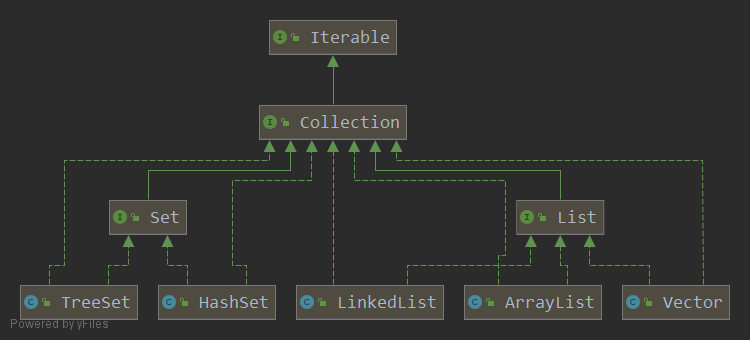

# Java集合专题

数组的缺点

- 长度在创建的时候就需要固定，一旦创建不可修改
- 只能够存储同一类型的元素
- 如果想要进行扩容，就需要创建新数组然后进行拷贝操作

集合 好处

- 动态保存任意多个元素

- 提供一系列操作对象的方法，使用方便


# Java集合框架

集合主要还是两组（单列集合，双列集合），Collection接口有两个重要的子接口，List和Set，他们的实现子类都是单列集合，Nao接口的实现子类是双列集合，存放键值对

单列集合：集合内存储单个对象



双列集合：集合内存储键值对


# Collection接口

1. Collection实现子类可以存放多个元素，每个元素可以使Object
2. Collection接口没有直接的实现梓烈，是通过它的子接口Set和List来实现的

Collection 接口常用方法

- add(Object obj)
- addAll(Collection coll)
- size()
- isEmpty()
- clear();
- contains(Object obj)
- hasCode()
- toArray()
- iterator();

## Collection遍历元素的方式

### Iterator

快捷键 ：itli

只要是实现了Collection的子类都有一个iterator()方法，用以返回一个实现了Iterator接口的对象，即可以返回一个迭代器。

```java
Iterator iterator = coll.iterator();
//hasNext():判断是否还下一个元素
while(iterator.hasNext()){
    //next():①指针下移 ②将下移以后集合位置上的元素返回
    System.out.println(iterator.next());
}
```

老韩提示：在调用iterator.next()方法之前必须要调用iterator.hasNext(0进行检测。若不调用且下一条记录无效，直接调用iteraotr.next()会抛出NoSuchElementException异常

```java
public void test3(){
        Collection coll = new ArrayList();
        coll.add(123);
        coll.add(456);
        coll.add(new Person("Jerry",20));
        coll.add(new String("Tom"));
        coll.add(false);

        //删除集合中"Tom"
        Iterator iterator = coll.iterator();
        while (iterator.haseNext()){
//            iterator.remove();
            Object obj = iterator.next();
            if("Tom".equals(obj)){
                iterator.remove();
//                iterator.remove();
            }

        }
        //重新遍历集合，需要获取新的iterator对象
        iterator = coll.iterator();
        while (iterator.hasNext()){
            System.out.println(iterator.next());
        }
    }
```

- 如果集合没有指定泛型，那么返回的是Object类型的对象，如果指定了泛型，则返回对应泛型的对象
- 重新遍历集合，需要获取新的Iterator对象

### 增强for循环

快捷键 ：大写i

增强for循环既可以遍历集合，也可以遍历数组

增强for循环的底层实现就是iterator，可以理解成简化版本的迭代器。通过Debug可以看出，增强for循环就是以下代码

```
Iterator iterator = coll.iterator();
while(iterator.hasNext()){
	Object obj = iterator.next();
}
```

# List接口

- 存储有序的、可重复的数据。添加顺序和取出顺序一致
- List集合中的每个元素都有其对应的顺序索引，即支持索引。可以使用List.get(int Index)访问，索引从0开始。
- List常用实现类：ArrayList，LinkedList，Vector
- null也可以放入ArrayList

## List接口常用方法

增：add(Object obj)
删：remove(int index) / remove(Object obj)
改：set(int index, Object ele)
查：get(int index)， indexOf(Object obj), lastIndexOf(Object obj),

 subList(int fromIndex, int toIndex):前闭后开区间
插：add(int index, Object ele)
长度：size()
遍历：

- Iterator迭代器方式
-  增强for循环
- 普通的循环 + List.get() 方法

向Collection接口的实现类的对象中添加数据obj时，要求obj所在类要重写equals().

- contains的调用会使用equals方法
- remouve要调用equals方法


## ArrayList

- ArrayList可以存储的数据包括null，并且可以存储多个null
- ArrayList的数据存储底层是由数组实现的
- ArrayList基本等同于Vector，除了ArrayList是线程不安全的（执行效率高）。在多线程情况下不建议使用ArrayList

ArrayList是线程不安全的，比如add方法在源码中没有sychronized关键词修饰

```java
    /**
     * Appends the specified element to the end of this list.
     *
     * @param e element to be appended to this list
     * @return <tt>true</tt> (as specified by {@link Collection#add})
     */
    public boolean add(E e) {
        ensureCapacityInternal(size + 1);  // Increments modCount!!
        elementData[size++] = e;
        return true;
    }
```

### ArrayList底层结构和源码分析

- ArrayList中维护了一个Object类型的数组elemenData

  transient Object[] elementData

- 当创建ArrayList对象是，如果使用的是无参构造器，则初始elementData容量为0，第一次添加，则扩容elementData为10，如需要再次扩容，则扩容elementData为1.5倍

- 如果使用的是指定大小的构造器，则初始elementData容量为指定大小，如果需要扩容，则直接扩容elementData为1.5倍

transient 表示所修饰的属性不会被序列化


**当创建ArrayList对象是，如果使用的是无参构造器，则初始elementData容量为0，第一次添加，则扩容elementData为10，如需要再次扩容，则扩容elementData为1.5倍**

```java
import java.util.ArrayList;

/**
 * @author shkstart
 * @create 2021-04-25 22:59
 */
public class ArrayListSource {
    public static void main(String[] args) {
        ArrayList list = new ArrayList();

        for(int i = 1; i <= 10; i++){
            list.add(i);
        }

        for(int i = 11; i <= 15; i++){
            list.add(i);
        }

        list.add(100);

        list.add(200);

        list.add(null);


    }
}

1. 调用无参构造器，创建了一个空的elementData数组={}
        /**
     * Constructs an empty list with an initial capacity of ten.
     */
    public ArrayList() {
        this.elementData = DEFAULTCAPACITY_EMPTY_ELEMENTDATA;
    }

    /**
     * Shared empty array instance used for default sized empty instances. We
     * distinguish this from EMPTY_ELEMENTDATA to know how much to inflate when
     * first element is added.
     */
    private static final Object[] DEFAULTCAPACITY_EMPTY_ELEMENTDATA = {};
2. 执行list.add
    1）先确定是否要扩容   
    
    2）然后执行赋值
    
    /**
     * Appends the specified element to the end of this list.
     *
     * @param e element to be appended to this list
     * @return <tt>true</tt> (as specified by {@link Collection#add})
     */
    public boolean add(E e) {
        ensureCapacityInternal(size + 1);  // Increments modCount!!
        elementData[size++] = e;
        return true;
    }

	//确定真正的minCapacity，即最小容量，扩容为10
    private void ensureCapacityInternal(int minCapacity) {
        if (elementData == DEFAULTCAPACITY_EMPTY_ELEMENTDATA) {
            minCapacity = Math.max(DEFAULT_CAPACITY, minCapacity);
        }

        ensureExplicitCapacity(minCapacity);
    }  

    /**
     * Default initial capacity.
     */
    private static final int DEFAULT_CAPACITY = 10;

	/*
	modCount++:记录当前这个集合被修改的次数，为了防止多个线程同时修改
	如果elementData的大小不够，就调用grow()去扩容
	*/
    private void ensureExplicitCapacity(int minCapacity) {
        modCount++;

        // overflow-conscious code
        //如果当前最小需要的容量 - 数组长度 > 0 ，扩容
        if (minCapacity - elementData.length > 0)
            grow(minCapacity);
    }
3. 扩容机制
    1）空的elementData 第一扩容直接扩成10个
    2）第二次及其以后，按照1.5倍扩容
    3）扩容使用的是Arrays.copyOf()
        /**
     * Increases the capacity to ensure that it can hold at least the
     * number of elements specified by the minimum capacity argument.
     *
     * @param minCapacity the desired minimum capacity
     */
    private void grow(int minCapacity) {
        // overflow-conscious code
        int oldCapacity = elementData.length;
    	//1.5倍扩容
        int newCapacity = oldCapacity + (oldCapacity >> 1);
    	//如果1.5倍扩容后还是不满足minCapacity，则直接将新的容量设置为minCapacity
        if (newCapacity - minCapacity < 0)
            newCapacity = minCapacity;
        if (newCapacity - MAX_ARRAY_SIZE > 0)
            newCapacity = hugeCapacity(minCapacity);
        // minCapacity is usually close to size, so this is a win:
    	//使用copyOf进行扩容
        elementData = Arrays.copyOf(elementData, newCapacity);
    }
    
```

**如果使用的是指定大小的构造器，则初始elementData容量为指定大小，如果需要扩容，则直接扩容elementData为1.5倍**

```java
1. 创建一个指定大小的elementData数组    
    /**
     * Constructs an empty list with the specified initial capacity.
     *
     * @param  initialCapacity  the initial capacity of the list
     * @throws IllegalArgumentException if the specified initial capacity
     *         is negative
     */
    public ArrayList(int initialCapacity) {
        if (initialCapacity > 0) {
            this.elementData = new Object[initialCapacity];
        } else if (initialCapacity == 0) {
            this.elementData = EMPTY_ELEMENTDATA;
        } else {
            throw new IllegalArgumentException("Illegal Capacity: "+
                                               initialCapacity);
        }
    }
2. 接下来按需进行1.5倍扩容
```

## Vector

- Vector的底层也是一个对象数组

```java
    /**
     * The array buffer into which the components of the vector are
     * stored. The capacity of the vector is the length of this array buffer,
     * and is at least large enough to contain all the vector's elements.
     *
     * <p>Any array elements following the last element in the Vector are null.
     *
     * @serial
     */
    protected Object[] elementData;
```

- Vector是线程同步的，即线程安全，Vector类的操作方法带有synchronized

```java
    public synchronized E get(int index) {
        if (index >= elementCount)
            throw new ArrayIndexOutOfBoundsException(index);

        return elementData(index);
    }
```

- 在开发中，需要线程同步安全时，考虑使用Vector

### Vector和ArrayList的比较

|           | 底层结构     | 版本   | 线程安全，效率 | 扩容参数                                           |
| --------- | ------------ | ------ | -------------- | -------------------------------------------------- |
| ArrayList | Object[]数组 | jdk1.2 | 不安全，效率高 | 有参：1.5倍 <br />无参：第一次10，第二次开始1.5倍  |
| Vector    | Object[]数组 | jdk1.0 | 安全，效率不高 | 无参，默认10，之后2倍扩<br />有参数：每次直接2倍扩 |

**无参构造，默认容量为10，之后开始2倍扩容**

```java
    public static void main(String[] args) {
        Vector vector = new Vector();
        for (int i = 0; i < 10; i++) {
            vector.add(i);
        }

    }
1.无参构造器调用其他有参构造器进行初始化
        /**
     * Constructs an empty vector so that its internal data array
     * has size {@code 10} and its standard capacity increment is
     * zero.
     */
    public Vector() {
        this(10);
    }
2.执行vector.add()
        /**
     * Appends the specified element to the end of this Vector.
     *
     * @param e element to be appended to this Vector
     * @return {@code true} (as specified by {@link Collection#add})
     * @since 1.2
     */
    public synchronized boolean add(E e) {
        modCount++;
        ensureCapacityHelper(elementCount + 1);
        elementData[elementCount++] = e;
        return true;
    }

    /**
     * This implements the unsynchronized semantics of ensureCapacity.
     * Synchronized methods in this class can internally call this
     * method for ensuring capacity without incurring the cost of an
     * extra synchronization.
     *
     * @see #ensureCapacity(int)
     */
	//确定是否需要扩容
    private void ensureCapacityHelper(int minCapacity) {
        // overflow-conscious code
        if (minCapacity - elementData.length > 0)
            grow(minCapacity);
    }
3. 扩容机制
    1）如果需要的数组大小不够用，就扩容。扩容时如果设置了capacityIncrement>0，就按照步长扩容，否则2倍扩容
    private void grow(int minCapacity) {
        // overflow-conscious code
        int oldCapacity = elementData.length;
        int newCapacity = oldCapacity + ((capacityIncrement > 0) ?
                                         capacityIncrement : oldCapacity);
        if (newCapacity - minCapacity < 0)
            newCapacity = minCapacity;
        if (newCapacity - MAX_ARRAY_SIZE > 0)
            newCapacity = hugeCapacity(minCapacity);
        elementData = Arrays.copyOf(elementData, newCapacity);
    }
    
```

**如果有参构造器初始化容量为0**

```java
    private void grow(int minCapacity) {
        // overflow-conscious code
        int oldCapacity = elementData.length;
        int newCapacity = oldCapacity + ((capacityIncrement > 0) ?
                                         capacityIncrement : oldCapacity);
        //第一次添加时会在这令newCapacity = minCapacity == 1
        if (newCapacity - minCapacity < 0)
            newCapacity = minCapacity;
        if (newCapacity - MAX_ARRAY_SIZE > 0)
            newCapacity = hugeCapacity(minCapacity);
        elementData = Arrays.copyOf(elementData, newCapacity);
    }
```

## LinkedList

- LinkedList底层实现了双向链表和双端队列特点
- 可以添加任意元素（元素可以重复），包括null
- 线程不安全，没有实现同步

### LinkedList的底层操作机制

1. LinkedList底层维护了一个双向链表
2. LinkedList中维护了两个属性first和last分别指向首节点和尾节点
3. 每个节点（Node对象），每个Node维护了prev，next，item三个属性，通过prev指向前一个，通过next指向后一个节点。最终实现双向链表


```java
    public static void main(String[] args) {
        LinkedList list = new LinkedList();

        list.add(1);

        System.out.println(list);
    }
    
    1. 调用无参构造器，同时在属性定义出直接初始化
    transient int size = 0;

    /**
     * Pointer to first node.
     * Invariant: (first == null && last == null) ||
     *            (first.prev == null && first.item != null)
     */
    transient Node<E> first;

    /**
     * Pointer to last node.
     * Invariant: (first == null && last == null) ||
     *            (last.next == null && last.item != null)
     */
    transient Node<E> last;

    /**
     * Constructs an empty list.
     */
    public LinkedList() {
    }

	2. 添加元素
    /**
     * Appends the specified element to the end of this list.
     *
     * <p>This method is equivalent to {@link #addLast}.
     *
     * @param e element to be appended to this list
     * @return {@code true} (as specified by {@link Collection#add})
     */
    public boolean add(E e) {
        linkLast(e);
        return true;
    }

    /**
     * Links e as last element.
     */
    void linkLast(E e) {
        final Node<E> l = last;
        //构造prev为l，即原链表的last，内容为e，next为null的Node
        final Node<E> newNode = new Node<>(l, e, null);
        //将last指向newNode
        last = newNode;
        if (l == null)//如果之前链表为空
            first = newNode;
        else
            l.next = newNode;
        size++;
        modCount++;
    }
```

### ArrayList和LinkedList的比较

|            | 底层结构 | 增删效率           | 改查效率 |
| ---------- | -------- | ------------------ | -------- |
| ArrayList  | 可变数组 | 较低，通过数组扩容 | 较高     |
| LinkedList | 双向链表 | 较高，通过链表追加 | 较低     |

- 改查操作较多时，选择ArrayList
- 增删操作较多时，使用LinkedList

# Set接口

- 无序性。不等于随机性。存储的数据在底层数组中并非照数组索引的顺序添加，而是根据数据的哈希值决定的。无序性指的是，元素添加时，不是按照索引顺序添加的

  添加顺序和取出顺序不一致，但是取出顺序是固定的

- 不可重复性：保证添加的元素照equals()判断时，不能返回true.即：相同的元素只能添加一个。最多只能添加一个null。如果Set通过add添加相同的对象，不会被添加到Set中去

Set接口遍历方式：同Collection的遍历方式一样

- 可以用迭代器
- 可以使用增强for循环
- 不能够使用索引的方式获取

## HashSet

1. HashSet实现了Set接口

2. HashSet的底层实际上是HashMap

   ```java
       /**
        * Constructs a new, empty set; the backing <tt>HashMap</tt> instance has
        * default initial capacity (16) and load factor (0.75).
        */
       public HashSet() {
           map = new HashMap<>();
       }
   
   ```

   

3. 可以存放null值，但是只能优一个null
4. HashSet不保证存放的元素和取出元素顺序是一致的           

### HashSet底层添加机制

HashSet底层是HashMap,HashMao底层组织： 数组+链表+红黑树

1. HashSet的底层是HashMap
2. 添加一个元素时，会先得到hash值，然后通过对hash值进行运算得到索引值
3. 找到存储表table，看这个索引位置是否已经存放有元素
4. 如果没有直接加入
5. 如果有，调用equals比较该索引出元素的key和准备加入的元素的key是否相等，如果相同就直接替换val(对于Hashset而言，因为val都为Object PRESENT = new Object()，所以表现为放弃添加)；如果不相等需要判断是树结构还是链表结构，做出相应处理。如果添加后容量超过阈值threshold，则需要调用resize()扩容
6. 在Java8中，如果一条链表的元素个数到达TREEIFY_THRESHOLD(默认是8)，并且table的大小>=MIN_TREEIFY_CAPACITY(默认是64)，就会进行树化(红黑树)


```java
    public static void main(String[] args) {
        HashSet hashSet = new HashSet();

        hashSet.add("java");
        hashSet.add("php");
        hashSet.add("java");

        System.out.println(hashSet);

    }
    
    1. HashSet构造器初始化，调用HashMap无参构造器
        /**
     * Constructs a new, empty set; the backing <tt>HashMap</tt> instance has
     * default initial capacity (16) and load factor (0.75).
     */
    public HashSet() {
        map = new HashMap<>();
    }
-----------------------------------------------------------------------------------------------------
	2. 执行add方法，调用HashMap.put方法
        
    public boolean add(E e) {
        return map.put(e, PRESENT)==null;
    }

	//静态不可修改占位对象，没有意义
	// Dummy value to associate with an Object in the backing Map
    private static final Object PRESENT = new Object();	

	//执行put()，该方法会执行hash(key)得到key所对应的hash值。
    public V put(K key, V value) {
        return putVal(hash(key), key, value, false, true);
    }
	//hash()所算出来的哈希值并不直接是hashCode，而是hashCode经过处理后到的值
    static final int hash(Object key) {
        int h;
        return (key == null) ? 0 : (h = key.hashCode()) ^ (h >>> 16);//异或无符号右移16位
    }
-----------------------------------------------------------------------------------------------------
	3. putVal详解
            /**
     * Implements Map.put and related methods
     *
     * @param hash hash for key
     * @param key the key
     * @param value the value to put
     * @param onlyIfAbsent if true, don't change existing value
     * @param evict if false, the table is in creation mode.
     * @return previous value, or null if none
     */
    final V putVal(int hash, K key, V value, boolean onlyIfAbsent,
                   boolean evict) {
        //定义辅助变量。
        Node<K,V>[] tab; Node<K,V> p; int n, i;
        //table是HashMap的一个数组，类型是Node[]
        //if 语句表示如果当前table是null，或者大小为0，就进行第一次扩容，到16个空间
        if ((tab = table) == null || (n = tab.length) == 0)
            n = (tab = resize()).length;
        /*
        （1）根据Key，得到hash 去计算该key应该存放到table的哪个索引位置，并把这个位置的对象，赋给p
        （2）判断p是否为空
        （2.1）如果p为null，表示还没有存放元素，就用newNode方法，以传入的key和value创建一个节点。并进行挂载
        */
        if ((p = tab[i = (n - 1) & hash]) == null)
            tab[i] = newNode(hash, key, value, null);
        else {
            //技巧：在局部变量需要的时候再创建
            Node<K,V> e; K k;
            //如果当前索引位置对应的链表的第一个元素和准备添加的key的hahs值一样，并且满足下面两个条件之一
            //1. 准备加入的key和p指向的Node节点的key是同一个对象
            //2. 准别加入的key != null 且 p指向的NOde节点的key的equals方法 he准备加入的key比较后相同
            //就不能加入
            if (p.hash == hash &&
                ((k = p.key) == key || (key != null && key.equals(k))))
                e = p;
            //再判断p是不是一个红黑树的节点
            //如果是一颗红黑树，就调用putTreeVal进行添加
            else if (p instanceof TreeNode)
                e = ((TreeNode<K,V>)p).putTreeVal(this, tab, hash, key, value);
            //
            else { //如果table对应索引位置，已经是一个链表，就使用for循环比较
                for (int binCount = 0; ; ++binCount) {
                    //（2）依次和该链表的每一个元素比较，都不相同，则加入到该链表的最后。且此时e被赋值为null
                    if ((e = p.next) == null) {
                        p.next = newNode(hash, key, value, null);
                        //在把元素添加到链表后，如果链表长度达到8个节点，就对调用treeifBin()对当前这个链表进行树化。但在在treeifBin中，转成红黑树之前，还是会判断tab.length < 64 .判断条件如下 if (tab == null || (n = tab.length) < MIN_TREEIFY_CAPACITY--64)。如果条件成立，就先对table进行resize()扩容。如果不成立，才进行树化
                        if (binCount >= TREEIFY_THRESHOLD - 1) // -1 for 1st
                            treeifyBin(tab, hash);
                        break;
                    }
                    //（2）如果链表上出现相同key的情况，就直接break
                    if (e.hash == hash &&
                        ((k = e.key) == key || (key != null && key.equals(k))))
                        break;
                    p = e;
                }
            }
            //进行替换value操作
            if (e != null) { // existing mapping for key
                V oldValue = e.value;
                if (!onlyIfAbsent || oldValue == null)
                    e.value = value;
                afterNodeAccess(e);
                return oldValue;
            }
        }
        ++modCount;
        //新的扩容操作
        if (++size > threshold)
            resize();
        //这个方法HashMap自己没有实现，留给其子类实现
        afterNodeInsertion(evict);
        //返回空代表成功添加
        return null;
    }
        

```

### HashMap底层扩容机制

1. HashSet底层是HashMap，底层维护了Node类型的数组，默认为null，
2. 当创建一个HashMap对象时，将加载因子初始化为0.75
3. 第一次添加时，table数组扩容到16，临界值设置为（threshold）是16*加载因子（loadFactor）0.75 = 12
4. 如果table数组上存入Node的总个数（加在链表上的也算）超过了临界值12，就会扩容到16**2, = 32， 新的临界值是32* * 0.75 = 24， 依次类推
5. 在Java8中，如果一条链表的元素个数到达了TREEIFY_THRESHOLD（默认是8），并且table的大小>=MIN_TREEIFY_CAPACITY（默认是64）,就会进行树化（红黑树），否则仍然采用数组扩容和机制。

源码追踪

DEFAULT_INITIAL_CAPACITY : HashMap的默认容量，16
DEFAULT_LOAD_FACTOR：HashMap的默认加载因子：0.75
threshold：扩容的临界值，=容量*填充因子：16 * 0.75 => 12
TREEIFY_THRESHOLD：Bucket中链表长度大于该默认值，转化为红黑树:8
MIN_TREEIFY_CAPACITY：桶中的Node被树化时最小的hash表容量:64

1. HashMap的默认负载因子

```

```

## LinkedHashSet

1. LinkedHashSet继承于HashSet
2. LinkedHashSet的底层是LinkedHashMap，LinkedHashMap是HashMap的子类
3. LinkedHashSet根据元素的hashCode值来决定元素的储存位置，同时使用链表维护元素的次序，这使得元素看起来是以插入顺序保存的
4. LinkedHashSet不允许重复添加元素

### LinkedHashSet的添加机制

1. 在LinkedHashMap中维护了一个数组table +双向链表（LinkedHashSet有head和tail）
2. 每一个节点有pre和next属性，这样可以形成双向链表
3. 在添加一个元素时，先求hash值，再求索引。确定该元素在hashtable的位置，然后将添加的元素加入到双向链表。(如果已经存在，不添加。也就是和hashset一样)

```
tail.next = newElement
newElement =.pre = tail
tial = newElement
```

4. 第一次添加时，直接将数组table扩容到16， 存放的节点类型是 LinkedHashMap$Entry
5. 数组HashMap$Node[] 存放的元素/数据是 LinkedHashMap$Entry类型

```java
    /**
     * HashMap.Node subclass for normal LinkedHashMap entries.
     */
	//继承于HashMap的静态内部类Node
    static class Entry<K,V> extends HashMap.Node<K,V> {
        Entry<K,V> before, after;
        Entry(int hash, K key, V value, Node<K,V> next) {
            super(hash, key, value, next);
        }
    }

```

# Map接口

Map实现类特点

1. Map中的key和value可以是任何引用烈性的数据，会封装到HashMap$Node
2. Map中key不可以重复，value可以重复。当有相同的key加入时，就替换value
3. Map中key可以为null，value也可以为null。但是key的null只能有一个，而value的null可以有多个
4. 常用String类作为Map的key

Map接口的特点

Map里，k-v是存放放在一个个HashMap￥Node中。又因为Node实现了Entry接口

```java
public class MapSource {
    public static void main(String[] args) {
        Map map = new HashMap<>();
        map.put("no1", "韩顺平");
        map.put("no2", "张无忌");
        
    }
}
```

1. k-v最后是存在 HashMap$Node node = new Node(hash, key, value, null)

2. k-v 为了方便程序员遍历，还会创建EntrySet集合，该集合存放的元素的类型Entry，而一个Entry对象就有

   k,v EntrySet<Entry<K, V>> 即

   ```java
   /**
    * Holds cached entrySet(). Note that AbstractMap fields are used
    * for keySet() and values().
    */
   transient Set<Map.Entry<K,V>> entrySet;
   ```

3. entrySet中存放的元素的定义类型是Map.Entry，但实际上存放的还是HashMap$Node，这是因为

   static class Node<K,V> implements Map.Entry<K,V> 

4. 当把 HashMap$Node 对象存放到entrySet中时，就方便我们遍历，因为本身Map接口不想Collection接口实现了Iterable接口。因为Map.Entry接口定义了以下方法

   ```java
           /**
            * Returns the key corresponding to this entry.
            *
            * @return the key corresponding to this entry
            * @throws IllegalStateException implementations may, but are not
            *         required to, throw this exception if the entry has been
            *         removed from the backing map.
            */
           K getKey();
   
           /**
            * Returns the value corresponding to this entry.  If the mapping
            * has been removed from the backing map (by the iterator's
            * <tt>remove</tt> operation), the results of this call are undefined.
            *
            * @return the value corresponding to this entry
            * @throws IllegalStateException implementations may, but are not
            *         required to, throw this exception if the entry has been
            *         removed from the backing map.
            */
           V getValue();
   ```

   总结，所有的Node本身都是用table数组+链表+红黑树来组织的。但是同时又把所有的Node向上转型成Entry，将引用存入entrySet，方便遍历和管理。所有的Node节点都只有一个
   
5. HashMap$Node 实现了Map$Entry接口

## Map接口的遍历方式

- values()：获取所有的值
- keySet()：获取所有的键
- entrySet：获取所有的k-v

```java
@Test
public void test5(){
    Map map = new HashMap();
    map.put("AA",123);
    map.put(45,1234);
    map.put("BB",56);

    //遍历所有的key集：keySet()
    Set set = map.keySet();
        Iterator iterator = set.iterator();
        while(iterator.hasNext()){
            System.out.println(iterator.next());
    }
    System.out.println();
    
    //遍历所有的value集：values()
    Collection values = map.values();
    for(Object obj : values){
        System.out.println(obj);
    }
    System.out.println();
    
    //遍历所有的key-value
    //方式一：entrySet()
    Set entrySet = map.entrySet();
    Iterator iterator1 = entrySet.iterator();
    while (iterator1.hasNext()){
        Object obj = iterator1.next();
        //entrySet集合中的元素都是entry
        //这里向下转型为Map.Entry而不是HashMap.Node是因为Node是内部类。而Entry是Map接口内定义的静态接口
        Map.Entry entry = (Map.Entry) obj;
        System.out.println(entry.getKey() + "---->" + entry.getValue());

    }
    System.out.println();
    
    //方式二：
    Set keySet = map.keySet();
    Iterator iterator2 = keySet.iterator();
    while(iterator2.hasNext()){
        Object key = iterator2.next();
        Object value = map.get(key);
        System.out.println(key + "=====" + value);

    }
```

## HashMap

1. HahsMap是Map接口使用频率最高的实现类
2. HashMap没有实现同步，因此线程不安全，方法没有synchronized修饰
3. HashMap的重复添加相同key,，则会替换value，相当于修改


## HashTable

1. 存放的元素时键值对：即k-v
2. hashtable的键和值都不能为null，否则会抛出NullPointerException
3. HashTable的使用方法基本上和HashMap一样。添加相同的key，替换value
4. HashTable是线程安全的，HashMap是线程不安全的

```java
1. 底层有数组 HashTable$ENtry[] 初始化大小为11
2. 临界值 threshold 11 * 0.75 = 8;  
3. 执行方法addEntry(hash, key, value, index); 添加K-V 并封装成Entry 
4. 当if (count >= threshold) 满足时，就进行扩容
5. 扩容机制为  int newCapacity = (oldCapacity << 1) + 1;
 

HashTable元素添加机制
1. 执行方法addEntry(hash, key, value, index); 添加K-V 并封装成Entry 

    private void addEntry(int hash, K key, V value, int index) {
        modCount++;

        Entry<?,?> tab[] = table;
        if (count >= threshold) {
            //如果count 达到threshold，抵用rehash()进行扩容
            // Rehash the table if the threshold is exceeded
            rehash();

            tab = table;
            hash = key.hashCode();
            index = (hash & 0x7FFFFFFF) % tab.length;
        }

        // Creates the new entry.
        @SuppressWarnings("unchecked")
        Entry<K,V> e = (Entry<K,V>) tab[index];
        tab[index] = new Entry<>(hash, key, value, e);
        count++;
    }
2. 
    /**
     * Increases the capacity of and internally reorganizes this
     * hashtable, in order to accommodate and access its entries more
     * efficiently.  This method is called automatically when the
     * number of keys in the hashtable exceeds this hashtable's capacity
     * and load factor.
     */
    @SuppressWarnings("unchecked")
    protected void rehash() {
        int oldCapacity = table.length;
        Entry<?,?>[] oldMap = table;

        // overflow-conscious code
    	//扩容机制为 原容量*2 + 1
        int newCapacity = (oldCapacity << 1) + 1;
        if (newCapacity - MAX_ARRAY_SIZE > 0) {
            if (oldCapacity == MAX_ARRAY_SIZE)
                // Keep running with MAX_ARRAY_SIZE buckets
                return;
            newCapacity = MAX_ARRAY_SIZE;
        }
        Entry<?,?>[] newMap = new Entry<?,?>[newCapacity];

        modCount++;
        threshold = (int)Math.min(newCapacity * loadFactor, MAX_ARRAY_SIZE + 1);
        table = newMap;

        for (int i = oldCapacity ; i-- > 0 ;) {
            for (Entry<K,V> old = (Entry<K,V>)oldMap[i] ; old != null ; ) {
                Entry<K,V> e = old;
                old = old.next;

                int index = (e.hash & 0x7FFFFFFF) % newCapacity;
                e.next = (Entry<K,V>)newMap[index];
                newMap[index] = e;
            }
        }
    }
```


HashTable和HashMap对比

|           | 版本 | 线程安全 | 效率 | 允许null键或者null值 |
| --------- | ---- | -------- | ---- | -------------------- |
| HashMap   | 1.2  | 不安全   | 高   | 允许                 |
| HashTable | 1.0  | 安全     | 低   | 不允许               |

## Properties

1. Properties类继承自HashTable类并且实现了Map接口，也是使用键值对的形式保存数据。继承于HashTable，所以key和value不能为null
2. Propeties经常用于从xxx.properties文件中，加载数据到Properties类对象，并进行读取和修改

# 集合的选择

在开发中，选择什么集合实现类，主要取决于业务操作特点，然后根据集合实现类特性进行选择

1. 先判断储存类型（一组对象【单列】或者一组键值对【双列】）
2. 一组对象【单列】：Collection接口
   - 允许重复：List
     -  增删多：LinkedList【底层维护了一个双向链表】
     - 改查多：ArrayList【底层维护了Object类型的可变数组】
   - 不允许重复：Set
     - 无序：HashSet【底层是HashMap，维护了数组+链表+红黑树】
     - 排序：TreeSet
     - 插入和取出顺序一直：LinkedHashSet，维护了数组+双向链表
3. 一组键值对：Map
   - 键无序：HashMap，底层是【jdk7：数组+链表， jdk8：数组+链表+红黑树】	
   - 键排序：TreeMap
   - 键插入和取出顺序一致：LinkedhashMap
   - 读取文件：Properties