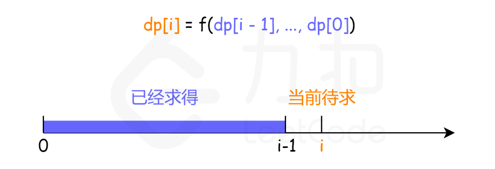

# LeetCode刷题记录


- #### B站视频录制思路：按照方法进行录制。比如可以做双指针系列，然后留一些练习题

- 如果我是面试官，我会在你解答完之后问你为什么使用A方法做了，没有考虑B方法。A方法和B方法的优略之间在哪里。所以，从我的角度上来说，刷题我找到行数最少的解决方案，是优先选。其次，我会看看有没有很共同的解题手法，然后从知识背景上考虑为什么他们会那么解

- 不要急着提交验证，自己先设计一些测试用例进行测试。

- 再写代码前思考整体框架和可能corner case，在写出整体框架后测试coner case。最常见的corner case 是输入的数据为空

- 三种分析方法：画图能使抽象问题形象化，举例使抽象问题具体化，分解使复杂问题简单化。

- 需要注意问题是否是大数问题

- 为每一轮面试，提前准备2~3个问题：问与招聘职位或者项目相关的问题

- 对于错误输入的异常情况处理可以询问面试官处理方式（抛出异常，返回特定值，设置全局变量）

  

## 算法题思考

21年

- 二月：开始直接上手刷LeetCode题目，开始逐步理解递归思想，理解了二叉树题目的套路。发现算法模式和模板确实非常是有用。开始在Educative学习算法常用模式
- 三月：循序渐进刷题，争取在四月初百题斩

**做题顺序**

1. 看题目，自己先想
2. 没思路，看思路然后复述思路，不看代码，自己实现代码
3. 在实现代码过程中遇到问题再参照源代码

**为什么复杂代码需要优化**

1. 通常面试官会要求优化
2. 复杂代码在面试时不容易写出来，而且容易出错

通过做题训练，最后能带到面试上的是什么

1.  看到一个具体问题时能够进行抽象，并想到对应的算法
2. 平时记忆的各种算法实现模板，提高编程速度和正确性
3. 边界条件处理经验
4. 针对具体数据结构处理的小技巧（双指针，虚拟节点，双递归等等）

**举反例的技巧**

很多题目，我们并不需要从纯数学角度证明方法的正确性后，再开始写代码

我们可以通过半经验的方式去举反例证明方案的不正确性，如果不能够证明起不正确，那么通常就是是正确的。

## 常用容器的方法

### Collection接口

```
|----Collection接口：单列集合，用来存储一个一个的对象
*          |----List接口：存储序的、可重复的数据。  -->“动态”数组
*              |----ArrayList、LinkedList、Vector
*
*          |----Set接口：存储无序的、不可重复的数据   -->高中讲的“集合”
*              |----HashSet、LinkedHashSet、TreeSet
```

List 接口-->通常作为数组，和队列

- 增：add(Object obj)
- 删：remove(Object obj) / remove(int index)
- 改：set(int index, Object element)
- 查：get(int index) / contains(Object o)
- 插：add(int index, Object element)
- size()
- isEmpty

Set 接口


## 零、技巧分类

###  双指针

只要数组**有序**，就应该想到双指针技巧。

#### 快慢指针

快慢指针一般都初始化指向链表的头结点 head，前进时快指针 fast 在前，慢指针 slow 在后，巧妙解决一些链表中的问题。

1. **使用快慢指针实现空间复杂度O(1)，在原数据结构上直接完成操作**

快指针在前方探路，当找到需要处理的元素时，返回给后方的慢指针进行操作。从而实现一次扫描且空间复杂度O(1)

- 26.删除排序数组中的重复项
- 27.移除元素
- 283.移动零
- 83.删除排序链表中的重复元素（与26基本一样）


2. **使用快慢指针判断链表是否有环**

在每次循环，慢指针前进一步，快指针前进两步。则以慢指针为参照系，快指针每一次循环前进一步，慢指针在原地不懂。因为链表成环，所以快指针一定追的上慢指针。

- 141.环形链表
- 142.环形链表||（这道题就是141加上快慢指针移动规律）

3. **用快慢指针步数差寻找特定节点**

对于链表而言。如果要寻找第k个节点，可以让快指针先走k步。然后快慢指针同速前进。当快指针走到null时，慢指针就在第k个位置

```java
ListNode slow, fast;
slow = fast = head;
while (k-- > 0) 
    fast = fast.next;
    fast = fast.next;
while (fast != null) {
    slow = slow.next;
    fast = fast.next;
}
return slow;
```

而对于数组而言。如果要寻找第k个位置。需要让快指针先走k-1步（注意倒数第k个，最后一个元素本身就算一个，只要往前数k-1个，相对一快指针只要 先走k-1步）

快慢指针还可以用步数两倍的关系来寻找中点。当链表的长度是奇数时，slow 恰巧停在中点位置；如果长度是偶数，slow 最终的位置是中间偏右：

```java
while (fast != null && fast.next != null) {
    fast = fast.next.next;
    slow = slow.next;
}
// slow 就在中间位置
return slow;
```

- 19.删除链表的倒数第N个节点（需要加入dummy节点，否则会空指针异常）

#### 左右指针

左右指针在数组中实际是指两个索引值，一般初始化为 left = 0, right = nums.length - 1

- 167.两数之和||-输入有序数组


###  递归思想

以下三道是递进题，25题为终极版

- 206.反转链表
- 93.反转链表||
- 25.K个一组反转链表

**使用自顶向下/自底向上递归实现解决树问题**

- 104.二叉树的最大深度
- 

### 妙用HashMap

- 1.两数之和：这道题，使用HashMap作为高效查找的数据库，在每遍历到一个元素后就将其加入HashMap，然后将O(N)的遍历查找，转换成O(1)的HashMap查找
- 236.二叉树的最近公共祖先


### 备忘录技术

现在，我们明确了亟待解决的问题：消除重叠子问题，即消灭重复计算的过程。我们可以创建一个备忘录（memorization），在每次计算出某个子问题的答案后，将这个临时的中间结果记录到备忘录里，然后再返回。

接着，每当遇到一个子问题时，我们不是按照原有的思路开始对子问题进行递归求解，而是先去这个备忘录中查询一下。如果发现之前已经解决过这个子问题了，那么就直接把答案取出来复用，没有必要再递归下去耗时的计算了。

对于备忘录，你可以考虑使用以下两种数据结构：

- 数组（Array），通常对于简单的问题来说，使用一维数组就足够了。在后续的课程中，你会看到更为复杂的状态存储过程，届时我会指导你使用更高维度（二维甚至三维）的数组来存储状态。
- 哈希表（Hash table），如果你存储的状态不能直接通过索引找到需要的值（比如斐波那契数列问题，你就可以直接通过数组的索引确定其对应子问题的解是否存在，如果存在你就拿出来直接使用），比如你使用了更高级的数据结构而非简单的数字索引，那么你还可以考虑使用哈希表，即字典来存储中间状态，来避免重复计算的问题。

## 一、链表

链表是一种兼具递归和迭代性质的数据结构


### 递归法

#### 25. K个一组翻转链表

思路：

链表是同时有迭代和递归性质的数据结构。整个链表的K个一组翻转可以使用递归来实现，每一次翻转过程处理的问题都是上一次翻转问题相同，即为子问题。

具体的翻转过程可以使用迭代实现，翻转问题即为翻转头结点到k个节点的之间的节点。翻转不能使用递归反转，而是要使用迭代反转。因为需要记录翻转

```
给你一个链表，每 k 个节点一组进行翻转，请你返回翻转后的链表。

k 是一个正整数，它的值小于或等于链表的长度。

如果节点总数不是 k 的整数倍，那么请将最后剩余的节点保持原有顺序。


示例：

给你这个链表：1->2->3->4->5

当 k = 2 时，应当返回: 2->1->4->3->5

当 k = 3 时，应当返回: 3->2->1->4->5

```


```java
/**
 * Definition for singly-linked list.
 * public class ListNode {
 *     int val;
 *     ListNode next;
 *     ListNode() {}
 *     ListNode(int val) { this.val = val; }
 *     ListNode(int val, ListNode next) { this.val = val; this.next = next; }
 * }
 */
class Solution {
    public ListNode reverseKGroup(ListNode head, int k) {
        //basecase
        if(head == null || head.next == null) return head;
        //定义一个cur节点辅助翻转
        ListNode beginNode = head;
        ListNode endNode = head;
        for(int i = 0; i < k; i++){
            //如果遍历到了链表尾部，这保持链表顺序不变
            if(endNode == null){
                return head;
            }
            endNode = endNode.next;
        }
        //局部翻转要早于递归，先递归会导致链表断裂，无法局部翻转
        ListNode last = reverseList(beginNode, endNode);
        beginNode.next = reverseKGroup(endNode, k);

        return last;
        
    }

    //首先实现反转链表头结点a和节点b之间的节点[a,b)
    public ListNode reverseList(ListNode head, ListNode endNode) {
        //base case
        if(head == null || head.next == null) return head;
        
        //创建三个引用
        ListNode pre = null;
        ListNode cur = head;
        ListNode next = head;

        while(cur != endNode){
            //将next的移动放到cur判断之后，防止空指针异常。同时也因为这里，初始化时next=head
            next = next.next;

            cur.next = pre;
            //节点向后移动
            pre = cur;
            cur = next;

        }

        return pre;
    }
}
```

####  92. 反转链表II

[LeetCode题解](https://leetcode-cn.com/problems/reverse-linked-list-ii/solution/yi-bu-yi-bu-jiao-ni-ru-he-yong-di-gui-si-lowt/)

```java
反转从位置 m 到 n 的链表。请使用一趟扫描完成反转。

说明:
1 ≤ m ≤ n ≤ 链表长度。

示例:
输入: 1->2->3->4->5->NULL, m = 2, n = 4
输出: 1->4->3->2->5->NULL
/**
 * Definition for singly-linked list.
 * public class ListNode {
 *     int val;
 *     ListNode next;
 *     ListNode() {}
 *     ListNode(int val) { this.val = val; }
 *     ListNode(int val, ListNode next) { this.val = val; this.next = next; }
 * }
 */
```

```java
/**
使用双递归方法
1. 首先从递归反转链表修改成递归反转前N个节点
2. 递归到left节点，然后使用递归反转前N个节点

*/
class Solution {
    public ListNode reverseBetween(ListNode head, int left, int right) {
        //base case
        if(head == null){
            return null;
        }
        //递归结束条件
        if(left == 1){
            return inverseN(head, right);
        }

        head.next = reverseBetween(head.next, left-1, right-1);
        return head;

    }
    
    //首先实现反转前N个节点
    ListNode successor = null;// 定义后继节点用于储存n+1节点的信息   
    
    public ListNode inverseN(ListNode head, int n){
        //base case
        if(head == null){
            return null;
        }
        //递归结束条件
        if(n == 1){
            //记录后继节点
            successor = head.next;
            return head;
        }
        
        ListNode last = inverseN(head.next, n-1);
        head.next.next = head;
        head.next = successor;
        return last;

    }
}
```

总结：反转链表的实质是[反转头结点head和null之间的节点]，也就是说将所有反转链表的算法中迭代结束的条件的null改成ListNode b，这算法就变成了反转头结点a和节点b之间的链表。

#### 206. 反转链表

[LeetCode题解](https://leetcode-cn.com/problems/reverse-linked-list-ii/solution/yi-bu-yi-bu-jiao-ni-ru-he-yong-di-gui-si-lowt/)

```java
反转一个单链表。
示例:
输入: 1->2->3->4->5->NULL
输出: 5->4->3->2->1->NULL
/**
 * Definition for singly-linked list.
 * public class ListNode {
 *     int val;
 *     ListNode next;
 *     ListNode() {}
 *     ListNode(int val) { this.val = val; }
 *     ListNode(int val, ListNode next) { this.val = val; this.next = next; }
 * }
 */
```


```java
/**
 思路1：使用栈反转链表
 */
class Solution {
    public ListNode reverseList(ListNode head) {
        //1. Base Case
        if(head == null){
            return null;
        }
        if(head.next == null){
            return head;
        }
        
        //2. 遍历链表，依次入栈
        Stack<ListNode> stack = new Stack<>();
        ListNode curNode = head; //curNode作为临时节点，用于遍历链表
        //开始遍历链表
        while(curNode != null){
            //链表节点依次入栈
            stack.push(curNode);
            //节点更新
            curNode = curNode.next;
        }
        //3. 遍历栈，反转链表
        //定义一个新的头结点，并指向栈顶节点
        ListNode newHead = stack.pop();
        curNode = newHead;
        //将头结点指向临时节点curNode
        while(!stack.empty()){
            curNode.next = stack.pop();
            curNode = curNode.next;
        }
        //4. 在反转后的链表尾加上null
        curNode.next = null;

        return newHead;
    }
}
```

```java
/**
 思路2. 使用递归实现，自底向上拼装实现
 
 
对于递归算法，最重要的就是明确递归函数的定义:
输入一个节点 head，将「以 head 为起点」的链表反转，并返回反转之后的头结点。
??所以递归先递归到头，再往回分析吗？还是可以利用递归函数的定义分析
//当子问题原问题相同时，就可以使用递归思想
*/
class Solution {
    public ListNode reverseList(ListNode head) {
        //base case
        if(head == null) return null;

        //单向链表需要从最后一个节点的前一个节点开始操作，否则信息丢失
        //递归到链表尾，返回最后尾节点作为前一次递归的last
        if(head.next == null) return head; 
        
        ListNode last = reverseList(head.next);
        //后一个节点指向前一个节点
        head.next.next = head;
        //前一个节点指向null
        head.next = null;

        return last;
    }
}

------------------------------------------------------
class Solution {
    private ListNode newHead;
    public ListNode reverseList(ListNode head) {
        //base case
        if(head == null) return head;

        helpReverseList(head);

        return newHead;
    }

    private ListNode helpReverseList(ListNode curNode){
        //递归结束条件
        if(curNode.next == null){
            newHead = curNode;
            return curNode;
        }

        ListNode node = helpReverseList(curNode.next);

        node.next = curNode;
        curNode.next = null;

        return curNode;
    }
}
```

```java
/**
思路3. 使用三个引用实现
 */
class Solution {
    public ListNode reverseList(ListNode head) {
        //base case
        if(head == null || head.next == null) return head;
        
        //创建三个引用
        ListNode pre = null; //这个很重要
        ListNode cur = head;
        ListNode next = head;

        while(cur != null){
            //将next的移动放到cur判断之后，防止空指针异常。同时也因为这里，初始化时next=head
            next = next.next;

            cur.next = pre;
            //节点向后移动
            pre = cur;
            cur = next;

        }

        return pre;
    }
}

class Solution {
    public ListNode reverseList(ListNode head) {
        //base case
        if(head == null || head.next == null) return head;
        
        ListNode pre = null;
        ListNode cur = head;

        while(cur != null){
            ListNode next = cur.next;
            cur.next = pre;
            pre = cur;
            cur = next;
        }

        return pre;
    }
}
```


#### 21. 合并有序链表

```
将两个升序链表合并为一个新的 升序 链表并返回。新链表是通过拼接给定的两个链表的所有节点组成的
输入：l1 = [1,2,4], l2 = [1,3,4]
输出：[1,1,2,3,4,4]
示例 2：

输入：l1 = [], l2 = []
输出：[]
示例 3：

输入：l1 = [], l2 = [0]
输出：[0]

两个链表的节点数目范围是 [0, 50]
-100 <= Node.val <= 100
l1 和 l2 均按 非递减顺序 排列

```

```java
/**
 * Definition for singly-linked list.
 * public class ListNode {
 *     int val;
 *     ListNode next;
 *     ListNode() {}
 *     ListNode(int val) { this.val = val; }
 *     ListNode(int val, ListNode next) { this.val = val; this.next = next; }
 * }
 */

//迭代实现
class Solution {
    public ListNode mergeTwoLists(ListNode l1, ListNode l2) {
        
        ListNode dummy = new ListNode();

        ListNode l3 = dummy;
        
        while(l1 != null && l2 != null){
            if(l1.val <= l2.val){
                l3.next = l1;
                l1 = l1.next;
            }else{
                l3.next = l2;
                l2 = l2.next;
            }

            l3 = l3.next;
        }

        l3.next = (l1 == null ? l2 : l1);

        return dummy.next;

    }
}
```

```java
//递归实现，自顶向下分治实现

/**
 * Definition for singly-linked list.
 * public class ListNode {
 *     int val;
 *     ListNode next;
 *     ListNode() {}
 *     ListNode(int val) { this.val = val; }
 *     ListNode(int val, ListNode next) { this.val = val; this.next = next; }
 * }
 */
class Solution {
    public ListNode mergeTwoLists(ListNode l1, ListNode l2) {
        if(l1 == null){
            return l2;
        }else if(l2 == null){
            return l1;
        }

        if(l1.val >= l2.val){
            l2.next = mergeTwoLists(l1, l2.next);
            return l2;
        }else{
            l1.next = mergeTwoLists(l1.next, l2);
            return l1;
        }
    }
}
```


### 简单双指针


### 快慢指针

#### 82. 删除排序链表汇总的重复元素||

```
 思路1：删两次，第一次对重复出现的数字做标记
 思路2：能否一次遍历解决问题？ 

如果cur.val == cur.next.val 
能从记录下cur的值，并从cur开始往后删除所有等于该值的节点

最外层循环的结束条件是

内层删除循环的结束条件是 cur.next == null
```

```java
class Solution {
    public ListNode deleteDuplicates(ListNode head) {
        //base case
        if(head == null || head.next == null) return head;

        ListNode dummy = new ListNode();
        dummy.next = head;

        ListNode pre = dummy; //这题的pre只辅助链表拼接操作，不使用的pre的val
        ListNode cur = head;

        /*
        这道题外层循环判断有两个条件，比较难
        1. cur != null 用于最后一个元素也是重复元素，删除后cur指向cur的情况
        2. cur.next != null 适用于大多数情况。因为是将cur.val 与cur.next.val 比较。所以当cur到达最后一个的是后，就已经没有重复元素了。
        
        */
        while(cur != null && cur.next != null){
            if(cur.val == cur.next.val){ //这一步决定了最外层的while条件对cur和cur.next都要判断null
                //重复删除后，cur指向之后不同的元素
                int repeatNumber = cur.val;
                while(cur != null && cur.val == repeatNumber){ 
                    cur = cur.next;
                }
                //要么指向null，要么指向val不同的新元素
                pre.next = cur;
            }else{
                pre = pre.next;
                cur = cur.next;
            }
        }

        return dummy.next;


    }
}
```


#### 83. 删除排序链表中的重复元素

[labuladongLeetcode解析](https://leetcode-cn.com/problems/remove-duplicates-from-sorted-list/solution/yuan-di-qu-chu-de-zhong-fu-yuan-su-yi-wen-miao-s-2/)

这道题的问题在于，边界条件判断不是太清晰，在构思是总是漏掉一些边界条件
解决思路：当有多重while时，先分析内层while的结束条件，然后根据结束条件写出外层循环对应的操作以及结束条件。然后再在外层条件下分析内层条件的边界情况

tips：leetcode好像不支持短路与或

```
存在一个按升序排列的链表，给你这个链表的头节点 head ，请你删除所有重复的元素，使每个元素 只出现一次 。

返回同样按升序排列的结果链表。

输入：head = [1,1,2,3,3]
输出：[1,2,3]

```

```java
/**
 * Definition for singly-linked list.
 * public class ListNode {
 *     int val;
 *     ListNode next;
 *     ListNode() {}
 *     ListNode(int val) { this.val = val; }
 *     ListNode(int val, ListNode next) { this.val = val; this.next = next; }
 * }
 */ 
 /**
 使用双指针中的快慢指针实现：快慢指针一般都初始化指向链表的头结点 head，前进时快指针 fast 在前，慢指针 slow 在后，巧妙解决一些链表中的问题。
 pre 和 cur
 注意这里有两层循环
 第一层循环，pre会遍历链表
 第二层循环，在pre的每一次遍历中，cur需要遍历pre之后的元素直到找到不相同的节点
 
 */
class Solution {
    public ListNode deleteDuplicates(ListNode head) {
        //base case
        if( head == null || head.next == null) return head;

        //初始化
        ListNode pre = head;
        ListNode cur = head;

        //循环遍历链表
        while( cur != null){

            while(true){
                if(cur == null) break; //首先排除cur空指针，然后之后再判断cur与pre的数值是否相等
                if(cur.val != pre.val) break;
                cur = cur.next;
            }
            //当跳出循环时有两种情况1. cur = null 2. cur已经与pre不同val

            pre.next = cur;
            pre = cur;
        }

        return head;
    }
}
```

```java
 /**
使用单指针cur实现

 注意这里有两层循环
 第一层循环，pre会遍历链表
 第二层循环，在pre的每一次遍历中，cur需要遍历pre之后的元素直到找到不相同的节点
 */
class Solution {
    public ListNode deleteDuplicates(ListNode head) {
        //base case
        if( head == null || head.next == null) return head;

        //初始化
        ListNode cur = head;

        //循环遍历链表
        while(cur != null){ //情况1

            while(true){
                if(cur.next == null) break; //首先排除cur空指针，然后之后再判断cur与pre的数值是否相等
                if(cur.val != cur.next.val) break;
                cur.next = cur.next.next;
            }
            //当跳出循环时有两种情况1. cur = null 2. cur已经与pre不同val
            cur = cur.next;  //情况2

        }

        return head;
    }
}
这道题的问题在于，边界条件判断不是太清晰，在构思是总是漏掉一些边界条件
解决思路：当有多重while时，先分析内层while的结束条件，然后根据结束条件写出外层循环对应的操作以及结束条件。然后再在外层条件下分析内层条件的边界情况
```

上面两种做法的缺点是同时因为有两层循环嵌套，导致边界条件分析麻烦

下面使用只需要一次遍历的快慢指针

 使用双指针中的快慢指针实现：快慢指针一般都初始化指向链表的头结点 head，前进时快指针 fast 在前，慢指针 slow 在后，巧妙解决一些链表中的问题。

优点：时间复杂度为O(n)，边界条件好判断

```java
class Solution {
    public ListNode deleteDuplicates(ListNode head) {
        //base case
        if( head == null || head.next == null) return head;

        //初始化
        ListNode fast = head;
        ListNode slow = head;

        while(fast != null){
            if(slow.val != fast.val){
                slow.next = fast;
                slow = slow.next;
            }
            fast = fast.next;
        }
        //两种情况，1->1->null, 1->2->null
        slow.next = fast;
        return head;

    }
}
```


### 24. 两两交换链表的节点

```
给定一个链表，两两交换其中相邻的节点，并返回交换后的链表。

你不能只是单纯的改变节点内部的值，而是需要实际的进行节点交换。
```

思路：这题递归实现是比较简单的：递归函数定义：输入当前链表头结点，返回两两翻转后的链表的头结点

```java
/**
 * Definition for singly-linked list.
 * public class ListNode {
 *     int val;
 *     ListNode next;
 *     ListNode() {}
 *     ListNode(int val) { this.val = val; }
 *     ListNode(int val, ListNode next) { this.val = val; this.next = next; }
 * }
 */
 /**
递归实现这道题
这道题和一般的链表递归的区别在于，一般链表递归都是传入下一个节点，而这道题需要传入下两个节点

递归函数定义：

传入链表头结点，返回两两交换相邻节点的链表

核心逻辑:  
ListNode newHead = head.next
newHead.next = head
newHead.next = swapPairs(head.next.next)
reuturn newHead

递归结束条件：
如果从当前节点之后没有节点，那就直接返回当前节点
如果当前节点是null，那么直接返回null


 */
class Solution {
    public ListNode swapPairs(ListNode head) {
        //递归结束条件
        if(head == null || head.next == null) return head;
        
        ListNode tempNode = head.next;
        head.next = swapPairs(head.next.next);
        tempNode.next = head;
        
        return tempNode;
    }
}
```

思路：迭代实现迭代实现：emmm确实很麻烦，需要同时使用三个指针

```
pre, node1, node2
pre.next = node2;
node1.next = node2.next;
nod2.next = node1; 
```

```java
class Solution {
    public ListNode swapPairs(ListNode head) {
        //base case 
        if(head == null || head.next == null) return head;
        //初始化三个节点指针
        ListNode dummy = new ListNode(0);
        dummy.next = head;
        ListNode pre = dummy;

        while(pre.next != null && pre.next.next != null){
            ListNode node2 = pre.next.next;
            ListNode node1 = pre.next;
            pre.next  = node2;
            node1.next = node2.next;
            node2.next = node1; 
            //重新定位pre,通过pre的位置来确定node1和node2的位置
            pre = node1;
        }

        return dummy.next;
    }
}
```


```

```


### 141. 环形链表

使用快慢指针判断链表是否成环

```
给定一个链表，判断链表中是否有环。

如果链表中有某个节点，可以通过连续跟踪 next 指针再次到达，则链表中存在环。 为了表示给定链表中的环，我们使用整数 pos 来表示链表尾连接到链表中的位置（索引从 0 开始）。 如果 pos 是 -1，则在该链表中没有环。注意：pos 不作为参数进行传递，仅仅是为了标识链表的实际情况。

如果链表中存在环，则返回 true 。 否则，返回 false 。
```

```java
/**
 * Definition for singly-linked list.
 * class ListNode {
 *     int val;
 *     ListNode next;
 *     ListNode(int x) {
 *         val = x;
 *         next = null;
 *     }
 * }
 */
public class Solution {
    public boolean hasCycle(ListNode head) {
        //base case
        if(head == null || head.next == null) return false;

        //初始化快慢指针
        ListNode fast = head;
        ListNode slow = head;

        while(fast != null && fast.next != null){
            fast = fast.next.next;
            slow = slow.next;
            if(fast == slow){
                return true;
            }
        }

        return false;
    }
}
```

```
复杂度分析

时间复杂度：O(N)O(N)，其中 NN 是链表中的节点数。

当链表中不存在环时，快指针将先于慢指针到达链表尾部，链表中每个节点至多被访问两次。

当链表中存在环时，每一轮移动后，快慢指针的距离将减小一。而初始距离为环的长度，因此至多移动 NN 轮。

空间复杂度：O(1)O(1)。我们只使用了两个指针的额外空间。
```

思路：使用HashMap进行判断，需要使用额外空间

每遍历到一个节点就判断重复，若不重复将链表节点存入HashSet，

```java
public class Solution {
    public boolean hasCycle(ListNode head) {
        //base case
        if(head == null || head.next == null) return false;

        HashSet<ListNode> set = new HashSet<>();
        while(head != null){
            if(set.contains(head)) return true;
            set.add(head);
            head = head.next;
        }
        return false;
    }
}
```


### 142. 环形链表||

- 思路：首先利用快慢指针判断链表是否成环。然后找规律，若成环，当快慢指针相遇时，快指针走了2k步，而慢指针走了k步。


```
给定一个链表，返回链表开始入环的第一个节点。 如果链表无环，则返回 null。

为了表示给定链表中的环，我们使用整数 pos 来表示链表尾连接到链表中的位置（索引从 0 开始）。 如果 pos 是 -1，则在该链表中没有环。注意，pos 仅仅是用于标识环的情况，并不会作为参数传递到函数中。

说明：不允许修改给定的链表。

进阶：

你是否可以使用 O(1) 空间解决此题？
```

```java
/**
 * Definition for singly-linked list.
 * class ListNode {
 *     int val;
 *     ListNode next;
 *     ListNode(int x) {
 *         val = x;
 *         next = null;
 *     }
 * }
 */
public class Solution {
    public ListNode detectCycle(ListNode head) {
        //base case 
        if(head == null || head.next == null) return null;

        //初始化快慢指针
        ListNode low = head;
        ListNode fast = head;

        //快慢指针追逐判断是否有环
        while(true){
            //不存在环
            if(fast == null || fast.next == null) return null;

            fast = fast.next.next;
            low = low.next;
            if(fast == low) break;

        }
        //上一次相遇慢指针走了k步,假设它倒退m步能到入环点，而恰巧快指针向前走k-m步也能大入环点。重置慢指针后，快慢指针相遇处即是入环节点。
        low = head;
        while(fast != low){
            fast = fast.next;
            low = low.next;
        }

        return fast;

    }
}
```

### 19. 删除链表的倒数第N个节点

```
给你一个链表，删除链表的倒数第 n 个结点，并且返回链表的头结点。

进阶：你能尝试使用一趟扫描实现吗？
```

```java
/**
 * Definition for singly-linked list.
 * public class ListNode {
 *     int val;
 *     ListNode next;
 *     ListNode() {}
 *     ListNode(int val) { this.val = val; }
 *     ListNode(int val, ListNode next) { this.val = val; this.next = next; }
 * }
 */
class Solution {
    public ListNode removeNthFromEnd(ListNode head, int n) {
        //base case
        if(head == null) return null;
        if(head.next == null) return null;

        //初始化快慢指针
        ListNode dummy = new ListNode();
        dummy.next = head;
        ListNode fast = dummy;
        ListNode slow = dummy;

        //本来，应该让快指针先前进n+1步，这样之后慢指针才能到达倒数第n个节点的前一个节点。但会出现的问题是，如果n与链表长度相同的话，走n步到达了null，再走第n+1步时就会有空指针异常
        //解决方案是在head节点前加入一个dummy节点，指向head。通过多加一个节点就可以使得走到第n+1步为null
        for(int i = 0; i < n+1; i++){
            fast = fast.next;
        }

        //然后快慢指针同速前进,当快指针到达null，慢指针到达快指针前一个节点
        while(fast != null){
            fast = fast.next;
            slow = slow.next;
        }

        slow.next = slow.next.next;

        return dummy.next;
    }
}
```


### 160. 相交链表

```
编写一个程序，找到两个单链表相交的起始节点。
```

思路： 直接把链表A的所有节点存到HashMap中，然后遍历链表B进行比对

```java
/**
 * Definition for singly-linked list.
 * public class ListNode {
 *     int val;
 *     ListNode next;
 *     ListNode(int x) {
 *         val = x;
 *         next = null;
 *     }
 * }
 */
 /**
 先来试试刚刚学的哈希Map的方法
 直接把链表A的所有节点存到HashMap中，然后遍历链表B进行比对
 */
public class Solution {
    private HashMap<ListNode, Integer> hashMap = new HashMap<>();
    public ListNode getIntersectionNode(ListNode headA, ListNode headB) {
        //base case
        if(headA == null && headB == null) return null;

        while(headA != null){
            hashMap.put(headA, 1);
            headA = headA.next;
        }

        while(headB != null){
            if(hashMap.containsKey(headB)) return headB;
            headB = headB.next;
        }

        return null;  
    }
}
```

思路：使用双指针

```java
 来一手双指针
双指针有三种方式
- 快慢指针： 通常用于进行增删改查操作
- 左右指针： 通常用于查找，通过调节左右指针缩小范围
- 同速指针： 通常用于有环的查找，通过在路程差别上做文章

这道题的双指针核心思路是，如果两个链表同样长，那么直接可以边遍历边比较。但是如果链表长度不一样长就不可以这么做
所以我们的思路是，链表的两个指针调到具有相同剩余长度的位置。然后就可以一起遍历比较
 */
public class Solution {
    
    public ListNode getIntersectionNode(ListNode headA, ListNode headB) {
        //base case
        if(headA == null || headB == null) return null;

        ListNode pa = headA;
        ListNode pb = headB;

        //同速移动两个指针，然后当短链表的指针到达末尾时
        while(pa != pb){
            pa = pa == null ? headB : pa.next;
            pb = pb == null ? headA : pb.next;
        }
        return pa;
    }
}
```

### 86. 分隔链表

```java
给你一个链表的头节点 head 和一个特定值 x ，请你对链表进行分隔，使得所有 小于 x 的节点都出现在 大于或等于 x 的节点之前。

你应当 保留 两个分区中每个节点的初始相对位置。
```

思路：使用一个扫描指针和一个双指针。扫描指针在原链表上遍历扫描。创建一个新的链表，dummy头结点。双指针slow 和 fast 指向dummy节点

1. 如果扫描大于等于x的节点，就直接添加到fast指针之后，同时fast++
2. 如果扫描到小于x的节点，添加到slow指针之后，同时进行一下拼接操作，slow++

 链表的重新排序操作，高级一点在原地进行，low一点就重新创建一个新链表进行排序。辅助使用dummy节点

```

```

优化空间大得很嘞

### 61. 旋转链表

```
给定一个链表，旋转链表，将链表每个节点向右移动 k 个位置，其中 k 是非负数。

示例 1:

输入: 1->2->3->4->5->NULL, k = 2
输出: 4->5->1->2->3->NULL
解释:
向右旋转 1 步: 5->1->2->3->4->NULL
向右旋转 2 步: 4->5->1->2->3->NULL
示例 2:

输入: 0->1->2->NULL, k = 4
输出: 2->0->1->NULL
解释:
向右旋转 1 步: 2->0->1->NULL
向右旋转 2 步: 1->2->0->NULL
向右旋转 3 步: 0->1->2->NULL
向右旋转 4 步: 2->0->1->NULL

```

思路：这道题首先可以肯定需要双指针进行链表操作。所谓旋转一次链表，就是将链表最后一个节点作为头节点。

一个时间复杂度为O(kN)的方法。两个指针分别指针倒数第二个节点和最后一个节点。进行一次旋转操作后，倒数第二个节点变成了最后一个节点，最后一个节点编程了头结点。现在从头结点开始遍历搜索出倒数第二个节点的位置。然后继续重复上面的操作。

效率太低，LeetCode直接超出时间限制。

粗略来看这道题，执行k次头插法，依次将链表尾端节点插入到链表头端，即可实现。由于这是个单链表，而且没有头尾指针，因此k次头插法就需要遍历 k*n次链表，若k取值过大，这个方法就不可行，因此我们需要一个能在线性时间O(n)内的算法。

```java
/**
 * Definition for singly-linked list.
 * public class ListNode {
 *     int val;
 *     ListNode next;
 *     ListNode() {}
 *     ListNode(int val) { this.val = val; }
 *     ListNode(int val, ListNode next) { this.val = val; this.next = next; }
 * }
 */
class Solution {
    public ListNode rotateRight(ListNode head, int k) {
        //base case 
        if(head == null || head.next == null) return head;

        //初始化三个指针
        ListNode pre = head;
        ListNode end = head.next;
        while(end.next != null){
            pre = pre.next;
            end = end.next;
        }

        for(int i = 0; i < k; i++){
            //链表旋转操作
            pre.next = null;
            end.next = head;
            //重置三个指针
            head = end;
            end = pre;

            pre = head;
            while(pre.next.next != null) pre = pre.next;
        }

        return head;

    }
}
```

思路：需要一个效率更高的算法。

- 通过观察可以发现。如果链表旋转的次数k等于链表长度。那么就等于没有旋转。首先可以利用这一点，用k%length找出真正要旋转的次数
- 可以先将链表补成环，然后再找到新头节点的前一个节点，断开链表

```java
/**
 * Definition for singly-linked list.
 * public class ListNode {
 *     int val;
 *     ListNode next;
 *     ListNode() {}
 *     ListNode(int val) { this.val = val; }
 *     ListNode(int val, ListNode next) { this.val = val; this.next = next; }
 * }
 */
class Solution {
    public ListNode rotateRight(ListNode head, int k) {
        //base case 
        if(head == null || head.next == null) return head;

        //初始化一个cur遍历指针
        ListNode cur = head.next;
        ListNode pre = head;
        int length = 2;
        
        while(cur.next != null){
            cur = cur.next;
            length++;
        }
        //如果旋转次数k能被链表长度整除，则等于不需要旋转
        if(k % length == 0) return head;
       //将链表连成环并重新定位好cur和pre
        cur.next = head;
        cur = head.next;
        //定位两个指针到新的头结点,cur指向新的头结点
        for(int i = 0; i < length - k % length - 1; i++){
            pre = pre.next;
            cur = cur.next;
        }

        pre.next = null;

        return cur;

    }
}
```

### 234. 回文链表

```
请判断一个链表是否为回文链表。
```

思路：将链表元素复制到数组中，然后对数组进行回文判断。

时间复杂度：O(n)

空间复杂度：O(n)

```java
class Solution {
    public boolean isPalindrome(ListNode head) {
        //base case
        if(head == null) return false;

        //用于储存链表元素的数组，因为不知道链表长度，同时之后再进行判断链表回文时需要对list进行随机存取。所以使用ArrayList实现
        ArrayList<Integer> list = new ArrayList<>();

        //将链表元素复制到数组中
        while(head != null){
            list.add(head.val);
            head = head.next;
        }

        //使用双指针判断回文链表
        int left = 0;
        int right = list.size() - 1;

        while(left < right){
            if(list.get(right) != list.get(left)) return false;
            left++;
            right--;
        }

        return true;

    }
}
```

思路：用 O(n) 时间复杂度和 O(1) 空间复杂度解决此题。

```java
class Solution {
    public boolean isPalindrome(ListNode head) {
        //base case，保证之后处理的链表长度大于1
        if(head == null) return false;
        if(head.next == null) return true;
        //找到链表中点
        ListNode leftEnd = midPoint(head);
        /*
        以中点进行分割链表，有两种情况
        1. 原链表为奇数，前半部分比后半部分短1
        2. 原链表为偶数，前后两半等长
        */

        //将以中点为头结点的链表进行翻转
        ListNode rightStart = reverseList(leftEnd.next);
        /*
        将两个链表的节点逐个比较，因为中点取得是左边那个，后半部分长度小于或者等于前半部分（翻转后的链表）
        所以结束条件为前半部分指针指到midNode或者不相等
        */
        ListNode comparePoint1 = head;
        ListNode comparePoint2 = rightStart;
        while(comparePoint2 != null){
            if(comparePoint1.val != comparePoint2.val) return false;
            comparePoint1 = comparePoint1.next;
            comparePoint2 = comparePoint2.next;
        }

        //将链表还原
        leftEnd.next = reverseList(rightStart);
        return true;

    }

    /*
    函数功能：返回链表中点,如果是偶数，返回左边那个

    */
    public ListNode midPoint(ListNode head){
        //初始化指针
        ListNode slow = head;
        ListNode fast = head;
        while(fast.next != null && fast.next.next != null){

            slow = slow.next;
            fast = fast.next.next;
        }

        return slow;

    }
    /*
    实现链表翻转
    以为题目要求O(1)的空间复杂度，所以这里不能使用递归进行链表翻转
    我们用三个指针实现链表翻转
    1
    */
    public ListNode reverseList(ListNode head){
        //base case，保证之后处理的链表长度大于1
        if(head.next == null) return head;
        
        ListNode pre = null;
        ListNode cur = head;
        ListNode next = head;

        while(cur != null){
            next = next.next;
            cur.next = pre;
           
            pre = cur;
            cur = next;
            
        }
        return pre;

    }
}
```


### 876. 链表的中间节点

```
给定一个头结点为 head 的非空单链表，返回链表的中间结点。

如果有两个中间结点，则返回第二个中间结点。
```

思路：使用双指针中的快慢指针。快指针每次前进2步，慢指针每次前进1步。当快指针到达链表末尾时，慢指针就到达了链表中点

```java
class Solution {
    public ListNode middleNode(ListNode head) {
        //base case
        if(head == null) return null;
        //初始化快慢指针
        ListNode fast = head;
        ListNode slow = head;
        
        while(true){
            //链表为偶数情况     链表为奇数情况
            if(fast == null || fast.next == null) return slow;

            fast = fast.next.next;
            slow = slow.next;
        }

    }
}
```

### 203. 移除链表元素

```java
给你一个链表的头节点 head 和一个整数 val ，请你删除链表中所有满足 Node.val == val 的节点，并返回 新的头节点 。
```

思路： 使用前后指针，同时为了统一逻辑，需要加入一个虚拟头结点

```java
/**
 * Definition for singly-linked list.
 * public class ListNode {
 *     int val;
 *     ListNode next;
 *     ListNode() {}
 *     ListNode(int val) { this.val = val; }
 *     ListNode(int val, ListNode next) { this.val = val; this.next = next; }
 * }
 */
class Solution {
    public ListNode removeElements(ListNode head, int val) {
        //base case
        if(head == null) return head;

        //创建虚拟节点，并将其指向head节点
        ListNode dummy = new ListNode();
        dummy.next = head;

        //初始化前后指针
        ListNode pre = dummy;
        ListNode cur = head;

        while(cur != null){
            //发现需要删除的节点，进行删除操作
            //删除完后pre不动，next = next.next
            if(cur.val == val){
                pre.next = cur.next;
            }else{
                pre = pre.next;
            }

            cur = cur.next;

        }

        return dummy.next;
    }
}
```

思路：使用递归实现

递归函数的定义是：输入一个链表头结点，返回一个已经删除掉题目要求节点的链表的链表头

```java
class Solution {
    public ListNode removeElements(ListNode head, int val) {
        //递归结束条件，递归到链表底
        if(head == null) return head;
		
        ListNode nextHead = removeElements(head.next, val);
        
        if(head.val == val){
            return nextHead;
        }else{
           head.next = nextHead;
           return head;
        }
    }
}
```


## 二、数组

### 双指针

#### 344. 翻转字符串

```java
编写一个函数，其作用是将输入的字符串反转过来。输入字符串以字符数组 char[] 的形式给出。

不要给另外的数组分配额外的空间，你必须原地修改输入数组、使用 O(1) 的额外空间解决这一问题。

你可以假设数组中的所有字符都是 ASCII 码表中的可打印字符。
```

```java
/*
直接双指针解决
*/
class Solution {
    public void reverseString(char[] s) {
        //base case
        if(s.length <= 1) return;

        //初始化双指针
        int left = 0;
        int right = s.length - 1;

        while(left < right){
            char tempChar = s[left];
            s[left] = s[right];
            s[right] = tempChar;

            left++;
            right--;
        }

    }
}
```


### 未归类

#### 167. 两数之和|| - 输入有序数组

```java
给定一个已按照 升序排列  的整数数组 numbers ，请你从数组中找出两个数满足相加之和等于目标数 target 。

函数应该以长度为 2 的整数数组的形式返回这两个数的下标值。numbers 的下标 从 1 开始计数 ，所以答案数组应当满足 1 <= answer[0] < answer[1] <= numbers.length 。

你可以假设每个输入只对应唯一的答案，而且你不可以重复使用相同的元素。

```

思路：首先这题虽然输入是升序排列，仍然可以使用1. 两数之和的思路

```java
class Solution {
    public int[] twoSum(int[] numbers, int target) {
        HashMap<Integer, Integer> hashMap = new HashMap<>();
        
        for(int i = 0; i < numbers.length; i++){
            if(hashMap.containsKey(target - numbers[i])){
                return new int[]{hashMap.get(target - numbers[i]) + 1, i + 1};
            }

            hashMap.put(numbers[i] , i);
         }

         return new int[0];
    }
}
```

思路：只要数组有序，就应该想到双指针技巧。这道题的解法有点类似二分查找，通过调节 left 和 right 可以调整 sum 的大小

使用双指针的实质是缩小查找范围。那么会不会把可能的解过滤掉？答案是不会。假设
$$
\text{numbers}[i]+\text{numbers}[j]=\text{target}numbers[i]+numbers[j]=target
$$
是唯一解，其中
$$
0 \leq i<j \leq \text{numbers.length}-10≤i<j≤numbers.length−1
$$
。初始时两个指针分别指向下标 00 和下标
$$
\text{numbers.length}-1numbers.length−1
$$
，左指针指向的下标小于或等于 ii，右指针指向的下标大于或等于 jj。除非初始时左指针和右指针已经位于下标 ii 和 jj，否则一定是左指针先到达下标 ii 的位置或者右指针先到达下标 jj 的位置。

如果左指针先到达下标 ii 的位置，此时右指针还在下标 jj 的右侧，
$$
\text{sum}>\text{target}sum>target
$$
，因此一定是右指针左移，左指针不可能移到 ii 的右侧。

如果右指针先到达下标 jj 的位置，此时左指针还在下标 ii 的左侧，
$$
\text{sum}<\text{target}sum<target
$$
，因此一定是左指针右移，右指针不可能移到 jj 的左侧。

由此可见，在整个移动过程中，左指针不可能移到 ii 的右侧，右指针不可能移到 jj 的左侧，因此不会把可能的解过滤掉。由于题目确保有唯一的答案，因此使用双指针一定可以找到答案

-------------

或者使用不断进行缩小排除的思路

```java
/**
使用双指针：左右指针方法，左边left指向数组头，右边指向数组尾巴right
初始情况，left为最小数，如果最小数加上end指向的的数都大于target的话，说明大于end的数都不符合要求
因为left，right所指向的都是
如果数太大了，调小right，如果数太小了调大left

*/

class Solution {
    public int[] twoSum(int[] numbers, int target) {
        //初始化两个指针
        int left = 0;
        int right = numbers.length - 1;

        while(true){
            int sum = numbers[left] + numbers[right]; 
            if(sum == target){
                return new int[]{left + 1, right + 1};
            }

            if(sum > target) right--;
            if(sum < target) left++;
        }

    }
}
```


#### 26. 删除排序数组中的重复项

这里使用快慢指针，在原数组上修改返回新数组

[labuladongLeetcode解析](https://leetcode-cn.com/problems/remove-duplicates-from-sorted-list/solution/yuan-di-qu-chu-de-zhong-fu-yuan-su-yi-wen-miao-s-2/)

```
给定一个排序数组，你需要在 原地 删除重复出现的元素，使得每个元素只出现一次，返回移除后数组的新长度。

不要使用额外的数组空间，你必须在 原地 修改输入数组 并在使用 O(1) 额外空间的条件下完成。

 
示例 1:

给定数组 nums = [1,1,2], 

函数应该返回新的长度 2, 并且原数组 nums 的前两个元素被修改为 1, 2。 

你不需要考虑数组中超出新长度后面的元素。
示例 2:

给定 nums = [0,0,1,1,1,2,2,3,3,4],

函数应该返回新的长度 5, 并且原数组 nums 的前五个元素被修改为 0, 1, 2, 3, 4。

你不需要考虑数组中超出新长度后面的元素。
 

说明:

为什么返回数值是整数，但输出的答案是数组呢?

请注意，输入数组是以「引用」方式传递的，这意味着在函数里修改输入数组对于调用者是可见的。

你可以想象内部操作如下:

// nums 是以“引用”方式传递的。也就是说，不对实参做任何拷贝
int len = removeDuplicates(nums);

// 在函数里修改输入数组对于调用者是可见的。
// 根据你的函数返回的长度, 它会打印出数组中该长度范围内的所有元素。
for (int i = 0; i < len; i++) {
    print(nums[i]);
}

```

- 时间复杂度：O(n)*O*(*n*)，假设数组的长度是 n*n*，那么 i*i* 和 j*j* 分别最多遍历 n*n* 步。
- 空间复杂度：O(1)*O*(1)

```java
class Solution {
    public int removeDuplicates(int[] nums) {
        int slow = 0;
        int fast = 0;

        for(int i = 0; i < nums.length; i++){
            if(nums[slow] != nums[fast]){
                slow++;
                nums[slow] = nums[fast];
            }
            fast++;
        }
        return slow + 1;
    }
}
```

#### 27. 移除元素

[labuladongLeetcode解析](https://leetcode-cn.com/problems/remove-duplicates-from-sorted-list/solution/yuan-di-qu-chu-de-zhong-fu-yuan-su-yi-wen-miao-s-2/)

这道题和26题虽然都是用快慢指针，但是有一点小区别

26题是删除重复的元素，所以在判断第一个元素时，肯定是保留的所以是先slow++，再赋值，在出for循环时slow指向的是新数组的最后一位，返回的是的长度是slow+1。而27题第一个元素也可能是是要移除的元素，所以先移除再slow++。在出for循环时，slow指向的是新数组的后一位，所以返回slow。

```
给你一个数组 nums 和一个值 val，你需要 原地 移除所有数值等于 val 的元素，并返回移除后数组的新长度。

不要使用额外的数组空间，你必须仅使用 O(1) 额外空间并 原地 修改输入数组。

元素的顺序可以改变。你不需要考虑数组中超出新长度后面的元素。

示例 2：
输入：nums = [0,1,2,2,3,0,4,2], val = 2
输出：5, nums = [0,1,4,0,3]
解释：函数应该返回新的长度 5, 并且 nums 中的前五个元素为 0, 1, 3, 0, 4。注意这五个元素可为任意顺序。你不需要考虑数组中超出新长度后面的元素。
```

```java
class Solution {
    public int removeElement(int[] nums, int val) {
        //base case
        if(nums.length == 0) return 0;

        //初始化快慢指针为数组头
        int fast = 0;
        int slow = 0;

        for(int i = 0; i < nums.length; i++){
            if(nums[fast] != val){
                nums[slow] = nums[fast];
                slow++;
                }           
            fast++;
        }
        return slow;
    }
}
```

#### 283. 移动零

[Leetcode题解](https://leetcode-cn.com/problems/remove-duplicates-from-sorted-list/solution/yuan-di-qu-chu-de-zhong-fu-yuan-su-yi-wen-miao-s-2/)

- 思路：快慢指针将非零元素都移到数组前部，然后从slow开始遍历将数组置零

```
给定一个数组 nums，编写一个函数将所有 0 移动到数组的末尾，同时保持非零元素的相对顺序。

示例:

输入: [0,1,0,3,12]
输出: [1,3,12,0,0]
说明:

必须在原数组上操作，不能拷贝额外的数组。
尽量减少操作次数。

```

```java
class Solution {
    public void moveZeroes(int[] nums) {
        //base case
        if(nums.length == 0) return;

        //初始化快慢指针
        int slow = 0;
        int fast = 0;

        for(int i = 0; i < nums.length; i++){
            if(nums[fast] != 0){
                nums[slow] = nums[fast];
                slow++;
            }

            fast++;
        }
        //将剩余数组置零
        for(int i = slow; i < nums.length; i++){
            nums[i] = 0;
        }

    }
}
```

#### 88.  合并两个有序数组

```java
给你两个有序整数数组 nums1 和 nums2，请你将 nums2 合并到 nums1 中，使 nums1 成为一个有序数组。

初始化 nums1 和 nums2 的元素数量分别为 m 和 n 。你可以假设 nums1 的空间大小等于 m + n，这样它就有足够的空间保存来自 nums2 的元素。

```

思路：首先基本思路是使用双指针。然后第一个方式是创建一个新的数组，将nums与nums2的有效元素搬到新数组中。但这种算法不是原地算法，需要创建额外的空间，

```java
class Solution {
    public void merge(int[] nums1, int m, int[] nums2, int n) {
        //因为nums1是最终用于输出的数组，所以首先把nums1中的元素搬运到一个另外创建的数组
        int[] nums3 = new int[m];
        // for(int i = 0; i < m; i++){
        //     nums3[i] = nums1[i];
        // }
        System.arraycopy(nums1, 0, nums3, 0, m);

        //初始化双指针分别指向nums123
        int p1 = 0;
        int p2 = 0;
        int p3 = 0;

        while(true){
            // //最坏情况，所有数都被遍历一遍。但这种if不会执行，因为nums2或者nums3总有一个先遍历完。
            // if(p1 = m + n) break;

            //如果p2到达n，或者n等于0将p3及剩余的数直接复制到nums1中
            if(p2 == n){
                System.arraycopy(nums3, p3, nums1, p1, (nums3.length - 1 - p3) + 1);
                break;
            }

            if(p3 == m){
                System.arraycopy(nums2, p2, nums1, p1, nums2.length - p2);
                break;
            }
            //正常p2与p3进行比较
            if(nums2[p2] <= nums3[p3]){
                nums1[p1] = nums2[p2];
                p2++; 
            }else{
                nums1[p1] = nums3[p3];
                p3++;
            }

            p1++;
        }

    }
}
```

思路2：原地算法，不需要使用额外的空间

```java
/**
使用原地算法，能够使得不使用额外的空间
从数组nums1最后开始向前合并
*/
class Solution {
    public void merge(int[] nums1, int m, int[] nums2, int n) {
        //初始化3个指针
        int p1 = m - 1; //指向nums1中的最大元素
        int p2 = n - 1; //指向nums2中的最大元素
        int pHelp = nums1.length - 1; //指向nums1的末尾

        //最坏情况是最小的元素在nums2中，那么它会被添加到nums1的第一个元素
        //所以要么nums2先遍历完，最差也是nums1和nums2两个同时遍历完
        //我们可以设置遍历结束条件是p2 < 0
        //但是有一个coner case是nums1中没有有效元素，m = 0，只有nums2中有效元素
        //所以还要加 p1< 0 这个条件 
        while(true){
            if(p2 < 0 || p1 < 0) break;

            if(nums1[p1] >= nums2[p2]){
                nums1[pHelp] = nums1[p1--];
            }else{
                nums1[pHelp] = nums2[p2--];
            }

            pHelp--;
        }
        // m = 0 直接将nums2中的元素拷贝到nums1中
        System.arraycopy(nums2, 0, nums1, 0, p2 + 1);

    }
}
```

#### 989. 数组形式的整数加法

```
对于非负整数 X 而言，X 的数组形式是每位数字按从左到右的顺序形成的数组。例如，如果 X = 1231，那么其数组形式为 [1,2,3,1]。

给定非负整数 X 的数组形式 A，返回整数 X+K 的数组形式。
```

  思路：这题并不允许将数组A先转化成数字然后直接相加，测试例子中会通过加长A的长度让A变的非常大。

  另一个思路：将A从低位开始加到K中， 自动完成进位。然后对K取最低位然后去掉最低位。结束条件为数组A指针大于等于0 || K ！= 0；

```java
class Solution {
    //这题并不允许将数组A先转化成数字然后直接相加，测试例子中会通过加长A的长度让A变的非常大。
    //另一个思路：将A从低位开始加到K中， 自动完成进位。然后对K取最低位然后去掉最低位。结束条件为数组A的指针为0 && K == 0；

    public List<Integer> addToArrayForm(int[] A, int K) {
        List<Integer> sumArray = new ArrayList<>();
        int temp = K;
        int i = A.length - 1;
        while(temp != 0 || i >= 0){
            if(i >= 0){
                temp = temp + A[i];
            }
            sumArray.add(temp%10);
            temp = temp / 10;
            i--;
        }

        Collections.reverse(sumArray);
        return sumArray;
    }
}

时间复杂度：O(max(N, log(K)))
空间复杂度：O(1)
```

#### 821. 字符的最短距离

```
给你一个字符串 s 和一个字符 c ，且 c 是 s 中出现过的字符。

返回一个整数数组 answer ，其中 answer.length == s.length 且 answer[i] 是 s 中从下标 i 到离它 最近 的字符 c 的 距离 。

两个下标 i 和 j 之间的 距离 为 abs(i - j) ，其中 abs 是绝对值函数。

 

示例 1：

输入：s = "loveleetcode", c = "e"
输出：[3,2,1,0,1,0,0,1,2,2,1,0]
解释：字符 'e' 出现在下标 3、5、6 和 11 处（下标从 0 开始计数）。
距下标 0 最近的 'e' 出现在下标 3 ，所以距离为 abs(0 - 3) = 3 。
距下标 1 最近的 'e' 出现在下标 3 ，所以距离为 abs(1 - 3) = 3 。
对于下标 4 ，出现在下标 3 和下标 5 处的 'e' 都离它最近，但距离是一样的 abs(4 - 3) == abs(4 - 5) = 1 。
距下标 8 最近的 'e' 出现在下标 6 ，所以距离为 abs(8 - 6) = 2 。

```

思路：遍历所有元素，并从当前元素开始向左和向右搜索

```java
class Solution {
    public int[] shortestToChar(String s, char c) {
        //用于储存返回int数组
        int[] returnArray = new int[s.length()];
        for(int i = 0; i < s.length(); i++){
            int left = i;
            int right = i;

            while(left >= 0){
                if(s.charAt(left) == c){
                    break;
                }
                left--;
            }
 
            while(right <= s.length() - 1){
                if(s.charAt(right) == c){
                    break;
                }
                right++;
            }

            if(left < 0){
                returnArray[i] = Math.abs(i-right);
                continue;
            } 

            if(right > s.length() - 1) {
                returnArray[i] = Math.abs(i-left);
                continue;
            }

            if(Math.abs(i-left) >= Math.abs(i-right)){
                returnArray[i] = Math.abs(i-right);
            }else{
                returnArray[i] = Math.abs(i-left);
            }

        }

        return returnArray;
    }
}
时间复杂度：O(N^2)
空间复杂度：O(N)
```

思路：显然上一种思路是非常低效的，高效思路是从左到右遍历一遍，记录与左边c的距离，再从右向左遍历一遍，记录与右边c的距离。然后取最小。在一开始将距离dis设置为Long的最大值。

```java
class Solution {
    public int[] shortestToChar(String s, char c) {
        //这里除以2是因为
        int dis = (Integer.MAX_VALUE)/2;
        int[] ans = new int[s.length()];
        //从左向右遍历，并记录
        for(int i = 0; i < s.length(); i++){
            if(c == s.charAt(i)){
                dis = 0;
            }else{
                dis++;
            }
            ans[i] = dis;
        }
		//注意这里要重新初始化一下dis
        dis = (Integer.MAX_VALUE)/2;
        //从右向左遍历，并记录
        for(int i = s.length() -1; i>=0; i--){
            if(c == s.charAt(i)){
                dis = 0;
            }else{
                dis++;
            }
            ans[i] = dis >= ans[i] ? ans[i] : dis; 
        }

        return ans;

    }
}

时间复杂度：O(N)
空间复杂度：O(N)

```

#### 1381. 设计一个支持增量操作的栈

```
请你设计一个支持下述操作的栈。

实现自定义栈类 CustomStack ：

CustomStack(int maxSize)：用 maxSize 初始化对象，maxSize 是栈中最多能容纳的元素数量，栈在增长到 maxSize 之后则不支持 push 操作。
void push(int x)：如果栈还未增长到 maxSize ，就将 x 添加到栈顶。
int pop()：弹出栈顶元素，并返回栈顶的值，或栈为空时返回 -1 。
void inc(int k, int val)：栈底的 k 个元素的值都增加 val 。如果栈中元素总数小于 k ，则栈中的所有元素都增加 val 。
```

```java
class CustomStack {
    private int[] array;
    private int top = -1; //为栈顶指针，始终指向栈顶元素
    private int maxSize;
    
    //实现栈的初始化
    //用 maxSize 初始化对象，maxSize 是栈中最多能容纳的元素数量，栈在增长到 maxSize 之后则不支持 push 操作。
    public CustomStack(int maxSize) {
        array = new int[maxSize];
        this.maxSize = maxSize;
    }
    
    public void push(int x) {
        if(top == maxSize - 1) return;
        //先++在入栈
        array[++top] = x;
    }
    
    //如果栈顶指针已经等于-1，则说明栈内没有元素了
    public int pop() {
        if(top == -1) return -1;
        //先返回栈顶元素，再--
        return array[top--];
    }
    
    public void increment(int k, int val) {
        //base case 如果栈为空      
        if(top == -1) return;
        //如果在迭代期间，i > top，这说明栈内没有足够的元素
        //否则k个元素将被增加
        for(int i = 0; i < k ; i++){
            if(i > top) break;
            array[i] += val;
        }
    }                     

}
```

#### 20. 有效括号

```
给定一个只包括 '('，')'，'{'，'}'，'['，']' 的字符串 s ，判断字符串是否有效。

有效字符串需满足：

左括号必须用相同类型的右括号闭合。
左括号必须以正确的顺序闭合。
```

思路：

- 迭代法实现:如果是[,{,( 就将其压入栈然后指针++
- 当遇到反括号的时候将栈顶的正括号出栈
- 将当前指针的反括号和出栈的正括号进行匹配。
  - 如果匹配失败，false
  - 如果匹配成功，指针++ 

```java
class Solution {


    private Stack<Character> stack = new Stack<>();

    public boolean isValid(String s) {
        for(int i = 0; i < s.length(); i++){

            char curChar = s.charAt(i);

            if(curChar == '(' || curChar == '{' || curChar == '['){

                stack.push(curChar);

            } else{
                //指向栈顶的char
                if(stack.isEmpty()) return false;

                char top = stack.pop();

                switch(top){
                    case '(':
                        if(curChar != ')') return false;
                        break;
                    case '{':
                        if(curChar != '}') return false;
                        break;
                    case '[':
                        if(curChar != ']') return false;
                        break;
                    default:
                        break;

                }

            } 

        }
		//这里其实是合并了两种情况
        return stack.isEmpty();

    }
}
```

思路：使用Map进行辅助，将一对正确的括号作为键值对存入Map当中，就可以不使用switch case

```java
class Solution {

    private Stack<Character> stack = new Stack<>();
    private Map<Character, Character> hashMap = new HashMap<>();

    public boolean isValid(String s) {

        hashMap.put('(',')');
        hashMap.put('[',']');
        hashMap.put('{','}');

        for(int i = 0; i < s.length(); i++){

            char curChar = s.charAt(i);

            if(curChar == '(' || curChar == '{' || curChar == '['){

                stack.push(curChar);

            } else{
                //指向栈顶的char
                if(stack.isEmpty() || hashMap.get(stack.pop()) != curChar) return false;
            } 

        }

        return stack.isEmpty();

    }
}
```

思路：我们还可以采用递归实现。通常用栈实现的程序都能够用递归重新实现一遍。因为递归就是隐式的调用栈。

```

```

#### 394. 字符串解码

```
给定一个经过编码的字符串，返回它解码后的字符串。

编码规则为: k[encoded_string]，表示其中方括号内部的 encoded_string 正好重复 k 次。注意 k 保证为正整数。

你可以认为输入字符串总是有效的；输入字符串中没有额外的空格，且输入的方括号总是符合格式要求的。

此外，你可以认为原始数据不包含数字，所有的数字只表示重复的次数 k ，例如不会出现像 3a 或 2[4] 的输入。
```

思路：

初始化一个StringBuilder decode储存解码后的字符串
初始化一个temp 储存正在解码的字符串

外层扫描，在扫描指针i原始字符串上扫描，

1. 遇到 数字，[，字符，入栈
   遇到 ],出栈，将[]之内的字符串重复数字次，并存入temp
2. 如果外层扫描指针cur >= s.length() 外层扫描完毕，返回decode

要点

- 这道题为了方便栈内字符串拼接，使用List模拟栈 
- 注意字符入栈后再出栈加入List中会使顺序相反

```java

class Solution {

    public String decodeString(String s) {
        //base case 考虑一下字符串为空的情况


        //初始化一个栈,这里泛型使用String是因为如果存在多位的数字就只能用String 储存了
        //同时我们也可以用List模拟栈，左边是栈底，右边是栈顶
        LinkedList<String> stack = new LinkedList<>();
        
        //外层扫描
        for(int i = 0; i < s.length(); i++){

            char cur = s.charAt(i);

            if(Character.isLetter(cur)){//处理普通字符入栈
                stack.add(String.valueOf(cur));
            }else if(Character.isDigit(cur)){ //处理数字和入栈[
                stack.add(getDigit(s, i));
                //越过数字，前进到'['
                while(s.charAt(i) != '[') i++;
                stack.add(String.valueOf(s.charAt(i)));
            } else {//这时候就],将stack中元素出栈直到遇到[

                //初始化一个temp 储存正在解码的字符串
                LinkedList<String> tempList = new LinkedList<>();
                
                while(!"[".equals(stack.peekLast())){
                    tempList.add(stack.removeLast());
                }

                stack.removeLast(); //将现在栈顶的[给删除掉

                int time = Integer.parseInt(stack.removeLast()); //此时出栈的一定是次数

                //将temp逆序(因为经过一次入栈出栈，此时字符串顺序是反的))并合并成字符串
                Collections.reverse(tempList);
                String tempString = getString(tempList); 

                //按数字进行字符串复制
                StringBuilder tempSB = new StringBuilder();
                for(int j = 0; j < time; j++){
                    tempSB.append(tempString);
                }
                
                //将temp转换成字符串入栈
                stack.add(tempSB.toString());
            }
            
        }

        return getString(stack);
    }
    //从当前字符串中取出第一个数字，
    public String getDigit(String s, int startIndex){
        StringBuilder sb = new StringBuilder();
        while(Character.isDigit(s.charAt(startIndex))){
            sb.append(s.charAt(startIndex++));
        }
        return sb.toString();
    }
    //List转换为String输出
    public String getString(LinkedList<String> list){
        StringBuilder sb = new StringBuilder();
        for(String s : list){
            sb.append(s);
        }
        return sb.toString();
    }
}

```

#### 232. 用栈实现队列

```java
请你仅使用两个栈实现先入先出队列。队列应当支持一般队列支持的所有操作（push、pop、peek、empty）：

实现 MyQueue 类：

void push(int x) 将元素 x 推到队列的末尾
int pop() 从队列的开头移除并返回元素
int peek() 返回队列开头的元素
boolean empty() 如果队列为空，返回 true ；否则，返回 false
 

说明：

你只能使用标准的栈操作 —— 也就是只有 push to top, peek/pop from top, size, 和 is empty 操作是合法的。
你所使用的语言也许不支持栈。你可以使用 list 或者 deque（双端队列）来模拟一个栈，只要是标准的栈操作即可。
 

进阶：

你能否实现每个操作均摊时间复杂度为 O(1) 的队列？换句话说，执行 n 个操作的总时间复杂度为 O(n) ，即使其中一个操作可能花费较长时间。
 
```

思路：使用两个栈，一个作为入栈，一个作为出栈。在需要去列表头元素的时候，如果出栈没有元素，就将入栈的所有元素pop 再push到出栈里。

```java
class MyQueue {

    private Stack<Integer> inStack = new Stack<>();
    private Stack<Integer> outStack = new Stack<>();

    /** Initialize your data structure here. */
    public MyQueue() {

    }
    
    /** Push element x to the back of queue. */
    public void push(int x) {
        //当有一个push操作时，直接将
        inStack.push(x);
    }
    
    /** Removes the element from in front of queue and returns that element. */
    public int pop() {
        //如果outStack为空，则将inStack中的元素依次pop，再push到outStack中，然后pop outStack
        //当outStack不为空时，直接将outStack的栈顶元素pop
        if(outStack.isEmpty()){
            while(!inStack.isEmpty()){
                outStack.push(inStack.pop());
            }
        }

        return outStack.pop();     
    }
    
    /** Get the front element. */
    //和pop()一样的原理，只是最后return时使用peek()
    public int peek() {
        if(outStack.isEmpty()){
            while(!inStack.isEmpty()){
                outStack.push(inStack.pop());
            }
        }

        return outStack.peek();  

    }
    
    /** Returns whether the queue is empty. */
    public boolean empty() {
    
        return inStack.isEmpty() && outStack.isEmpty();

    }
}
```

#### 125.验证回文串

这道题与234 回文链表是同型题

```
给定一个字符串，验证它是否是回文串，只考虑字母和数字字符，可以忽略字母的大小写。

说明：本题中，我们将空字符串定义为有效的回文串。

示例 1:

输入: "A man, a plan, a canal: Panama"
输出: true
```

思路：使用双指针，从两头向中间判断

- 注意大小写统一判断

```java
class Solution {
    public boolean isPalindrome(String s) {
        //初始化左右指针
        int left = 0;
        int right = s.length() - 1;
        
        while(true){
            
            while(left < s.length() ){
                if(Character.isLetterOrDigit(s.charAt(left))) break;
                left++;
            }

            while(right >= 0){
                if(Character.isLetterOrDigit(s.charAt(right))) break;
                right--;
            }

            if(left > right) break;

            if(Character.toLowerCase(s.charAt(left)) != Character.toLowerCase(s.charAt(right))) return false;
            
            left++;
            right--;
        }

        return true;
    }
}
```

#### 15. 三数之和

```java
给你一个包含 n 个整数的数组 nums，判断 nums 中是否存在三个元素 a，b，c ，使得 a + b + c = 0 ？请你找出所有和为 0 且不重复的三元组。

注意：答案中不可以包含重复的三元组。

```

思路：首先这道题可以用回溯法解

1. 数组元素不唯一，要考虑去重。因为可以对数组进行排序，所以使用used进行去重
2. 回溯法超时了。。。。

```java
class Solution {
    private LinkedList<List<Integer>> result = new LinkedList<>();
    private LinkedList<Integer> path = new LinkedList<>();

    public List<List<Integer>> threeSum(int[] nums) {
        //base case
        if(nums.length == 0) return result;

        boolean[] used = new boolean[nums.length];
        //对数组进行排序
        Arrays.sort(nums);

        backTracking(nums, used, 0, 0);

        return result;
    }

    public void backTracking(int[] nums, boolean[] used, int startIndex, int sum){
        if(path.size() == 3 && sum == 0){
            result.add(new LinkedList<Integer>(path));
            return;
        }

        //剪枝还没加上
        for(int i = startIndex; i <nums.length; i++){
            
            if(i !=0 && nums[i] == nums[i - 1] && used[i - 1] == false){
                continue;
            }

            sum += nums[i];
            used[i] = true;
            path.add(nums[i]);

            backTracking(nums, used, i + 1, sum);

            sum -= nums[i];
            used[i] = false;
            path.removeLast();
        }
    } 
}
```

思路：第二个思路是使用双指针

```java
class Solution {
    private LinkedList<List<Integer>> result = new LinkedList<>();
    private LinkedList<Integer> path = new LinkedList<>();

    public List<List<Integer>> threeSum(int[] nums) {
        //base case
        if(nums.length <= 2) return result;

        //对数组进行排序
        Arrays.sort(nums);

        /**
        双指针的移动逻辑
        first作为外层大循环的指针
        left 和 right    
        */
        for(int i = 0;  i < nums.length; i++){
            //如果有相同的，去重
            if(i != 0 && nums[i] == nums[i - 1]) continue;
            //初始化两个指针
            int left = i + 1;
            int right = nums.length - 1;
            
            while(left < right){
                int tempSum = nums[i] + nums[left] + nums[right];
                if(tempSum > 0){
                    right--;
                }else if(tempSum < 0){
                    left++;
                }else if(tempSum == 0){
                    LinkedList<Integer> path = new LinkedList<>();
                    path.add(nums[i]);
                    path.add(nums[left]);
                    path.add(nums[right]);
                    result.add(path);
                    
                    //接下来两个while是去重逻辑这里注意，left要和left+1比较而不是和left-1比较
                    while(left < right && nums[left] == nums[left + 1]){
                        left++;
                    }

                    while(left < right && nums[right] == nums[right - 1]){
                        right--;
                    }
                    // 找到答案时，双指针同时收缩
                    right--;
                    left++;
                }
            }
        }

        return result;
    }
   
}
```

#### 18. 四数之和

```java
给定一个包含 n 个整数的数组 nums 和一个目标值 target，判断 nums 中是否存在四个元素 a，b，c 和 d ，使得 a + b + c + d 的值与 target 相等？找出所有满足条件且不重复的四元组。

注意：答案中不可以包含重复的四元组。

```

思路：

这道题的思路继承三个数之和

在三数之和外再套一层循环。两层循环可以确定四个数中的两个数的所有可能组合。剩下两个数通过双指针进行匹配，将时间复杂度从O(n^4 )化简层O(n^3)

注意去重问题

```java
class Solution {

    private LinkedList<List<Integer>> result = new LinkedList<>();

    public List<List<Integer>> fourSum(int[] nums, int target) {
        //base case
        if(nums.length == 0) return result;

        //将数组进行排序，方便去重
        Arrays.sort(nums);
        
        //回头需要重新确认一下i和j的结束范围
        for(int i = 0; i < nums.length; i++){
            //i要进行去重
            if(i != 0 && nums[i] == nums[i - 1]) continue;

            for(int j = i + 1; j < nums.length - 1; j++){
                //j也要进行去重
                if(j != i + 1 && nums[j] == nums[j - 1]) continue;

                int left = j + 1;
                int right = nums.length - 1;   

                while(left < right){
                    int tempSum = nums[i] + nums[j] + nums[left] + nums[right];
                    
                    if(tempSum > target){   
                        right--;               

                    }else if(tempSum < target){
                        left++;
                    }else if(tempSum == target){
                        //将结果存入result
                        LinkedList<Integer> path = new LinkedList<>();
                        
                        path.add(nums[i]); 
                        path.add(nums[j]);
                        path.add(nums[left]); 
                        path.add(nums[right]);
                        result.add(path);
                        //left 和 right 进行去重 
                        while(left < right && nums[left] == nums[left + 1]) left++;
                        while(left < right && nums[right] == nums[right - 1]) right--;

                        //双指针同时收缩
                        left++;
                        right--;
                    }


                }
            }        
            
        }
        return result;
    }
}
```

#### 136. 只出现一次的数字

```
给定一个非空整数数组，除了某个元素只出现一次以外，其余每个元素均出现两次。找出那个只出现了一次的元素。
说明：
你的算法应该具有线性时间复杂度。 你可以不使用额外空间来实现吗？
```

思路：思路：首先将数组排序

使用快慢指针，当快指针和慢指针所对应的数组值不相同时，若快慢指针之差等于1，则说明慢指针所指的是唯一的元素。否则慢指针等于快指针

需要特殊考虑一下最后一个元素是唯一元素的情况

```java
class Solution {
    public int singleNumber(int[] nums) {
        //base case
        //默认数组数组长度大于2
        //首先对数组进行排序
        Arrays.sort(nums);

        //然后使用双指针进行重复判断
        int slow = 0;
        int fast = 0;

        while(fast < nums.length){
            if(nums[slow] == nums[fast]){
                fast++;
            }else if(fast - slow == 1 && nums[slow] != nums[fast]){
                return nums[slow];
            }else{
                slow = fast;
            }
        }

        //最后一个元素时唯一的元素的情况
        if(fast - slow == 1) return nums[slow];

        return -1;
    }
}
```

思路： 使用一下异或的骚性质

1. 任何数与自己异或都等于0
2. 异或具有交换性
3. 0与任何元素异或，等于元素本身

```java
class Solution {
    public int singleNumber(int[] nums) {
        int temp = 0;
        for(int number : nums){
            temp = temp ^ number;
        }

        return temp;
    }

```

#### 137. 只出现一次的数字||

```java

给定一个非空整数数组，除了某个元素只出现一次以外，其余每个元素均出现了三次。找出那个只出现了一次的元素。

说明：

你的算法应该具有线性时间复杂度。 你可以不使用额外空间来实现吗？

示例 1:

输入: [2,2,3,2]
输出: 3
示例 2:

输入: [0,1,0,1,0,1,99]
输出: 99
```

思路：暴力循环和哈希这两种方法需要额外空间，就不考虑了

上一题排序后双指针的方法，在这道题仍然是能够通用的。直接复制136双指针解法

```java
class Solution {
    public int singleNumber(int[] nums) {
        //base case
        //默认数组数组长度大于2
        //首先对数组进行排序
        Arrays.sort(nums);

        //然后使用双指针进行重复判断
        int slow = 0;
        int fast = 0;

        while(fast < nums.length){
            if(nums[slow] == nums[fast]){
                fast++;
            }else if(fast - slow == 1 && nums[slow] != nums[fast]){
                return nums[slow];
            }else{
                slow = fast;
            }
        }

        //最后一个元素时唯一的元素的情况
        if(fast - slow == 1) return nums[slow];

        return -1;        
    }
}
```

思路：那是否还能够使用异或呢？。。不能用异或

#### 260. 只出现一次的数字|||

```
给定一个整数数组 nums，其中恰好有两个元素只出现一次，其余所有元素均出现两次。 找出只出现一次的那两个元素。你可以按 任意顺序 返回答案。

 

进阶：你的算法应该具有线性时间复杂度。你能否仅使用常数空间复杂度来实现？

 

示例 1：

输入：nums = [1,2,1,3,2,5]
输出：[3,5]
解释：[5, 3] 也是有效的答案。
示例 2：

输入：nums = [-1,0]
输出：[-1,0]
示例 3：

输入：nums = [0,1]
输出：[1,0]
提示：

2 <= nums.length <= 3 * 104
-231 <= nums[i] <= 231 - 1
```

思路：这道题思路继承136 和 137

那么我就先试一下快慢指针方法

```java
class Solution {
    public int[] singleNumber(int[] nums) {

        //初始化双指针
        int fast = 0;
        int slow = 0;
        //用来储存最后返回的结果
        int[] result = new int[2];
        int resultIndex = 0;

        //对数组进行排序
        Arrays.sort(nums);

        while(fast < nums.length){
            if(nums[fast] == nums[slow]){
                fast++;
            }else if(nums[fast] != nums[slow] && fast - slow == 1){
                result[resultIndex++] = nums[slow];
                slow = fast;
            }else{
                slow = fast;
            }
        }

        if(fast - slow == 1) result[resultIndex] = nums[slow];

        return result;

    }
}
```

#### 5. 最长回文子串

```java
5. 最长回文子串
给你一个字符串 s，找到 s 中最长的回文子串。

 

示例 1：

输入：s = "babad"
输出："bab"
解释："aba" 同样是符合题意的答案。
```

思路： 暴力法，两层循环取所有的子串，然后对每个子串判断回文。时间复杂度O(n^3)。直接超时好吧

```java
class Solution {
    public String longestPalindrome(String s) {
        //用于记录最长的回文子串
        String returnString = new String();

        int maxLength = 0;
        for(int i = 0; i < s.length(); i++){
            for(int j = i + 1; j <= s.length(); j++){

                String tempString = s.substring(i, j);
                if(palindrome(tempString) && maxLength < tempString.length()) {
                    returnString = tempString;
                    maxLength = tempString.length();
                }
            }
        }

        return returnString;
    }

    public boolean palindrome(String s){
        //base case 如果字符串长度小于等于1，直接判断为回文串
        if(s.length() <= 1) return true;

        int left = 0;
        int right = s.length() - 1;

        while(left < right){
            if(s.charAt(left++) != s.charAt(right--)) return false;
        }

        return true;
    }


}
```

思路：中心扩法判断回文

分别有两种中心

1. 以元素为中心

2. 两个元素之间为中心

```java
class Solution {
    public String longestPalindrome(String s) {
        //base case
        if(s.length() <= 1) return s;

        //初始化
        int i = 0;
        int j = 0;
        String maxString = new String();

        while(j < s.length()){
            String tempString = palindrome(s, i, j);
            //调整下标，j先向前一步，然后i向前一步等于j
            if(i == j){
                j++;
            }else{
                i++;
            }
            //记录返回回文串的状态
            if(maxString.length() < tempString.length()){
                maxString = tempString;
            }
        }
        return maxString;

    }
    /*
    使用中心扩散法判断回文串
    1. i == j 这是以元素为中心的情况
    2. j = i + 1 这是以ij元素中间为中心的情况
    */
    public String palindrome(String s, int i, int j){
        if(i == j){//i == j 这是以元素为中心的情况

            i--; j++;

            while(i >= 0 && j < s.length()){
                if(s.charAt(i) != s.charAt(j)) break;
                i--; j++;
            }


        }else{//( j == i + 1)的情况

            while(i >= 0 && j < s.length()){
                if(s.charAt(i) != s.charAt(j)) break;
                i--; j++;
            }
        }

        return s.substring(i + 1, j);
        
    }

}
```

#### 169. 多数元素

```
给定一个大小为 n 的数组，找到其中的多数元素。多数元素是指在数组中出现次数 大于 ⌊ n/2 ⌋ 的元素。

你可以假设数组是非空的，并且给定的数组总是存在多数元素。

```

```java
class Solution {
    public int majorityElement(int[] nums) {

        int count = 0;
        int flagNumber = 0;

        for(int i = 0; i < nums.length; i++){
           if(count == 0){
               flagNumber = nums[i];
               count++;
           }else if(nums[i] != flagNumber){
               count--;
           }else{
               count++;
           }
        }

        return flagNumber;

    }
}
```


### 滑动窗口

#### 209. 长度最小的子数组

```
给定一个含有 n 个正整数的数组和一个正整数 target 。

找出该数组中满足其和 ≥ target 的长度最小的 连续子数组 [numsl, numsl+1, ..., numsr-1, numsr] ，并返回其长度。如果不存在符合条件的子数组，返回 0 。

```

思路：先来一个暴力搜索

```Java
class Solution {
    public int minSubArrayLen(int target, int[] nums) {
        
        int minLength = Integer.MAX_VALUE;

        for(int i = 0; i < nums.length; i++){
            int sum = 0;
            for(int j = i; j < nums.length; j++){
                
                sum += nums[j];
                if(sum >= target){
                    minLength =  Math.min(j - i + 1, minLength);
                    break;
                }
            }
        }

        return minLength == Integer.MAX_VALUE ? 0 : minLength;
    }
}
时间复杂度：O(n^2)
空间复杂度：O(1)
```

滑动窗口解法：

这是做的的第一道滑动窗口题，窗口的滑动右左右start和end两个指针进行控制

start和end 都初始化在数组第一个元素

```java
class Solution {
    public int minSubArrayLen(int target, int[] nums) {
        
        //定义start和end总是指向当前元素
        int start = 0;
        int end = 0;
        int sum = 0;
        int minLength = Integer.MAX_VALUE;

        while(end < nums.length){
            sum += nums[end];

            while(sum >= target){
                minLength = Math.min(end - start + 1, minLength);
                sum -= nums[start]; 
                start++;
            }

            end++;
        }

        return minLength == Integer.MAX_VALUE ? 0 : minLength;
    }
}
时间复杂度： O(n) 最多两个指针都移动n次
空间复杂度： O(1)
```

#### 3. 无重复字符的最长子串

```java
给定一个字符串，请你找出其中不含有重复字符的 最长子串 的长度。

 

示例 1:

输入: s = "abcabcbb"
输出: 3 
解释: 因为无重复字符的最长子串是 "abc"，所以其长度为 3。

```

```java
/*
思路：滑动窗口加上hashmap判断重复
hashmap中记录字符以及他的位置，key为字符，value为索引、
初始化star和end都等于0，每次end判断当前字符是否在hashmap中
1. 如果不在当前map中，加入map，end++
2. 如果在当前map中，记录end - start的长度，并比较储存。找到map中重复字符的下标，start = 下标+1

结束条件：end >= s.length()；需要注意的是在退出while循环时还要进行一次记录

为了维护hashmap
- 在发现有重复后，需要将map中value从start到重复元素的前一个。都删掉
*/
```

```java
class Solution {
    public int lengthOfLongestSubstring(String s) {
        //base case 保证字符串长度大于2
        if(s.length() <= 1) return s.length();
        
        //初始化
        int start = 0, end = 0;
        //用于进行判断重复
        HashMap<Character, Integer> map = new HashMap<>();
        //用于储存最大的子串长度
        int maxLength = -1;

        while(true){

            char curChar = s.charAt(end);
            
            //如果不在当前map中，加入map，end++
            if(!map.containsKey(curChar)){
                map.put(curChar, end);
                end++;
            }else{
            //如果在当前map中
                //记录end - start的长度，并比较储存。
                maxLength = Math.max(end - start, maxLength);

                //找到map中重复字符的下标，nextStart = 下标 + 1。因为下面重复元素要被删去，提前记录下标信息
                int nextStart = map.get(curChar) + 1;
                //将map中value从start到重复元素
                int indexOfRepeat = map.get(curChar);
                for(int i = start; i <= indexOfRepeat; i++){
                    map.remove(s.charAt(i));
                }
                
                start = nextStart;//start最多也只会等于end，不会大于end
 
                map.put(curChar, end);
                end++;
            }


            if(end >= s.length()){
                maxLength = Math.max(end - start, maxLength);
                break;
            }
        }

        return maxLength;

    }
```


## 树

### 树的介相关知识点

树是一种经常用到的数据结构，用来模拟具有树状结构性质的数据集合。

树里的每一个节点有一个值和一个包含所有子节点的列表。从图的观点来看，树也可视为一个拥有N 个节点和N-1 条边的一个有向无环图。

二叉树是一种更为典型的树状结构。如它名字所描述的那样，二叉树是每个节点最多有两个子树的树结构，通常子树被称作“左子树”和“右子树”。

#### 树的遍历

树的遍历只有两种，DFS与BFS。这两种遍历可以分使用递归和迭代实现。到达根节点的条件是

```java
//典型的递归结束条件为左右节点为null
if(root.left  == null && root.right == null){

} 
```


##### DFS

根据DFS遍历中在不同时间进行操作，可以分为前中后序遍历

- 前序遍历：首先访问根节点，然后遍历左子树，最后遍历右子树。第一次进入当前节点进行操作
- 中序遍历：先遍历左子树，然后访问根节点，然后遍历右子树。第二次进入当前节点进行操作
- 后序遍历：先遍历左子树，然后遍历右子树，最后访问树的根节点。第三次，也是最后一次进入当前节点进行操作

值得注意的是，当你删除树中的节点时，删除过程将按照后序遍历的顺序进行。 也就是说，当你删除一个节点时，你将首先删除它的左节点和它的右边的节点，然后再删除节点本身。

DFS的迭代实现借助栈

##### BFS

层序遍历是一种没有提前终止的BFS

BFS 比较适合找**「最短距离/路径」**和**「某一个距离的目标」**。比如`给定一个二叉树，在树的最后一行找到最左边的值。`，此题是力扣 513 的原题。这不就是求距离根节点**「最远距离」**的目标么？一个 BFS 模板就解决了。

“BFS 比较适合找**「最短距离/路径」**和**「某一个距离的目标」**”。如果我需要求的是最短距离/路径，我是不关心我走到第几步的，这个时候可是用不标记层的目标。而如果我需要求距离某个节点距离等于 k 的所有节点，这个时候第几步这个信息就值得被记录了。

#### 三种题型

- 搜索类
- 构建类
- 修改类

#### 七个技巧

- 技巧一：递归函数（可能是题目给的函数，也可能是自己构建的辅助函数）的参数写成root而不要用其他节点表示（比如node）

- 双递归：

  ```c++
  def dfs_inner(root):
      # 这里写你的逻辑，就是前序遍历
      dfs_inner(root.left)
      dfs_inner(root.right)
      # 或者在这里写你的逻辑，那就是后序遍历
  def dfs_main(root):
      return dfs_inner(root) + dfs_main(root.left) + dfs_main(root.right)
  ```

  


#### 树的递归特性

递归是树的特性之一。 因此，许多树问题可以通过递归的方式来解决。 对于每个递归层级，我们只能关注单个节点内的问题，并通过递归调用函数来解决其子节点问题。

通常，我们可以通过 “自顶向下” 或 “自底向上” 的递归来解决树问题。

**自顶向下**

“自顶向下” 意味着在每个递归层级，我们将首先访问节点来计算一些值，并在递归调用函数时将这些值传递到子节点。 所以 “自顶向下” 的解决方案可以被认为是一种*前序遍历*。 具体来说，递归函数 top_down(root, params) 的原理是这样的：

```java
1. return specific value for null node
2. update the answer if needed                      // answer <-- params
3. left_ans = top_down(root.left, left_params)		// left_params <-- root.val, params
4. right_ans = top_down(root.right, right_params)	// right_params <-- root.val, params
5. return the answer if needed                      // answer <-- left_ans, right_ans
    
```

例如，思考这样一个问题：给定一个二叉树，请寻找它的最大深度。

我们知道根节点的深度是1。 对于每个节点，如果我们知道某节点的深度，那我们将知道它子节点的深度。 因此，在调用递归函数的时候，将节点的深度传递为一个参数，那么所有的节点都知道它们自身的深度。 而对于叶节点，我们可以通过更新深度从而获取最终答案。 这里是递归函数 maximum_depth(root, depth) 的伪代码：

```java
1. return if root is null
2. if root is a leaf node:
3. 		answer = max(answer, depth)         // update the answer if needed
4. maximum_depth(root.left, depth + 1)      // call the function recursively for left child
5. maximum_depth(root.right, depth + 1)		// call the function recursively for right child
```

**自底向上**

自底向上” 是另一种递归方法。 在每个递归层次上，我们首先对所有子节点递归地调用函数，然后根据返回值和根节点本身的值得到答案。 这个过程可以看作是*后序遍历*的一种。 通常， “自底向上” 的递归函数 bottom_up(root) 为如下所示：

```java
1. return specific value for null node
2. left_ans = bottom_up(root.left)			// call function recursively for left child
3. right_ans = bottom_up(root.right)		// call function recursively for right child
4. return answers                           // answer <-- left_ans, right_ans, root.val
```


#### 二叉树遍历框架

**二叉树题目的一个难点就是，如何把题目的要求细化成每个节点需要做的事情**。这种洞察力需要多刷题训练，我们看下一道题。

```java
/* 二叉树遍历框架 */
void traverse(TreeNode root) {
    // 前序遍历
    traverse(root.left)
    // 中序遍历
    traverse(root.right)
    // 后序遍历
}

```

**对二叉树遍历框架的深入研究**

- ·所谓前中后序遍历，是根据对节点操作与traverse()的相对位置。当使用同一个遍历框架时，遍历经过节点的顺序都是相同的
- 通常我们在前序遍历的位置进行生成节点的操作，在后序遍历的位置进行节点连接的操作
- 所以可以将“前中后序遍历”看做指代操作位置的名词


写二叉树的算法题，都是基于递归框架的，我们先要搞清楚 `root` 节点它自己要做什么，然后**思考一个二叉树节点需要做什么，到底用什么遍历顺序就清楚了**。就可以选择使用前序，中序，后续的递归框架。

二叉树题目的难点在于如何通过题目的要求思考出每一个节点需要做什么，这个只能通过多刷题进行练习了。

#### 队列和二叉树是好搭档

- 程序遍历能够利用队列储存每一层的信息
- 反序列化字符串数组可以用队列替换数组接收字符串切片。简化后序操作

#### 二叉搜索树 Binary Search Tree

- 对于 BST 的每一个节点`node`，左子树节点的值都比`node`的值要小，右子树节点的值都比`node`的值大。

- 对于 BST 的每一个节点`node`，它的左侧子树和右侧子树都是 BST。

从上面两个定义可以得到：**BST 的中序遍历结果是有序的（升序）**。

```java
void traverse(TreeNode root) {
    if (root == null) return;
    traverse(root.left);
    // 中序遍历代码位置
    print(root.val);
    traverse(root.right);
}
```

通过改变递归顺序（先进行搜索右节点再搜索左节点），二叉搜索树还能够降序打印


## 二叉树题

### 二叉树模板


二叉树题对于没有约束的二叉树而言，可以很简单地想到使用下面这个递归的解法：

```java
public int countNodes(TreeNode root) {
    if (root == null){
        return 0;
    }
    return countNodes(root.left) + countNodes(root.right) + 1;
}
```

关于如何计算二叉树的层数，可以利用下面的递归来算

```
private int countLevel(TreeNode root){
        if(root == null){
            return 0;
        }
        return Math.max(countLevel(root.left),countLevel(root.right)) + 1;
}
```


#### 144. 二叉树的前序遍历

```
给你二叉树的根节点 `root` ，返回它节点值的 前序 遍历。


```

思路：使用递归前序遍历二叉树

```java
/**
 * Definition for a binary tree node.
 * public class TreeNode {
 *     int val;
 *     TreeNode left;
 *     TreeNode right;
 *     TreeNode() {}
 *     TreeNode(int val) { this.val = val; }
 *     TreeNode(int val, TreeNode left, TreeNode right) {
 *         this.val = val;
 *         this.left = left;
 *         this.right = right;
 *     }
 * }
 */


class Solution {
    
    List<Integer> returnList = new ArrayList<>();

    public List<Integer> preorderTraversal(TreeNode root) {
            //base case 
            if(root == null) return new ArrayList<Integer>() ;

            //前序遍历，将根节点加入返回list
            returnList.add(root.val);
            //左子树递归
            preorderTraversal(root.left);
            //右子树递归
            preorderTraversal(root.right);

            return returnList;

    }
}
```

思路：使用迭代前序遍历二叉树。使用栈进行辅助，首先把头结点压入栈
然后弹出栈顶节点，打印栈顶节点。如果右子树非空，入栈，然后如果左子树非空，入栈。循环结束条件为：栈为空

```java
/**使用非递归的方法实现二叉树的先序遍历
使用栈进行辅助
首先把头结点压入栈
然后弹出栈顶节点，打印栈顶节点。如果右子树非空，入栈，然后如果左子树非空，入栈
循环结束条件为：栈为空

*/
class Solution {
   //如果没有在泛型指明栈内节点类型，在出栈时默认为object 
   //同样使用ArrayList时，如果不定义泛型类型时，泛型类型实际上就是Object
    private Stack<TreeNode> stack = new Stack<>(); 

    public List<Integer> preorderTraversal(TreeNode root) {
            //base case 
            if(root == null) return new ArrayList<Integer>();
            //创建返回的List
            List<Integer> returnList = new ArrayList<>();

            //首先将头结点压入栈
            stack.push(root);
            while(true){
                //弹出栈顶节点
                TreeNode topNode = stack.pop();
                returnList.add(topNode.val);

                if(topNode.right != null) stack.push(topNode.right);
              
                if(topNode.left != null) stack.push(topNode.left);
                
                if(stack.empty()) break; 
            }

            return returnList;  
    }
}
```

#### 94. 二叉树的中序遍历

```
给定一个二叉树的根节点 `root` ，返回它的 中序 遍历。
```

思路：使用递归中序序遍历二叉树（将144题顺序一调就好）

```java
/**
 * Definition for a binary tree node.
 * public class TreeNode {
 *     int val;
 *     TreeNode left;
 *     TreeNode right;
 *     TreeNode() {}
 *     TreeNode(int val) { this.val = val; }
 *     TreeNode(int val, TreeNode left, TreeNode right) {
 *         this.val = val;
 *         this.left = left;
 *         this.right = right;
 *     }
 * }
 */
class Solution {

    List<Integer> returnList = new ArrayList<>();
    public List<Integer> inorderTraversal(TreeNode root) {
        //base case 
        if(root == null) return new ArrayList<Integer>();

        //左子树递归
        inorderTraversal(root.left);
        //将根节点加入list
        returnList.add(root.val);
        //右子树递归
        inorderTraversal(root.right);

        return returnList;
    }
}
```

思路：迭代解法。

大循环（不断把左树压入栈。当全部入栈后，出栈并打印节点，然后将头结点设置为当前节点的右节点）

大循环结束条件：


```

```


#### 145. 二叉树的后序遍历

```
给定一个二叉树，返回它的 后序 遍历。
```

思路：使用递归后序序遍历二叉树（将144题顺序一调就好）

```java
class Solution {

    List<Integer> returnList = new ArrayList<>();
    public List<Integer> postorderTraversal(TreeNode root) {
        //base case 
        if(root == null) return new ArrayList<Integer>();

        //左子树递归
        postorderTraversal(root.left);
        //右子树递归
        postorderTraversal(root.right);
        //将根节点加入list
        returnList.add(root.val);

        return returnList;
    }
}
```

思路：迭代解法

```

```

#### 102. 二叉树的层序遍历

```
给你一个二叉树，请你返回其按 层序遍历 得到的节点值。 （即逐层地，从左到右访问所有节点）。

 

示例：
二叉树：[3,9,20,null,null,15,7],

    3
   / \
  9  20
    /  \
   15   7
返回其层序遍历结果：

[
  [3],
  [9,20],
  [15,7]
]
```

思路：使用队列进行广度搜索完成遍历。

这题同时还需要分别返回每一层的的节点集合。这里遇到的问题是如果在遍历时将每一层的节点集合储存起来。解决思路是。在一开始让root入队列。每一层广度搜索搜索前记录一次队列的长度。这个长度就是这一层节点的数量。然后用for循环遍历这个长度，在遍历时出栈元素记录其val。在遍历结束时就得到了这一层所有节点的val。

```java
/**
 * Definition for a binary tree node.
 * public class TreeNode {
 *     int val;
 *     TreeNode left;
 *     TreeNode right;
 *     TreeNode() {}
 *     TreeNode(int val) { this.val = val; }
 *     TreeNode(int val, TreeNode left, TreeNode right) {
 *         this.val = val;
 *         this.left = left;
 *         this.right = right;
 *     }
 * }
 */
class Solution {
    public List<List<Integer>> levelOrder(TreeNode root) {
        //base case
        if(root == null) return new ArrayList();

        //变量初始化
        List<List<Integer>> returnList = new ArrayList<>(); //最终返回的List
        List<TreeNode> queue = new ArrayList<>(); //用于在遍历过程中储存节点
       

        //在第一次入队列之后，就记录一次队列的长度。然后按照这个长度遍历结束后，再记录一些队列长度
        //就能获得下一层节点的个数
        queue.add(root);
        while(true){
            //用于储存每一层的节点，在每次遍历后添加到returnList
             List<Integer> tempList = new ArrayList<>(); 
            int size = queue.size();
            for(int i = 0; i < size; i++){
                //队列元素一次出栈，并记录到tempList中
                TreeNode tempNode = queue.remove(0);
                tempList.add(tempNode.val);
                //如果节点为null则不需要加入tempList
                if(tempNode.left != null){
                    queue.add(tempNode.left);
                }
                if(tempNode.right != null){
                    queue.add(tempNode.right);
                }
            }
            //一层遍历结束
            returnList.add(tempList);
       
            
            if(queue.isEmpty()) break;
        }

        return returnList;

    }
}
```

#### 104. 二叉树的最大深度

```
给定一个二叉树，找出其最大深度。

二叉树的深度为根节点到最远叶子节点的最长路径上的节点数。

说明: 叶子节点是指没有子节点的节点。

示例：
给定二叉树 [3,9,20,null,null,15,7]，

    3
   / \
  9  20
    /  \
   15   7
返回它的最大深度 3 。
```

思路：采用自顶向下实现方式。因为原始的函数的定义，不能在递归时从根节点向子节点传递根节点层数的信息。所以我们重新构造一个递归函数。

```java
/**
 * Definition for a binary tree node.
 * public class TreeNode {
 *     int val;
 *     TreeNode left;
 *     TreeNode right;
 *     TreeNode() {}
 *     TreeNode(int val) { this.val = val; }
 *     TreeNode(int val, TreeNode left, TreeNode right) {
 *         this.val = val;
 *         this.left = left;
 *         this.right = right;
 *     }
 * }
 */
class Solution {
    //创建一个变量用于保存最大深度
    public int max = 1;
    
    public int maxDepth(TreeNode root) {
        //base case
        if(root == null) return 0;

        
        searchDepth(root.left, 1);
        searchDepth(root.right, 1);

        return max;
    }

    //构造一个函数，将问题转化为自顶向下
    //传入参数为本层的根节点和上一层的层数
    public void searchDepth(TreeNode root, int depth){
        //当遍历到null时，depth为上一层层数。
        if(root == null){
            max = max >= depth ? max : depth;
            return;
        }

        searchDepth(root.left, depth + 1);
        searchDepth(root.right, depth + 1);
    }
}
```

思路：采用自底向上的实现方式

```java
class Solution {
    
    public int maxDepth(TreeNode root) {
        //base case
        if(root == null) return 0;

        
        int leftDepth = maxDepth(root.left);
        int rightDepth = maxDepth(root.right);

        return leftDepth >= rightDepth ? leftDepth + 1 : rightDepth + 1;
    }

}
```

#### 226. 翻转二叉树

```java
翻转一棵二叉树。

示例：

输入：

     4
   /   \
  2     7
 / \   / \
1   3 6   9
输出：

     4
   /   \
  7     2
 / \   / \
9   6 3   1
备注:
这个问题是受到 Max Howell 的 原问题 启发的 ：
谷歌：我们90％的工程师使用您编写的软件(Homebrew)，但是您却无法在面试时在白板上写出翻转二叉树这道题，这太糟糕了。
```

思路1：通过观察可以发现，当二叉树每个节点的子节点都翻转后，整个二叉树就被翻转了。使用递归解决这道题。同时这道题使用的是后序遍历，先遍历到根节点，然后逐层往上翻转

思路2：使用前序遍历，边翻转边遍历也是可以的

```java
/**
 * Definition for a binary tree node.
 * public class TreeNode {
 *     int val;
 *     TreeNode left;
 *     TreeNode right;
 *     TreeNode() {}
 *     TreeNode(int val) { this.val = val; }
 *     TreeNode(int val, TreeNode left, TreeNode right) {
 *         this.val = val;
 *         this.left = left;
 *         this.right = right;
 *     }
 * }
 */
class Solution {
    public TreeNode invertTree(TreeNode root) {
        //base case 同时也是递归终止条件
        if(root == null) return null;

        TreeNode invertNodeLeft = invertTree(root.left);
        TreeNode invertNodeRight = invertTree(root.right);

        root.left = invertNodeRight;
        root.right = invertNodeLeft;
        return root;
    }
}
```

#### 101. 对称二叉树

```
给定一个二叉树，检查它是否是镜像对称的。

 

例如，二叉树 [1,2,2,3,4,4,3] 是对称的。

    1
   / \
  2   2
 / \ / \
3  4 4  3
 

但是下面这个 [1,2,2,null,3,null,3] 则不是镜像对称的:

    1
   / \
  2   2
   \   \
   3    3
```

思路：

将判断二叉树是否镜像这个问题转化成root节点的两个子树是否相等。

 解决办法是每一次递归，同时在两棵树上进行递归（我愿称为并行递归）。由于要进行并行递归，所以需要等两棵树都递归完再进行节点的比较。这就决定了只能选择在后序遍历的位置上进行节点的比较。

 检查一个给定二叉树是否镜像具体为，检查两个镜像节点的左节点是否等于对方的右节点。 所以，左子树和右子树的递归顺序需要相反。

```java
/**
 * Definition for a binary tree node.
 * public class TreeNode {
 *     int val;
 *     TreeNode left;
 *     TreeNode right;
 *     TreeNode() {}
 *     TreeNode(int val) { this.val = val; }
 *     TreeNode(int val, TreeNode left, TreeNode right) {
 *         this.val = val;
 *         this.left = left;
 *         this.right = right;
 *     }
 * }
 */

class Solution {
    public boolean isSymmetric(TreeNode root) {
        //base case 
        if(root == null) return false;

        return help(root.left, root.right);
    }

    public boolean help(TreeNode left, TreeNode right){
        //如果两个叶子节点都等于null，说明是对称的
        if(left == null && right == null) return true;
        //如果只有一个等于null，说明不对称
        if(left == null || right == null) return false;

        return (left.val == right.val) && help(left.left, right.right) && help(left.right, right.left);

    }
}
```

#### 116.  填充每个节点的下一个右侧节点指针

```
给定一个 完美二叉树 ，其所有叶子节点都在同一层，每个父节点都有两个子节点。二叉树定义如下：

struct Node {
  int val;
  Node *left;
  Node *right;
  Node *next;
}
填充它的每个 next 指针，让这个指针指向其下一个右侧节点。如果找不到下一个右侧节点，则将 next 指针设置为 NULL。

初始状态下，所有 next 指针都被设置为 NULL。
```


思路1：首先，递归使用后序遍历可以将每个节点的子节点左右连接起来。但是问题是，两个节点下的子节点没办法连接。原因是递归函数没有足够的信息，所以可以考虑构造辅助函数，给辅助函数的参数为两个节点。这道题前序遍历和后序遍历都可以

```java
/*
// Definition for a Node.
class Node {
    public int val;
    public Node left;
    public Node right;
    public Node next;

    public Node() {}
    
    public Node(int _val) {
        val = _val;
    }

    public Node(int _val, Node _left, Node _right, Node _next) {
        val = _val;
        left = _left;
        right = _right;
        next = _next;
    }
};
*/
class Solution {
    public Node connect(Node root) {
        //base case
        if(root == null) return null;

        helpConnect(root.left, root.right);

        return root;
    }
    //输入为上一层的左右节点，当问题是第一个层只有一个节点
    public void helpConnect(Node leftNode, Node rightNode){
        //递归结束条件, 因为是完美二叉树，只要判断left是否null就可
        if(leftNode == null || rightNode == null) return;

        //前序遍历
        leftNode.next = rightNode;
        //进行连接操作
        helpConnect(leftNode.left, leftNode.right);
        helpConnect(rightNode.left, rightNode.right);
        //跨越节点连接，这次遍历会将剩余节点连接起来，但是也会重复连接一些节点
        helpConnect(leftNode.right, rightNode.left);
        
        //后序遍历
        //leftNode.next = rightNode;

    }
}
```

思路2：使用层遍历，然后每一层遍历完将其连接在一起。

```java
//思路：层序遍历。在遍历每一层时，将节点存入队列中。
class Solution {
    public Node connect(Node root) {
        //base case
        if(root == null) return null;


        //创建队列储存每一层节点
        List<Node> arrayList = new ArrayList<>();
        //首先将更节点入队列
        arrayList.add(root);

        while(true){
            int size = arrayList.size();
            //桥接右 -> 左节点
            
            Node dummy = new Node(0);
            //通过建立哑节点避免走不出第一步
            Node cur = dummy;

            for(int i = 0; i < size; i++){
                Node tempNode = arrayList.remove(0);
                
                //首先将左右节点入队列，用于下一层的遍历
                if(tempNode.left != null){
                    cur.next = tempNode.left;
                    arrayList.add(tempNode.left);
                }
                if(tempNode.right != null){
                    cur = tempNode.right;
                    arrayList.add(tempNode.right);
                    tempNode.left.next = tempNode.right;
                }

            }
            //可以通过建立一个临时指针，在层序遍历时作为桥接
            // //遍历队列将这一层的节点相连接
            // for(int i = 0; i < arrayList.size() - 1; i++){
            //     arrayList.get(i).next = arrayList.get(i+1);
            // }

            if(arrayList.isEmpty()) break;

        }

    return root;

    }

}
```

#### 114. 二叉树展开为链表

```
给你二叉树的根结点 root ，请你将它展开为一个单链表：

展开后的单链表应该同样使用 TreeNode ，其中 right 子指针指向链表中下一个结点，而左子指针始终为 null 。
展开后的单链表应该与二叉树 先序遍历 顺序相同。
```

```java
/**
 * Definition for a binary tree node.
 * public class TreeNode {
 *     int val;
 *     TreeNode left;
 *     TreeNode right;
 *     TreeNode() {}
 *     TreeNode(int val) { this.val = val; }
 *     TreeNode(int val, TreeNode left, TreeNode right) {
 *         this.val = val;
 *         this.left = left;
 *         this.right = right;
 *     }
 * }
 */
 /**
 这题采用自底向上递归实现。首先对flatten函数进行定义：输入一个根节点，以根节点的二叉树会被拉成一个链表。然后根据这个定义寻找具体每个节点的操作:右节点接到左节点下方，左节点作为右节点.
 同时观察发现，如果使用前序遍历会改变二叉树结构，无法拉平成链表。所以采用后序遍历（自底向上实现）
 
 */
class Solution {
    //flatten函数定义为，输入一个根节点，以根节点的二叉树会被拉成一个链表
    public void flatten(TreeNode root) {
        //base case 同时也是递归结束条件
        if(root == null) return;

        flatten(root.left);
        flatten(root.right);

        //此时左右子树已经被拉平成链表


        TreeNode leftEnd = root.left;
        if(leftEnd != null){

            //存在一个困难是左子树拉平成链表后，表尾无法确定。在左右链表合并前遍历寻找左链表尾巴
            while(leftEnd.right != null){
                leftEnd = leftEnd.right;
            }

            //右节点接到左节点下方，左节点变换成右节点，左节点置null
            leftEnd.right = root.right;
            root.right = root.left;
            root.left = null;

        }

    }
```

参考一下labuladong的思路修改一下

```java
// 定义：将以 root 为根的树拉平为链表
void flatten(TreeNode root) {
    // base case
    if (root == null) return;

    flatten(root.left);
    flatten(root.right);

    /**** 后序遍历位置 ****/
    // 1、左右子树已经被拉平成一条链表
    TreeNode left = root.left;
    TreeNode right = root.right;

    // 2、将左子树作为右子树
    root.left = null;
    root.right = left;

    // 3、将原先的右子树接到当前右子树的末端
    TreeNode p = root;
    while (p.right != null) {
        p = p.right;
    }
    p.right = right;
}
```

#### 112. 路径总和

```
给你二叉树的根节点 root 和一个表示目标和的整数 targetSum ，判断该树中是否存在 根节点到叶子节点 的路径，这条路径上所有节点值相加等于目标和 targetSum 。

叶子节点 是指没有子节点的节点。
```

思路： //思路：自顶向下实现，采用前序遍历。每遍历一个节点，计算从根节点到这个节点的路径和，然后与targetSum进行判断。

 //因为需要向子节点传递上层节点的路径和，需要构造辅助函数

```java
/**
 * Definition for a binary tree node.
 * public class TreeNode {
 *     int val;
 *     TreeNode left;
 *     TreeNode right;
 *     TreeNode() {}
 *     TreeNode(int val) { this.val = val; }
 *     TreeNode(int val, TreeNode left, TreeNode right) {
 *         this.val = val;
 *         this.left = left;
 *         this.right = right;
 *     }
 * }
 */
 //思路：自顶向下实现，采用前序遍历。每遍历一个节点，计算从根节点到这个节点的路径和，然后与targetSum进行判断。
 //因为需要向子节点传递上层节点的路径和，需要构造辅助函数
class Solution {
    public boolean hasPathSum(TreeNode root, int targetSum) {
        //base case
        if(root == null) return false;
        return helpHasPathSum(root, 0, tempSum);
        
    }
    //辅助函数定义：输入根节点，targetSum和累积到当前节点的sum。判断是否存在路径
    public boolean helpHasPathSum(TreeNode root, int targetSum, int tempSum){
        
        if(root == null) return false; 
        
        tempSum += root.val;

        //递归到叶子节点返回
        if(root.left == null && root.right == null) {
            return tempSum == targetSum;
        }

        return helpHasPathSum(root.left, targetSum, tempSum) || helpHasPathSum(root.right, targetSum, tempSum);


    }
}
```

#### 101. 对称二叉树

```
给定一个二叉树，检查它是否是镜像对称的。

 

例如，二叉树 [1,2,2,3,4,4,3] 是对称的。

    1
   / \
  2   2
 / \ / \
3  4 4  3
 

但是下面这个 [1,2,2,null,3,null,3] 则不是镜像对称的:

    1
   / \
  2   2
   \   \
   3    3
```

思路：将判断二叉树是否镜像这个问题转化成root节点的两个子树是否相等。同时前序遍历root节点的左右子树然后，边遍历边比较当前左右子树的节点是否相等。

#### 654. 最大二叉树

给定一个不含重复元素的整数数组 nums 。一个以此数组直接递归构建的 最大二叉树 定义如下：

二叉树的根是数组 nums 中的最大元素。
左子树是通过数组中 最大值左边部分 递归构造出的最大二叉树。
右子树是通过数组中 最大值右边部分 递归构造出的最大二叉树。
返回有给定数组 nums 构建的 最大二叉树 。

思路：这题具有很明显的递归性质。每个节点要做的事就是构造出自己

1. 前序遍历，找到当前数组中最大的数字以及其下标，作为当前节点
2. 将当前节点左边放入递归函数
3. 将当前节点数组右边放入递归函数
4. 后序遍历，连接所有节点

```java
/**
 * Definition for a binary tree node.
 * public class TreeNode {
 *     int val;
 *     TreeNode left;
 *     TreeNode right;
 *     TreeNode() {}
 *     TreeNode(int val) { this.val = val; }
 *     TreeNode(int val, TreeNode left, TreeNode right) {
 *         this.val = val;
 *         this.left = left;
 *         this.right = right;
 *     }
 * }
 */
class Solution {
    public TreeNode constructMaximumBinaryTree(int[] nums) {
        //base case
        if(nums == null) return null;

        return helper(nums, 0, nums.length - 1);

    }
    //构造辅助函数:输入数组，起始下标和结束下标。返回一个构造好的最大二叉树
    public TreeNode helper(int[] nums, int low, int high){

        if(high < low) return null;

        //前序遍历 根据low和high的范围找出数组中的最大值以及其下标maxIndex
        int max = Integer.MIN_VALUE; //比0更规范
        int maxIndex = -1; //小于所有下标
        for(int i = low; i <= high; i++){
            if(nums[i] >= max){
                max = nums[i];
                maxIndex = i; 
            }
        }
        //根据找到的max值构造当前节点
        TreeNode curNode = new TreeNode(max);
        //递归
        TreeNode leftNode = helper(nums, low, maxIndex - 1);
        TreeNode rightNode = helper(nums, maxIndex + 1, high);

        //后序遍历 进行节点连接
        curNode.left = leftNode;
        curNode.right = rightNode;
   
        return curNode;
    }
}
```

#### 105. 从前序和中序遍历序列构造二叉树

```java
根据一棵树的前序遍历与中序遍历构造二叉树。

注意:
你可以假设树中没有重复的元素。

例如，给出

前序遍历 preorder = [3,9,20,15,7]
中序遍历 inorder = [9,3,15,20,7]
返回如下的二叉树：

    3
   / \
  9  20
    /  \
   15   7
```

思路：构造二叉树数这类问题递归解法的基本思路是，每次递归前序遍历构造出当前节点，后序遍历将已经构造好的节点连接起来

- 前序遍历的第一个节点就是树的头结点
- 中序遍历的头结点左右分别是左右子树

递归结束条件：在构建好当前节点前如果输入中序遍历数组为null直接返回null ，在1.构建好当前节点后判断中序遍历是否只有一个节点

前序遍历部分

1. 当前节点构建思路，选函数参数中的前序遍历的第一个节点作为当前节点
2. 然后根据当前节点到函数参数的中序遍历中寻找根节点
3. 根据根节点划分出左右子树的中序遍历数组，当遇到一个节点只有左或者右子树的情况，令中序遍历数组为null
4. 以左子树中序遍历数组最后一个元素到前序遍历数组中划分出左右子树的前序遍历数组

迭代部分

后序遍历部分：自底向上将节点进行连接

**这里考虑重新构造一个辅助函数，通过维护两个遍历数组的起始和结束位置进行数组的划分（从而实现数组的切片）**

```java
/**
 * Definition for a binary tree node.
 * public class TreeNode {
 *     int val;
 *     TreeNode left;
 *     TreeNode right;
 *     TreeNode() {}
 *     TreeNode(int val) { this.val = val; }
 *     TreeNode(int val, TreeNode left, TreeNode right) {
 *         this.val = val;
 *         this.left = left;
 *         this.right = right;
 *     }
 * }
 */
class Solution {
    public TreeNode buildTree(int[] preorder, int[] inorder) {
        //base case 也是递归结束条件
        if(preorder == null || inorder == null) return null;

        return build(preorder, 0, preorder.length -1, inorder, 0, inorder.length - 1);
    }

    public TreeNode build(int[] preorder, int preStar, int preEnd, int[] inorder, int inStar, int inEnd){
        //递归结束条件
        if(preStar > preEnd) return null;
        
        //从前序遍历的头指针取出当前节点
        int curRoot = preorder[preStar];
 
        //初始化辅助变量
        int inCurIndex = 0; // 中序遍历中当前节点的index

        //根据当前节点到函数参数的中序遍历中寻找根节点
        for(int i = inStar; i <= inEnd; i++){
            if(inorder[i] == curRoot){
                inCurIndex = i;
                break;
            }
        }

        //以左子树中序遍历数组最后一个元素到前序遍历数组中划分出左右子树的前序遍历数组    
        int leftSize = inCurIndex - inStar;

        TreeNode root = new TreeNode(curRoot);
        //根据中序遍历中找到的根节点位置划分下一次中序遍历左右子树  
        root.left = build(preorder, preStar + 1, preStar + leftSize, inorder, inStar, inCurIndex - 1);
        root.right = build(preorder, preStar + leftSize + 1, preEnd, inorder, inCurIndex + 1, inEnd);

        return root;

    }
}
```

#### 106. 从中序遍历与后序遍历序列构造二叉树

```java
根据一棵树的中序遍历与后序遍历构造二叉树。

注意:
你可以假设树中没有重复的元素。

例如，给出

中序遍历 inorder = [9,3,15,20,7]
后序遍历 postorder = [9,15,7,20,3]
返回如下的二叉树：

    3
   / \
  9  20
    /  \
   15   7

```

思路：这题和105从前序和中序遍历序列构造二叉树是同题，唯一区别是使用了后序遍历。当前后序遍历中节点便到了末尾和leftSize的计算稍有不同

```java
/**
 * Definition for a binary tree node.
 * public class TreeNode {
 *     int val;
 *     TreeNode left;
 *     TreeNode right;
 *     TreeNode() {}
 *     TreeNode(int val) { this.val = val; }
 *     TreeNode(int val, TreeNode left, TreeNode right) {
 *         this.val = val;
 *         this.left = left;
 *         this.right = right;
 *     }
 * }
 */
 /**
 后序遍历数组最后一个元素为当前节点
 中序遍历可以根据当前节点划分左右子树
 1. 从postorder中取出最后一个元素作为当前节点
 2. 根据当前节点的值去inorder中找到当前节点的curIndex，并划分左右子树的inorder
 3. 根据curIndex位置计算后序遍历中左右子树的划分位置
 
 
 */
class Solution {
    public TreeNode buildTree(int[] inorder, int[] postorder) {
        //base case 
        if(inorder == null || postorder == null) return null;

        return build(inorder, 0, inorder.length -1, postorder, 0, postorder.length-1);

    }

    public TreeNode build(int[] inorder, int inStar, int inEnd, int[] postorder,
    int postStar, int postEnd){
        //递归结束条件
        if(inStar > inEnd) return null;

        /*前序遍历构造当前节点*/
        int curNodeVal = postorder[postEnd];
        TreeNode curNode = new TreeNode(curNodeVal);

        //根据curNodeVal到中序遍历中找出curNodeIndex
        int curNodeIndex = 0;
        for(int i = inStar; i <= inEnd; i++){
            if(inorder[i] == curNodeVal){
                curNodeIndex = i;
            }
        }

        int leftSize = curNodeIndex - inStar;
        //递归+后序遍历连接构造的节点*/ 
        curNode.left = build(inorder, inStar, curNodeIndex-1, postorder, postStar, postStar+leftSize-1);
        curNode.right = build(inorder, curNodeIndex+1, inEnd, postorder, postStar+leftSize, postEnd-1);

        return curNode;
      
    }
}
```

#### 111. 二叉树的最小深度

```
给定一个二叉树，找出其最小深度。

最小深度是从根节点到最近叶子节点的最短路径上的节点数量。

说明：叶子节点是指没有子节点的节点。

```

```java
/**
 * Definition for a binary tree node.
 * public class TreeNode {
 *     int val;
 *     TreeNode left;
 *     TreeNode right;
 *     TreeNode() {}
 *     TreeNode(int val) { this.val = val; }
 *     TreeNode(int val, TreeNode left, TreeNode right) {
 *         this.val = val;
 *         this.left = left;
 *         this.right = right;
 *     }
 * }
 */
 /**
 因为是寻找最小深度，更适合使用自顶向下实现。在递归时加入剪枝条件
 构造辅助函数加入参数：到当前节点之前所有节点的路径长度
 
 
 */
class Solution {
    private int minimumDepth = Integer.MAX_VALUE;

    public int minDepth(TreeNode root) {
        //base case
        if(root == null) return 0;

        help(root, 0);

        return minimumDepth;
    }
    //root为传入的当前节点，tempDepth为当前节点之前深度
    public void help(TreeNode root, int tempDepth){
        //递归结束条件以及剪枝条件
        if(root == null || tempDepth > minimumDepth) return;

        /*前序遍历部分*/
        tempDepth++;
        //到达叶子节点
        if(root.left == null && root.right == null){
            if(tempDepth < minimumDepth){
                minimumDepth = tempDepth;
            }
            return;
        }

        //递归
        help(root.left, tempDepth);
        help(root.right, tempDepth);

    }
}
```

#### 297. 二叉树的序列化与反序列化

```java
序列化是将一个数据结构或者对象转换为连续的比特位的操作，进而可以将转换后的数据存储在一个文件或者内存中，同时也可以通过网络传输到另一个计算机环境，采取相反方式重构得到原数据。

请设计一个算法来实现二叉树的序列化与反序列化。这里不限定你的序列 / 反序列化算法执行逻辑，你只需要保证一个二叉树可以被序列化为一个字符串并且将这个字符串反序列化为原始的树结构。

提示: 输入输出格式与 LeetCode 目前使用的方式一致，详情请参阅 LeetCode 序列化二叉树的格式。你并非必须采取这种方式，你也可以采用其他的方法解决这个问题。

```

通常来说单纯的有前序遍历时不可能反序列化从二叉树的，但是因为在序列化时加入了了叶子结点的信息（叶子节点之后为##），使得可以完成反序列化。同理，后序遍历也能能够实现序列化和反序列化。但是中序遍历不能够实现，因为无法通过序列化字符串找到当前节点的位置

使用队列而不是数组接受切片后的序列化字符串，在每次递归出列一个节点作为当前节点。

发现队列和二叉树是好搭档

思路：使用前序遍历将序列进行序列化

```java
/**
 * Definition for a binary tree node.
 * public class TreeNode {
 *     int val;
 *     TreeNode left;
 *     TreeNode right;
 *     TreeNode(int x) { val = x; }
 * }
 */
public class Codec {
    
    //用于储存序列化后的字符串
    private StringBuilder serString = new StringBuilder();
    //用于储存将序列化字符串切片后的队列
    private ArrayList<String> desList = new ArrayList<>();

    // Encodes a tree to a single string.
    //使用StringBuilder（线程不安全）储存最后序列化的二叉树字符串
    //节点和节点之间用，进行分割，null节点用#表示
    //考虑到原函数签名返回值为String，而使用StringBuilder储存的字符串每次返回
    //都需要指向StringBuilder.toString()方法，会降低效率。这里考虑构造辅助函数
    public String serialize(TreeNode root) {

        seriablizeHelp(root);
        return serString.toString();

    }

    public void seriablizeHelp(TreeNode root){
        //null节点，递归结束条件
        if(root == null){
            serString.append("#,");
            return;
        }

        /*前序遍历部分*/
        serString.append(root.val + ",");
        //递归
        seriablizeHelp(root.left);
        seriablizeHelp(root.right);

    }

    // Decodes your encoded data to tree.
    //借助队列完成反序列化，分别使用前序，后序和层序三种办法

    public TreeNode deserialize(String data) {
        //base case
        if(data.isEmpty()) return null;

        //对data进行切片，然后加入队列中
        for(String nodeVal : data.split(",")){
            desList.add(nodeVal);
        }
        
        return deserializeHelp(desList);
    }
    //构造辅助函数，输入参数为切片后的字符串队列
    public TreeNode deserializeHelp(List<String> list){
        //取出队列第一个String
        String tempString = list.remove(0);
        //递归结束条件
        if(tempString.equals("#")) return null;

        /*前序遍历部分*/
        TreeNode curNode = new TreeNode(Integer.parseInt(tempString));

        //递归
        curNode.left = deserializeHelp(desList);
        curNode.right = deserializeHelp(desList);

        return curNode;

    }
}

// Your Codec object will be instantiated and called as such:
// Codec ser = new Codec();
// Codec deser = new Codec();
// TreeNode ans = deser.deserialize(ser.serialize(root));
```


#### 814. 二叉树剪枝（补充虚拟节点方法）

```
给定二叉树根结点 root ，此外树的每个结点的值要么是 0，要么是 1。

返回移除了所有不包含 1 的子树的原二叉树。

( 节点 X 的子树为 X 本身，以及所有 X 的后代。)
```

```java
/**
 * Definition for a binary tree node.
 * public class TreeNode {
 *     int val;
 *     TreeNode left;
 *     TreeNode right;
 *     TreeNode() {}
 *     TreeNode(int val) { this.val = val; }
 *     TreeNode(int val, TreeNode left, TreeNode right) {
 *         this.val = val;
 *         this.left = left;
 *         this.right = right;
 *     }
 * }
 */
 /**
 这题采用自底向上实现，在后序遍历时，从叶子节点先上搜索，当遇到一个1节点时，进行剪枝

  若向上搜索到1节点，如果左右子树都有剪枝信号，进行剪枝，然后剪枝信号返回false；
                    如果左子树有剪枝信号，右子树没有，则对左子树进行剪枝。向上返回剪枝信号false


  若向上搜索到0节点，如果左右子树都有剪枝信号，则不进行剪枝操作，向上返回剪枝信号true。
                    如果左子树有剪枝信号，右子树没有，则对左子树进行剪枝。向上返回剪枝信号false

总结，一但搜索到一个为1的节点，就说明以这个节点的父节点都是安全的（也就是当前递归回调的后的节点都是安全的），也就是一旦子树返回剪枝

构造辅助函数输入为root，返回为剪枝信号false信号，则该节点一定向上传递剪枝false信号

 */
class Solution {
    public TreeNode pruneTree(TreeNode root) {
        //base case
        if(root == null) return null;
        // //为了解决根节点删除问题，建立一个dummy节点指向根节点
        // TreeNode dummyNode = new TreeNode(-1);
        // dummyNode.left = root;
        // boolean rootFlag = help(dummyNode);
        // if(rootFlag == true) dummyNode.left = null;
        if(help(root)) return null;
        
        return root;
        
    }
    public boolean help(TreeNode root){
        //递归结束条件，到达根节点
        if(root == null) return true;

        //递归
        boolean pruneFlagLeft = help(root.left);
        boolean pruneFlagRight = help(root.right);
        //后序遍历操作
        //第一种思路是向上搜索到最后一个需要执行剪枝操作的节点再剪枝
        //  若向上搜索到1节点，如果左右子树都有剪枝信号，进行剪枝，然后剪枝信号返回false；
        //如果左子树有剪枝信号，右子树没有，则对左子树进行剪枝。向上返回剪枝信号false
        // if(root.val == 1){
        //     if(pruneFlagLeft == true) root.left = null;
        //     if(pruneFlagRight == true) root.right = null;
        //     return false;
        // }else{ //搜索到节点为0
        //     //若向上搜索到0节点，如果左右子树都有剪枝信号，则不进行剪枝操作，向上返回剪枝信号true。

        //     if(pruneFlagLeft && pruneFlagRight == true) return true;
        //     //如果左子树有剪枝信号，右子树没有，则对左子树进行剪枝。向上返回剪枝信号false
        //     if(pruneFlagLeft == true) root.left = null;
        //     if(pruneFlagRight == true) root.right = null;
        //     return false;

        //另一种思路只要一收到剪枝信号就剪枝，而不是积累到第一个1节点出现再剪
        boolean curFlag = root.val == 1 ? false : true;
        if(pruneFlagLeft == true) root.left = null;
        if(pruneFlagRight == true) root.right = null;

        return pruneFlagLeft && pruneFlagRight && curFlag;
        }
        
}

```

#### 100. 相同的树

```
给你两棵二叉树的根节点 `p` 和 `q` ，编写一个函数来检验这两棵树是否相同。

如果两个树在结构上相同，并且节点具有相同的值，则认为它们是相同的。
```

思路：

- 从最抽象的角度进行思考：每个递归函数要做的是就是，比较pq当前节点是否相当，然后返回pq两个节点的左右子树是否相等。然后当递归进入下一个左右子树时，解决的仍然是相同的问题。这时候我们只要保证有正确的递归结束条件就能解决问题。正确的递归结束条件通常能在根节点找到，或者根据题意找到
- 如果进入递归进行思考：那么递归函数做的事是，前序遍历阶段比较pq当前节点是否相等。等收集完左右子树是否分别相等的信息后，在后序遍历阶段返回是否相等信息。
- 当前节点信息是否相等时通过自顶向下判断，左右子树是否相等，是通过自底向上返回。

使用深度优先遍历。先判断两棵二叉树当前节点是否相等。如果相等的话，就继续向下递归判断当前节点的左右子树是否相等。如果不相等的话，直接返回false，结束递归。最后返回左右子树是否分别相等。


```java
/**
 * Definition for a binary tree node.
 * public class TreeNode {
 *     int val;
 *     TreeNode left;
 *     TreeNode right;
 *     TreeNode() {}
 *     TreeNode(int val) { this.val = val; }
 *     TreeNode(int val, TreeNode left, TreeNode right) {
 *         this.val = val;
 *         this.left = left;
 *         this.right = right;
 *     }
 * }
 */
class Solution {
    public boolean isSameTree(TreeNode p, TreeNode q) {
        if(p == null && q == null){
            return true;
        }else if(p == null || q == null){
            return false;
        }

        if(p.val != q.val) return false;

        return isSameTree(p.left, q.left) && isSameTree(p.right, q.right);
    }
}
```

#### 236. 二叉树的最近公共祖先

```
给定一个二叉树, 找到该树中两个指定节点的最近公共祖先。

百度百科中最近公共祖先的定义为：“对于有根树 T 的两个节点 p、q，最近公共祖先表示为一个节点 x，满足 x 是 p、q 的祖先且 x 的深度尽可能大（一个节点也可以是它自己的祖先）。”
```

思路：使用递归实现

首先二叉树题的递归解法都是一个套路。

- 明确递归函数的定义（递归函数可以题目的原函数，也可以自己定义辅助函数）
- 明确递归函数的参数
- 得到函数的递归结果后，应该干什么

这题的递归解法有题目的特殊性。在先序遍历阶段，需要如果root == p || root == q，则无论另一个节点在不在自己子树上都可以直接返回root。这是一个深度优先向下检查的过程

当检查到p或者q或者到达根节点后，向上开始返回子树信息。分三种情况讨论

- 如果左右节点都是null，直接返回null
- 如果左右节点中一个是null，返回非null的节点。假设左节点非null，而且检测到的是p，那么如果q在p的子树上，p直接为公共祖先，如果q在p某个祖先的子树上，那么p和q的信息会在他们最近的公共祖先相遇
- 如果左右节点都不是null，说明当前root是最近公共祖先，返回root。

```java
/**
 * Definition for a binary tree node.
 * public class TreeNode {
 *     int val;
 *     TreeNode left;
 *     TreeNode right;
 *     TreeNode(int x) { val = x; }
 * }
 */
class Solution {
    //函数定义：给定两个节点，返回最近公共祖先
    //
    public TreeNode lowestCommonAncestor(TreeNode root, TreeNode p, TreeNode q) {
        //base case
        //如果当前root为p，无论q在不在p的子树中，最近公共祖先都为p。反之root为q也是一样
        //如果root == null 则return null
        if(root == p || root == q) return root;
        if(root == null) return null;

        TreeNode left = lowestCommonAncestor(root.left, p, q);
        TreeNode right = lowestCommonAncestor(root.right, p, q);

        if(left == null && right == null) return null;

        if(left != null && right != null) return root;

        return left == null ? right : left;
      
    }
}
```

思路：使用HashMap1直接标记整个二叉树父子节点。从p节点开始往回搜索，将所有父节点都加入新的HashMap2中。然后从q节点再往回搜索，每次搜索和HashMap2中的元素进行比对。如果有相同的就说明这个是最近的公共祖先。

```java
/**
 * Definition for a binary tree node.
 * public class TreeNode {
 *     int val;
 *     TreeNode left;
 *     TreeNode right;
 *     TreeNode(int x) { val = x; }
 * }
 */
class Solution {
    //函数定义：给定两个节点，返回最近公共祖先
    //定义parents标记当前节点的父节点，实现向上搜索
    private HashMap<Integer, TreeNode> parents = new HashMap<>();
    //用于储存已经访问过的节点
    private HashMap<Integer, TreeNode> visited = new HashMap<>();

    public TreeNode lowestCommonAncestor(TreeNode root, TreeNode p, TreeNode q) {
        //base case 
        if(root == null) return null;

        dfs(root);

        //从p节点开始利用parents向上寻找所有的父节点(包括p本身)，加入到visited中
        while(p != null){
            visited.put(p.val, p);
            p = parents.get(p.val);

        }

        //从q节点开始向上边搜索，边比对，q节点本身也要进行比对（q本身也可能是最近公共祖先）
        while(q != null ){
            if(visited.containsKey(q.val)){
                return q;
            }
            //向上寻找q的父节点
            q = parents.get(q.val);
        }

        return null;
    }
    //递归实现深度优先遍历，在遍历的时候将左右孩子值和其父节点加入HashMap
    public void dfs(TreeNode root){
        
        if(root.left != null){
            parents.put(root.left.val, root);
            dfs(root.left);
        }
        if(root.right != null){
            parents.put(root.right.val, root);
            dfs(root.right);    
        }
    }
}
```

#### 513. 找树左下角的值

```
513. 找树左下角的值
给定一个二叉树，在树的最后一行找到最左边的值。
示例 1:
输入:

    2
   / \
  1   3

输出:
1
示例 2:

输入:

        1
       / \
      2   3
     /   / \
    4   5   6
       /
      7
输出:
7

注意: 您可以假设树（即给定的根节点）不为 NULL。
```

思路：

 首先借助队列实现程序遍历，在每一层的开始将队列的第一个元素记录。当遍历结束后，返回最后一次记录的第一个元素

 层序遍历的迭代实现

 首先将头结点入队列

 while（如果队列不为空）

1. 记录队列的size，即为当前层的层数 
2. 从队列中出队一个元素
3. 如果元素不为空，将其加入队列

```java
/**
 * Definition for a binary tree node.
 * public class TreeNode {
 *     int val;
 *     TreeNode left;
 *     TreeNode right;
 *     TreeNode() {}
 *     TreeNode(int val) { this.val = val; }
 *     TreeNode(int val, TreeNode left, TreeNode right) {
 *         this.val = val;
 *         this.left = left;
 *         this.right = right;
 *     }
 * }
 */
class Solution {
    //层序遍历辅助队列
    private List<TreeNode> list = new ArrayList<>();

    public int findBottomLeftValue(TreeNode root) {
        //base case 
        if(root == null) return 0;
        //用于记录每一层元素个数
        int size = 0;
        //记录每一次最左边那个元素的val
        int mostLeft = 0;
        //首先将头结点加入队列
        list.add(root);

        while(!list.isEmpty()){
            size = list.size();

            //先获取最左边元素的值
            mostLeft = list.get(0).val;
            for(int i = 0; i < size; i++){
                TreeNode tempNode = list.remove(0);
                //先加左边，再加右边
                if(tempNode.left != null) list.add(tempNode.left);
                if(tempNode.right != null) list.add(tempNode.right);
            }

        }

        return mostLeft;
    }
}
```


#### 面试题 04.12.求和路径

```java
给定一棵二叉树，其中每个节点都含有一个整数数值(该值或正或负)。设计一个算法，打印节点数值总和等于某个给定值的所有路径的数量。注意，路径不一定非得从二叉树的根节点或叶节点开始或结束，但是其方向必须向下(只能从父节点指向子节点方向)。

示例:
给定如下二叉树，以及目标和 sum = 22，

              5
             / \
            4   8
           /   / \
          11  13  4
         /  \    / \
        7    2  5   1
返回:

3
解释：和为 22 的路径有：[5,4,11,2], [5,8,4,5], [4,11,7]
提示：

节点总数 <= 10000
```

思路：

- 这道题如果简化成从根节点到叶子结点求和路径，那么这道题就只要从根节点开始递归搜索到叶子结点就好了
- 但是烦的是，他竟然要从任意节点开始，任意节点结束。任意节点结束其实比较好办，将结束条件设置为路径总和等于sum
- 但是从任意节点开始就需要再加入一层递归实现。

 所以，核心思路：使用双递归技巧，pathSum作为外层递归，进行DFS，实现从任意节点开始。pathSum在前序遍历位置执行第二层递归dfs，寻找符合条件的路径

```java

/**
 * Definition for a binary tree node.
 * public class TreeNode {
 *     int val;
 *     TreeNode left;
 *     TreeNode right;
 *     TreeNode(int x) { val = x; }
 * }
 */

class Solution {
    //用来记录所有可能的路径
    private int count = 0;
    
    public int pathSum(TreeNode root, int sum) {
        //base case 也是外层递归结束条件
        if(root == null) return 0;

        dfs(root, sum, 0);
        pathSum(root.left, sum);
        pathSum(root.right, sum);

        return count;

    }
    //递归函数定义：从当前root节点作为根，搜索符合条件的路径，返回路径个数
    public void dfs(TreeNode root, int sum, int tempSum){
        //搜索超过了叶子节点
        if(root == null) return;
        
        tempSum += root.val;
        //搜索到了满足条件的路径
        if(tempSum == sum){
             count++; 
        }

        return;
    }
}
```

#### 合并二叉树

```
给定两个二叉树，想象当你将它们中的一个覆盖到另一个上时，两个二叉树的一些节点便会重叠。

你需要将他们合并为一个新的二叉树。合并的规则是如果两个节点重叠，那么将他们的值相加作为节点合并后的新值，否则不为 NULL 的节点将直接作为新二叉树的节点。

来源：力扣（LeetCode）
链接：https://leetcode-cn.com/problems/merge-two-binary-trees
著作权归领扣网络所有。商业转载请联系官方授权，非商业转载请注明出处。
```

```java
/**
 * Definition for a binary tree node.
 * public class TreeNode {
 *     int val;
 *     TreeNode left;
 *     TreeNode right;
 *     TreeNode() {}
 *     TreeNode(int val) { this.val = val; }
 *     TreeNode(int val, TreeNode left, TreeNode right) {
 *         this.val = val;
 *         this.left = left;
 *         this.right = right;
 *     }
 * }
 */
 /**
 基础算法:使用递归进行深度优先搜索，两颗树同步进行深度优先搜索，创建一棵新的树作为合并后的树
 base case: 
  */
class Solution {
    public TreeNode mergeTrees(TreeNode root1, TreeNode root2) {
        if(root1 == null && root2 == null) return null;

        TreeNode newNode;

        if(root1 == null){
            newNode = new TreeNode(root2.val);
            newNode.left = mergeTrees(null, root2.left);
            newNode.right = mergeTrees(null, root2.right);
        }else if(root2 == null){
            newNode = new TreeNode(root1.val);
            newNode.left = mergeTrees(root1.left, null);
            newNode.right = mergeTrees(root1.right, null);
        }else{
            newNode = new TreeNode(root1.val + root2.val);
            newNode.left = mergeTrees(root1.left, root2.left);
            newNode.right = mergeTrees(root1.right, root2.right);
        }

        return newNode;

    }

    
}
```

#### 199. 二叉树的右视图

```
给定一个二叉树的 根节点 root，想象自己站在它的右侧，按照从顶部到底部的顺序，返回从右侧所能看到的节点值。
```

```java
/**
 * Definition for a binary tree node.
 * public class TreeNode {
 *     int val;
 *     TreeNode left;
 *     TreeNode right;
 *     TreeNode() {}
 *     TreeNode(int val) { this.val = val; }
 *     TreeNode(int val, TreeNode left, TreeNode right) {
 *         this.val = val;
 *         this.left = left;
 *         this.right = right;
 *     }
 * }
 */
 /**
 二叉树层序遍历
 当遍历到最右边的节点时将其储存
    
  */
class Solution {
    public List<Integer> rightSideView(TreeNode root) {
        //base case
        if(root == null) return new LinkedList<Integer>();

        //initialization
        List<Integer> returnList = new LinkedList<>();
        Queue<TreeNode> queue = new LinkedList<>();

        //将root先入队列
        queue.add(root);

        while(queue.size() > 0){
            
            int queueSize = queue.size();

            for(int i = 0; i < queueSize; i++){
                TreeNode tempNode = queue.poll();
                if(tempNode.left != null) queue.add(tempNode.left);
                if(tempNode.right != null) queue.add(tempNode.right);

                if(i == queueSize - 1){
                    returnList.add(tempNode.val);
                }
            }
        }

        return returnList;

    }
}
```

#### 543. 二叉树的直径

```
给定一棵二叉树，你需要计算它的直径长度。一棵二叉树的直径长度是任意两个结点路径长度中的最大值。这条路径可能穿过也可能不穿过根结点。
```

```java
/**
 * Definition for a binary tree node.
 * public class TreeNode {
 *     int val;
 *     TreeNode left;
 *     TreeNode right;
 *     TreeNode(int x) { val = x; }
 * }
 */

 /**
 这道题可以使用回溯来做

 收集左右子树的深度，计算当前根节点的直径，同时与最大直径进行比较

 返回左右子树中最大的深度 + 1，作为上层根节点的左，或者右子树的最大深度 
 
 根据指定的定义（注意直径的定义）后返回res 

  */
class Solution {
    private int res = 0;

    public int diameterOfBinaryTree(TreeNode root) {
        //base case
        if(root == null) return 0;

        help(root);

        return res;
    }

    private int help(TreeNode root){
        //递归结束条件
        if(root == null) return 0;

        //递归
        int leftDiameter = help(root.left);
        int rightDiameter = help(root.right);

        res = Math.max(res, leftDiameter + rightDiameter);

        return Math.max(leftDiameter, rightDiameter) + 1;

    }
}
```

#### 110.平衡二叉树

```
给定一个二叉树，判断它是否是高度平衡的二叉树。

本题中，一棵高度平衡二叉树定义为：

一个二叉树每个节点 的左右两个子树的高度差的绝对值不超过 1 。
```

```java
/**
 * Definition for a binary tree node.
 * public class TreeNode {
 *     int val;
 *     TreeNode left;
 *     TreeNode right;
 *     TreeNode() {}
 *     TreeNode(int val) { this.val = val; }
 *     TreeNode(int val, TreeNode left, TreeNode right) {
 *         this.val = val;
 *         this.left = left;
 *         this.right = right;
 *     }
 * }
 */
class Solution {
    public boolean isBalanced(TreeNode root) {
        //base case
        if(root == null) return true;

        return dfs(root) == -1 ? false : true;

    }

    private int dfs(TreeNode root){
        //null节点
        if(root == null) return 0;
        
        //叶子节点
        if(root.left == null && root.right == null) return 1;

        int leftDepth = dfs(root.left);
        int rightDepth = dfs(root.right);

        if(leftDepth == -1 || rightDepth == -1) return -1;  

        if(Math.abs(leftDepth - rightDepth) > 1) return -1;

        return Math.max(leftDepth, rightDepth) + 1; 
    }
}
```


### 二叉搜索树题

#### 230. 二叉搜索树中第K小的元素

```
给定一个二叉搜索树的根节点 root ，和一个整数 k ，请你设计一个算法查找其中第 k 个最小元素（从 1 开始计数）。
```

思路：

这道题直接利用二叉搜索树中序遍历为升序的特性。

```java
/**
 * Definition for a binary tree node.
 * public class TreeNode {
 *     int val;
 *     TreeNode left;
 *     TreeNode right;
 *     TreeNode() {}
 *     TreeNode(int val) { this.val = val; }
 *     TreeNode(int val, TreeNode left, TreeNode right) {
 *         this.val = val;
 *         this.left = left;
 *         this.right = right;
 *     }
 * }
 */
class Solution {
    int count = 0;
    int kVal = 0;
    public int kthSmallest(TreeNode root, int k) {
        //base case
        if(root == null) return -1;

        help(root, k);
        return kVal;
    }

    public void help(TreeNode root, int k){
        //递归结束条件
        if(root == null) return;

        help(root.left, k);

        count++;
        if(count == k){
            kVal = root.val;
            return;
        } 

        help(root.right, k);

    }
}
```

**进阶：**如果二叉搜索树经常被修改（插入/删除操作）并且你需要频繁地查找第 `k` 小的值，你将如何优化算法？

思路：这道题搜索的的是排名。时间复杂度为O(N)。首先如果这道题搜索的是第k小的数，那么时间复杂度会降到O(logn)。同理如果能在节点中加入当前节点的是第几小节点的信息。这可以将排名搜索的时间复杂度也降到O(logN)。

#### 108. 将有序数组转换为二叉搜索树

```
给你一个整数数组 nums ，其中元素已经按 升序 排列，请你将其转换为一棵 高度平衡 二叉搜索树。

高度平衡 二叉树是一棵满足「每个节点的左右两个子树的高度差的绝对值不超过 1 」的二叉树。
```

思路：要求是高度平衡的二叉树，所以每次节点构建都要选取数组的中点

 递归解法：维护一对指向数组头尾的指针、前序遍历选取数组中间节点，后序遍历连接所有节点

```java
/**
 * Definition for a binary tree node.
 * public class TreeNode {
 *     int val;
 *     TreeNode left;
 *     TreeNode right;
 *     TreeNode() {}
 *     TreeNode(int val) { this.val = val; }
 *     TreeNode(int val, TreeNode left, TreeNode right) {
 *         this.val = val;
 *         this.left = left;
 *         this.right = right;
 *     }
 * }
 */
 /**要求是高度平衡的二叉树，所以每次节点构建都要选取数组的中点
 递归解法：维护一对指向数组头尾的指针、
 前序遍历选取数组中间节点，后序遍历连接所有节点*/
class Solution {
    public TreeNode sortedArrayToBST(int[] nums) {
        //base case
        if(nums == null) return null;

        return help(nums, 0, nums.length-1);

        
    }

    public TreeNode help(int[] nums, int star, int end){
        //递归结束条件
        if(star > end) return null;

        //前序遍历找到当前节点，选取数组的中点
        int midIndex = (star + end)/2;
        TreeNode curNode = new TreeNode(nums[midIndex]);
        //后序遍历连接节点
        curNode.left = help(nums, star, midIndex - 1);
        curNode.right = help(nums, midIndex + 1, end);

        return curNode;


    }
}
```

#### 109. 有序链表转换二叉搜索树

```java
给定一个单链表，其中的元素按升序排序，将其转换为高度平衡的二叉搜索树。

本题中，一个高度平衡二叉树是指一个二叉树每个节点 的左右两个子树的高度差的绝对值不超过 1。

示例:

给定的有序链表： [-10, -3, 0, 5, 9],

一个可能的答案是：[0, -3, 9, -10, null, 5], 它可以表示下面这个高度平衡二叉搜索树：

      0
     / \
   -3   9
   /   /
 -10  5
```

思路：这题是108的同类型题，唯一区别就是将有序数组更换成了有序链表。有序单链表不能够向有序数组那样直接维护一对头尾指针。需要使用快慢指针（876题）的方法寻找链表的中点。

反思：虽然这道题和108题几乎相同，但是在做的时候还是遇到了一些问题。

- 因为递归过程中需要进行链表的断开操作，所以876题链表中间节点的方法中要加入中间节点前一个节点的信息
- 链表的断开操作不能直接将当前节点的应用设置为null，这并不改变链表，只是引用变成了null而已

```java
/**
 * Definition for singly-linked list.
 * public class ListNode {
 *     int val;
 *     ListNode next;
 *     ListNode() {}
 *     ListNode(int val) { this.val = val; }
 *     ListNode(int val, ListNode next) { this.val = val; this.next = next; }
 * }
 */
/**
 * Definition for a binary tree node.
 * public class TreeNode {
 *     int val;
 *     TreeNode left;
 *     TreeNode right;
 *     TreeNode() {}
 *     TreeNode(int val) { this.val = val; }
 *     TreeNode(int val, TreeNode left, TreeNode right) {
 *         this.val = val;
 *         this.left = left;
 *         this.right = right;
 *     }
 * }
 */
 /***/
class Solution {
    //如果使用递归的话，如何分割这个链表呢？
    //找出链表中点midNode构造当前节点curNode，
    //右子树为midNode.next
    //左子树midNode = null, 然后使用head作为左子树头结点 

    //链表分割结束条件？如果当前节点为null，结束递归。只有链表一个节点，构造当前节点后结束递归

    //断开链表是否能直接让当前节点为null？

    public TreeNode sortedListToBST(ListNode head) {
        //base case
        
        if(head == null) return null;

        //前序遍历
        //首先使用快慢指针查找出链表中点的前一个节点
        ListNode fast = head; ListNode slow = head; ListNode pre = null;
        while(true){
            //如果只有一个节点，
            if(fast == null || fast.next == null) break;

            pre = slow; //这样就能记录中点的前一个节点
            slow = slow.next;
            fast = fast.next.next;
        }

        TreeNode curNode = new TreeNode(slow.val);
        //如果只有链表一个节点，构造当前节点后结束递归
        if(head.next == null) return curNode;

        //递归前左右子树划分
        /**以下划分方法存在问题，midNode = null 只是将midNode这个引用置为null
        这个节点仍然存在于链表中*/
        // ListNode rightHead = midNode.next;
        // midNode = null;
        // ListNode leftHead = head;
        pre.next = null; //链表断开操作

        curNode.left = sortedListToBST(head);
        curNode.right = sortedListToBST(slow.next);

        return curNode;

    }
  
}
```

#### 538. 把二叉搜索树转换为累加树

```java
给出二叉 搜索 树的根节点，该树的节点值各不相同，请你将其转换为累加树（Greater Sum Tree），使每个节点 node 的新值等于原树中大于或等于 node.val 的值之和。

提醒一下，二叉搜索树满足下列约束条件：

节点的左子树仅包含键 小于 节点键的节点。
节点的右子树仅包含键 大于 节点键的节点。
左右子树也必须是二叉搜索树。
```

思路：遍历到当前节点时，需要开始记录大于等于自己节点值的所有节点值的和。利用中序遍历BST是升序的性质

 另一方面通过先右后左的遍历方式，可以使得二叉搜索树实现降序遍历

 所以思路是，使用二叉搜索树的降序遍历，首先设置一个变量记录已经遍历到节点的累加和，然后每遍历到一个节点，就将节点值

 累加到累加和上，并且用累加和替换当前节点

```java
/**
 * Definition for a binary tree node.
 * public class TreeNode {
 *     int val;
 *     TreeNode left;
 *     TreeNode right;
 *     TreeNode() {}
 *     TreeNode(int val) { this.val = val; }
 *     TreeNode(int val, TreeNode left, TreeNode right) {
 *         this.val = val;
 *         this.left = left;
 *         this.right = right;
 *     }
 * }
 */
 /**
 遍历到当前节点时，需要开始记录大于等于自己节点值的所有节点值的和。利用中序遍历BST是升序的性质
 另一方面通过先右后左的遍历方式，可以使得二叉搜索树实现降序遍历
 所以思路是，使用二叉搜索树的降序遍历，首先设置一个变量记录已经遍历到节点的累加和，然后每遍历到一个节点，就将节点值
 累加到累加和上，并且用累加和替换当前节点
 */
class Solution {

    //用于储存累加值的变量
    private int sum = 0;

    public TreeNode convertBST(TreeNode root) {
        //base case
        if(root == null) return null;

        help(root);
        return root;
    }

    public void help(TreeNode root){
        //递归结束条件
        if(root == null) return;

        //递归
        help(root.right);
        //中序遍历部分
        sum += root.val;
        root.val = sum;
        help(root.left);
        
        return;
    }
}
```

#### 98. 验证二叉搜索树

```java
给定一个二叉树，判断其是否是一个有效的二叉搜索树。

假设一个二叉搜索树具有如下特征：

节点的左子树只包含小于当前节点的数。
节点的右子树只包含大于当前节点的数。
所有左子树和右子树自身必须也是二叉搜索树。
```

 思路：先来一个简单的思路，利用搜索二叉树中序遍历升序的性质

 中序遍历二叉树，设置一个变量记录当前节点的前一个节点值（非null），判断当前节点值是否大于前一个节点值

```java
class Solution {

    //用于记录当前节点的前一个节点val
    private long lastVal = Long.MIN_VALUE;
    //定义一个布尔变量作为不合法标记
    private boolean legalFlag = true; 

    public boolean isValidBST(TreeNode root) {
        //base case
        if(root == null) return false;

        //递归
        isValidBST(root.left);

        //中序遍历阶段
        if(root.val <= lastVal){
            legalFlag = false;
            return legalFlag;
        }else{
            lastVal = root.val;
        }

        isValidBST(root.right);

        return legalFlag;

    }

}
```

思路：不使用中序遍历，而是使用递归判断

一种递归思路是将当前节点与左右两个节点比大小。但是这种思路有一个漏洞，只当前节点和左右子树的节点都合法并不能一定保证整棵BST树合法

严密的思路是，左子树所有节点都小于当前节点，右子树所有节点都大于当前节点。

根据这个思路：构造辅助函数，将单纯的数值比较，改为用上下界约束。初始化最大值为long最大数，最小值为long最小数

- 到左子树遍历，一定要满足在约束边界（min，root）内
- 到右子树遍历，一定满足在约束边界（root，max）内

这种边界约束因为需要从当前节点向下传递当前节点的信息，所以需要构造辅助函数向下传递边界条件。另外这个边界条件是不断收缩的，也就是根节点的边界条件是最窄的。也正是因为这种不断收缩的边界条件体现了信息的传递

```java
 /**
 递归思路：左子树所有节点都小于当前节点，右子树所有节点都大于当前节点。

设置两个变量，一个记录左子树的最大值，一个记录右子树的最小值。*/
class Solution {

    //用于记录左子树的最大值
    private long max = Long.MAX_VALUE;
    //用于记录右子树的最小值
    private long min = Long.MIN_VALUE;

    public boolean isValidBST(TreeNode root) {
        //base case
        if(root == null) return false;

        return help(root, min, max);

        
    }

    public boolean help(TreeNode root, long lower, long uper) {
        if(root == null) return true;

        if(root.val <= lower || root.val >= uper) return false;

        return help(root.left, lower, root.val) && help(root.right, root.val, uper);
    }

}
```

## 排序算法

912.排序数组

### 快速排序

它在时间复杂度为 O(nlogn)级的几种排序算法中，大多数情况下效率更高，所以快速排序的应用非常广泛。再加上快速排序所采用的分治思想非常实用，使得快速排序深受面试官的青睐，所以掌握快速排序的思想尤为重要。

快速排序算法的基本思想是：

- 从数组中取出一个数，称之为基数（pivot）
- 遍历数组，将比基数大的数字放到它的右边，比基数小的数字放到它的左边。遍历完成后，数组被分成了左右两个区域
- 将左右两个区域视为两个数组，重复前两个步骤，直到排序完成

下面写出快速排序的递归框架

```java
public static void quickSort(int[] arr) {
    quickSort(arr, 0, arr.length - 1);
}
public static void quickSort(int[] arr, int start, int end) {
    // 将数组分区，并获得中间值的下标
    int middle = partition(arr, start, end);
    // 对左边区域快速排序
    quickSort(arr, start, middle - 1);
    // 对右边区域快速排序
    quickSort(arr, middle + 1, end);
}
public static int partition(int[] arr, int start, int end) {
    // TODO: 将 arr 从 start 到 end 分区，左边区域比基数小，右边区域比基数大，然后返回中间值的下标
}

```

进一步完善quickSort中的递归结束条件

```java
public static void quickSort(int[] arr, int start, int end) {
    // 将数组分区，并获得中间值的下标
    int middle = partition(arr, start, end);
    // 当左边区域中至少有 2 个数字时，对左边区域快速排序
    if (start != middle && start != middle - 1) quickSort(arr, start, middle - 1);
    // 当右边区域中至少有 2 个数字时，对右边区域快速排序
    if (middle != end && middle != end - 1) quickSort(arr, middle + 1, end);
}
```

[LeetCode讲解](https://leetcode-cn.com/leetbook/read/sort-algorithms/eul7hm/)

接下里实现分区算法partition，我们始终选取第一个元素作为pivot，算法使用双指针实现

```java
class Solution {
    public int[] sortArray(int[] nums) {
        quickSort(nums, 0, nums.length -1);
        return nums;

    }

    //快排主函数，递归实现
    public void quickSort(int[] nums, int start, int end){
        int middle = partition(nums, start, end);
        
        if(start != middle && start != middle -1){
            quickSort(nums, start, middle -1);
        }
        if(end != middle && end != middle + 1){
            quickSort(nums, middle + 1, end);
        }
    }

    //快排分组函数
    public int partition(int[] nums, int start, int end){
        //选取数组第一个元素作为pivot
        int pivot = nums[start];
        //初始化左右指针分别为头和尾
        int left = start;
        int right = end;
        while(left < right){

            //移动右指针，直到找到第一个小于pivot的数
            while(left < right && nums[right] >= pivot) right--;

            //移动左指针，直到找到第一个大于pivot的数
            while(left < right && nums[left] <= pivot) left++;

            //交换左右指针所指的数
            exchage(nums, left, right);
        }

        exchage(nums, start, left);
        return left;
    }

    //交换函数
    public void exchage(int[] nums, int index1, int index2){
        int temp = nums[index1];
        nums[index1] = nums[index2];
        nums[index2] = temp;
    }
}
```

### 归并排序

1. 将排序中待排序数字分为若干组，每个数字分为一组
2. 将若干个组两两合并，保证合并后的组是有序的
3. 重复第二部操作知道只剩一组，排序完成


## 回溯

回溯算法基本模板

```
void backtracking(参数)
	if(终止条件){
		存放结果
		return;
	}
	
	for(选择：本层集合中元素(书中节点孩子的数量就是集合的大小)){
		 处理节点；
		 backtracking(路径，选择列表); //递归
		 回溯，撤销处理结果;
	}
```

回溯三部曲

- 回溯函数模板返回值以及参数
- 回溯函数终止条件
- 回溯搜索的遍历过程

几种题型总结：

- 组合问题和子集问题搜索原理一样。组合问题在叶子节点进行收集，子集问题是边搜索边收集
- 字符串切割问题是组合问题的变体，加入返回list中收集的不是一个个数，而是字符串
- 排列问题的搜索原理不同于组合问题，不需要startIndex。

关于去重的总结：在回溯题中，去重主要有两种。分别是树层去重和树枝去重

- 树层去重有两种实现方式，排序后用used数组辅助或者在每一层都创建一个HashMap。树层去重的基本原理是，在当前搜索模式下，同一层的相同节点的搜索出相同子树会相同会造成重复。还有一种就是在求子集问题中，相同节点，更迟（更右边）的节点搜索出的子集会被包含在更早（更左边）进行搜索的子集中。

### 组合问题

N个数里面按一定规律找出k个数的集合

#### 257. 二叉树的所有路径

```java
给定一个二叉树，返回所有从根节点到叶子节点的路径。

说明: 叶子节点是指没有子节点的节点。

示例:

输入:

   1
 /   \
2     3
 \
  5

输出: ["1->2->5", "1->3"]
```

思路：首先，这道题我的第一思路是使用回溯做。但是因为这是一道字符串的题，回溯过程中必然涉及到字符串操作，会很麻烦。为了不在回溯时进行字符串操作，我们先把每个节点的信息储存起来，到达根节点后再进行拼接操作

```java
/**
 * Definition for a binary tree node.
 * public class TreeNode {
 *     int val;
 *     TreeNode left;
 *     TreeNode right;
 *     TreeNode() {}
 *     TreeNode(int val) { this.val = val; }
 *     TreeNode(int val, TreeNode left, TreeNode right) {
 *         this.val = val;
 *         this.left = left;
 *         this.right = right;
 *     }
 * }
 */
 /**
 正常二叉树遍历，同时增加回溯操作
 这道题如果只是打印节点，则操作会简单很多。为了避免在回溯中陷入字符串操作问题。
 我们先将节点信息储存到List中，在到达叶子节点的时候再组合成字符串

 */
class Solution {
    //用于储存结果返回的List
    private List<String> returnList = new ArrayList<>();
    //用于储存总结路径
    private Stack<Integer> tempStack = new Stack<>();

    public List<String> binaryTreePaths(TreeNode root) {
        //base case
        if(root == null) return new ArrayList<String>();


        dfs(root);
        return returnList;

    }

    public void dfs(TreeNode root){
       
        tempStack.push(root.val);
        //典型的递归结束条件为左右节点为null
        if(root.left  == null && root.right == null){

            StringBuilder sb = new StringBuilder();

            for(int i = 0; i < tempStack.size() - 1; i++){
                sb.append(tempStack.get(i) + "->");
            }

            sb.append(String.valueOf(tempStack.get(tempStack.size() - 1)));
            returnList.add(sb.toString());
        } 

        if(root.left != null){
            dfs(root.left);
            tempStack.pop();

        }
        
        if(root.right != null){
            dfs(root.right);
            tempStack.pop();

        }

    }
}
```

#### 589. N叉树的前序遍历

```javv
给定一个 N 叉树，返回其节点值的 前序遍历 。

N 叉树 在输入中按层序遍历进行序列化表示，每组子节点由空值 null 分隔（请参见示例）。
```

思路：

- 这道题可以看从二叉树过渡到回溯专题的一道题
- 之前的二叉树问题在进行遍历时，二叉对应着显示的调用两个递归函数，而这里N叉数遍历则就要使用for循环调用递归函数

```java
/*
// Definition for a Node.
class Node {
    public int val;
    public List<Node> children;

    public Node() {}

    public Node(int _val) {
        val = _val;
    }

    public Node(int _val, List<Node> _children) {
        val = _val;
        children = _children;
    }
};
*/
class Solution {
    //作为返还List
    private List<Integer> returnList = new ArrayList<>();

    public List<Integer> preorder(Node root) {
        //base case
        if(root == null) return new ArrayList();
        //前序遍历首先将当前节点值加入returnList
        returnList.add(root.val);

        for(int i = 0; i < root.children.size(); i++){

            preorder(root.children.get(i));
    
        }

        return returnList;
        
    }
}
```


#### 77. 组合

```
给定两个整数 *n* 和 *k*，返回 1 ... *n* 中所有可能的 *k* 个数的组合。思路：
```

思路：套用回溯算法模板，直接暴力回溯

```java
class Solution {
    //用来储存最后的返回结果
    private List<List<Integer>> returnList = new ArrayList<>();
    //用来储存每个搜索过程中找到的结果
    private List<Integer> path = new ArrayList<>();

    public List<List<Integer>> combine(int n, int k) {
        backtracking(n, 1, k);
        return returnList;
    }

    public void backtracking(int n, int startIndex, int k){
        if(path.size() == k){
            returnList.add(new ArrayList(path));
            return;
        }

        for(int i = startIndex; i <= n; i++){
            path.add(i);
            backtracking(n, ++startIndex, k);
            path.remove(new Integer(i));
        }

    }
}
```

思路：在暴力回溯的基础上加上剪枝。我们注意到for循环能够遍历下去的条件是（n -  i + 1） >=（k - path.sieze）。所以可能根据得到剪枝条件

```java
class Solution {
    //用来储存最后的返回结果
    private List<List<Integer>> returnList = new ArrayList<>();
    //用来储存每个搜索过程中找到的结果
    private List<Integer> path = new ArrayList<>();

    public List<List<Integer>> combine(int n, int k) {
        backtracking(n, 1, k);
        return returnList;
    }

    public void backtracking(int n, int startIndex, int k){
        if(path.size() == k){
            returnList.add(new ArrayList(path));
            return;
        }

        for(int i = startIndex; i <= (n + 1 - (k - path.size())); i++){
            path.add(i);
            backtracking(n, ++startIndex, k);
            path.remove(new Integer(i));
        }

    }
}
```

#### 401. 二进制手表

```
二进制手表顶部有 4 个 LED 代表 小时（0-11），底部的 6 个 LED 代表 分钟（0-59）。

每个 LED 代表一个 0 或 1，最低位在右侧。

示例：

输入: n = 1
返回: ["1:00", "2:00", "4:00", "8:00", "0:01", "0:02", "0:04", "0:08", "0:16", "0:32"]

提示：

输出的顺序没有要求。
小时不会以零开头，比如 “01:00” 是不允许的，应为 “1:00”。
分钟必须由两位数组成，可能会以零开头，比如 “10:2” 是无效的，应为 “10:02”。
超过表示范围（小时 0-11，分钟 0-59）的数据将会被舍弃，也就是说不会出现 "13:00", "0:61" 等时间。

```

思路：这道题是个遍历出状态空间所有组合的问题，可以使用回溯方法，考虑利用时间合法性进行剪枝。现在问题在于如何将二进制状态空间模拟出来。

```java


class Solution {
    //用于储存返回List
    private List<String> returnList = new ArrayList<>();
    //用一个int数组进储存每一个子集
    private int[] path = new int[2];
    private int count = 0; //用于记录递归的次数
    int[] hous = new int[]{1, 2, 4, 8};
    int[] minutes = new int[]{1, 2, 4, 8, 16, 32};


    public List<String> readBinaryWatch(int num) {

        backTracking(0, num);
        return returnList;
    }

    public void backTracking(int starIndex, int num){
        if(count >= num){
            //排除不合法情况
            if(path[0] > 11 || path[1] > 59) return;

            if(path[1] < 10){
                returnList.add(path[0] + ":0" + path[1]);
            }else{
                returnList.add(path[0] + ":" + path[1]);
            }
            return;
        }
        //剪枝条件 (9 - i +1) >= num - count（这里面9是代表总灯数，从0开始计算）
        for(int i = starIndex; i <= 10 - num +  count; i++){
            if(i <= 3){
                path[0] += hous[i];
                count++;
                backTracking(++starIndex, num);
                path[0] -= hous[i];
                count--;
            }else{
                path[1] += minutes[i - 4];
                count++;
                backTracking(++starIndex, num);
                path[1] -= minutes[i - 4];
                count--;
            }
        }
        return;
    }
}
```

#### 216. 组合总和|||

```java
找出所有相加之和为 n 的 k 个数的组合。组合中只允许含有 1 - 9 的正整数，并且每种组合中不存在重复的数字。

说明：

所有数字都是正整数。
解集不能包含重复的组合。 
示例 1:

输入: k = 3, n = 7
输出: [[1,2,4]]
示例 2:

输入: k = 3, n = 9
输出: [[1,2,6], [1,3,5], [2,3,4]]

```

思路：首先，这道题采用回溯搜索在搜索在1-9中，所有k个数组合，并取出所有组合中之和为n的组合回溯函数参数。

```java
class Solution {
    //作为返回列表
    private List<List<Integer>> returnList = new ArrayList<>();
    //存放临时结果的列表
    private ArrayList<Integer> tempList = new ArrayList<>();
    //存放临时结果的求和
    int sum = 0;
    public List<List<Integer>> combinationSum3(int k, int n) {
        
        backTracking(k, n, 1);
        return returnList;
    }

    public void backTracking(int k, int n, int startIndex){
        if(sum > n ) return;
        //处理回溯终止条件
        if(tempList.size() == k){
            if(sum == n){
                returnList.add(new ArrayList(tempList));
            }
            //这里return一定不要忘了, 无论如何终止条件处的最外面都要执行return
            return; 
        }
        //剪枝条件：
        for(int i = startIndex; i <= (9 - (k - tempList.size()) + 1); i++){
            tempList.add(i);
            sum += i;
            backTracking(k, n, ++startIndex);
            tempList.remove(new Integer(i));
            sum -= i;
        }

    }
}
```

#### 17. 电话号码的字母组合

```
给定一个仅包含数字 2-9 的字符串，返回所有它能表示的字母组合。答案可以按 任意顺序 返回。

给出数字到字母的映射如下（与电话按键相同）。注意 1 不对应任何字母。

```

思路：
这题还是考虑回溯算法
首先将每个电话数字与其对应的字符串存入HashMap便于之后查找

```java
class Solution {
    public Solution(){
        hashMap.put('2', "abc");
        hashMap.put('3', "def");
        hashMap.put('4', "ghi");
        hashMap.put('5', "jkl");
        hashMap.put('6', "mno");
        hashMap.put('7', "pqrs");
        hashMap.put('8', "tuv");
        hashMap.put('9', "wxyz");

    }

    private HashMap<Character, String> hashMap = new HashMap<>();
    //用于储存返回列表
    private ArrayList<String> returnList = new ArrayList<>();
    //储存中间字符串变量
    private StringBuilder sb = new StringBuilder();

    public List<String> letterCombinations(String digits) {
        //base case
        if(digits.length() == 0) return returnList;
        backTracing(digits, 0);
        return returnList;
    }

    public void backTracing(String digits, int curIndex){
        //回溯结束条件
        if(curIndex >= digits.length()){
            returnList.add(sb.toString());
            return;
        }
        //找到电话号码对应的字符串
        //加入剪枝条件，这题不需要剪枝
        String tempString = hashMap.get(digits.charAt(curIndex));
        for(int i = 0; i < tempString.length(); i++){
            sb.append(tempString.charAt(i));
            backTracing(digits, curIndex + 1);
            sb.deleteCharAt(sb.length() - 1);

        }
    }
}
```

#### [39. 组合总和](https://leetcode-cn.com/problems/combination-sum/)

```
给定一个无重复元素的数组 candidates 和一个目标数 target ，找出 candidates 中所有可以使数字和为 target 的组合。

candidates 中的数字可以无限制重复被选取。

说明：

所有数字（包括 target）都是正整数。
解集不能包含重复的组合。 
示例 1：

输入：candidates = [2,3,6,7], target = 7,
所求解集为：
[
  [7],
  [2,2,3]
]

```

思路：

首先，这道题还是采取回溯的思路

之前做的简单组合问题，都有明确的递归深度。这道题没有一个统一的递归深度限制，当然也不能无限递归下去。这道题不能每一层都从candidates的第一个元素遍历到最后一个，这样会出现重复的元素。

关于什么时候需要startIndex，但一个集合作为一个整体进行选取时，就需要使用。而使用了startIndex就存在了剪枝的可能性

这道题的剪枝条件比较骚

1. 如果输入的candidates数组是无序的，可以在当前candidates[i]大于target时，进行剪枝。但效果几乎没有
2. 如果输入的candidates数组是有序的，则可以在当前candidates[i]大于target时直接终止循环。所以我们可以在一开始对candidates数组进行排序
3. 其实2.的情况下能够更近一步，在当前sum + candidates[i] > target 时就可以提前终止后面的循环了，不需要等到candidates[i]大于target时 

在求和问题中，排序后剪枝是常见套路

```java
class Solution {
    //用于储存返回的结果
    private ArrayList<List<Integer>> returnList = new ArrayList<>();
    //用于储存暂时的数组列表
    private LinkedList<Integer> tempList = new LinkedList<>();
    

    public List<List<Integer>> combinationSum(int[] candidates, int target) {
        //base case
        if(candidates.length == 0) return returnList;
        Arrays.sort(candidates);
        backTracking(candidates, target, 0, 0);
        return returnList;
    }

    public void backTracking(int[] candidates, int target, int sum, int startIndex){
        //递归结束条件
        if(sum == target){
            returnList.add(new ArrayList<Integer>(tempList));
            return;
        }
      
        //加入剪枝条件
        for(int i = startIndex; i < candidates.length; i++){
            //如果当前数字都大于target，直接continue
            if(candidates[i] + sum > target) break;
            tempList.add(candidates[i]);
            backTracking(candidates, target, sum + candidates[i], i);
            tempList.removeLast();
        }

    }
}
```

#### 40.组合||

```
给定一个数组 candidates 和一个目标数 target ，找出 candidates 中所有可以使数字和为 target 的组合。

candidates 中的每个数字在每个组合中只能使用一次。

说明：

所有数字（包括目标数）都是正整数。
解集不能包含重复的组合。

```

思路：

```java
/**
这道题和39题，组合总和相比，区别在于
- 本题的candidates中的每个数字在每个组合中只能使用一次
- 本题数组candidates的元素是有重复的，而39题是无重复元素数组

这两个区别导致
- 首先在递归时，startIndex需要不断前进
- 数组元素的重复会导致组合的重复选取


解决办法，首先对candidates数组进行排序，然后引入used作为去重标记

去重原理
1. 首先，我们知道这种回溯的搜索方式，第一个子树会遍历包含candidate[0]的所有组合。在进行第一棵树纵深的遍历上，如果有重复的数字是没有关系的
此时的条件是candidtaes[i] = candidates[i-1] && used[i-1] == true; 
2. 假设我们在第一棵树遍历完后，我们到了第二棵树上进行遍历。在遍历的第一层，如果candidates[i] == candidates[i-1] 并且used[i-1]==false，这意味着，上一棵树的第一个节点和这棵树的第一层节点时相同的。因为candidates又是经过排序的。这就意味着，当前这棵树的遍历结果，一定是上一棵树的一个子树（应该就是第二个子树）。所以如果有符合结果的答案，那么一定已经加入过了结果集。

综上所述，我们在第一层就停止了搜索，也顺便完成了剪枝操作的一部分。


树层去重：指的是最大的几棵子树重复，这道题解决的就是树层去重
树枝去重：指的是同一个子树内有重复元素，这道题不要求树枝去重

*/
```

```java
class Solution {

    //初始化返回result
    private LinkedList<List<Integer>> result = new LinkedList<>();
    //初始化搜索过程中的正确结果
    private LinkedList<Integer> path = new LinkedList<>();
    

    public List<List<Integer>> combinationSum2(int[] candidates, int target) {
        //base case
        if(candidates.length == 0) return result;

        //用于记录节点使用情况
        boolean[] used = new boolean[candidates.length];
        //对candidates进行排序，使得相同的元素都挨在一起
        Arrays.sort(candidates);
        backTracking(candidates, target, 0, used, 0);

        return result;

    }
    

    public void backTracking(int[] candidates, int target, int sum, boolean[] used, int startIndex){
        //递归结束条件
      
        if(sum == target){
            result.add(new LinkedList<Integer>(path));
            return;
        }
        
        
        for(int i = startIndex; i < candidates.length; i++){
            //i=0不需要进行重复判断，同时也是为了统一逻辑
            if(i != 0){
                if(candidates[i] == candidates[i -1] && used[i-1] == false){
                    continue;
                }
            }
            //剪枝条件
            if(sum + candidates[i] > target) break;

            path.add(candidates[i]);
            used[i] = true;
            backTracking(candidates, target, sum + candidates[i], used, i + 1);
            path.removeLast();
            used[i] = false;
        }


    }
```

### 切割问题

一个字符串按照一定规则有几种切割方式。切割问题可以用回溯算法把所有切割方式搜索出来

#### 131. 分割回文字符串

```
给你一个字符串 s，请你将 s 分割成一些子串，使每个子串都是 回文串 。返回 s 所有可能的分割方案。

回文串 是正着读和反着读都一样的字符串
```

```
思路：
首先这道题分为两个两个子问题：
首先是分割字符串：将使用回溯搜索出所有字符串分割的可能
其次是回文串判断：使用双指针方法判断回文串

那么，如何对字符串进行分割呢？可以通过画回溯数来辅助思考
for循环从starIndex开始，每次取字符串更大的子串
```

```java
class Solution {
    //初始化返回列表
    private LinkedList<List<String>> result = new LinkedList<>();
    //初始化中间搜索结果
    private LinkedList<String> path = new LinkedList<>();


    public List<List<String>> partition(String s) {
        //base case 
        if (s.length() == 0) return result;

        backTracking(s, 0);

        return result;
    }


    public void backTracking(String s, int startIndex){
        //递归结束条件
        if (startIndex == s.length()){

            result.add(new LinkedList(path));

            return;
        }

        for (int i = startIndex; i < s.length(); i++){
            String sub = s.substring(startIndex, i + 1);
            if (!palindrome(sub)) continue;
            
            path.add(sub);
            backTracking(s, i + 1);
            path.removeLast() ;
        }


    }
    //用于确认输入字符串 是否为回文串
    public boolean palindrome(String s){
        //如果s长度为1直接判定是回文串
        if (s.length() == 1) return true;

        int left = 0;
        int right = s.length() - 1;

        while (left < right){
            if (s.charAt(left) != s.charAt(right)) return false;
            left++;
            right--;
        }

        return true;

    }
}
```

#### 93. 复原IP地址

```java
给定一个只包含数字的字符串，用以表示一个 IP 地址，返回所有可能从 s 获得的 有效 IP 地址 。你可以按任何顺序返回答案。

有效 IP 地址 正好由四个整数（每个整数位于 0 到 255 之间组成，且不能含有前导 0），整数之间用 '.' 分隔。

例如："0.1.2.201" 和 "192.168.1.1" 是 有效 IP 地址，但是 "0.011.255.245"、"192.168.1.312" 和 "192.168@1.1" 是 无效 IP 地址。

```

```java
思路：
/**
首先，这道题也是一道分割字符串的问题
搜索放弃条件
1. path中已经存入了IP地址的四位，但是还并没有遍历到字符串最后一位v
2. 当前IP位以0开头且大于1位
3. 当前IP大于255
4. 当前IP大于3位

将搜索出的结果先放入List，在最后再组合成IP地址形式存入result
*/
```

```java
class Solution {
    //返回List
    private LinkedList<String> result = new LinkedList<>();
    //搜索path
    private LinkedList<String> path = new LinkedList<>();
    
    public List<String> restoreIpAddresses(String s) {
        //base case 如果字符串长度没有达到4不能构成IP地址或者长度大于12
        if(s.length() < 4 || s.length() > 12) return result;

        backTracking(s, 0);

        return result;
    }

    public void backTracking(String s, int startIndex){
        //递归结束条件
        if (path.size() == 4){
            //排除path中已经存入了IP地址的四位，但是还并没有遍历到字符串最后一位
            if (startIndex >= s.length()){
                StringBuilder sb = new StringBuilder();
                for(String string : path){
                    sb.append(string + ".");
                }
                //删除最后一个多余的.
                sb.deleteCharAt(sb.length() - 1);
                result.add(sb.toString());
            }
        
            return;
        }

        if(startIndex >= s.length()) return;

        for(int i = startIndex; i < s.length(); i++){
            //当前IP将超过3位
            if (i - startIndex + 1 > 3) break;

            String sub = s.substring(startIndex, i + 1);
            //这里本来写的是 if(!ipCheck(sub)) continue;但是因为经过分析后发现一但当前子串不符合，则这个for循环之后的子串也全部不符合
            if(!ipCheck(sub)) break;

            path.add(sub);
            backTracking(s, i + 1);
            path.removeLast(); 
        }
        
    }

    //验证切割出来的子串是否符合ip地址格式
    public boolean ipCheck(String s){
        //当前IP位以0开头且大于1位
        if(s.charAt(0) == '0' && s.length() >= 2) return false; 
        
        int ip = Integer.parseInt(s);
        //当前IP大于255
        if(ip > 255) return false;

        return true;

    }
}
```

### 求子集问题

如果把子集问题、组合问题、分割问题都抽象成一颗树。组合问题和切割问题做的是收集树的叶子节点，而子集问题做的是找到树的所有节点。

求子集问题需要注意考虑空集的情况

#### 78. 子集

```
给你一个整数数组 nums ，数组中的元素 互不相同 。返回该数组所有可能的子集（幂集）。

解集 不能 包含重复的子集。你可以按 任意顺序 返回解集。
```

```java
class Solution {
    private LinkedList<List<Integer>> result = new LinkedList<>();
    private LinkedList<Integer> path = new LinkedList<>();

    public List<List<Integer>> subsets(int[] nums) {
        //base case
        if(nums.length == 0) return result;

        // result.add(new LinkedList<>());
        backTracking(nums, 0);

        return result;
    }

    public void backTracking(int[] nums, int startIndex){
        //递归结束条件
        result.add(new LinkedList<Integer>(path));

        if(startIndex >= nums.length){
            return;
        }

        for(int i = startIndex; i < nums.length; i++){
            
            path.add(nums[i]);
            backTracking(nums, i + 1);
            path.removeLast();
        }
    }
}
```

#### 90. 子集||

```
给定一个可能包含重复元素的整数数组 nums，返回该数组所有可能的子集（幂集）。

说明：解集不能包含重复的子集。

示例:

输入: [1,2,2]
输出:
[
  [2],
  [1],
  [1,2,2],
  [2,2],
  [1,2],
  []
]
```

思路：

```java
/**
首先这是一个求子集问题，同时我们注意到原数组中存在重复元素
所以，如果我们直接使用回溯算法在原数组上求子集，就会重现子集中有重复元素的情况

处理方法：首先对原数组进行排序，使得相同的元素会挨在一起
然后定义一个used数组对元素的使用情况进行标记
1. nums[i] == nums[i - 1] && used[i - 1] == false，说明横向树层发生重复，当前树的回溯结果是左边那个树的子树，剪枝
2. nums[i] == nums[i - 1] && used[i - 1] == true, 说明纵向树枝发生重复，这道题中无所谓
*/
```


```java
class Solution {
    private LinkedList<List<Integer>> result = new LinkedList<>();
    private LinkedList<Integer> path = new LinkedList<>();

    public List<List<Integer>> subsetsWithDup(int[] nums) {
        //base case
        if(nums.length == 0) return result;

        Arrays.sort(nums);
        boolean[] used = new boolean[nums.length];

        backTracking(nums, used, 0);

        return result;
    }

    public void backTracking(int[] nums, boolean[] used, int startIndex){
        //放在这里能够把空集也包含进去
        result.add(new LinkedList<Integer>(path));
        //递归结束条件
        if(startIndex >= nums.length){
            return;
        }

        for(int i = startIndex; i < nums.length; i++){
            //横向树层发生重复，当前树的回溯结果是左边那个树的子树，剪枝
            if(i != 0){
                if(nums[i] == nums[i - 1] && used[i - 1] == false) continue;
            }
            
            used[i] = true;
            path.add(nums[i]);
            
            backTracking(nums, used, i + 1);

            used[i] = false;
            path.removeLast();
        }

    }
}
```

```
这里我们对used的使用再进行一下思考
我们通过used[i - 1] == true/false 来进行判断是树层搜索还是树枝搜索
其实这道题，我们只需要进行树层去重，是否可以用HashMap代替used，map的信息只会停留在本层间，而不会传递到下一层。
但貌似为每一层都创建一个Map会占用非常大的空间
```


#### 491.递增子序列

```Java
给定一个整型数组, 你的任务是找到所有该数组的递增子序列，递增子序列的长度至少是 2 。

 

示例：

输入：[4, 6, 7, 7]
输出：[[4, 6], [4, 7], [4, 6, 7], [4, 6, 7, 7], [6, 7], [6, 7, 7], [7,7], [4,7,7]]
 

提示：

给定数组的长度不会超过15。
数组中的整数范围是 [-100,100]。
给定数组中可能包含重复数字，相等的数字应该被视为递增的一种情况。

```

```java
/**
首先观察发现，
这道题是在一个有重复元素的数组中，找出递增子序列。其实第一反应是，将原始序列排序后，然后按照树层去重的方式寻找出的子集就一定是递增的。但是仔细审题会发现，我们不能对数组进行sort，而是就应该在原始数组上找出递增子序列，且子序列长度至少是2

通过画出递归树可以找到思路
首先这道题的基础是求原整型数组的所有子集。使用回溯法求子集其实就是从左到右找子集，也就是找出的子集如果是递增的，就是最后要求的结果

我们要做的就是在搜索时对不正确的答案进行剪枝， 对正确的答案进行保存

注意，子串长度至少是2，在最后要进行选择


这道题要考虑使用HashMap进行去重
将使用过的数字存入HashMap，下面对可能的重复情况进行讨论
1.--- 5 6437 5 67 这是会导致重复的
2.--- 5 3 5 678  这也是会导致重复的
3. --- 55 678 这也会导致重复
其实这些重复是在树层方面产生的，在纵向的树枝搜索角度，相同的数字重复并没有影响
在每一层建立一个HashMap进行书层去重

*/
```

```java
class Solution {
    
    private LinkedList<List<Integer>> result = new LinkedList<>();
    private LinkedList<Integer> path = new LinkedList<>();
    


    public List<List<Integer>> findSubsequences(int[] nums) {
        //base case
        if(nums.length == 0) return result;
        //lastNumber用于储存上一个有效递增的数值，用于和当前数值进行比较
        backTracking(nums, 0);

         return result; 
    }

    public void backTracking(int[] nums, int startIndex){
        //在这里进行path长度判断，同时保存子集结果
        if(path.size() > 1){
            result.add(new LinkedList<Integer>(path));
        }
        
        //递归结束条件
        if(startIndex >= nums.length){
            return;
        }

        //在每一层建立HashMap进行树层去重
        HashMap<Integer, Integer> hashMap = new HashMap<>();
        for(int i = startIndex; i < nums.length; i++){

            // if(lastNumber > nums[i]) continue;
            // lastNumber = nums[i];
            if(path.size() > 0 && path.peekLast() > nums[i]){
                continue;
            }
           
            if(hashMap.containsKey(nums[i])) continue;
            hashMap.put(nums[i], 0);

            
            path.add(nums[i]);
            backTracking(nums, i + 1);
            path.removeLast();

        }
        

    }
}
```

思路：上一个解法中，使用HashMap进行去重，我们看到数组的整数范围是[-100,100]，所以我们可以使用数组模拟HashMap，提高速度。

所以将[-100, 100] 映射到[0, 201]

```java
class Solution {
    
    private LinkedList<List<Integer>> result = new LinkedList<>();
    private LinkedList<Integer> path = new LinkedList<>();
    


    public List<List<Integer>> findSubsequences(int[] nums) {
         //base case
         if(nums.length == 0) return result;
        //lastNumber用于储存上一个有效递增的数值，用于和当前数值进行比较
        backTracking(nums, 0);

         return result; 
    }

    public void backTracking(int[] nums, int startIndex){
        //在这里进行path长度判断，同时保存子集结果
        if(path.size() >= 2){
            result.add(new LinkedList<Integer>(path));
        }
        
        //递归结束条件
        if(startIndex >= nums.length){
            return;
        }

        //在每一层建立HashMap进行树层去重，用数组模拟HashMapp
        boolean[] hashMap = new boolean[201];

        for(int i = startIndex; i < nums.length; i++){

            // if(lastNumber > nums[i]) continue;
            // lastNumber = nums[i];
            if(path.size() > 0){
                if(path.peekLast() > nums[i]) continue;
            }
           

            // if(hashMap.containsKey(new Integer(nums[i]))) continue;
            // hashMap.put(nums[i], 0);
            if(hashMap[nums[i] + 100] == true) continue;
            hashMap[nums[i] + 100] = true;

            
            path.add(nums[i]);
            backTracking(nums, i + 1);
            path.removeLast();

        }
        

    }
}
```

### 排列问题

#### 46. 全排列

```
给定一个 没有重复 数字的序列，返回其所有可能的全排列。
示例:

输入: [1,2,3]
输出:
[
  [1,2,3],
  [1,3,2],
  [2,1,3],
  [2,3,1],
  [3,1,2],
  [3,2,1]
]
```

思路：

- 排列问题的典型解法是回溯法

- 排列问题和组合问题不同之处在于，排列问题不会使用startIdex，每次都是从头遍历候选元素集合

- 在需要用一个used标记使用过的元素

```java
class Solution {

    private LinkedList<List<Integer>> result = new LinkedList<>();
    private LinkedList<Integer> path = new LinkedList<>();

    public List<List<Integer>> permute(int[] nums) {
        //base case 
        if(nums.length == 0) return result;
        //用于标记排列中使用过的元素
        boolean[] used = new boolean[nums.length];
        backTacking(nums, used);
        return result; 
    }

    public void backTacking(int[] nums, boolean[] used){
        //递归结束条件
        if(path.size() == nums.length){
            result.add(new LinkedList<Integer>(path));
            return;
        }

        for(int i = 0; i < nums.length; i++){
            //对于使用过的元素进行排除
            if(used[i] == true) continue;
            
            used[i] = true;
            path.add(nums[i]);
            backTacking(nums, used);
            used[i] = false;
            path.removeLast();
        }
    }
}
```

```
 public void backTracking(int[] nums){
        //递归结束条件
        if(){


            return;
        }

        for(int i = 0; i < nums.legnth; i++){
            if(path.size == 0){
                if(i == 0){
                    map.put(nums[i], 0);
                }else if(map.containsKey(nums[i])){
                    continue;
                }else{
                    map.put(nums[i], 0)
                }
            }


        }
    }
```


  #### 47. 全排列||

```
给定一个可包含重复数字的序列 nums ，按任意顺序 返回所有不重复的全排列。

 

示例 1：

输入：nums = [1,1,2]
输出：
[[1,1,2],
 [1,2,1],
 [2,1,1]]
```

思路：

首先这道题是在46.全排列基础上加上树层去重

重复情况分析：

因为搜索机制原因。导致同一层的节点如果相同，则相同节点下的子树也一定相同就会导致重复。

其次数层去重有两种办法

- 对于可以排序的数组，先排序然后用used进行去重
- 对于不可以排序的数组，就只能对每一层建立HashMap进行去重

```java
class Solution {
    
    private LinkedList<List<Integer>> result = new LinkedList<>();
    private LinkedList<Integer> path = new LinkedList<>();
    private HashMap<Integer, Integer> map = new HashMap<>();
    
    
    public List<List<Integer>> permuteUnique(int[] nums) {
        //base case 
        if(nums.length == 0) return result;

        //对nums进行排序
        Arrays.sort(nums);
        //用于标记排列中使用过的元素
        boolean[] used = new boolean[nums.length];
        backTacking(nums, used);

        return result;
    }

    public void backTacking(int[] nums, boolean[] used){
        //递归结束条件
        if(path.size() == nums.length){
            result.add(new LinkedList<Integer>(path));
            return;
        }

        for(int i = 0; i < nums.length; i++){


            //对于使用过的元素进行排除
            if(used[i] == true) continue;
            //进行树层去重
            if(i != 0 && nums[i - 1] == nums[i] && used[i - 1] == false) continue;
            
            used[i] = true;
            path.add(nums[i]);
            backTacking(nums, used);
            used[i] = false;
            path.removeLast();
        }
    }

   
}
```


## 哈希表

一般哈希表都是用来快速判断一个元素是否出现集合里。但是哈希法也是**牺牲了空间换取了时间**，因为我们要使用额外的数组，set或者是map来存放数据，才能实现快速的查找

哈希表选择：

- 数组：当有合适映射关系，且哈希值不是太大时，可以用数组模拟哈希表 -->242. 有效的字母异位词
- set/map：如果哈希值比较少、特别分散、跨度非常大，使用数组就造成空间的极大浪费！这时候就使用HashSet或者HashMap

### 242. 有效的字母异位词

```java
给定两个字符串 s 和 t ，编写一个函数来判断 t 是否是 s 的字母异位词。

示例 1:

输入: s = "anagram", t = "nagaram"
输出: true
示例 2:

输入: s = "rat", t = "car"
输出: false
说明:
你可以假设字符串只包含小写字母。
```

思路：最简单的思路就是暴力搜索，这里我们用一模拟HashMap的方式将时间复杂度降到O(N)

1. 因为字母都是小写的，所以字符数不多，只有26个。可以用一个长度为26的字符数组模拟HashMap。
2. 映射方式为s.get[i] - 'a'
3. 先搜索字符串t，数组字符映射位对应位+1。在搜索字符串s，将字符映射位-1
4. 最后检查数组是否全0

```java
class Solution {
    public boolean isAnagram(String s, String t) {
        
        int[] map = new int[26];

        for(int i = 0; i < t.length(); i++){
            map[t.charAt(i) - 'a'] += 1;
        }

        for(int i = 0; i < s.length(); i++){
            map[s.charAt(i) - 'a'] -= 1;
        }

        for(int i = 0; i < map.length; i++){
            if(map[i] != 0) return false;
        }

        return true;
    }
}
```

### 349. 两个数组的交集

```
给定两个数组，编写一个函数来计算它们的交集。
```

思路：是有HashSet解决

```java
class Solution {
    public int[] intersection(int[] nums1, int[] nums2) {
         HashSet<Integer> set = new HashSet<>();
         HashSet<Integer> result = new HashSet<>();
         
         //首先遍历第一个数组，将元素存入hashset
         for(int i = 0; i < nums1.length; i++){
             set.add(nums1[i]);
         }

         for(int i = 0; i < nums2.length; i++){
            if(set.contains(nums2[i])){
                result.add(nums2[i]);
            }
         }

        int[] transferResult = new int[result.size()];

        int i = 0;
        for(Integer integer : result){
            transferResult[i++] = integer;
        }
         
         return transferResult;

    }
}
```


### 202. 快乐数

```
编写一个算法来判断一个数 n 是不是快乐数。

「快乐数」定义为：

对于一个正整数，每一次将该数替换为它每个位置上的数字的平方和。
然后重复这个过程直到这个数变为 1，也可能是 无限循环 但始终变不到 1。
如果 可以变为  1，那么这个数就是快乐数。
如果 n 是快乐数就返回 true ；不是，则返回 false 

```

思路：这道题的解题点在于，快乐数的求解过程可能导致无限循环。

- 无限循环的出现情况是快乐数计算过程中出现相同的数
- 如果计算过程中一直不出现相同的数，我们就一直计算下去。

```java
class Solution {
    public boolean isHappy(int n) {
        //创建HashSet用于判断是有计算过程出现重复的数
        HashSet<Integer> set = new HashSet<>();

        int tempHappy = n;

        while (true){
            
            if(set.contains(tempHappy)) return false;

            set.add(tempHappy);
            
            if (tempHappy == 1){
                return true;
            } 

            tempHappy = happy(tempHappy);
          
        }


    }
    //输入上一个一个数number，进行一步快乐数计算
    public int happy(int number){
        //用于储存number分割结果
        ArrayList<Integer> list = new ArrayList<>();

        while (number != 0){
            list.add(number % 10);
            number /= 10;
        }

        int sum = 0;
        for (Integer i : list){
            sum += i*i;
        }

        return sum;
    }
}
```

### 1. 两数之和

```
给定一个整数数组 nums 和一个整数目标值 target，请你在该数组中找出 和为目标值 的那 两个 整数，并返回它们的数组下标。
你可以假设每种输入只会对应一个答案。但是，数组中同一个元素不能使用两遍。

你可以按任意顺序返回答案。

```

思路：最直接的思路是使用暴力枚举法，时间复杂度为O(N^2)， 主要的时间开销在于，对于每个元素x，都需要O(N)的查找数组中是否存在target - x这个元素。

优化思路：遍历一遍数组，将target-x存入HashMap，然后对数组的每个x到HashMao中搜索是否存在target-x。更简单一每遍历到一个元素就首先去map中搜索是否存在target-x。如果不存在就将x存入hashmap

将数值作为key，将下标作为value。这样通过get（nums[i]）可以得到key。

```java
class Solution {
    public int[] twoSum(int[] nums, int target) {

        HashMap<Integer, Integer> hashMap = new HashMap<>();
        
        for(int i = 0; i < nums.length; i++){
            if(hashMap.containsKey(target - nums[i])){
                return new int[]{i, hashMap.get(target - nums[i])};
            }

            hashMap.put(nums[i], i);
         }

         return new int[0];
    }
}
```

### 454. 四数相加||

```
给定四个包含整数的数组列表 A , B , C , D ,计算有多少个元组 (i, j, k, l) ，使得 A[i] + B[j] + C[k] + D[l] = 0。

为了使问题简单化，所有的 A, B, C, D 具有相同的长度 N，且 0 ≤ N ≤ 500 。所有整数的范围在 -228 到 228 - 1 之间，最终结果不会超过 231 - 1 。
```

思路：这道题可以看做是两数之和的进阶版

因为加法交换律

这道题计算的是元组的数目，组合的标准是元组的下标，所以不涉及去重问题。首先将AB数组所有元素可能的组合形式，及其出现的次数。存入HashMap，然后将CD所有的组合形式相加的结果和HashMap中进行比较。如果遇到符合的结果，就将key对应的次数取出加到返回结果上。

```java
class Solution {
    public int fourSumCount(int[] A, int[] B, int[] C, int[] D) {
        //初始化HashMap
        HashMap<Integer, Integer> map = new HashMap<>();
        //用于记录最后返回的结果
        int result = 0;

        //用两层循环将AB的所有组合及其出现次数存入map
        for(int i : A){
            for(int j : B){
                int sum = i + j; 
                if(map.containsKey(sum)){
                    map.replace(sum, map.get(sum) + 1);
                }else{
                    map.put(sum, 1);
                }
            }
        }

        for(int k : C){
            for(int l : D){
                int temp = 0 - (k + l);
                if(map.containsKey(temp)){
                    result += map.get(temp);
                }  
            }
        }
        
        return result;
    }
}
```

### 383.  赎金信

```
5555555555555555555555555给定一个赎金信 (ransom) 字符串和一个杂志(magazine)字符串，判断第一个字符串 ransom 能不能由第二个字符串 magazines 里面的字符构成。如果可以构成，返回 true ；否则返回 false。

(题目说明：为了不暴露赎金信字迹，要从杂志上搜索各个需要的字母，组成单词来表达意思。杂志字符串中的每个字符只能在赎金信字符串中使用一次。)
信只由小写字母构成

```

思路：

这道题暴力解法是O(n^2)

其次可以用HashMap，Key记录值，Value记录出现的次数。所以首先将magazines 遍历一遍，获得map。然后遍历一遍ransom。对于ransom中的每个字符，如果在map中有对应的字符，并且vaule > 0 。就将value-1。

```java
class Solution {
    public boolean canConstruct(String ransomNote, String magazine) {
        //初始化map
        HashMap<Character, Integer> map = new HashMap<>();

        for(int i = 0; i < magazine.length(); i++){
            char tempChar = magazine.charAt(i);
            if(map.containsKey(tempChar)){
                map.put(tempChar, map.get(tempChar) + 1);
            }else{
                map.put(tempChar, 1);
            }
        }

        for(int j = 0; j < ransomNote.length(); j++){
            char tempChar = ransomNote.charAt(j);
            if(map.containsKey(tempChar) && map.get(tempChar) != 0){
                 map.replace (tempChar, map.get(tempChar) - 1);  
            } else{
                return false;
            }
        }

        return true;
    }
}
```

思路：这道题和242. 有效的字母异位词一样，因为字母的组成只由26的小写字母，所以完全可以用数组来构造HashMap。

**使用map的空间消耗要比数组大一些，因为map要维护红黑树或者符号表，而且还要做哈希函数的运算。所以数组更加简单直接有效！**

```java
class Solution {
    public boolean canConstruct(String ransomNote, String magazine) {
        //初始化数组作为HahsMap
        int[] mapArray = new int[26];

        for(int i = 0; i < magazine.length(); i++){
            char tempChar = magazine.charAt(i);

            if(mapArray[tempChar - 'a'] != 0){
                mapArray[tempChar - 'a'] += 1;
            }else{
                mapArray[tempChar - 'a'] = 1;
            }
        }

        for(int j = 0; j < ransomNote.length(); j++){
            char tempChar = ransomNote.charAt(j);

            if(mapArray[tempChar - 'a'] != 0){
                 mapArray[tempChar - 'a'] -= 1;
            } else{
                return false;
            }
        }

        return true;
    }
}
```

### 128. 最长连续序列

```java
/**
基础思路：
对使用两层遍历，复杂度为O(n^3)
可以将数组中的每个元素都存到hashset中，使得内层循环中的的查找速度为O(1)

优化思路：
利用题目特点，我们可以知道如果一个数n在hashset中能够找到其前驱节点，那么这个数
就可以跳过搜索，因为它一定被包含在一个更惨的连续序列中，这样使得数组中的每个数都只会被 遍历一次，
复杂度为O(n)

需要一个变量记录最长序列的长度
 */
class Solution {
    public int longestConsecutive(int[] nums) {
        //base case
        if(nums.length <= 0) return 0;

        int maxLength = 0;
        HashSet<Integer> hashSet = new HashSet<>(); 
        //将数组中的所有数都放入hashset
        for(Integer number : nums){
            hashSet.add(number);       
        }

        for(Integer number : hashSet){

            if (hashSet.contains(number - 1)) continue;

            int tempLength = 0;
            int tempNumber = number;
            while (true){
                if (!hashSet.contains(tempNumber)) break;
                tempNumber++;
                tempLength++;
            }

            maxLength = Math.max(maxLength, tempLength);
        }

        return maxLength;

    }
}
```

## 贪心算法

### 未分类

#### 455. 分发饼干

```
假设你是一位很棒的家长，想要给你的孩子们一些小饼干。但是，每个孩子最多只能给一块饼干。

对每个孩子 i，都有一个胃口值 g[i]，这是能让孩子们满足胃口的饼干的最小尺寸；并且每块饼干 j，都有一个尺寸 s[j] 。如果 s[j] >= g[i]，我们可以将这个饼干 j 分配给孩子 i ，这个孩子会得到满足。你的目标是尽可能满足越多数量的孩子，并输出这个最大数值。
```

思路：

```java
/**
题目要最大化的是被满足的孩子，最多能够被满足的孩子不会超过饼干的个数。
所以题目的目标可以转换成，尽可能多的分发饼干

朴素的思路是，
首先将饼干数组和胃口数组从小到大排序
先拿着最大的饼干从孩子胃口从大往小尝试。最大饼干也不能满足的胃口，那么比他小等于的饼干肯定也无法满足。这么往下分饼干会出现几种情况
- 饼干分光了，那么一定是最优解
- 饼干没分光，但是已经遍历到胃口最小的那个孩子了。-->那也没有办法了，能喂的都喂了
*/

这道题第一种写法是外层循环使用饼干尺寸，内层index使用胃口
```

```java
class Solution {
    public int findContentChildren(int[] g, int[] s) {
        //用于记录被满足的孩子的个数
        int sum = 0;

        Arrays.sort(g);
        Arrays.sort(s);

        //指向胃口值的索引
        int index = g.length - 1;

        for(int i = s.length - 1; i >= 0; i--){
            while(s[i] < g[index]){
                index--;
                if(index < 0) return sum;
            }
            //此时说明index >=0 且有能够被满足的孩子了
            sum++;
            index--;
            
            if(index < 0) return sum;
        }

        return sum;

    }
}
```

思路：我感觉更好的写法是外层使用胃口，内层使用饼干尺寸，这样能够省去内层的while循环

```java
class Solution {
    public int findContentChildren(int[] g, int[] s) {
        //用于记录被满足的孩子的个数
        int sum = 0;

        Arrays.sort(g);
        Arrays.sort(s);

        //指向饼干的索引
        int index = s.length - 1;
        //i是胃口值
        for(int i = g.length - 1; i >= 0; i--){
            if(index >= 0 && g[i] <= s[index]){
                index--;
                sum++;
            }
        }

        return sum;

    }
}
```

#### 376. 摆动序列

```java
如果连续数字之间的差严格地在正数和负数之间交替，则数字序列称为摆动序列。第一个差（如果存在的话）可能是正数或负数。少于两个元素的序列也是摆动序列。

例如， [1,7,4,9,2,5] 是一个摆动序列，因为差值 (6,-3,5,-7,3) 是正负交替出现的。相反, [1,4,7,2,5] 和 [1,7,4,5,5] 不是摆动序列，第一个序列是因为它的前两个差值都是正数，第二个序列是因为它的最后一个差值为零。

给定一个整数序列，返回作为摆动序列的最长子序列的长度。 通过从原始序列中删除一些（也可以不删除）元素来获得子序列，剩下的元素保持其原始顺序。

示例 1:

输入: [1,7,4,9,2,5]
输出: 6 
解释: 整个序列均为摆动序列。

```

思路：

```
/**
这道题我思考的贪心策略是：
1.如果能够构成正负数交替，那么就选入摆动序列
2.如果不能构成交替，那么就将最大/最小的的数字作为下一个峰值

能够发现这个策略能够保证找到一个还不错的摆动序列，但是不一定能够收敛到最长的摆动序列。
可以一试
这道题只需要统计峰值数目即可

使用prediff记录上下坡的信息，如果是平原也保持之前的上下坡信息
使用curdiff记录当前上下坡信息
当curdiff与prediff有异号时，记录峰值

preDiff的初始值应该设置为多少？

对于初始时平原，然后才上下坡的情况如何处理？
*/
```

```java
class Solution {
    public int wiggleMaxLength(int[] nums) {
        
        int curDiff = 0;
        int preDiff = 0;
        //用于储存最后返回的结果，如果只有一个节点也算一个
        int result = 1;

        for(int i = 0; i < nums.length - 1; i++){
            curDiff = nums[i + 1] - nums[i];
            //这里pre = 0 是为了兼容初始preDiff为0
            //一开始是平原，则第一次出现上下坡后会记录一个峰值
            //一旦出现的峰值，preDiff就不会再等于0了。因为只有在curDiff><0时才进行preDiff = curDiff操作
            //这就实现了即使上坡后出现平原，也仍然能够保持上坡信息
            if(curDiff > 0 && preDiff <= 0 || curDiff< 0 && preDiff >= 0){
                result++;
                preDiff = curDiff;
            }
        }

        return result;
    }
}
```

#### 55. 跳跃游戏

```java
给定一个非负整数数组 nums ，你最初位于数组的 第一个下标 。

数组中的每个元素代表你在该位置可以跳跃的最大长度。

判断你是否能够到达最后一个下标。

 

示例 1：

输入：nums = [2,3,1,1,4]
输出：true
解释：可以先跳 1 步，从下标 0 到达下标 1, 然后再从下标 1 跳 3 步到达最后一个下标。
示例 2：

输入：nums = [3,2,1,0,4]
输出：false
解释：无论怎样，总会到达下标为 3 的位置。但该下标的最大跳跃长度是 0 ， 所以永远不可能到达最后一个下标。
 

提示：

1 <= nums.length <= 3 * 104
0 <= nums[i] <= 105
```

思路：emmm这个思路是自己想的，就叫做进进退退算法

```java
/*
通过观察发现，如果跳到了下标内容为0的元素（且不是最后一个下标），就意味着不能跳跃了。

首先尝试一个所谓保守跳跃
1.只要下标对应的元素不等于0就意味着一定可以向前跳一步，那么每次就只往前跳一步
直到遇到为0的元素
2.然后我们回退，判断前一个元素是否大于回退次数+1
3.如果2条件不满足，就继续回退。直到跳过0，或者退到起始点
*/
```

```java
class Solution {
    public boolean canJump(int[] nums) {
       
        //辅助指针，指向当前元素
        int curPoint = 0;

        while(curPoint < nums.length){
            //跳到了下标内容为0的元素（且不是最后一个下标）
            if(nums[curPoint] == 0 && curPoint != nums.length - 1){
                //用来记录回退次数
                int backTime = 0;
                //不改变curPoint
                int tempPoint = curPoint;
               
                while(true){
                    tempPoint--;
                    backTime++;
                    //退过了数组头
                    if(tempPoint < 0) return false;

                    if(nums[tempPoint] >= backTime + 1){
                        break;
                    }
 
                }
            }
        
            curPoint++;
        }

        return true;
    }
}
```

思路：使用贪心算法

```
1. 每次向前搜索，记录局部能够覆盖到的最远下标为cover。
2. 只要i <= cover 就一直向前搜索
```

```java
class Solution {
    public boolean canJump(int[] nums) {
        //用于记录局部能够覆盖到的最大的下标
        int cover = 0;
        for(int i = 0; i <= cover; i++){
            if(cover >= nums.length - 1) return true;

            cover = Math.max(i + nums[i], cover);
        }

        return false;

    }
}
```

思路：动态规划

```java
/*
使用动态规划来解
感觉是个单串问题

状态：数组下标

dp数组定义：算上当前下标，能到达的最远下标

递推公式：
if(dp[i-1] >= i）{
    if(i + dp[i] > dp[i-1]){
        dp[i] = i + nums[i];
    }else{
        dp[i] = dp[i-1];
    }
    
    if(dp[i] >= nums.length - 1) return true;
}else{
    return false;
}


else return false;

初始化 dp[0] = nums[0]，然后从1开始遍历

手动推导：
*/
class Solution {
    public boolean canJump(int[] nums) {
        
        int length = nums.length;
        //base case
        if(length == 1) return true;

        int[] dp = new int[length];

        //dp数组初始化
        dp[0] = nums[0];

        for(int i = 1; i < length; i++){

            if(dp[i-1] >= i){

                if(i + nums[i] > dp[i-1]){
                    dp[i] = i + nums[i];
                }else{
                    dp[i] = dp[i-1];
                }
                
                if(dp[i] >= nums.length - 1) return true;

            }else{
                return false;
            }

        }

        return false;

    }
}
```


## 二分搜索

### **二分查找总结**

参考： [labuladong二分题解](https://leetcode-cn.com/problems/binary-search/solution/er-fen-cha-zhao-xiang-jie-by-labuladong/)

二分查找一般由三个主要部分组成：

1. 预处理 —— 如果集合未排序，则进行排序。
2. 确认搜索区间
3. 二分查找 —— 使用循环或递归在每次比较后将查找空间划分为两半。
4. 后处理 —— 最后判定边界条件与返回值。

#### 基础二分

二分查找框架：**分析二分查找的一个技巧是：不要出现 else，而是把所有情况用 else if 写清楚，这样可以清楚地展现所有细节**

```java
int binarySearch(int[] nums, int target) {
    int left = 0, right = ...;

    while(...) {
        //计算 mid 时需要防止溢出，代码中left + (right - left) / 2就和(left + right) / 2的结果相同，但是有效防止了left和right太大直接相加导致溢出。
        int mid = left + (right - left) / 2;
        if (nums[mid] == target) {
            ...
        } else if (nums[mid] < target) {
            left = ...
        } else if (nums[mid] > target) {
            right = ...
        }
    }
    return ...;
}
```

然后最基本的二分搜索：搜索一个数，如果存在，返回其索引，否则返回 -1。

```java
int binarySearch(int[] nums, int target) {
    int left = 0; 
    int right = nums.length - 1; // 注意

    while(left <= right) {
        int mid = left + (right - left) / 2;
        if(nums[mid] == target)
            return mid; 
        else if (nums[mid] < target)
            left = mid + 1; // 注意
        else if (nums[mid] > target)
            right = mid - 1; // 注意
    }
    return -1;
}
```

while循环的条件中是<=，当left == right 在单个元素的搜索区间上进行搜索。如果仅仅是left < right的话，就会漏掉left == right 那单个元素。

#### 基础二分搜索的局限性

至此，你应该已经掌握了该算法的所有细节，以及这样处理的原因。但是，这个算法存在局限性。

比如说给你有序数组`nums = [1,2,2,2,3]`，`target`为 2，此算法返回的索引是 2，没错。但是如果我想得到`target`的左侧边界，即索引 1，或者我想得到`target`的右侧边界，即索引 3，这样的话此算法是无法处理的。

这样的需求很常见，**你也许会说，找到一个 target，然后向左或向右线性搜索不行吗？可以，但是不好，因为这样难以保证二分查找对数级的复杂度了**。

#### 寻找左侧边界的二分搜索

```java
int left_bound(int[] nums, int target) {
    int left = 0, right = nums.length - 1;
    while (left <= right) {
        int mid = left + (right - left) / 2;
        if (nums[mid] < target) {
            left = mid + 1;
        } else if (nums[mid] > target) {
            right = mid - 1;
        } else if (nums[mid] == target) {
            // 别返回，锁定左侧边界，缩小右边界
            right = mid - 1;
        }
    }
    // 最后要检查 left 越界的情况
    if (left >= nums.length || nums[left] != target)
        return -1;
    return left;
}
```

#### 搜索右边界的二分搜索

```java
int right_bound(int[] nums, int target) {
    int left = 0, right = nums.length - 1;
    while (left <= right) {
        int mid = left + (right - left) / 2;
        if (nums[mid] < target) {
            left = mid + 1;
        } else if (nums[mid] > target) {
            right = mid - 1;
        } else if (nums[mid] == target) {
            // 别返回，锁定右侧边界，缩小左边界
            left = mid + 1;
        }
    }
    // 最后要检查 right 越界的情况
    if (right < 0 || nums[right] != target)
        return -1;
    return right;
}
```

总结：二分的模板是给定的，但是在面对具体问题的时候需要进行一些调整，要根据题目要求最后确认返回的是right还是left

### 704. 二分查找

```java
/**
递归写法
 */
class Solution {
    public int search(int[] nums, int target) {

        int len = nums.length;

        if(len < 1) return -1;

        return searchHelp(0, len - 1, target, nums);
    }
    
    private int searchHelp(int left, int right, int target, int[] nums){
        if(left > right){
            return -1;
        }

        int mid = left + (right - left)/2;

        if(nums[mid] == target){
            return mid;
        }else if(nums[mid] > target){
            return searchHelp(left, mid - 1, target, nums);
        }else{
            return searchHelp(mid + 1, right, target, nums);
        }
        
    }
}

/**
迭代写法
*/

class Solution {
    public int search(int[] nums, int target) {
        int len = nums.length;

        int left = 0;
        int right = len -1;

        while (left <= right){
            int mid = left + (right - left) / 2;
            int midNumber = nums[mid];
            if(midNumber == target){
                return mid;
            }
            if(midNumber < target){
                left = mid + 1;
            }
            if(midNumber > target){
                right = mid -1;
            }
        }

        return -1;
    }
}
```


### 35. 搜索插入位置

```java
给定一个排序数组和一个目标值，在数组中找到目标值，并返回其索引。如果目标值不存在于数组中，返回它将会被按顺序插入的位置。

你可以假设数组中无重复元素。

示例 1:

输入: [1,3,5,6], 5
输出: 2
```

思路：很明显，这道题可以用二分法来做。同时二分法可以使用递归来实现。当然二分查找也可以用while循环实现。这样不需要占用额外空间、

```java
class Solution {


    public int searchInsert(int[] nums, int target) {
        //base case
        if(nums.length == 0) return 0;

        int left = 0;
        int right = nums.length - 1;

        while(left <= right){
            int mid = left + (right - left) / 2;
            if(nums[mid] == target){
                return mid;
            }else if(nums[mid] > target){
                right = mid - 1;
            }else if(nums[mid] < target){
                left = mid + 1;
            }
        }
        /*
        此时说明left > right 了，没有符合的元素，需要判断一下插入的下标
        有两种可能导致left > right
        1. right = mid - 1, 此时说明target值小于上一个mid，所以插入下标为mid 即为left
        2. left = mid + 1，此时说明target值大于上一个mid，所以插入值也为mid，即left
        */
        
        return left;

    }
}
```


### 278. 第一个错误的版本

```
你是产品经理，目前正在带领一个团队开发新的产品。不幸的是，你的产品的最新版本没有通过质量检测。由于每个版本都是基于之前的版本开发的，所以错误的版本之后的所有版本都是错的。

假设你有 n 个版本 [1, 2, ..., n]，你想找出导致之后所有版本出错的第一个错误的版本。

你可以通过调用 bool isBadVersion(version) 接口来判断版本号 version 是否在单元测试中出错。实现一个函数来查找第一个错误的版本。你应该尽量减少对调用 API 的次数。

示例:

给定 n = 5，并且 version = 4 是第一个错误的版本。

调用 isBadVersion(3) -> false
调用 isBadVersion(5) -> true
调用 isBadVersion(4) -> true

所以，4 是第一个错误的版本。 

```

思路：使用基础二分搜索

```java
public class Solution extends VersionControl {
    public int firstBadVersion(int n) {
        int left = 1;
        int right = n;

        while(left <= right){

            int mid = left + (right - left) / 2;

            if(!isBadVersion(mid)){//说明mid说对应的版本不是错误版本，错误版本一定在mid之后
                left = mid + 1;
            }else if(isBadVersion(mid)){
                right = mid - 1;
            }

        }

        return left;

    }
        
}
```

### 875. 爱吃香蕉的珂珂

```
珂珂喜欢吃香蕉。这里有 N 堆香蕉，第 i 堆中有 piles[i] 根香蕉。警卫已经离开了，将在 H 小时后回来。

珂珂可以决定她吃香蕉的速度 K （单位：根/小时）。每个小时，她将会选择一堆香蕉，从中吃掉 K 根。如果这堆香蕉少于 K 根，她将吃掉这堆的所有香蕉，然后这一小时内不会再吃更多的香蕉。  

珂珂喜欢慢慢吃，但仍然想在警卫回来前吃掉所有的香蕉。

返回她可以在 H 小时内吃掉所有香蕉的最小速度 K（K 为整数）。

 

示例 1：

输入: piles = [3,6,7,11], H = 8
输出: 4
```

```java
/*
思路分析：
这道题的最基础思路是：枚举尝试
从最小速度K = 1开始尝试，直到可以再H小时内吃掉所有香蕉。

已知K，计算吃香蕉的时间：将(piles[i] / k) + (pile[i] % k == 0 ? 0 : 1);

这道题可以用搜索左边界二分法优化
1. 首先确定初始的查找边界：

 - 吃香蕉最快时间是piles[i].length小时，能够达到这个时间的最小速度是max(piles[i])
 - 吃香蕉最慢的速度是1 
 为了确定边界，需要从数组piles中查找出最大值
2. 
 - 吃香蕉速度midK的时间大于H
    left = mid + 1
 - 吃香蕉速度midK的时间小于H 
    right = mid;
3. 二分结束条件为 left == right;
    

*/
```

```java
class Solution {
 
    public int minEatingSpeed(int[] piles, int h) {
        //初始化
        int left = 1;
        int right = maxArray(piles);
        //这里认为最后一个搜索到的元素就是符合要求的
        while(left <= right){
            int mid = left + (right - left) / 2;
            int tempTime = getTime(piles, mid);
            if(tempTime > h){
                left = mid + 1;
            }else if(tempTime < h){
                right = mid - 1; 
            }else if(tempTime == h){
                right = mid - 1;
            }
        }

        return left;
    }


    /*
    输入一个数值型数组，返回它所有元素的中的最大值
    */
    public int maxArray(int[] array){
        Arrays.sort(array);
        return array[array.length - 1];
    }

    /*
    输入piles数组和吃香蕉速度K，返回吃完所有香蕉所需要的时间
    */
    public int getTime(int[] piles, int K){
        
        int sum = 0;

        for(int i = 0; i < piles.length; i++){
            sum += piles[i] / K + (piles[i] % K == 0 ? 0 : 1);
        }

        return sum;
    }

}
```

### 69.  x的的平方根

```java

实现 int sqrt(int x) 函数。

计算并返回 x 的平方根，其中 x 是非负整数。

由于返回类型是整数，结果只保留整数的部分，小数部分将被舍去。

示例 1:

输入: 4
输出: 2
示例 2:

输入: 8
输出: 2
说明: 8 的平方根是 2.82842..., 
     由于返回类型是整数，小数部分将被舍去。
```

```java
使用二分查找法寻找一个数的平方根
搜索空间[1, x]
1.使用除法进行平方根判断，需要单独列出x == 1 与 x == 0，这两种情况都会导致mid -- 0 出现数学错误。 使用除法的优点是避免int * int 超出int范围


```

```java
class Solution {
    public int mySqrt(int x) {
        //base case
        if(x == 0) return 0;
        if(x == 1) return 1;
        //初始化
        int left = 0;
        int right = x;
       
        while(left <= right){

            int mid = left + (right - left) / 2;
            int division = x / mid;

            if(division == mid){
                return mid;
            }else if(division < mid){
                right = mid - 1;
            }else if(division > mid){ 
                left = mid + 1;
            }
        }

        return right;

    }
}
```

### 374. 猜数字大小

```java
猜数字游戏的规则如下：

每轮游戏，我都会从 1 到 n 随机选择一个数字。 请你猜选出的是哪个数字。
如果你猜错了，我会告诉你，你猜测的数字比我选出的数字是大了还是小了。
你可以通过调用一个预先定义好的接口 int guess(int num) 来获取猜测结果，返回值一共有 3 种可能的情况（-1，1 或 0）：

-1：我选出的数字比你猜的数字小 pick < num
1：我选出的数字比你猜的数字大 pick > num
0：我选出的数字和你猜的数字一样。恭喜！你猜对了！pick == num
返回我选出的数字。

 

示例 1：

输入：n = 10, pick = 6
输出：6

```

思路：基础二分，没啥好说的

```java
public class Solution extends GuessGame {
    public int guessNumber(int n) {
        int left = 1;
        int right = n;

        while(left <= right){
            int mid = left + (right - left) / 2;
            int guessResult = guess(mid);
            if(guessResult == 0){
                return mid;
            }else if(guessResult == -1){
                right = mid - 1;
            }else if(guessResult == 1){
                left = mid + 1;
            }
        }

        return left;
        
    }
}
```

### 274. H指数

```
给你一个整数数组 citations ，其中 citations[i] 表示研究者的第 i 篇论文被引用的次数。计算并返回该研究者的 h 指数。

h 指数的定义：h 代表“高引用次数”（high citations），一名科研人员的 h 指数是指他（她）的 （n 篇论文中）总共有 h 篇论文分别被引用了至少 h 次。且其余的 n - h 篇论文每篇被引用次数 不超过 h 次。

例如：某人的 h 指数是 20，这表示他已发表的论文中，每篇被引用了至少 20 次的论文总共有 20 篇。

提示：如果 h 有多种可能的值，h 指数 是其中最大的那个。


```

```java
/**
对于这种没有排序的数组，首先上来咔咔先排序

根据定义：H指数受到两方面限制
    1. 发表论文的数量，H指数不会高于发表论文的数量
    2. 论文引用数，H指数不会高于所有发表论文中最高的引用数

基础思路：将citations数组排序

从大到小开始遍历，每轮循环 h++, minCitation++ 直到 minCitation > citations[i]
 */
class Solution {
    public int hIndex(int[] citations) {
        int minCitation = 0;
        int h = 0;

        Arrays.sort(citations);

        for(int i = citations.length - 1; i >= 0; i--){
            minCitation++;
            
            if(minCitation > citations[i]) break;

            h++;
        }

        return h;


    }
}
```

```java
/**
对于这种没有排序的数组，首先上来咔咔先排序

根据定义：H指数受到两方面限制
    1. 发表论文的数量，H指数不会高于发表论文的数量
    2. 论文引用数，H指数不会高于所有发表论文中最高的引用数

基础思路：二分查找方法

首先将citations数组排序

int len = citations.length;

if(ciations[mid] > leftIndex - mid){ //这时候说明还能在左边找到更高的H指数
    right = mid -1;
} 


 */
class Solution {
    public int hIndex(int[] citations) {
        int len = citations.length;
        int left = 0, right = len - 1;
        int H = 0;

        Arrays.sort(citations);

        while(left <= right){
            int mid = left + (right - left) / 2;
            int numberOfHighReferenceArticle = (len - 1) - mid + 1;
            if(citations[mid] > numberOfHighReferenceArticle){ //这时候说明还能在左边找到更高的H指数
                right = mid - 1;
            }else if(citations[mid] < numberOfHighReferenceArticle){ //说明最大的H指数在右边
                left = mid + 1;
            }else if(citations[mid] == numberOfHighReferenceArticle){ //这时候引用数等于论文数，一定是最大的H指数
                return citations[mid];
            }
        }

        //这时候说明论文引用数不能满足论文数

        return (len - 1) - left + 1;
    }
}
```

### 275. H指数 II

```
给你一个整数数组 citations ，其中 citations[i] 表示研究者的第 i 篇论文被引用的次数，citations 已经按照 升序排列 。计算并返回该研究者的 h 指数。

h 指数的定义：h 代表“高引用次数”（high citations），一名科研人员的 h 指数是指他（她）的 （n 篇论文中）总共有 h 篇论文分别被引用了至少 h 次。且其余的 n - h 篇论文每篇被引用次数 不超过 h 次。

提示：如果 h 有多种可能的值，h 指数 是其中最大的那个。

请你设计并实现对数时间复杂度的算法解决此问题。
```

```java
/**
这道题相比274，它提供的数组是已经排序过的，所以不需要预处理进行排序
其他的处理方法和274是一样的

两个处理方法
1. 直接从高到低遍历，复杂度O(N)
2. 使用二分法直接寻找到那个点


 */
class Solution {
    public int hIndex(int[] citations) {
        int len = citations.length;
        int left = 0, right = len - 1;
        int H = 0;

        while (left <= right){
            int mid = left + (right - left) / 2;
            if (citations[mid] > len - mid){ // 这说明，往左边还能够找到更大的H
                right = mid - 1;
            }else if (citations[mid] < len - mid){ //这说明，当前mid的的引用数小于论文数，H在右边
                left = mid + 1;
            }else if(citations[mid] == len - mid){
                return len - mid;
            }
        }

        return len - left;
    }
}
```

### 33. 搜索旋转排序数组

```
整数数组 nums 按升序排列，数组中的值 互不相同 。

在传递给函数之前，nums 在预先未知的某个下标 k（0 <= k < nums.length）上进行了 旋转，使数组变为 [nums[k], nums[k+1], ..., nums[n-1], nums[0], nums[1], ..., nums[k-1]]（下标 从 0 开始 计数）。例如， [0,1,2,4,5,6,7] 在下标 3 处经旋转后可能变为 [4,5,6,7,0,1,2] 。

给你 旋转后 的数组 nums 和一个整数 target ，如果 nums 中存在这个目标值 target ，则返回它的下标，否则返回 -1。

```

```java
/**
基础思路，先将旋转排序数组切分，然后分段使用二分查找，这个方法写起来会非常复杂

第二个方法，
先根据 nums[mid] 与 nums[lo] 的关系判断 mid 是在左段还是右段，接下来再判断 target 是在 mid 的左边还是右边，从而来调整左右边界 lo 和 hi


方法三的注释 有点误导倾向，nums[mid] >= nums[lo]按官方的解释是判断[lo, mid]是否有序数组

 */
class Solution {
    public int search(int[] nums, int target) {
        int left = 0, right = nums.length - 1;

        while(left <= right){
            int mid = left + (right - left) / 2;
            if(nums[mid] == target){
                return mid;
            }

            if(nums[mid] >= nums[left]){//这时候说明，mid和left之间没有旋转部分
                if(target < nums[mid] && target >= nums[left]){ //[left, mid]为有序数组
                    right = mid - 1;
                }else{//target在mid右侧
                    left = mid + 1;
                }
            }else if(nums[mid] < nums[left]){ //说明，[left, mid]含有旋转部分
                if(target > nums[mid] && target <= nums[right]){ //因为left和mid之间有旋转部分，mid和right之间一定没有旋转部分
                    left = mid + 1;
                }else{ //target在mid左侧
                    right = mid - 1;
                }
            }
        }

        return -1;

    }

}
```

### 153. 寻找旋转排序数组中的最小值

```
已知一个长度为 n 的数组，预先按照升序排列，经由 1 到 n 次 旋转 后，得到输入数组。例如，原数组 nums = [0,1,2,4,5,6,7] 在变化后可能得到：
若旋转 4 次，则可以得到 [4,5,6,7,0,1,2]
若旋转 7 次，则可以得到 [0,1,2,4,5,6,7]
注意，数组 [a[0], a[1], a[2], ..., a[n-1]] 旋转一次 的结果为数组 [a[n-1], a[0], a[1], a[2], ..., a[n-2]] 。

给你一个元素值 互不相同 的数组 nums ，它原来是一个升序排列的数组，并按上述情形进行了多次旋转。请你找出并返回数组中的 最小元素 。
```


```java
/**
All the integers of nums are unique.

转换成寻找最左边
 */
class Solution {
    public int findMin(int[] nums) {
        int len = nums.length;
        int left = 0;
        int right = len - 1;

        //base case
        if(len == 1) return nums[0];
        if(nums[left] <= nums[right]) return nums[left];

        while (left <= right){

            int mid = left + (right - left) / 2;
            int numberMid = nums[mid];

            if (numberMid > nums[0]) { //这时候说midNumber在左半边
                left = mid + 1;
            } else if (numberMid < nums[0]) { //这时候说明midNumber在右半边
                right = mid - 1;
            } else if (numberMid == nums[0]) {
                left = mid + 1;
            }

        }

        return nums[left];

    }
}
```

### 852. 山脉数组的峰顶索引

```
符合下列属性的数组 arr 称为 山脉数组 ：
arr.length >= 3
存在 i（0 < i < arr.length - 1）使得：
arr[0] < arr[1] < ... arr[i-1] < arr[i]
arr[i] > arr[i+1] > ... > arr[arr.length - 1]
给你由整数组成的山脉数组 arr ，返回任何满足 arr[0] < arr[1] < ... arr[i - 1] < arr[i] > arr[i + 1] > ... > arr[arr.length - 1] 的下标 i 。

```

```java
/**
这道题也就是153. 旋转数组的变形，由寻找最小值变成了寻找最大值


 */
class Solution {
    public int peakIndexInMountainArray(int[] arr) {

        int len = arr.length;
        int left = 0, right = len - 1;

        while(left <= right){
            int mid = left + (right - left) / 2;

            if (arr[mid] > arr[mid -1] && arr[mid] > arr[mid + 1]) {
                return mid;
            } else if (arr[mid] > arr[mid - 1] && arr[mid] < arr[mid + 1]){
                left = mid;
            } else if (arr[mid] < arr[mid - 1] && arr[mid] > arr[mid + 1]){
                right = mid;
            }
        }

        return -1;

    }
}
```

### 74. 搜索二维矩阵

```
编写一个高效的算法来判断 m x n 矩阵中，是否存在一个目标值。该矩阵具有如下特性：

每行中的整数从左到右按升序排列。
每行的第一个整数大于前一行的最后一个整数。


```

```java
/**
使用类似于二分法的方式快速排除不可能包含目标值的行和列

从右上角开始搜索

如果搜索范围超过了矩阵的下标，也就代表着不可能找到了。false


 */
class Solution {
    public boolean searchMatrix(int[][] matrix, int target) {
        //initialization
        int m = matrix.length - 1;
        int n = matrix[0].length - 1;
        
        int i = 0;
        int j = n;

        while (i <= m && j >= 0) {
            if (matrix[i][j] == target) {
                return true;
            } else if (matrix[i][j] > target) {
                j--; 
            } else if (matrix[i][j] < target) {
                i++;
            }
        }

        return false;
    }
}
```


## 动态规划

动态规划特征

- 重叠子问题：在穷举的过程中（比如通过递归），存在重复计算的现象；
- 无后效性：子问题之间的依赖是单向性的，某阶段状态一旦确定，就不受后续决策的影响；
- 最优子结构：，如果一个问题的最优解包含其子问题的最优解，那么我们就称这个问题有***最优子结构\***性质。也就是说，一个问题的最优解一定是由其各个子问题的最优解组合而成的。或者说后续的计算可以通过前面的状态推导出来。

动态规划的状态方程

动态规划问题的核心是写出正确的状态转移方程，为了写出它，我们要先确定以下几点：

1. 初始化状态：由于动态规划是根据已经计算好的子问题推广到更大问题上去的，因此我们需要一个“原点”作为计算的开端。在硬币找零问题中，这个初始化状态是 memo[0]=0；
2. 状态：找出子问题与原问题之间会发生变化的变量。在硬币找零问题中，这个状态只有一个，就是剩余的目标兑换金额 k。
3. 决策：改变状态，让状态不断逼近初始化状态的行为。在硬币找零问题中，挑一枚硬币，用来凑零钱，就会改变状态。

一般来说，状态转移方程的核心参数就是状态。

一般来说，状态转移方程的核心参数就是状态。接着，我们需要自底向上地使用备忘录来消除重叠子问题，构造一个备忘录（在硬币找零问题中，它叫 memo。为了通用，我们以后都将其称之为 DP table）。带备忘录的递归解法是自顶向下的，需要使用递归实现，而动归是自底向上的，可以直接使用循环实现。

最后，我们需要实现决策。在硬币找零问题中，决策是指挑出需要硬币最少的那个结果。通过这样几个简单步骤，我们就能写出状态转移方程：


0/1背包问题的理解

1. 外层遍历物品，内层遍历容量更容易理解。当外层在第i个物品时，是基于在前i-1个物品在所有背包容量情况下已经做完决策后得到的最大价值的基础上进行决策，决策内容是：在所有背包容量的情况中，是否放入第i个物品
   
   - 第i个物品重量大于背包容量，根本放不进去:`dp[tn][rw] = dp[tn - 1][rw]`,直接取当前背包容量rw在放入前i-1个物品的最大值
   - 第i个物品重量小于等于背包容量，则将在前i-1个物品放入背包的最大价值中找到背包容量为W[rw - W[i]] + 当前物品价值：`dp[tn - 1][rw - Weight[i]] + Value[i]`计算出的价值与没放入第i个物品的最大价值进行比较，取最大的。完成内层循环后，得到对前i个物品进行决策后，所有背包容量情况下，的最大价值。
   
   最后子结构分析：在给定背包容量的情况下，对前i个物品进行决策得到的背包内最大价值，可以由对前i-1个物品进行决策的背包内容最大价值得出。
   
   
   
   

完全背包问题

 如果使用一维数组的话，相反于0/1背包问题背包的顺序是从大到小。为了能够实现重复添加物品，内层背包容量的遍历需要从小到大。

### 单串问题

单串问题单串 dp[i] 线性动态规划最简单的一类问题，输入是一个串，状态一般定义为 dp[i] := 考虑[0..i]上，原问题的解，其中 i 位置的处理，根据不同的问题，主要有两种方式：

- 第一种是 i 位置必须取，此时状态可以进一步描述为 dp[i] := 考虑[0..i]上，且取 i，原问题的解；
- 第二种是 i 位置可以取可以不取



1. 依赖比 i 小的 O(1) 个子问题
dp[n] 只与常数个小规模子问题有关，状态的推导过程 dp[i] = f(dp[i - 1], dp[i - 2], ...)。时间复杂度 O(n)O(n)，空间复杂度 O(n)O(n) 可以优化为 O(1)O(1)，例如上面提到的 70, 801, 790, 746 都属于这类。

如图所示，虽然绿色部分的 dp[i-1], dp[i-2], ..., dp[0] 均已经计算过，但计算橙色的当前状态时，仅用到 dp[i-1]，这属于比 i 小的 O(1)O(1) 个子问题。

例如，当 f(dp[i-1], ...) = dp[i-1] + nums[i] 时，当前状态 dp[i] 仅与 dp[i-1] 有关。这个例子是一种数据结构前缀和的状态计算方式，关于前缀和的详细内容请参考下一章。

2. 依赖比 i 小的 O(n) 个子问题
dp[n] 与此前的更小规模的所有子问题 dp[n - 1], dp[n - 2], ..., dp[1] 都可能有关系。

状态推导过程如下：


dp[i] = f(dp[i - 1], dp[i - 2], ..., dp[0])
依然如图所示，计算橙色的当前状态 dp[i] 时，绿色的此前计算过的状态 dp[i-1], ..., dp[0] 均有可能用到，在计算 dp[i] 时需要将它们遍历一遍完成计算。

其中 f 常见的有 max/min，可能还会对 i-1,i-2,...,0 有一些筛选条件，但推导 dp[n] 时依然是 O(n)O(n) 级的子问题数量。

例如：

139 单词拆分
818 赛车
以 min 函数为例，这种形式的问题的代码常见写法如下

```
for i = 1, ..., n
    for j = 1, ..., i-1
        dp[i] = min(dp[i], f(dp[j])
```

时间复杂度 O(n^{2})

空间复杂度 O(n)


#### 70.爬楼梯

```
假设你正在爬楼梯。需要 n 阶你才能到达楼顶。

每次你可以爬 1 或 2 个台阶。你有多少种不同的方法可以爬到楼顶呢？

注意：给定 n 是一个正整数。
```

```java
/*
初始状态
0阶楼梯 -- 1

转移方程
0阶楼梯 -- 1
1阶楼梯 -- 1
dp[n] = dp[n - 1] + dp[n - 2]


进而可以使用滚动数组优化好吧
*/
class Solution {
    public int climbStairs(int n) {
        //base case
        if(n == 0) return 1;
        if(n == 1) return 1;
        
        //初始化dp数组
        int[] dp = new int[n + 1];
        dp[0] = 1;
        dp[1] = 1;

        for(int i = 2; i <= n; i++){
            dp[i] = dp[i - 1] + dp[i - 2];
        }

        return dp[n];


    }
}
```

思路：滚动数组优化

```java
class Solution {
    public int climbStairs(int n) {  
        //初始化dp数组
        int[] dp = new int[3];
        dp[0] = 1;
        dp[1] = 1;

        for(int i = 0; i < n - 1 ; i++){
            dp[2] = dp[0] + dp[1];
            dp[0] = dp[1];
            dp[1] = dp[2];
        }

        return dp[1];


    }
}
```

思路：简单使用递归来做，会超时

```
class Solution {
    public int climbStairs(int n) {
        //base case
        if(n == 2) return 2;
        if(n == 1) return 1;
        
        return climbStairs(n - 1) + climbStairs(n - 2);

    }
}
```

#### 53. 最大子序和

```java
给定一个整数数组 nums ，找到一个具有最大和的连续子数组（子数组最少包含一个元素），返回其最大和。

 

示例 1：

输入：nums = [-2,1,-3,4,-1,2,1,-5,4]
输出：6
解释：连续子数组 [4,-1,2,1] 的和最大，为 6 。
```

思路：最简单的思路就是暴力算法，同时在暴力中可以加上一个剪枝条件提高一点效率

当前子串为负数时，可以确定，之后的子串一定有比当前子串更大的（也就是以当前子串下一个求和元素作为其实的子串），当前子串可以抛弃。

```java
class Solution {
    public int maxSubArray(int[] nums) {
        int sumMax = Integer.MIN_VALUE;

        for(int i = 0; i < nums.length; i++){
            int tempSum = 0;
            for(int j = i; j < nums.length; j++){
                tempSum += nums[j];
                if(tempSum > sumMax){
                    sumMax = tempSum;
                }
                
                if(tempSum < 0) break;
            }
        }

        return sumMax == Integer.MIN_VALUE ? 0 :sumMax;
    }
}
```

思路：使用贪心算法

贪心策略如下：

```java
/*
贪心算法
贪心策略如下：
从头开始遍历，每次都判断当前和是否大于最大和，并考虑是否记录
如果一旦当前和小于0， 这从当前子串的下一个元素开始作为子串头重新计算子串长度

这个贪心策略能够找到全局最优解的前提条件是，当前子串和小于零，那么从子串中任意一个元素开始到子串最后一个元素的子串和也是小于零，那么意味着当前子串可以抛弃。

这个前提是否成立呢？

首先，举不出反例，所以可以尝试贪心算法
其次，尝试证明

一个子串和小于零。如果从当前子串第二个元素开始到当前子串的结尾求和是否有可能大于0呢？

假设可能大于零
则意味着第一个元素小于0
这种情况不存在，因为头元素一定大于0。

所以我们可以推出结论，当一个子串和小于0后。从当前子串中选取任何一个元素作为起始，该元素之前的元素和一定大于0，
那么该元素之后的子串和一定小于0.

所以我们可以证明，该贪心策略能找到全局最优解的前提成立。


*/
```

```java
class Solution {
    public int maxSubArray(int[] nums) {
        
        int maxSum = Integer.MIN_VALUE;
        int tempSum = 0;
        for(int i = 0; i < nums.length; i++){
            tempSum += nums[i];
            
            if(tempSum > maxSum) maxSum = tempSum;

            if(tempSum < 0) tempSum = 0;
        }

        return maxSum;

    }
}
```

思路：动态规划解法

```java
/*

1. 状态：数组下标
2. dp数组定义：从当前下标开始其子数组的最大和
3. 递推公式  dp[i] = dp[i] + dp[i+1] when dp[i] < dp[i] + dp[i+1];
            dp[i] = dp[i]           when dp[i] >= dp[i] + dp[i+1]

    
*/ 

class Solution {
    public int maxSubArray(int[] nums) {
        //base case,只有一个元素的情况
        if(nums.length == 1) return nums[0];

        int maxSum = nums[nums.length - 1];

        for(int i = nums.length - 2; i >= 0; i--){
            if(nums[i] < nums[i] + nums[i + 1]){
                nums[i] += nums[i + 1];
            }else{
                nums[i] = nums[i];
            }

            maxSum = Math.max(nums[i], maxSum);
        }
        
        return maxSum;
    }
}

//如果不想改变nums数组，可以仅仅使用一个长度为2的数组作为dp数组
```

#### 300. 最长递增子序列

```java
给你一个整数数组 nums ，找到其中最长严格递增子序列的长度。

子序列是由数组派生而来的序列，删除（或不删除）数组中的元素而不改变其余元素的顺序。例如，[3,6,2,7] 是数组 [0,3,1,6,2,2,7] 的子序列。

 
示例 1：

输入：nums = [10,9,2,5,3,7,101,18]
输出：4
解释：最长递增子序列是 [2,3,7,101]，因此长度为 4 。
```

```java

/*
这是一道依赖比i小的O(n)个子问题的单串动态规划问题

这种题的典型模板是
for i = 1, ..., n
    for j = 1, ..., i-1
        dp[i] = min(dp[i], f(dp[j])
1. 状态：数组下标
2. 状态转移方程：

    int maxLenght = 1;
    for(int i = nums.length - 2; i>=0; i--){
        
        for(int j = i + 1; j < nums.length){
            if(nums[i] < nums[j]){
                dp[i] = Math.max(dp[i], dp[j] + 1);
            }
        }
    }
3. 初始化dp数组
    dp[] = 1；
4. 手动推导

5. base case
    nums.length == 1
*/

class Solution {
    public int lengthOfLIS(int[] nums) {
        //base case 
        if(nums.length == 1) return 1;

        //create and initialize dp array
        int[] dp = new int[nums.length];
        Arrays.fill(dp, 1);

        int maxLength = 0;

        for(int i = nums.length - 2; i >= 0; i--){
            for(int j = i + 1; j < nums.length; j++){

                if(nums[i] < nums[j]){
                    dp[i] = Math.max(dp[i], dp[j] + 1);
                }   
            }
            maxLength = Math.max(maxLength, dp[i]);
        }

        return maxLength;
    }
}
```

#### 673. 最长递增子序列的个数

```java
给定一个未排序的整数数组，找到最长递增子序列的个数。

示例 1:

输入: [1,3,5,4,7]
输出: 2
解释: 有两个最长递增子序列，分别是 [1, 3, 4, 7] 和[1, 3, 5, 7]。
```

```java
/*
这道题由300题 最长递增子序列 修改而成

count[i] : nums[i]开始的最长递增子序列长度为dp[i]的子序个数个数

递推公式：count[i] = count[i] + 1 when 

*/
class Solution {
    public int findNumberOfLIS(int[] nums) {
       //base case 
        if(nums.length == 1) return 1;

        //create and initialize dp array

        //当前下标开始能找到的最长子序列
        int[] dp = new int[nums.length];
        Arrays.fill(dp, 1);
        //count[i] : 到为止nums[i]的最长递增子序列个数
        int[] count = new int[nums.length];
        Arrays.fill(count, 1);

        int maxLength = 1;

        for(int i = nums.length - 2; i >= 0; i--){
            for(int j = i + 1; j < nums.length; j++){

                if(nums[i] < nums[j]){
                    
                    if(dp[i] < dp[j] + 1){
                        dp[i] = dp[j] + 1;
                        count[i] = count[j];
                    //当前nums[i]开始的最长子序dp[i] 与 其之后元素nums[j] 开始的最长子序dp[j] + 1 相等时
                    }else if(dp[i] == dp[j] + 1){
                        count[i] += count[j];
                    }
                }  
            }

            maxLength = Math.max(maxLength, dp[i]);
      
        }

        int result = 0;
        for(int i = 0; i < nums.length; i++){
            if(dp[i] == maxLength){
                result += count[i];
            }
        }

        return result;
    }
}
```

#### 152. 乘积最大子数组

```
给你一个整数数组 nums ，请你找出数组中乘积最大的连续子数组（该子数组中至少包含一个数字），并返回该子数组所对应的乘积。

 
```

```java
/*
这道题乍眼一看还以为就是和最大递增子数组一样的的解法
但是因为数组内的数会出现负数，所以会负负得正，如果使用简单的单串解法不满足最优子结构

同时维护一个最大乘积的dp数组和最小乘积的dp数组

dpMax[i] = Math.max(nums[i] * dpMax[i-1], Math.max(nums[i], nums[i] * dpMin[i-1])) 到当前元素为止，最大的乘积数组的乘积
dpMin[i] = Math.min(nums[i] * dpMin[i-1], Math.min(nums[i], nums[i] * dpMax[i-1]))


初始化：
*/
class Solution {
    public int maxProduct(int[] nums) {
        
        int ln = nums.length;

        //base case
        if(ln == 0) return 0;

        int[] dpMax = new int[ln];
        int[] dpMin = new int[ln];

        dpMax[0] = nums[0];
        dpMin[0] = nums[0];

        for(int i = 1; i < ln; i++){
            dpMax[i] = Math.max(nums[i] * dpMax[i-1], Math.max(nums[i], nums[i] * dpMin[i-1]));

            dpMin[i] = Math.min(nums[i] * dpMin[i-1], Math.min(nums[i], nums[i] * dpMax[i-1]));
        }

        int result = dpMax[0];
        for(int number : dpMax){
            result = Math.max(result, number);
        }

        return  result;
    }
}
```


### 子数组问题

首先，我们要明确一下什么是动态规划中的子数组问题。如果一道题目给定的输入是一个数组，那么满足以下条件的问题就是动归子数组问题：

1. 问题符合动归典型特征：
   -  求“最”优解问题（最大值和最小值）；
   - b. 求可行性（True 或 False）；
   - c. 求方案总数
2. 题目的答案是题设数组的子数组，或者来源于子数组。

如果问题涉及位置，考虑增加备忘录的维度来记录下会发生变化的这些变量。这些变量就是状态转移方程中最为关键的状态参数，一般每一个维度都会对应一个状态参数，只有正确定义了状态参数，我们才能用决策来正确地进行状态转移。


所有动态规划领域中的子数组问题，基本都需要遍历原来的数组，使用数组元素下标作为子问题的状态参数。除此之外，在更复杂的问题中，我们可能还会使用更多的状态参数。一般来说，如果不考虑空间复杂度优化，那么一般有几个状态参数，备忘录就要用几维数组。

#### 647. 回文子串

```java
给定一个字符串，你的任务是计算这个字符串中有多少个回文子串。

具有不同开始位置或结束位置的子串，即使是由相同的字符组成，也会被视作不同的子串。

```

```java
/*
使用动态规划解决子数组问题

状态变量： 使用两个下标分别代表子数组的起始与结束

递推公式： 

i <= j
dp[i][j] = true when (dp[i+1][j-1] == true|| j - i < 3) && s.charAt(i) == s.charAt(j))
dp[i][j] = false when "else"
遍历顺序：先j后i
dp数组初始化：数组对角线初始化为true，其他为false；

手动推导
*/
class Solution {
    public int countSubstrings(String s) {
        //base case
        int length = s.length();
        if(length == 0) return 0;

    
        boolean[][] dp = new boolean[length][length];

        //initialize dp array
        // for(int i = 0; i < length; i++){
        //     dp[i][i] = true;
        // }

        //用于记录总的回文串的个数
        int count = 0;
        //这道题需要纵向优先遍历,右边列的元素依赖左下的元素
        for(int j = 0; j < length; j++){
            for(int i = 0; i <= j; i++){
                if((j - i < 3 || dp[i+1][j-1] == true) && s.charAt(i) == s.charAt(j)){
                    dp[i][j] = true;
                    count++;
                }else{
                    dp[i][j] = false;
                }

            }
        }

        return count;

    }
}
```

### 子序列问题

如果一个问题涉及以下特征，那么它大概率需要使用动态规划来进行求解：

- 题目涉及子序列；
- 问题符合动归典型特征，特别是求“最”优解问题（最大值和最小值）；
- 题目的答案是题设数组的子序列，或者来源于子序列。

其实，一旦技术面试问题涉及子序列，你都几乎不需要考虑动态规划以外的解法了。为什么这么说呢？你考虑一下，一个数组或字符串子序列的组合数肯定是指数级别的，如果想依赖纯粹的穷举来进行求解，从时间复杂度上看，几乎没有求解的可能性。


#### 516. 最长回文子序列

```
给定一个字符串 s ，找到其中最长的回文子序列，并返回该序列的长度。可以假设 s 的最大长度为 1000 。
```

```java
于我们最终需要的答案存放在 DP[0][n−1] 中，因此需要从最右下角反向推导：DP[i][j] 需要的是其左侧 DP[i][j−1]、左下角 DP[i+1][j−1] 以及正下方 DP[i+1][j] 的值来满足上述状态转移方程。
```

当前子问题的计算，需要依赖于哪些更小的子问题推导出来呢？寻找这个线索，你应该能够找出备忘录上的计算方向。

```java
/*
DP(i,j)={2+DP[i+1][j−1], s[i]==s[j]max(DP[i+1][j],DP[i][j−1]), s[i]​=s[j]​

状态：子序列的头尾下标
dp数组定义：以[i][j]为首尾的子序列中的最长回文子序列长度
递推公式 dp[i][j] = dp[i+1][j-1] + 2 when s.charAt(i) == .charAt(j) i < j  
         dp[i][j] = Math.max(dp[i][j-1], dp[i+1][j])
遍历顺序：先遍历j再遍历i，并且i需要从大到小遍历
初始化：对角线初始为1
手动推导 
*/

class Solution {
    public int longestPalindromeSubseq(String s) {
        //base case
        if(s.length() == 0) return 0;

        int ln = s.length();
        
		for (int[] row : dp) { Arrays.fill(row, 0); }
        
        int[][] dp = new int[ln][ln];

        //dp是数组对角线元素初始为1
        for(int i = 0; i < ln; i++){
            dp[i][i] = 1;
        }
        
        for(int j = 0; j < ln; j++){
            for(int i = j - 1; i >= 0; i--){
                if(s.charAt(i) == s.charAt(j)){
                    dp[i][j] = dp[i+1][j-1] + 2;
                }else{
                    dp[i][j] = Math.max(dp[i][j-1], dp[i+1][j]);
                }
            }
        }

        return dp[0][ln-1];
    }
}
```

#### 1143. 最长公共子序列

```java
给定两个字符串 text1 和 text2，返回这两个字符串的最长 公共子序列 的长度。如果不存在 公共子序列 ，返回 0 。

一个字符串的 子序列 是指这样一个新的字符串：它是由原字符串在不改变字符的相对顺序的情况下删除某些字符（也可以不删除任何字符）后组成的新字符串。

例如，"ace" 是 "abcde" 的子序列，但 "aec" 不是 "abcde" 的子序列。
两个字符串的 公共子序列 是这两个字符串所共同拥有的子序列。

```

对于两个字符串求子序列的问题，都是用两个指针i和j分别在两个字符串上移动

```java
/*
这道题的dp数组定义好像有点骚。因为这道题涉及到两个子串，所以会难一些

dp数组：text1[0~i] 与text2[0~j]这两个子序列的最长公共子序列

递推公式：dp[i][j] = dp[i-1][j-1] + 1 when s.charAt(i) = s.charAt(j);
          else dp[i][j] = Math.max(dp[i-1][j], dp[i][j-1])

遍历顺序：从右往左，从上往下
初始化：增加一个全0行和全0列
手推：

*/
class Solution {
    public int longestCommonSubsequence(String text1, String text2) {

        int m = text1.length();
        int n = text2.length();

        //base case
        if(m == 0 || n == 0) return 0;

        //initialize dp array

        int[][] dp = new int[m + 1][n + 1];

        for(int j = 1; j <= n; j++){
            for(int i = 1; i <= m; i++){
                if(text1.charAt(i - 1) == text2.charAt(j - 1)){
                    dp[i][j] = dp[i-1][j-1] + 1;
                }else{
                    dp[i][j] = Math.max(dp[i-1][j], dp[i][j-1]);
                }
            }
        }

        return dp[m][n];

    }
}
```

#### 583. 两个字符串的删除操作

```
给定两个单词 word1 和 word2，找到使得 word1 和 word2 相同所需的最小步数，每步可以删除任意一个字符串中的一个字符。
```

```java
/*使得两个字符串相同的最小步数可以转化成寻找最长公共子序列的长度

状态：两个字符串下标

dp数组定义：dp[i][j] 到i下标的word1子数组和到j下标的word2子数组最长公共子序列的长度

递推公式：

dp[i][j] = dp[i-1][j-1] + 1; when word1.charAt(i) == word2.charAt(j);

dp[i][j] = Math.max(dp[i-1][j], dp[i][j-1]) when word1.charAt(i) != word2.charAt(j); 

dp数组遍历顺序：左上至右下
dp数组初始化：需要增加以个全0行和全0列

*/

class Solution {
    public int minDistance(String word1, String word2) {
        int m = word1.length();
        int n = word2.length();

        //base case
        if(m == 0) return n;
        if(n == 0) return m;

        int[][] dp = new int[m + 1][n + 1];

        for(int i = 1; i <= m; i++){
            for(int j = 1; j <= n; j++){
                if(word1.charAt(i - 1) == word2.charAt(j - 1)){
                    dp[i][j] = dp[i-1][j-1] + 1;   
                }else{
                    dp[i][j] = Math.max(dp[i-1][j], dp[i][j-1]);
                }
            }
        }

        int maxLength = dp[m][n];

        return m + n - 2 * maxLength; 
    }
}
```

#### 712. 两个字符串的最小ASCII删除和

```java
给定两个字符串s1, s2，找到使两个字符串相等所需删除字符的ASCII值的最小和。

示例 1:

输入: s1 = "sea", s2 = "eat"
输出: 231
解释: 在 "sea" 中删除 "s" 并将 "s" 的值(115)加入总和。
在 "eat" 中删除 "t" 并将 116 加入总和。
结束时，两个字符串相等，115 + 116 = 231 就是符合条件的最小和。
```

```java
/*
这道题的源头还是来自与 1143. 最长公共子序列
所要做的是首先寻找出最长公共子序列，求出最长公共子序列的ascii值，然后计算要删除的字符串的ascii值

但是这道题需要明确要删除的字符而不是仅仅求最长公共子序列的长度


可以简单修改一下dp数组的定义：
第一步:dp[i][j] 为s1到下标i和s2到下标j的两个子数组中最大公共子串的ascii值
第二部:dp[i][j] 为s1到下标i和s2到下标j的两个子数组中需要删除的的字符ascii值的和

状态：数组下标
dp数组定义：dp[i][j] 为s1到下标i和s2到下标j的两个子数组中最大公共子串的ascii值
递推公式：

需要保留0行和0列
dp[i][j] = dp[i-1][j-1] + s1.charAt(i) when s1.charAt(i-1) == s2.charAt(j-1)
dp[i][j] = Math.max(dp[i-1][j], dp[i][j-1])


初始化：
dp[s1.length() + 1][s2.length() +1]

手动推导：

*/

class Solution {
    public int minimumDeleteSum(String s1, String s2) {
        int m = s1.length();
        int n = s2.length();

        int mSum = 0;
        for(char c : s1.toCharArray()){
            mSum += c;
        }

        int nSum = 0;
        for(char c : s2.toCharArray()){
            nSum += c;
        }

        //base case
        if(m == 0) return nSum;
        if(n == 0) return mSum;

        //initialize dp array
        int[][] dp = new int[m + 1][n + 1];

        for(int i = 1; i <= m; i++){
            for(int j = 1; j <= n; j++){
                if(s1.charAt(i - 1) == s2.charAt(j - 1)){
                    dp[i][j] = dp[i - 1][j - 1] + s1.charAt(i - 1);
                }else{
                    dp[i][j] = Math.max(dp[i - 1][j], dp[i][j - 1]);
                }
            }
        }

        return mSum + nSum - 2 * dp[m][n];


    }
}
```


### 股票买卖专题

通用解题框架：穷举出所有的可能状态，再找出每个「状态」对应的「选择」，然后用状态转移方程表示，合理初始化。看看总共有几种「状态」。穷举的目的是根据对应的「选择」更新状态

穷举框架

```java

for 状态1 in 状态1的所有取值：
	for 状态2 in 状态2的所有取值：
		for ...
			dp[状态1][状态2][...] = 择优（选择1， 选择2 ...）
			
具体到当前问题

1. 状态：这个问题的「状态」有三个，第一个是天数，第二个是当天允许交易的最大次数，第三个是当前的持有状态（即之前说的 rest 的状态，我们不妨用 1 表示持有，0 表示没有持有）
            
DP[i][j][k]，表示在第 i 天，是否持有（其中 j 为 0 表示未持有，1 表示持有）以及卖出了几次（其中 k 为 0 表示卖出 0 次，1 表示卖出 1 次，2 表示卖出 2 次）股票的情况下，最大利润是多少
            
2. 每天都有三种「选择」：买入、卖出、无操作，我们用 buy, sell, rest 表示这三种选择。
          
原问题要求解的是：最后一天结束时，一共赚取了多少利润。每天结束时，赚得的总利润 = 前一天赚取的总利润 ➕ 当天的决策（是否卖出或者买入股票            

现在设每天能够交易的最大次数k为2
DP[i][0][0] = 0
DP[i][0][1] = max(DP[i-1][1][0] + p[i], DP[i-1][0][1])
DP[i][0][2] = max(DP[i-1][1][1] + p[i], DP[i-1][0][2])
DP[i][1][0] = max(DP[i-1][0][1] - p[i], DP[i-1][1][0])
DP[i][1][1] = max(DP[i-1][0][2] - p[i], DP[i-1][1][1])
DP[i][1][2] = 0
            
 
初始化：思考边界条件
第一种边界情况是：如果当天结束时没有持股，而且到当天结束时从未卖出过股票，这种情况利润肯定为 0；
第二种边界情况是：当天持股，而且卖出过两次股票，这种情况是不存在的，这也就是我们的终止条件。
            
// 处理第一天 
// 假设第一天没有买入
dp[0][0][0] = 0;
dp[0][0][1] = 0; 
dp[0][0][2] = 0; 
// 第一天不可能已卖出
dp[0][1][0] = -prices[0];
dp[0][1][1] = -prices[0];
dp[0][1][2] = -prices[0];       
         

            


            

 
            
               
我们想求的最终答案是 dp[n - 1][K][0]，即最后一天，最多允许 K 次交易，所能获取的最大利润。读者可能问为什么不是 dp[n - 1][K][1]？因为 [1] 代表手上还持有股票，[0] 表示手上的股票已经卖出去了，很显然后者得到的利润一定大于前者。


```

状态转移框架

```java
现在，我们完成了「状态」的穷举，我们开始思考每种「状态」有哪些「选择」，应该如何更新「状态」。


    
    


                         
```

解题模板提炼

给定一个数组，它的第 i 个元素是一支给定的股票在第 i 天的价格。设计一个算法来计算你所能获取的最大利润，你最多可以完成 k 笔交易。

附加条件是：

- 每次卖出股票之后 t 天内你无法进行任何交易，同时买入股票的时候会收取 c 元的交易手续费；
- 你不能同时参与多笔交易，即你必须在再次购买前出售掉之前的股票。

**状态参数**

- 天数
- 当天结束时是否持有股票
- 股票卖出的次数

**DP数组定义**

在前面的具体买卖股票问题中，交易次数的上限是 2 次。那时，状态存储空间是三维数组 DP[i][2][3]，其中第三个维度表示股票卖出次数。那么，如果交易上限变成 k 次，状态转移数组就变成了 DP[i][j][k+1]，表示在第 i 天，是否持有（其中 j 为 0 表示未持有，1 表示持有）以及卖出了几次（其中 k 为 0 表示卖出 0 次，1 表示卖出 1 次，2 表示卖出 2 次 … 以此类推）股票的情况下，最大利润是多少。

**边界条件**

第一种边界情况没有变化：如果当天结束时没有持股而且到当天结束时从未卖出过股票，这种情况利润肯定为 0；

第二种边界情况发生了变化：由于交易次数限制从 2 次变成了 k 次，因此这里边界变成：当天持股，而且卖出过 k 次股票，而对于情况不存在的，利润设定为负无穷（实际情况下可能需要在编写代码时进行调整）。

**转移方程**

```
dp[i][0][k] = 0 k =0
dp[i][0][k] = Math.max(dp[i-1][1][k-1] + prices[i], dp[i-1][0][k]) k <= kmax
dp[i][1][k] = Math.max(dp[i-1-t][0][k]-prices[i]-c, dp[i-1][1][k]) k <= kmax
dp[i][2][kmax] = initify
```


#### 123. 买卖股票的最佳时机 III

```java
给定一个数组，它的第 i 个元素是一支给定的股票在第 i 天的价格。

设计一个算法来计算你所能获取的最大利润。你最多可以完成 两笔 交易。

注意：你不能同时参与多笔交易（你必须在再次购买前出售掉之前的股票）。

示例 1:

输入：prices = [3,3,5,0,0,3,1,4]
输出：6
解释：在第 4 天（股票价格 = 0）的时候买入，在第 6 天（股票价格 = 3）的时候卖出，这笔交易所能获得利润 = 3-0 = 3 。
     随后，在第 7 天（股票价格 = 1）的时候买入，在第 8 天 （股票价格 = 4）的时候卖出，这笔交易所能获得利润 = 4-1 = 3 。


```

```java
/*
状态定义：

i：第i填
j：手上是否持有股票 0是，1否
k：已经进行了

dp数组定义：
在第 i 天，是否持有（其中 j 为 0 表示未持有，1 表示持有）以及卖出了几次（其中 k 为 0 表示卖出 0 次，1 表示卖出 1 次，2 表示卖出 2 次）股票的情况下，最大利润是多少

*/
class Solution {
    public int maxProfit(int[] prices) {
        int m = prices.length;
        //创建dp数组
        int[][][] dp = new int[m][2][3];

        //进行边界条件初始化
        //第一天没有买入的情况
        dp[0][0][0] = 0;
        dp[0][0][1] = 0;
        dp[0][0][2] = 0;
        //第一天持有股票，而且第一天不能卖出
        dp[0][1][0] = -prices[0];
        dp[0][1][1] = -prices[0];
        dp[0][1][2] = -prices[0];
        //i从1开始，所以一定不会使用到dp[0][1][k]
        //
        for(int i = 1; i < m; i++){
            dp[i][0][0] = 0;
            dp[i][0][1] = Math.max(dp[i-1][1][0] + prices[i], dp[i-1][0][1]);
            dp[i][0][2] = Math.max(dp[i-1][1][1] + prices[i], dp[i-1][0][2]);
            dp[i][1][0] = Math.max(dp[i-1][0][0] - prices[i], dp[i-1][1][0]);
            dp[i][1][1] = Math.max(dp[i-1][0][1] - prices[i], dp[i-1][1][1]);
            dp[i][1][2] = 0;
        }


        return Math.max(dp[m - 1][0][1], dp[m - 1][0][2]); // 输出答案


    }
}
```

#### 121. 买卖股票的最佳时机

```
给定一个数组 prices ，它的第 i 个元素 prices[i] 表示一支给定股票第 i 天的价格。

你只能选择 某一天 买入这只股票，并选择在 未来的某一个不同的日子 卖出该股票。设计一个算法来计算你所能获取的最大利润。

返回你可以从这笔交易中获取的最大利润。如果你不能获取任何利润，返回 0 。

```

```java

/*
使用一次遍历的方式解决
初始化curMin 记录当前最小值 = Integer.MAX_VALUE
初始化max 记录与当前最小值的最大差值 = Integer.MIN_VALUE
1. 每次检查当前元素是否比最小值小
    如果小于当前最小值，记录当前值为（当前）最小值，continue
    如果大于当前最小值，计算差值并与
如果只有一个元素，或者股票价格一直是下跌的情况，即max == Integer.MIN_VALIE,则返回0
*/
class Solution {
    public int maxProfit(int[] prices) {
        //base case 
        if(prices.length == 0) return 0;

        //初始化
        int max = Integer.MIN_VALUE;
        int curMin = Integer.MAX_VALUE;

        for(int price : prices){
            if(price < curMin){
                curMin = price;
                continue;  
            }
            
            if(price - curMin > max){
                max = price - curMin;
            }
        }

        return max == Integer.MIN_VALUE ? 0 : max;
    }
}
```

动态规划解法

```java
/*
只买卖一次股票
暴力算法：遍历所有的买入卖出情况
DP
K = 1

递推公式:

dp[i][0][0] = 0
dp[i][0][1] = Math.max(dp[i-1][1][0] + prices[i], dp[i-1][0][0]);
dp[i][1][0] = Math.max(dp[i-1][0][0] - prices[i], dp[i-1][1][0]);
dp[i][1][1] = infinity


初始化
//第一天没有持股
dp[0][0][0] = 0;
dp[0][0][1] = 0;
//第一天过后买入了股票
dp[0][1][0] = -prices[0];
dp[0][1][1] = -prices[0];
*/

class Solution {
    public int maxProfit(int[] prices) {
        int m = prices.length;

        int[][][] dp = new int[m][2][2];

        //第一天没有持股
        dp[0][0][0] = 0;
        dp[0][0][1] = 0;
        //第一天过后买入了股票
        dp[0][1][0] = -prices[0];
        dp[0][1][1] = -prices[0];

        for(int i = 1; i < m; i++){
            dp[i][0][0] = 0;
            dp[i][0][1] = Math.max(dp[i-1][1][0] + prices[i], dp[i-1][0][1]);
            dp[i][1][0] = Math.max(dp[i-1][0][0] - prices[i], dp[i-1][1][0]);
            dp[i][1][1] = 0;

        }

        return dp[m-1][0][1];

    }
}
```

#### 122. 买卖股票的最佳时机II

```
给定一个数组，它的第 i 个元素是一支给定股票第 i 天的价格。

设计一个算法来计算你所能获取的最大利润。你可以尽可能地完成更多的交易（多次买卖一支股票）。

注意：你不能同时参与多笔交易（你必须在再次购买前出售掉之前的股票）。

来源：力扣（LeetCode）
链接：https://leetcode-cn.com/problems/best-time-to-buy-and-sell-stock-ii
著作权归领扣网络所有。商业转载请联系官方授权，非商业转载请注明出处。
```

思路：

```java
/*
这道题看起来就非常像可以用贪心算法的题，我们来尝试一下

贪心策略：
1. 只要第二天股票价格高于第一天，就进行一次买入和卖出-->从测试用例来看，并不是最优解
2. 如果探测到明天股票高于今天，就买入。直到探测到第二下一天股票高于当天时卖出。抽象一下，其实就是在波峰卖出。---->这个方法感觉可行哈哈哈哈

其实不用去模拟股票的变化，只要在每次探测到有新的利润时都记录一下就可以得到和模拟同样的效果

*/

在自己尝试不同的贪心策略时，如果发现使用的策略可以从局部最优推出全局最优，并且好像举不出反例，就可以尝试贪心算法。
```

```java
class Solution {
    public int maxProfit(int[] prices) {
        //base case
        if(prices.length <= 1) return 0;
        //用于记录最后的利润
        int result = 0;
        
        for(int i = 0; i < prices.length - 1; i++){
            int diff = prices[i + 1] - prices[i];
            if( diff >= 0){
                result += diff; 
            }
        }

        return result;
    }
}
```

```java
/*
使用动态规划解法，这道股票题不限制交易次数，即对k没有约束

状态定义：
i：第i天
j：手上是否持有股票，0为没有，1为有
k：卖出股票的次数

因为股票交易次数不限制，所以这道题不需要k

dp数组定义：dp[i][j],在第i天结束,i从0开始，j持股状态下，得到的最大利润

递推公式:

初始化:

dp[0][0] = 0;
dp[0][1] = -prices[0]
*/

class Solution {
    public int maxProfit(int[] prices) {
        int m = prices.length;
        // int Kmax = prices.length/2;

        //创建dp数组
        int[][] dp = new int[m][2];

        dp[0][0] = 0;
        dp[0][1] = -prices[0];

        for(int i = 1; i < m; i++){
            dp[i][0] = Math.max(dp[i-1][1] + prices[i], dp[i-1][0]);
            dp[i][1] = Math.max(dp[i-1][0] - prices[i], dp[i-1][1]);

        }
        return dp[m-1][0];


    }
}
```

对于上面的dp解法还可以进行内存优化

```java
class Solution {
    public int maxProfit(int[] prices) {
        int m = prices.length;
        // int Kmax = prices.length/2;

        // //创建dp数组
        // int[][] dp = new int[m][2];

        int dp0 = 0;
        int dp1 = -prices[0];

        for(int i = 1; i < m; i++){
            dp0 = Math.max(dp1 + prices[i], dp0);
            dp1 = Math.max(dp0 - prices[i], dp1);

        }
        return dp0;
    }
}
```

#### 714. 买卖股票的最佳时机含手续费

```java
给定一个整数数组 prices，其中第 i 个元素代表了第 i 天的股票价格 ；非负整数 fee 代表了交易股票的手续费用。

你可以无限次地完成交易，但是你每笔交易都需要付手续费。如果你已经购买了一个股票，在卖出它之前你就不能再继续购买股票了。

返回获得利润的最大值。

注意：这里的一笔交易指买入持有并卖出股票的整个过程，每笔交易你只需要为支付一次手续费。
```

```java
//这道题直接在122题的基础上加个fee就完成
class Solution {
    public int maxProfit(int[] prices, int fee) {
        int m = prices.length;

        //创建dp数组
        int[][] dp = new int[m][2];

        dp[0][0] = 0;
        dp[0][1] = -prices[0];

        for(int i = 1; i < m; i++){
            dp[i][0] = Math.max(dp[i-1][1] + prices[i] - fee, dp[i-1][0]);
            dp[i][1] = Math.max(dp[i-1][0] - prices[i], dp[i-1][1]);

        }
        return dp[m-1][0];        
    }
}
```

#### 309. 最佳买卖股票时机含冷冻期

```java
给定一个整数数组，其中第 i 个元素代表了第 i 天的股票价格 。

设计一个算法计算出最大利润。在满足以下约束条件下，你可以尽可能地完成更多的交易（多次买卖一支股票）:

你不能同时参与多笔交易（你必须在再次购买前出售掉之前的股票）。
卖出股票后，你无法在第二天买入股票 (即冷冻期为 1 天)。
```

```java
//通过列出所有可能的状态来思考冷冻期对于dp递推公式的影响
class Solution {
    public int maxProfit(int[] prices) {
        int m = prices.length;

        //创建dp数组
        int[][] dp = new int[m][2];

        dp[0][0] = 0;
        dp[0][1] = -prices[0];

        for(int i = 1; i < m; i++){

            dp[i][0] = Math.max(dp[i-1][1] + prices[i], dp[i-1][0]);
            if(i == 1){
                dp[i][1] = Math.max(dp[i-1][0] - prices[i], dp[i-1][1]);
            }else{
                dp[i][1] = Math.max(dp[i-1-1][0] - prices[i], dp[i-1][1]);
            }

        }
        return dp[m-1][0];  
    }
}
```

#### 188. 买卖股票的最佳时机 IV

```java
给定一个整数数组 prices ，它的第 i 个元素 prices[i] 是一支给定的股票在第 i 天的价格。

设计一个算法来计算你所能获取的最大利润。你最多可以完成 k 笔交易。

注意：你不能同时参与多笔交易（你必须在再次购买前出售掉之前的股票）。
```

```

```


### 509. 斐波那契数

```java
斐波那契数，通常用 F(n) 表示，形成的序列称为 斐波那契数列 。该数列由 0 和 1 开始，后面的每一项数字都是前面两项数字的和。也就是：

F(0) = 0，F(1) = 1
F(n) = F(n - 1) + F(n - 2)，其中 n > 1
给你 n ，请计算 F(n) 。

 

示例 1：

输入：2
输出：1
解释：F(2) = F(1) + F(0) = 1 + 0 = 1
```

```java
/*
写一个效率最低的递归解
*/
class Solution {
    public int fib(int n) {
        if(n == 0) return 0;
        if(n == 1) return 1;

        return fib(n - 1) + fib(n - 2); 
    }
}
```

思路：上一个单纯暴力递归的方法存在非常多重复计算的地方，也就是所谓的重复子问题。现在我们采用备忘录的技术解决重复计算的问题

```java
/*
使用备忘录
*/
class Solution {
    //用数组做备忘录
    int[] memo = new int[31]; // 0~n     

    public int fib(int n) {
 
        if(n == 0) return 0;
        if(n == 1) return 1;
        if(memo[n] != 0) return memo[n];
        
        int result = fib(n - 1) + fib(n - 2);
        memo[n] = result;
        
         return result;
    }
}
```

```java
/*
使用DP方法
*/
class Solution {
    public int fib(int n) {
        if(n == 0) return 0;
        if(n == 1) return 1;

        //初始化dp数组 
        int[] dp = new int[n + 1];
        dp[1] = 1;

        for(int i = 2; i <= n; i++){
            dp[i] = dp[i -1] + dp[i - 2];
        }

        return dp[n];

    }
}
```


### 322. 零钱兑换

```java
给定不同面额的硬币 coins 和一个总金额 amount。编写一个函数来计算可以凑成总金额所需的最少的硬币个数。如果没有任何一种硬币组合能组成总金额，返回 -1。

你可以认为每种硬币的数量是无限的。

```

思路：

1. 直接回溯搜索所有可能，会超时

2. 尝试使用回溯加上贪心，每一层回溯都从最大的硬币开始选取，如果超出了就回溯选取更小的那个。但是这个思路其实是错误的

   ```
   coins：[1, 4, 5]
   amount：28
   若按照我之前的贪心来计算，结果应该是28 = 5 + 5 + 5 + 5 + 5 + 1 + 1 + 1，8枚
   然而实际的最小数应该是28 = 5 + 5 + 5 + 5 + 4 + 4，6枚
   ```

3. 正确的贪心思路，每次都会把当前面值的硬币尽量用光，然后才会尝试下一种面值的货币。

下面给出直接暴力回溯的代码，注意找零是否完成使用的是减法实现，避免加法造成溢出


```java
class Solution {

    int result = Integer.MAX_VALUE;

    public int coinChange(int[] coins, int amount) {
        //base case 看看后面能不能统一逻辑
        if(amount == 0) return 0;

        backTracking(coins, amount, 0, amount);

        return result == Integer.MAX_VALUE ? -1 : result;
    }

    public void backTracking(int[] coins, int amount, int minCount, int left){

        //递归结束条件
        if(left <= 0){
            if(left == 0){
                result = Math.min(result, minCount);
            }

            return;
        }

        for(int i = coins.length - 1; i >= 0; i--){

            backTracking(coins, amount, minCount + 1, left - coins[i]);

        }

    }
}
```

### 22. 括号生成

```java
数字 n 代表生成括号的对数，请你设计一个函数，用于能够生成所有可能的并且 有效的 括号组合。

 

示例 1：

输入：n = 3
输出：["((()))","(()())","(())()","()(())","()()()"]
```

思路：这道题判断所生成的括号序列是否合法，时刻检查左括号的数目是否大于等于右括号的数目 || 左括号数大于n

1. 利用上面这个判断方法，可以遍历出所有可能的序号组合，然后再进行判断
2. 同样利用上面这个判断方法，可以使用回溯，边遍历边判断，减少时间复杂度。

```java
class Solution {
    //最后返回的结果
    LinkedList<String> returnList = new LinkedList<>();
    //用于储存中间路径
    StringBuffer path = new StringBuffer();
    public List<String> generateParenthesis(int n) {

        backTacking(n, 0, 0);
        return returnList;
    }
    /*
    leftCount:左括号的数目
    rightCount：右括号数目
    */
    public void backTacking(int n, int leftCount, int rightCount){
        //进行括号合法性检查
        if(leftCount < rightCount || leftCount > n) return;
        //递归结束条件
        if(path.length() == 2*n){
            returnList.add(path.toString());
            return;
        }

        //其实就是一个二叉树
        for(int i = 0; i < 2; i++){
            if(i == 1){
                path.append('(');
                backTacking(n, leftCount + 1, rightCount);
                path.deleteCharAt(path.length() - 1);
            }else{
                path.append(')');
                backTacking(n, leftCount, rightCount + 1);    
                path.deleteCharAt(path.length() - 1);            
            }
        }
    }
}
```

### 322. 零钱兑换

```java
给定不同面额的硬币 coins 和一个总金额 amount。编写一个函数来计算可以凑成总金额所需的最少的硬币个数。如果没有任何一种硬币组合能组成总金额，返回 -1。

你可以认为每种硬币的数量是无限的。

 

示例 1：

输入：coins = [1, 2, 5], amount = 11
输出：3 
解释：11 = 5 + 5 + 1

```

```java
/*
使用回溯算法,并通过备忘录技术降低算法的时间复杂度
横向for循环从大到小遍历不同面额的硬币，纵向递归。
初始化记忆化数组int[] memo = int[amount + 1]
递归结束条件
1. amount == 0 return 0
2. amount < 0 return -1;
3. memo[amount] != 0 return memo[amount]

在for循环前初始化 int min = Integer.MAX_VALUE;
然后开始for循环遍历，循环内回溯。

出了循环便一定是当前amount的最小硬币找零数

}
*/
```

```java
class Solution {


    public int coinChange(int[] coins, int amount) {
        //base case 看看后面能不能统一逻辑
        if(amount < 1) return 0;

        return backTracking(coins, amount, new int[amount + 1]); // 0 ~ amount
    }

    public int backTracking(int[] coins, int amount, int[] memo){
        //递归结束条件
        if(amount == 0) return 0;
        if(amount < 0) return -1;
        //搜索备忘录返回
        if(memo[amount] != 0){
            return memo[amount];
        }

        //搜索当前amount的最小硬币数
        int min = Integer.MAX_VALUE;
        for(int coin : coins){

            int result = backTracking(coins,amount - coin, memo);
            //如果返回-1代表没有搜索结果
            if(result != -1 && result < min){
                min = result + 1;
            }

        }
        //出了循环就一定是当前amount下最小的硬币数
        memo[amount] = (min != Integer.MAX_VALUE) ? min : -1;
        return memo[amount];
    }
}
```

```
使用DP实现
```

```java
/*
使用动态规划，自底部向上实现
1. 构造DP数组 ，数组长度为0~amount + 1
2. 外层循环从0~amount进行遍历，内层循环遍历硬币数组
*/
class Solution {


    public int coinChange(int[] coins, int amount) {

        int[] dp = new int[amount + 1];

        for(int i = 1; i <= amount; i++){

            int min = Integer.MAX_VALUE;
            for(int coin : coins){
                
                if(i - coin < 0) continue;
                if(dp[i - coin] == -1) continue;
                min = Math.min(min, dp[i - coin] + 1);
            }

            dp[i] = (min == Integer.MAX_VALUE) ? -1 : min; 
        }

        return dp[amount];

    }


}
```

### 1049. 最后一块石头的重量

```java
有一堆石头，每块石头的重量都是正整数。

每一回合，从中选出任意两块石头，然后将它们一起粉碎。假设石头的重量分别为 x 和 y，且 x <= y。那么粉碎的可能结果如下：

如果 x == y，那么两块石头都会被完全粉碎；
如果 x != y，那么重量为 x 的石头将会完全粉碎，而重量为 y 的石头新重量为 y-x。
最后，最多只会剩下一块石头。返回此石头最小的可能重量。如果没有石头剩下，就返回 0。

 

示例：

输入：[2,7,4,1,8,1]
输出：1
解释：
组合 2 和 4，得到 2，所以数组转化为 [2,7,1,8,1]，
组合 7 和 8，得到 1，所以数组转化为 [2,1,1,1]，
组合 2 和 1，得到 1，所以数组转化为 [1,1,1]，
组合 1 和 1，得到 0，所以数组转化为 [1]，这就是最优值。
 

提示：

1 <= stones.length <= 30
1 <= stones[i] <= 1000

```

```java
/*使用动态规划，将问题转化为0/1背包问题
设石头的总重量为total
设置背包容量为0.5total, 物品为石头，石头的价值等于石头的重量
通过最大化物品的价值使得背包内总石头的重量最接近0.5total

*/
class Solution {
    public int lastStoneWeightII(int[] stones) {
        //物品数量
        int N = stones.length;
        //求所有石头的重量和,进而得到背包容量
        int total = 0;
        for(int stone : stones){
            total += stone;
        }
        int W = total/2;
        
        
        //创建价值数组
        int[] values = Arrays.copyOf(stones, N);

        //创建dp数组
        int[][] dp = new int[N + 1][W + 1];

        //初始化dp数组第0列
        for(int i = 0; i <= N; i++){
            dp[i][0] = 0;
        }
        //初始化dp数组第0行
        for(int j = 0; j <= W; j++){
            dp[0][j] = 0;
        }

        for(int tn = 1; tn <= N; tn++){
            for(int rw = 1; rw <= W; rw++){
                if(rw < stones[tn - 1]){
                    dp[tn][rw] = dp[tn - 1][rw];
                }else{
                    dp[tn][rw] = Math.max(dp[tn - 1][rw], dp[tn - 1][rw - stones[tn - 1]] + values[tn - 1]);
                }
            }
        }

        return total - 2 * dp[N][W];
    }
}
```

### 416. 分割等和子集

```java
给你一个 只包含正整数 的 非空 数组 nums 。请你判断是否可以将这个数组分割成两个子集，使得两个子集的元素和相等。

 

示例 1：

输入：nums = [1,5,11,5]
输出：true
```

```java
/*
base case
如果total为奇数，直接返回false

分割子集同时子集相等，典型可以转化为0/1背包问题
设数组所有元素的的和为total
背包大小为total/2
设置物品重量等于数组每个元素的值，物品的价值等于重量
通过因为背包大小为total/2，且为偶数。物品的最大价值也就为total/2.
所以通过最大化背包内的物品价值找到等于total/2的子集

如果最后找到的值不等于total/2，那么返回false;
*/
class Solution {
    public boolean canPartition(int[] nums) {
        //base case
        if(nums.length < 2) return false;
        //求数组所有元素的和
        int total = 0;
        for(int number : nums){
            total += number;
        }

        //如果total为奇数，直接返回false
        if(total % 2 != 0) return false;

        //初始化背包容量
        int W = total / 2;
        //物品数量
        int N = nums.length;

        //将nums作为重量数组，同时创立价值数组
        int[] values = Arrays.copyOf(nums, nums.length);

        //建立备忘录
        int[][] dp = new int[N + 1][W + 1];

        //初始第0列,物品列
        for(int i = 0; i <= N; i++){
            dp[i][0] = 0;
        }
        //初始化第0行,容量行
        for(int j = 0; j <= W; j++){
            dp[0][j] = 0;
        }

        //先遍历物品，再遍历背包
        for(int tn = 1; tn <= N; tn++){
            for(int rw = 1; rw <= W; rw++){
                if(rw < nums[tn - 1]){
                    dp[tn][rw] = dp[tn - 1][rw];
                }else{
                    dp[tn][rw] = Math.max(dp[tn - 1][rw], dp[tn - 1][rw - nums[tn - 1]]+ values[tn - 1]);
                }
            }
        }

        if(dp[N][W] != total / 2) return false;

        return true;

    }
}
```

思路：使用一维数组完成，注意，一维数组内层背包容量遍历需要从大到小

```java
class Solution {
    public boolean canPartition(int[] nums) {
        //base case
        if(nums.length < 2) return false;
        //求数组所有元素的和
        int total = 0;
        for(int number : nums){
            total += number;
        }

        //如果total为奇数，直接返回false
        if(total % 2 != 0) return false;

        //初始化背包容量
        int W = total / 2;
        //物品数量
        int N = nums.length;

        //将nums作为重量数组，同时创立价值数组
        int[] values = Arrays.copyOf(nums, nums.length);

        //建立备忘录
        int[] dp = new int[W + 1];

        //初始化第0行,容量行
        for(int j = 0; j <= W; j++){
            dp[j] = 0;
        }

        //先遍历物品，再遍历背包
        for(int tn = 1; tn <= N; tn++){
            for(int rw = W; rw >= 0; rw--){
                if(rw >= nums[tn - 1]){
                    dp[rw] = Math.max(dp[rw], dp[rw - nums[tn - 1]]+ values[tn - 1]);
                }
            }
        }

        if(dp[W] != total / 2) return false;

        return true;

    }
}
```


### 494. 目标和

```java
给定一个非负整数数组，a1, a2, ..., an, 和一个目标数，S。现在你有两个符号 + 和 -。对于数组中的任意一个整数，你都可以从 + 或 -中选择一个符号添加在前面。

返回可以使最终数组和为目标数 S 的所有添加符号的方法数。

```

```java
/*
使用回溯加上备忘录，找到所有组合情况中和等于S的情况
备忘录定义：memo[i][sum]表示到第i个数和为sum的情况总数。
这道题不能够简单使用二维数组作为备忘录，因为s会小于0，不符合索引规范。需要将s的范围-total~total映射到0~2*total

重复子问题：这道题的解题思路是dfs所有情况，所以到第i个节点有2^(i1)个路径，其中有可能某些路径的sum是相同的。
*/ 

class Solution {
    //memo备忘录
    int[][] memo;
    
    public int findTargetSumWays(int[] nums, int target) {
        //将nums求和
        int total = 0; 
        for(int num : nums){
            total += num;
        }
        //初始化备忘录，备忘录定义 到第i个元素时，之前路径和为sum，能得到目标数S的符号方法数
        memo = new int[nums.length][2*total + 1];

        //sum : 0 -> 0 + total , target : target + total
        return backTracking(nums, target + total, total, 0);
    }

    public int backTracking(int[] nums, int target, int sum, int i){
        //i从0开始，当下标超出nums.length时
        if(i == nums.length){
            if(sum == target){
                return 1;
            }
            return 0;
        }

        if(memo[i][sum] > 0){
        return memo[i][sum];
        }

        return memo[i][sum] = backTracking(nums,target, sum + nums[i], i + 1) + backTracking(nums,target, sum - nums[i], i + 1); 

    }
}
```

思路：用减法实现

```java
class Solution {
    //memo备忘录
    int[][] memo;
    
    public int findTargetSumWays(int[] nums, int target) {
        //将nums求和
        int total = 0; 
        for(int num : nums){
            total += num;
        }
        //初始化备忘录，备忘录定义 到从第i个元素开始，能得到目标数res的符号方法数
        memo = new int[nums.length][2*total + 1 + target];

        //res : target -> target + total 
        //res上界：target  + total -> 2*total + target
        //res下界 : target - total -> target
        return backTracking(nums, target + total, total, 0);
    }

    public int backTracking(int[] nums, int res, int total, int i){
        //i从0开始，当下标超出nums.length时
        if(i == nums.length){
            if(res == total){
                return 1;
            }
            return 0;
        }

        if(memo[i][res] > 0){
        return memo[i][res];
        }

        return memo[i][res] = backTracking(nums, res - nums[i], total, i + 1) + backTracking(nums,res + nums[i], total, i + 1); 

    }
}
```

```java
/*
left - right = S
left + right = total
left = （S + total）/ 2
背包容量为 （S + total） / 2, 物品价值与物品重量等于数组元素值

对于求填满背包有多少种方式的问题，有一定的套路
dp[i][j]，使用[0,i]的nums[i]能够凑满j这么大容量的包，有dp[i][j]种方法

如何从回溯备忘录的自顶向下转化成动态规划的自底向上呢？

dp[0]要初始化为1，意义为装满容量为0的被阿伯，有1中方法，即为装入0件五篇
。如

*/
class Solution {

    public int findTargetSumWays(int[] nums, int target) {
        //计算nums所有元素的总和
        int total = 0;
        for(int num : nums){
            total += num;
        }

        if(total < target) return 0;
        //（total + target）/ 2 不等于整数，则不可能凑齐
        if((total + target) % 2 == 1) return 0;

        int left = (total + target) / 2;

        int[] dp = new int[left + 1];

        dp[0] = 1;
        for(int i = 1; i <= nums.length; i++){
            for(int j = left; j >= 0; j--){
                if(j >= nums[i - 1]){
                    dp[j] += dp[j- nums[i - 1]];
                }
            }
        }

        return dp[left];

    }


}
```

### 518. 零钱兑换||

```java
给定不同面额的硬币和一个总金额。写出函数来计算可以凑成总金额的硬币组合数。假设每一种面额的硬币有无限个。 

 

示例 1:

输入: amount = 5, coins = [1, 2, 5]
输出: 4
解释: 有四种方式可以凑成总金额:
5=5
5=2+2+1
5=2+1+1+1
5=1+1+1+1+1
```

```
1. 确定dp数组以及下标的含义：dp[i][j]在前i-1个硬币做完决策后，总金额数为j的情况下能够凑成总金额的硬币组合数
2. 确定递推公式： 
dp[i][j] = dp[i -1][j]
for(int K = j/coins[i-1]; i > 0; i--){
	dp[i][j] += dp[i-1][j - K*coins[i-1]]); 
}

3. dp数组初始化
N = coins.length, W = amount
dp = int[N + 1][W + 1]
dp[0][0] = 1 在没有放入硬币的情况下，凑足总金额0的情况为1
4. 确认遍历顺序，这道题必须外层遍历硬币，内层遍历金额
5. 举例推导dp数组
```

```java
class Solution {
    public int change(int amount, int[] coins) {
        
        int N = coins.length;
        
        //创建dp数组
        int[][] dp = new int[N + 1][amount + 1];

        //初始化dp数组,凑总金额为0的硬币总有一种方法
        for(int i = 0; i <= N; i++){
            dp[i][0] =1;
        }

        for(int i = 1; i <= N; i++){
            for(int j = 1; j <= amount; j++){
                dp[i][j] = dp[i-1][j];
                for(int k = j/coins[i-1]; k > 0; k--){
                    dp[i][j] += dp[i - 1][j - k*coins[i-1]];
                }
            }
        }
        
        return dp[N][amount];
    }
}
```

接下来进行优化

```java
class Solution {
    public int change(int amount, int[] coins) {
        
        int N = coins.length;
        
        //创建dp数组
        int[][] dp = new int[N + 1][amount + 1];

        //初始化dp数组,凑总金额为0的硬币总有一种方法
        for(int i = 0; i <= N; i++){
            dp[i][0] =1;
        }

        for(int i = 1; i <= N; i++){
            for(int j = 1; j <= amount; j++){
                if(j < coins[i - 1]){
                    dp[i][j] = dp[i-1][j];
                }else{
                    dp[i][j] = dp[i-1][j] + dp[i][j - coins[i - 1]];
                }
                
            }
        }
        
        return dp[N][amount];
    }
}
```

继续优化

```

```

### 62. 不同路径

```java
一个机器人位于一个 m x n 网格的左上角 （起始点在下图中标记为 “Start” ）。

机器人每次只能向下或者向右移动一步。机器人试图达到网格的右下角（在下图中标记为 “Finish” ）。

问总共有多少条不同的路径？

```

```java
/*
1.dp数组定义:
int[][] dp = new int[m][n]
dp[i][j] 到达第ij个网格有多少种不同的路径
2.递推公式

dp[i][j] = dp[i-1][j] + dp[i][j-1]

3.dp数组初始化 dp[0][j] = 1 / dp[i][0] = 1

4.确定遍历顺序，这题感觉外层m或者n都没有区别

5.手推
*/
class Solution {
    public int uniquePaths(int m, int n) {
        int[][] dp = new int[m][n];

        //初始化dp数组第0列
        for(int i = 0; i < m; i++){
            dp[i][0] = 1;
        }
        //初始化dp数组第0行
        for(int j = 0; j < n; j++){
            dp[0][j] = 1;
        }

        for(int i = 1; i < m; i++){
            for(int j = 1; j < n; j++){
                dp[i][j] = dp[i - 1][j] + dp[i][j - 1];
            }
        }

        return dp[m - 1][n - 1];
    }
}
```

### 63. 不同路径||

```
一个机器人位于一个 m x n 网格的左上角 （起始点在下图中标记为“Start” ）。

机器人每次只能向下或者向右移动一步。机器人试图达到网格的右下角（在下图中标记为“Finish”）。

现在考虑网格中有障碍物。那么从左上角到右下角将会有多少条不同的路径？

网格中的障碍物和空位置分别用 1 和 0 来表示。
```

```java
/*
这道题相比于62题的变化是，加上了障碍物
递推公式
{
1. dp[i][j] = dp[i - 1][j] + dp[i][j - 1] when obstacleGrid[i][j] = 0;
2. dp[i][j] = 0 when obstacleGrid[i][j] = 1;
}
在初始化时对于有障碍物的位置不初始化

*/
class Solution {
    public int uniquePathsWithObstacles(int[][] obstacleGrid) {
        int m = obstacleGrid.length;
        int n = obstacleGrid[0].length;
        
        int[][] dp = new int[m][n];

        //初始化dp数组第0列
        for(int i = 0; i < m && obstacleGrid[i][0] != 1; i++){
            dp[i][0] = 1;
        }
        //初始化dp数组第0行
        for(int j = 0; j < n && obstacleGrid[0][j] != 1; j++){
            dp[0][j] = 1;
        }

        for(int i = 1; i < m; i++){
            for(int j = 1; j < n; j++){
                if(obstacleGrid[i][j] != 1){
                    dp[i][j] = dp[i - 1][j] + dp[i][j - 1];
                }
            }
        }

        return dp[m - 1][n - 1];
    }
}
```

### 64. 最小路径和

```java
给定一个包含非负整数的 m x n 网格 grid ，请找出一条从左上角到右下角的路径，使得路径上的数字总和为最小。

说明：每次只能向下或者向右移动一步。
```

```java
/*
1.dp数组定义，到[i][j] 方格的的最小路径和
2.递推公式
    dp[i][j] += Math.min(dp[i - 1][j], dp[i][j - 1])
3.dp数组初始化，第0行和第0列的路径总和手动初始化
4.遍历顺序无所谓
5.手动推导


通过观察发现，这道题可以直接使用grid数组作为dp数组
*/
class Solution {
    public int minPathSum(int[][] grid) {
        // //创建dp数组
        int m = grid.length;
        int n = grid[0].length;

        //初始化dp数组第0列
        for(int i = 1; i < m; i++){
            grid[i][0] += grid[i - 1][0];
        } 
        //初始化dp数组第0行
        for(int j = 1; j < n; j++){
            grid[0][j] += grid[0][j - 1];
        }
        //先纵向遍历，再横向遍历
        for(int i = 1; i < m; i++){
            for(int j = 1; j < n; j++){
                grid[i][j] += Math.min(grid[i - 1][j], grid[i][j - 1]);
            }
        }

        return grid[m - 1][n - 1];
    }
}
```

### 525. 连续数组

```
给定一个二进制数组, 找到含有相同数量的 0 和 1 的最长连续子数组（的长度）。
```

```java
 
貌似不太行，内存消耗太大
/*
相同数量的0/1其实和找回文子串是同一类型的问题

状态变量：子数组起始和终止下标

dp数组定义：将0设置为-1，dp[i][j]，为从i开始到j结束的子数组的和

*/

class Solution {
    public int findMaxLength(int[] nums) {

        int length = nums.length;

        //base case 
        if(length <= 1) return 0;

        int[][] dp = new int[length][length];

        for(int i = 0; i < length; i++){
            nums[i] = nums[i] == 0 ? -1 : 1;
        }
        
        for(int i = 0; i < length; i++){
            dp[i][i] = nums[i];
        }

        int maxLength = 0;

        for(int j = 1; j < length; j++){
            for(int i = 0; i < j; i++){

                int tempSum = 0;

                if(j - i == 1){
                    tempSum =  nums[i] + nums[j];
                }else{
                    tempSum = dp[i+1][j-1] + nums[i] + nums[j];
                }

                dp[i][j] = tempSum;

                if(tempSum == 0){
                    maxLength = Math.max(maxLength, j - i + 1);
                }
            }
        }

        return maxLength;

    }
}
```

### 931. 下降路径最小和

```
给你一个 n x n 的 方形 整数数组 matrix ，请你找出并返回通过 matrix 的下降路径 的 最小和 。

下降路径 可以从第一行中的任何元素开始，并从每一行中选择一个元素。在下一行选择的元素和当前行所选元素最多相隔一列（即位于正下方或者沿对角线向左或者向右的第一个元素）。具体来说，位置 (row, col) 的下一个元素应当是 (row + 1, col - 1)、(row + 1, col) 或者 (row + 1, col + 1) 。

```

```java
/**
最简单的思路就是暴力解， 两层循环时间复杂度非常高

可以使用DP进行优化,

DP数组定义：在当前层，到达每一列元素的最小下降路径和

DP数组初始化：直接使用输入的数组，外层行循环，内层列循环。外层循环从第二层开始                                                                                                                                                                                                                                                                                                                                                                                                         

状态转移方程：


 */

class Solution {
    public int minFallingPathSum(int[][] matrix) {

        int m = matrix.length;
        int n = matrix[0].length;
        
        for(int i = 1; i < m; i++){
            for(int j = 0; j < n; j++){
                int tempMin = matrix[i - 1][j] + matrix[i][j];
                if(j - 1 >= 0) tempMin = Math.min(tempMin, matrix[i - 1][j - 1] + matrix[i][j]);
                if(j + 1 < n) tempMin = Math.min(tempMin, matrix[i - 1][j + 1] + matrix[i][j]);

                matrix[i][j] = tempMin;  
            }
        }

        int finalMin = matrix[m - 1][0];

        for(int k : matrix[m - 1]){
            finalMin = Math.min(k, finalMin);
        }

        return finalMin;
    }
}
```

### 96. 不同的二叉搜索树

```
给你一个整数 n ，求恰由 n 个节点组成且节点值从 1 到 n 互不相同的 二叉搜索树 有多少种？返回满足题意的二叉搜索树的种数。
```

```java
/**
这道题的解法：将n=1，2，3的所有可能情况列出，然后观察规律

可以发现，n=3 的所有二叉搜索树的不同结构其实是n=1，n=2 的的结构组合

1. dp数组定义：数组的下标表示由n个节点组成的二叉搜索树，下标对应的内容为二叉搜索树的种数

2. dp数组递推公式：dp[i] = dp[i-1]*dp[0] + dp[i-1]*dp[1] + ......... dp[0] * dp[i]

3. dp数组初始化订dp[0] = 1

4. 确定遍历顺序

5. 手动推导

 */
class Solution {
    public int numTrees(int n) {
        //base case
        if(n == 0) return 1;

        //initialization
        int[] dp = new int[n + 1];  
        dp[0] = 1;

        for(int i = 1; i <= n; i++){
            for(int j = 0; j < i; j++){
                dp[i] += dp[j]*dp[i - j - 1];
            }
        }

        return dp[n];
    }
}
```


## 字符串

### 541. 反转字符串 II

```
给定一个字符串 s 和一个整数 k，从字符串开头算起，每 2k 个字符反转前 k 个字符。

如果剩余字符少于 k 个，则将剩余字符全部反转。
如果剩余字符小于 2k 但大于或等于 k 个，则反转前 k 个字符，其余字符保持原样。

```

```java
/**
在for循环上做文章
每次往前走2k步，然后反转之后k个字符

 */
class Solution {
    public String reverseStr(String s, int k) {

        char[] charArray = s.toCharArray();
        int length = charArray.length;
        int i = 0;

        for(i = 0; i < length; i = i + 2*k){
            reverse(i, Math.min(i + k - 1, length - 1), charArray);
        }
        
        return new String(charArray);

    }

    private void reverse(int start, int end,  char[] charArray){
        int left = start, right = end;

        while(left <= right){
            char leftChar = charArray[left];
            charArray[left] = charArray[right];
            charArray[right] = leftChar;

            left++;
            right--;
        }
    }
}
```

### 557. 反转字符串中的单词 |||

```
给定一个字符串，你需要反转字符串中每个单词的字符顺序，同时仍保留空格和单词的初始顺序。
```

```java
/**
使用前后指针，从左向右扫描

 */
class Solution {
    public String reverseWords(String s) {

        int len = s.length();
        //base case
        if(len <= 1) return s;

        char[] charArray = s.toCharArray();

        int left = 0;
        int right = 0;
   
        while(right < len){
            while(right < len && s.charAt(right) != ' '){
                right++;
            }
            helpReverse(left, right - 1, charArray);
            right++;
            left = right;
        }

        return new String(charArray);
    }

    private void helpReverse(int left, int right, char[] charArray){
        
        while(left <= right){
            char leftChar = charArray[left];
            charArray[left] = charArray[right];
            charArray[right] = leftChar;
            left++;
            right--;
        }
    }
}
```

### 151. 翻转符串里的单词

```
给你一个字符串 s ，逐个翻转字符串中的所有 单词 。

单词 是由非空格字符组成的字符串。s 中使用至少一个空格将字符串中的 单词 分隔开。

请你返回一个翻转 s 中单词顺序并用单个空格相连的字符串。

说明：

输入字符串 s 可以在前面、后面或者单词间包含多余的空格。
翻转后单词间应当仅用一个空格分隔。
翻转后的字符串中不应包含额外的空格。

```

```java
/**
思路1：
如果可以能够使用额外空间的话，就使用StringBuffer进行拼接，然后从左向右使用前后指针进行扫描

思路2：
不使用额外空间
整体反转再加上局部扫描翻转能够实现题目要求

因为翻转后的字符串不包含额外的空格，所以先对字符串进行trim的预处理
整体翻转
局部翻转
双指针剔除中间的多余空格
 */
class Solution {
    public String reverseWords(String s) {
        
        //字符串预处理
        s = s.trim();
    
        char[] charArray = s.toCharArray();
        int len = charArray.length;
        //首先进行第一次整体翻转
        helpReverse(0, len - 1, charArray);

        //然后进行局部扫描翻转，从左到右进行扫描，遇到空格跳过
        int left = 0, right = 0;
        while(right < len){
            while(right < len && charArray[right] != ' '){
                right++;
            }
            helpReverse(left, right - 1, charArray);
            //跳过空格
            while(right < len && charArray[right] == ' '){
                right++;
                left = right;
            }
        }

        //快慢指针剔除从中间多余的空格
        int fast = 0, slow = 0;
        while(fast < len){
            if(charArray[fast] != ' '){
                charArray[slow++] = charArray[fast++];
            }else if(charArray[fast] == ' '){
                charArray[slow++] = charArray[fast++];
                while(fast < len && charArray[fast] == ' '){
                    fast++;
                }
            }
        }

        String returnString = new String(charArray);
        return returnString.substring(0, slow);

    }

    private void helpReverse(int left, int right, char[] charArray){

        while(left <= right){
            char leftChar = charArray[left];
            charArray[left] = charArray[right];
            charArray[right] = leftChar;
            left++;
            right--;
        }
    }
}
```

## 单调栈，单调队列


单调栈用途不太广泛，只处理一种典型的问题，叫做 Next Greater Element。本文用讲解单调队列的算法模版解决这类问题，并且探讨处理「循环数组」的策略。

首先，讲解 Next Greater Number 的原始问题：给你一个数组，返回一个等长的数组，对应索引存储着下一个更大元素，如果没有更大的元素，就存 -1。不好用语言解释清楚，直接上一个例子：

给你一个数组 [2,1,2,4,3]，你返回数组 [4,2,4,-1,-1]。

解释：第一个 2 后面比 2 大的数是 4; 1 后面比 1 大的数是 2；第二个 2 后面比 2 大的数是 4; 4 后面没有比 4 大的数，填 -1；3 后面没有比 3 大的数，填 -1。


**环形数组**


```c++

###vector<int> nextGreaterElement(vector<int>& nums) {
    vector<int> ans(nums.size()); // 存放答案的数组
    stack<int> s;
    for (int i = nums.size() - 1; i >= 0; i--) { // 倒着往栈里放
        while (!s.empty() && s.top() <= nums[i]) { // 判定个子高矮
            s.pop(); // 矮个起开，反正也被挡着了。。。
        }
        ans[i] = s.empty() ? -1 : s.top(); // 这个元素身后的第一个高个
        s.push(nums[i]); // 进队，接受之后的身高判定吧！
    }
    return ans;
}

```

**循环数组**


### 496. 下一个更大元素  I

```
给你两个 没有重复元素 的数组 nums1 和 nums2 ，其中nums1 是 nums2 的子集。

请你找出 nums1 中每个元素在 nums2 中的下一个比其大的值。

nums1 中数字 x 的下一个更大元素是指 x 在 nums2 中对应位置的右边的第一个比 x 大的元素。如果不存在，对应位置输出 -1 。
```

```java
/**
这道题的本质是一个Next Greater Number问题
所以一定是使用单调栈来解决的

基础思路：
使用单调栈处理nums1，找到nums1中所有元素的下一个更大的元素。然后将其存入HashMap中

接着只要遍历nums2进行匹配输出

 */
class Solution {
    public int[] nextGreaterElement(int[] nums1, int[] nums2) {
        //base case
        if(nums1.length == 0 || nums2.length == 0) return new int[0];

        //初始化
        HashMap<Integer, Integer> hashMap = new HashMap<>();
        Stack<Integer> stack = new Stack<>();
        int[] res = new int[nums1.length];

        //单调栈对nums2进行搜索
        for(int i = nums2.length - 1; i >= 0; i--){
            while(!stack.isEmpty() && stack.peek() <= nums2[i]){
                stack.pop();
            }

            int nextGreater = stack.isEmpty() ? -1 : stack.peek();
            hashMap.put(nums2[i], nextGreater);

            stack.push(nums2[i]);
        }


        for(int i = 0; i < nums1.length; i++){
            res[i] = hashMap.get(nums1[i]);
        }

        return res;

    }
}
```

### 739. 每日温度

```
请根据每日 气温 列表 temperatures ，请计算在每一天需要等几天才会有更高的温度。如果气温在这之后都不会升高，请在该位置用 0 来代替。
```

```java
/**
本题和496下一个更大元素时同一模板题

在使用单调栈找出下一个更高的温度时，计算下标的距离

 */
class Solution {
    public int[] dailyTemperatures(int[] T) {
        //base case
        if(T.length <= 0) return new int[0];

        //initialization
        Stack<Integer> stack = new Stack<>();
        int[] res = new int[T.length];

        for(int i = T.length - 1; i >= 0; i--){
            while(!stack.isEmpty() && T[stack.peek()] <= T[i]){
                stack.pop();
            }

            int nextDay = stack.isEmpty() ? 0 : stack.peek();
            stack.push(i);

            res[i] = (nextDay == 0) ? 0 : nextDay - i;
        }

        return res;

    }
}
```

### 42. 接雨水

```
给定 n 个非负整数表示每个宽度为 1 的柱子的高度图，计算按此排列的柱子，下雨之后能接多少雨水。
```


```java
/**
使用单调栈解决这道题，按照行进行雨水容量计算

维护一个单调栈，从栈顶到栈底单调递减

1. 首先将下标为0的柱子压入栈
2. 当下一个元素入栈时，首先和栈顶元素进行比较
        如果小于栈顶元素，则直接将当前元素下标入栈
        如果等于栈顶元素，将栈顶元素出栈，然后将当前元素的下标入栈
        如果大于栈顶元素，则开始计算雨水容量
            弹出栈顶元素，这个是容器的底
            while(栈不为空，且即将入栈元素大于栈顶元素)
            
                即将入栈的元素，和当前的栈顶元素的最小值是容器的顶
                即将入栈元素下标和当前栈顶元素值之差减一为容器的宽
            
            计算完雨水容量，然后将即将入栈元素入栈


 */
class Solution {
    public int trap(int[] height) {
        //base case
        if(height.length <= 2) return 0;

        //initialization
        int capacity = 0;
        Stack<Integer> stack = new Stack<>();
        stack.push(0);

        for(int i = 1; i < height.length; i++){
            if(height[i] < height[stack.peek()]){
                stack.push(i);
            }else if(height[i] == height[stack.peek()]){
                stack.pop();
                stack.push(i);
            }else{
                while(!stack.isEmpty() && height[i] > height[stack.peek()]){
                    int midIndex = stack.pop();
                    if(!stack.isEmpty()){
                        int tempHeight = Math.min(height[stack.peek()], height[i]) - height[midIndex];
                        int tempLength = i - stack.peek() - 1;
                        capacity += tempHeight * tempLength;
                    }
                }
                stack.push(i);
            }
        }

        return capacity;
    }
}
```

### 84. 柱状图中最大的矩形

```
给定 n 个非负整数，用来表示柱状图中各个柱子的高度。每个柱子彼此相邻，且宽度为 1 。

求在该柱状图中，能够勾勒出来的矩形的最大面积。
```

```java
/**
这道题的基本思路是使用单调栈，代码框架基本和46接雨水差不多

维护一个从栈顶到栈底单调递减的栈，同时用一共全局变量记录最大的矩形面积

初始化，在heights首尾加上0。
然后将下标0入栈

1. 如果即将入栈的下标对应的高度大于栈顶元素对应的高度，直接入栈
2. 如果即将入栈的下标对应的高度等于栈顶元素对应的高度，先出栈，在入栈
3. 如果即将入栈的下标对应的高度下雨栈顶元素对应的高度
    while(即将入栈元素对应的高度小于当前栈顶元素对应的高度)
        将当前栈顶元素出栈并记录为mid
        计算w = 即将入栈元素 - 当前栈顶元素- 1；
        计算h = height[mid]
        计算高度
    将即将入栈元素入栈


 */
class Solution {
    public int largestRectangleArea(int[] heights) {
        //初始化
        int[] newHeights = new int[heights.length + 2];
        System.arraycopy(heights, 0, newHeights, 1, heights.length);
        Stack<Integer> stack = new Stack<>();
        int maxArea = 0;

        stack.push(0);

        for(int i = 1; i < newHeights.length; i++){
            if(newHeights[i] > newHeights[stack.peek()]){
                stack.push(i);
            }else if(newHeights[i] == newHeights[stack.peek()]){
                stack.pop();
                stack.push(i);
            }else{
                while(!stack.isEmpty() && newHeights[i] < newHeights[stack.peek()]){
                    int midIndex = stack.pop();
                    int width = i - stack.peek() - 1;
                    int height = newHeights[midIndex];

                    maxArea = Math.max(maxArea, width * height);
                }

                stack.push(i);
            }
            
        } 
        return maxArea;
    }
}
```

##  广度搜索

在图中，由于 图中存在环，和深度优先遍历一样，广度优先遍历也需要在遍历的时候记录已经遍历过的结点。特别注意：将结点添加到队列以后，一定要马上标记为「已经访问」，否则相同结点会重复入队


# 剑指Offer

## 03. 数组中重复的数字

```
找出数组中重复的数字。


在一个长度为 n 的数组 nums 里的所有数字都在 0～n-1 的范围内。数组中某些数字是重复的，但不知道有几个数字重复了，也不知道每个数字重复了几次。请找出数组中任意一个重复的数字。

示例 1：

输入：
[2, 3, 1, 0, 2, 5, 3]
输出：2 或 3 
 

限制：

2 <= n <= 100000
```

```java
/* 
思路：
1. 哈希表法
2. 先排序，遍历
3. 暴力法

4. 原地交换法：因为题目指定了数组长度与数字范围一一对应，可以将数组本身当做字典

遍历数组，将nums[i] 与 nums[nums[i]]进行比较

如果不相同，就将nums[i] 移到下标为nums[nums[i]]进行交换，并且i不变
如果相同 但nums[i] == i 则i++
如果相同 且nums[i] != i 则输出nums[i]

*/
class Solution {
    public int findRepeatNumber(int[] nums) {
        //base case
        if(nums.length <= 1) return -1;

        for(int i = 0; i < nums.length; i++){
            if(nums[i] != nums[nums[i]]){
                int temp = nums[i];
                nums[i] = nums[nums[i]];
                nums[temp] = temp;
                i--; 
            }else if(nums[i] != i){
                return nums[i];
            }
        } 

        return -1;
    }
}
```

## 04. 二维数组中的查找

```
在一个 n * m 的二维数组中，每一行都按照从左到右递增的顺序排序，每一列都按照从上到下递增的顺序排序。请完成一个高效的函数，输入这样的一个二维数组和一个整数，判断数组中是否含有该整数。

 

示例:

现有矩阵 matrix 如下：

[
  [1,   4,  7, 11, 15],
  [2,   5,  8, 12, 19],
  [3,   6,  9, 16, 22],
  [10, 13, 14, 17, 24],
  [18, 21, 23, 26, 30]
]
给定 target = 5，返回 true。

给定 target = 20，返回 false。
```

```java

/*
这道题的基础思路就是沿着某个方向进行搜索
通过画图分析可以发现
如果从左上角开始搜索，则有可能出现三种动作：向右，向下，向左
如果从右上角开始搜索，只有两种动作，向左，向下（更好）

那么我们使用从右上角开始搜索的方式，当前matrix[i][j] > target 就向左， < target 就向下
也就转化成了二分搜索

 */
class Solution {
    public boolean findNumberIn2DArray(int[][] matrix, int target) {
        if(matrix == null || matrix.length == 0) return false;

        int row = matrix.length;
        int colum = matrix[0].length;

        int m = 0;
        int n = colum - 1;

        while(m <= row - 1 && n >= 0){
            if(matrix[m][n] == target){
                return true;
            }

            if(matrix[m][n] > target){
                n--;
            }else if(matrix[m][n] < target){
                m++;
            }
        }

        return false;
    }
}
```

## 05. 替换空格

```
请实现一个函数，把字符串 s 中的每个空格替换成"%20"。
```

```java
/*
1. 遍历一遍数组，统计总字数和空格个数
2. 根据1.的结果，创建新的字符串数组
3. 初始化两个指针，p1和p2
4. 遍历
如果遇到‘ ’
*/
class Solution {
    public String replaceSpace(String s) {
        //base case
        if(s.length() == 0 || s == null) return s;

        //1.遍历一遍数组，统计总字数和空格个数
        int oldLength = s.length();
        int countSpace = 0;
        for(char c : s.toCharArray()){
            if(c == ' '){
                countSpace++;
            }
        }

        if(countSpace == 0) return s;
        //创建新的字符串数组并且初始化指针
        char[] newS = new char[oldLength + 2*countSpace];

        int oldPoint = oldLength - 1;
        int newPoint = newS.length - 1;

        for(int i = oldPoint; i >= 0; i--){
            if(s.charAt(oldPoint) == ' '){
                newS[newPoint--] = '0';
                newS[newPoint--] = '2';
                newS[newPoint] = '%' ;

            }else{
                newS[newPoint] = s.charAt(oldPoint);
            }

            oldPoint--;
            newPoint--;
        }

        return new String(newS);

    }
}
```

## 06. 从尾到头打印链表

```
输入一个链表的头节点，从尾到头反过来返回每个节点的值（用数组返回）。
```

```java
/**
 * Definition for singly-linked list.
 * public class ListNode {
 *     int val;
 *     ListNode next;
 *     ListNode(int x) { val = x; }
 * }
 */

 /* 
 从尾到到头，首先可以用栈实现，而能用栈实现就一般能够转化成递归
 使用递归的可能的问题是：递归太深可能导致函数调用栈溢出

 我们这里先使用栈来实现
 1. 遍历链表，并将所有元素入栈
 2. 
 */
class Solution {
    public int[] reversePrint(ListNode head) {
        //base case
        if(head == null) return new int[0];

        //创建辅助栈并遍历
        Stack<Integer> stack = new Stack<>();
        while(head != null){
            stack.push(head.val);
            head = head.next;
        }

        int[] returnArray = new int[stack.size()];

        for(int i = 0; i < returnArray.length; i++){
            returnArray[i] = stack.pop();
        }

        return returnArray;
    }
}
```

**递归解法：**

```java
/**
 * Definition for singly-linked list.
 * public class ListNode {
 *     int val;
 *     ListNode next;
 *     ListNode(int x) { val = x; }
 * }
 */

 /* 
使用递归回溯实现
定义一个全局LinkedList
首先需要遍历一遍链表得到它的长度，然后按照这个长度初始化数组
递归结束条件：当head == null 的时候结束递归
 */
class Solution {
    private int count = 0;

    public int[] reversePrint(ListNode head) {
        //base case
        if(head == null) return new int[0];
        ListNode tempHead = head;
        //遍历链表，计算链表长度，这里注意，因为之后需要使用到head，所以重新定义一个tempHead作为遍历变量
        while(tempHead != null){
            count++;
            tempHead = tempHead.next;
        }
        //初始化数组
        int[] returnArray = new int[count];

        //调用help函数
        help(head, 0, returnArray);

        return returnArray;

    }

    public void help(ListNode head, int index, int[] returnArray){
        //递归结束
        if(head == null){
            return;
        }

        //回溯
        help(head.next, index + 1, returnArray);
        returnArray[count - 1 - index] = head.val;

    }
}
```

## 07. 重建二叉树 LCOF

```
输入某二叉树的前序遍历和中序遍历的结果，请重建该二叉树。假设输入的前序遍历和中序遍历的结果中都不含重复的数字。
```

```java
/**
 * Definition for a binary tree node.
 * public class TreeNode {
 *     int val;
 *     TreeNode left;
 *     TreeNode right;
 *     TreeNode(int x) { val = x; }
 * }
 */

 /*
 通过前序遍历确定父节点，将中序遍历的结果划分成左右子树。而前序遍历的划分是依据划分后左右子树的个数
 原问题和子问题解决方法相同，是一个递归的过程
 递归函数定义：输入前序遍历和中序遍历的序列（通过index来定义）


如果prStart > prEnd，结束递归
1. 取前序的第一个元素作为根节点，并构建根节点

2. 在中序遍历中搜索出根节点位置
3. 按照中序遍历中根节点的位置，重新划分新的左右子树，将根节点与左右节点相连
4. 返回构建的根节点

这道题难点
1. 在递归中进行链表的重新划分
2. 递归的结束条件，以及结束条件的位置。
    2.1 结束条件为，当prStar > prEnd的时候结束（因为每次递归prStar都会+1，而prEn的的计算方式则需要依赖于leftLength）
    2.2 结束条件的位置，递归结束条件放在最开始

  */
class Solution {
    public TreeNode buildTree(int[] preorder, int[] inorder) {

        
        //base case
        if(preorder.length == 0 || inorder.length == 0) return null;

        return help(preorder, inorder, 0, preorder.length - 1, 0, inorder.length - 1);

    }

    public TreeNode help(int[] preorder, int[] inorder, int prStar, int prEnd, int inStart, int inEnd){
        
        //递归结束条件
        if(prStar > prEnd) return null;

        //取前序的第一个元素作为根节点，并构建根节点。如果prStart == prEnd，结束递归  
        
        int curNodeVal = preorder[prStar];
        TreeNode curNode = new TreeNode(curNodeVal);


        //在中序遍历中搜索出根节点位置
        int inIndex = 0;
        for(int i = inStart; i <= inEnd; i++){
            if(inorder[i] == curNodeVal){
                inIndex = i;
                break;
            }
        }

        //按照中序遍历中根节点的位置，重新划分新的左右子树，将根节点与左右节点相连
        int leftLength = inIndex - inStart;


        curNode.left = help(preorder, inorder, prStar + 1, prStar + leftLength, inStart, inIndex - 1);
        curNode.right = help(preorder, inorder, prStar + leftLength + 1, prEnd, inIndex + 1, inEnd);

        return curNode;

    }

}
```

## 09. 用两个栈实现队列

```
用两个栈实现一个队列。队列的声明如下，请实现它的两个函数 appendTail 和 deleteHead ，分别完成在队列尾部插入整数和在队列头部删除整数的功能。(若队列中没有元素，deleteHead 操作返回 -1 )

```

```java
class CQueue {
    private Stack<Integer> stackIn;
    private Stack<Integer> stackOut;

    public CQueue() {
        stackIn = new Stack<>();
        stackOut = new Stack<>();
    }
    
    public void appendTail(int value) {
        stackIn.push(value);
    }
    
    public int deleteHead() {
        if(!stackOut.empty()){
            return stackOut.pop();
        }

        if(stackIn.empty()){
            return -1;
        }else{
            while(!stackIn.empty()){
                stackOut.push(stackIn.pop());
            }
        }

        return stackOut.pop();

    }
}

/**
 * Your CQueue object will be instantiated and called as such:
 * CQueue obj = new CQueue();
 * obj.appendTail(value);
 * int param_2 = obj.deleteHead();
 */

 /*
 用两个栈实现队列
 Java 中的栈是Stack
 定义一个入栈stackIn和一个出栈stackOut
 1. 新插入队列的元素入栈stackIN
 2. 当需要从队列头去元素时
    2.1 首先检查出栈stackOut是否为空，如果不为空，直接出栈
    2.2 如果stackOut为空，则首先将所有stackIn中的元素依次出栈并入栈stackOut,然后从stackOut中出栈
  */
```

## 10-I. 斐波那契数列

```java
写一个函数，输入 n ，求斐波那契（Fibonacci）数列的第 n 项（即 F(N)）。斐波那契数列的定义如下：

F(0) = 0,   F(1) = 1
F(N) = F(N - 1) + F(N - 2), 其中 N > 1.
斐波那契数列由 0 和 1 开始，之后的斐波那契数就是由之前的两数相加而得出。

答案需要取模 1e9+7（1000000007），如计算初始结果为：1000000008，请返回 1。
```

```java
/*
题目分析：
使用最传统的递归解法，会产生重复子问题
优化1：使用备忘录保存已经计算过的值
优化2：使用dp，且这是一个典型只依赖前一个状态的单串问题，dp数组长度设置为2即可
 */
class Solution {
    public int fib(int n) {
        //base case
        if(n == 0) return 0;
        if(n == 1) return 1;

        int nMinusOne = 1;
        int nMinusTwo = 0;
        
        for(int i = 2; i <= n; i++){

            int temp = (nMinusOne + nMinusTwo) % 1000000007;

            nMinusTwo = nMinusOne;
            nMinusOne = temp;
        }

        return nMinusOne;

    }
}
```

## 10-II 青蛙跳台阶问题

```
一只青蛙一次可以跳上1级台阶，也可以跳上2级台阶。求该青蛙跳上一个 n 级的台阶总共有多少种跳法。

答案需要取模 1e9+7（1000000007），如计算初始结果为：1000000008，请返回 1。
```

```java
/*
所谓青蛙跳台阶，就是斐波那契数列的应用。问题分析和10-I一样

但有一个小区别，n=0时，也有一种跳法。对应的理解是：没跳也是一种跳法。。。。，其实我感觉
纯粹是为了n=2之后的情况做初始化
*/ 
class Solution {
    public int numWays(int n) {
        //base case
        if(n == 0) return 1;
        if(n == 1) return 1;

        int nMinusOne = 1;
        int nMinusTwo = 1;
        
        for(int i = 2; i <= n; i++){

            int temp = (nMinusOne + nMinusTwo) % 1000000007;

            nMinusTwo = nMinusOne;
            nMinusOne = temp;
        }

        return nMinusOne;
    }
}

```


## 11. 旋转数组的最小数字

```
把一个数组最开始的若干个元素搬到数组的末尾，我们称之为数组的旋转。输入一个递增排序的数组的一个旋转，输出旋转数组的最小元素。例如，数组 [3,4,5,1,2] 为 [1,2,3,4,5] 的一个旋转，该数组的最小值为1。

```

```java
/*
这道题的最简单思路就是O(n)复杂度的遍历，但是它没有利用上旋转数组的性质

旋转数组可以看成两个排序好的数组拼接在一起，后面那个排序数组的最大元素，小于或者等于前面那个排序数组的最小元素

如果仅仅是在排序数组中查找一个特定元素，我们可以使用二分法，而这道题我们使用二分法的改版

特殊情况，如果numbers[left] < numbers[right]说明没有进行旋转，直接返回第一个元素

定义left指向最左边的元素，right指向最右边的元素，而mid指向中间的那个元素
1. if numbers[left] > numbers[mid]那么说明最小值在左边, right = mid
2. if numbers[left] < numbers[mid]那么说明最小值在右边, left = mid 
循环结束条件，当right - left == 1时，返回numbers[right]

但是还需要讨论一种情况当numbers[left] == numbers[mid]的时候，其实是并不能够确定最小元素的位置的，因为
10111 , 11101
所以，此时我们就只能够使用遍历查找


 */
class Solution {
    public int minArray(int[] numbers) {
        
        int left = 0;
        int right = numbers.length - 1;
        
        
        //base case 如果numbers[left] < numbers[right]说明没有进行旋转，直接返回第一个元素
        if(numbers[left] < numbers[right]){
            return numbers[0];
        }

        while(true){
            //循环结束条件
            if(right - left == 1) break;

            int mid = (left + right) / 2;

            if(numbers[left] == numbers[mid]){
                return findByOrder(numbers, left, right);
            }

            if(numbers[left] > numbers[mid]){
                right = mid;
            }else{
                left = mid;
            }
        }

        return numbers[right];

    }
    public int findByOrder(int[] numbers, int left, int right){
        int min = numbers[left];
        for(int i = left; i <= right; i++){
            min = Math.min(numbers[i], min);
        }

        return min;
    }    
}
```

## 12. 矩阵中的路径

```
给定一个 m x n 二维字符网格 board 和一个字符串单词 word 。如果 word 存在于网格中，返回 true ；否则，返回 false 。

单词必须按照字母顺序，通过相邻的单元格内的字母构成，其中“相邻”单元格是那些水平相邻或垂直相邻的单元格。同一个单元格内的字母不允许被重复使用。

```

思考：这道题最大的收获是，下文代码回溯注释掉的部分。将多个方向的回溯用 || 并列在一起可以大大提高算法效率，只要其中一个条件不满足就等于进行了剪枝。 

```java
/*
首先这是一道搜索问题，搜索简单的用循环，复杂的用回溯
这道题需要循环和回溯结合
搜索的初始字母可以是二维字符网格的任何一个字符，所以首先最外层需要两层循环遍历board
而在每一次遍历，我们都用回溯算法去验证从当前字符作为初始字符，是否能够找到要求的路径

注意搜索过的网格不能够重复搜索，我们使用一个used数组进行标记/或者将二维数组本身作为used数组

考虑是否能够改成d算法p
 */
class Solution {

    public boolean exist(char[][] board, String word) {

        //循环遍历board的每一个字符，外层m内层n
        int m = board.length;
        int n = board[0].length;

        //将word转化成charArray提高访问速度
        char[] chars = word.toCharArray();

        for(int i = 0; i < m; i++){
            for(int j = 0; j < n; j++){
                    if(backTracking(board, chars, i, j, 0)){
                        return true;
                    }
            }
        }

        return false;
    }

    public boolean backTracking(char[][] board, char[] chars, int m, int n, int index){
        //递归结束条件
        if(m < 0 || m >= board.length || n < 0 || n >= board[0].length || chars[index] != board[m][n] ){
            return false;
        }

        if(index == chars.length - 1)  return true;

        //回溯
        board[m][n] = '0';

        // boolean up = backTracking(board, chars, m - 1, n, index + 1);
        // boolean down = backTracking(board, chars, m + 1, n, index + 1);
        // boolean left = backTracking(board, chars, m, n - 1, index + 1);
        // boolean right = backTracking(board, chars, m, n + 1, index + 1);
        boolean result = backTracking(board, chars, m - 1, n, index + 1)
                      || backTracking(board, chars, m + 1, n, index + 1)
                      || backTracking(board, chars, m, n - 1, index + 1)
                      || backTracking(board, chars, m, n + 1, index + 1);

        board[m][n] = chars[index];

        return result;

        //return up || down || left || right;
    }
}


```

## 13. 机器人的运动范围

```java
地上有一个m行n列的方格，从坐标 [0,0] 到坐标 [m-1,n-1] 。一个机器人从坐标 [0, 0] 的格子开始移动，它每次可以向左、右、上、下移动一格（不能移动到方格外），也不能进入行坐标和列坐标的数位之和大于k的格子。例如，当k为18时，机器人能够进入方格 [35, 37] ，因为3+5+3+7=18。但它不能进入方格 [35, 38]，因为3+5+3+8=19。请问该机器人能够到达多少个格子？
```

```java
/*
Constraint
1. 不能移动到方格外
2. 不能进入行坐标和列坐标的数位之和大于k的格子（需要专门设置一个函数进行检验）

Question：
请问该机器人能够到达多少个格子？

Thinking：
貌似这是一个搜索问题，利用回溯进行深度优先搜索所有可以到达的格子。
搜索过的格子需要进行标记避免重复搜索

这道题，只需要向下和向右搜索，不需要四个方向一起搜索

 */

class Solution {

    private boolean[][] used;
    private int count = 0;

    public int movingCount(int m, int n, int k) {
    
    //base case
    //initialision
    used = new boolean[m][n];

    backTracking(0, 0, k);

    return count;
    }

    public void backTracking(int m, int n, int k){
        
        if(m < 0 || m >= used.length || n < 0 || n >= used[0].length || used[m][n] == true){
            return;
        }

        if(!check(m, n, k)){
            used[m][n] = true;
            return;
        }

        count++;
        used[m][n] = true;

        // backTracking(m - 1, n, k); //up
        backTracking(m + 1, n, k); // down
        // backTracking(m, n - 1, k); // left
        backTracking(m, n + 1, k); // right

    }
    /*
    用于检查：
    2. 不能进入行坐标和列坐标的数位之和大于k的格子（需要专门设置一个函数进行检验）
    满足条件，返回true
    不满足添加，返回false
     */
    public boolean check(int m, int n, int k){
        if(slideSum(m) + slideSum(n) > k){
            return false;
        }else{
            return true;
        }

    }

    public int slideSum(int number){
        int sum = 0;
        while(number > 0){
           sum += number % 10;
           number /= 10;
        }
        return sum;
    }
}
```

## 14-I. 剪绳子

```
给你一根长度为 n 的绳子，请把绳子剪成整数长度的 m 段（m、n都是整数，n>1并且m>1），每段绳子的长度记为 k[0],k[1]...k[m-1] 。请问 k[0]*k[1]*...*k[m-1] 可能的最大乘积是多少？例如，当绳子的长度是8时，我们把它剪成长度分别为2、3、3的三段，此时得到的最大乘积是18。

```

```java
/*
1. 绳子长度从2开始，当绳子长度为1时，最大乘积是1
2. 一个绳子可以切下1~m-1的长度，被切下的长度可以继续切分或者不继续切分
3. m > 1 所以至少需要切一刀
dp数组定义：长度为n的绳子能够获得的最大乘积

dp[n] = Math.max(i * n - i, i * dp[n - i], dp[i]) 

手动推导:
*/
class Solution {
    public int cuttingRope(int n) {

        int[] dp = new int[n + 1];
        dp[1] = 1;

        for(int i = 2; i <= n; i++){
            for(int j = 1; j <= i - 1; j++){
                int temp =  Math.max(j * (i - j), j * dp[i - j]);
                dp[i] = Math.max(temp, dp[i]);
            }
        } 

        return dp[n];

    }
}
```

## 15. 二进制中1的个数

```java
请实现一个函数，输入一个整数（以二进制串形式），输出该数二进制表示中 1 的个数。例如，把 9 表示成二进制是 1001，有 2 位是 1。因此，如果输入 9，则该函数输出 2。

```

```java
/*
使用Java特有的无符号右移:按位右移补零操作符。左操作数的值按右操作数指定的位数右移，移动得到的空位以零填充。

使用按位操作符时要注意，相等（==）与不相等（!=）的优先级在按位运算符之上！！！！
这意味着，位运算符的优先级极小，所以使用位运算符时，最好加上括号()

 */
public class Solution {
    // you need to treat n as an unsigned value
    public int hammingWeight(int n) {
        
        int count = 0;

        while(n != 0){
            if((n & 1) == 1){
                count++;        
            }
            n >>>= 1;
        }

        return count;
    }
}
```

```java
/*
<<  ：左移        在右边补 0 ，在没有数据溢出的前提下，左移 N 位，也是乘以 2 的N次方

>>  ：右移        在左边补符号位。  右移 N 位，也是除以 2 的N次方。当除不尽的情况，实际得到的整数总是比实际算术计算的值略小

当使用普通的右移操作 >> 的时候，对于负数需要特别关注。
因为负数的第一位是1，而>> 会在左边补上符号位1，这会导致在右移过程中1不断增多。
所以我们不使用将输入数字右移的方法，而是将判断位flag不停左移
 */
public class Solution {
    // you need to treat n as an unsigned value
    public int hammingWeight(int n) {
        //int 型 是32位整数
        int flag = 1;
        int count = 0;

        while(flag != 0){
            if((n & flag) == flag){
                count++;
            }

            flag <<= 1;
        }

        return count;

    }
}
```

```java
/*
从二进制数的视角，如果把一个数减去1
1、 如果最后一位为1，就相当于把最后一位由1变成0
2、 如果最后一位不为1，那么假设这个数从左往右第一个1在m处，则第m处的1变成0，m之前的0全部变成1，m之后的数不变

总结一下，就是如果把一个数减1，就等于将其最右边的1变为0,1前面的数不变，后面的数全部变为1

那么此时我们将减一前和减一后的数进行按位与，得到的数就是将原数最右边的1变为0的数
例子
1100 - 1 = 1011
1100 & 1011 = 1000;

那么我们利用这个性质可以将最最右边的1不断变为0，每变一次计数一次
 */
public class Solution {
    // you need to treat n as an unsigned value
    public int hammingWeight(int n) {
        //int 型 是32位整数
        int count = 0;

        while(n != 0){
           n =  (n - 1) & n;
           count++;
        }

        return count;

    }
}
```

## 16. 数值的整数次方

```
实现 pow(x, n) ，即计算 x 的 n 次幂函数（即，xn）。不得使用库函数，同时不需要考虑大数问题。
```

```java
/*
可能的输入
1. n 为正数或者负数 或者为 0
2. x = 0, n < 0;
3. n = 0;

基础算法
for(int i = 0; i < n; i++){
    pow *= x;
}
但是，明显这个基础算法的效率是不行的，超出时间限制

这对于n为正数的情况能行，但是对于n为负数的情况不行
- 如果 n == 0 直接return 1
- 当 n < 0 且 x != 0，对x 取倒数 并 将n取负为正数

对于0的判断需要


 */
class Solution {
    public double myPow(double x, int n) {
        //base case
        if(x == 0) return 0;
        if(n == 0) return 1;

        if(n < 0){
            x = 1 / x;
            n = -n;
        }
        //因为输入x为double类型，需要注意之后使用新变量储存和x相关的操作时需要使用x精度匹配的类型
        double pow = 1;
        for(int i = 0; i < n; i++){
            pow *= x;
        }

        return pow;

    }
}
```

```
优化思路

上面那个算法的时间复杂度是O(n);
是否能提出一个O(lgn)复杂度的算法？

假设求2的8次方，可以转化成2^4 * 2^4。 而2^4又能能够分解成2^2 * 2^2。这样就变成了lgn的复杂度 。但是这个方法对于其他的情况是否也有普世性呢？

比如对于 2^7 如何分解呢，可以变成 偶数次幂*x， 

感觉需要使用递归实现！

提示：

-100.0 < x < 100.0
-231 <= n <= 231-1
-104 <= xn <= 104

```

```java
/*
优化思路

上面那个算法的时间复杂度是O(n);
是否能提出一个O(lgn)复杂度的算法？

假设求2的8次方，可以转化成2^4 * 2^4。 而2^4又能能够分解成2^2 * 2^2。这样就变成了lgn的复杂度 。但是这个方法对于其他的情况是否也有普世性呢？

比如对于 2^7 如何分解呢，可以变成 偶数次幂*x， 

感觉需要使用递归实现！
这里使用位操作来代替 /2 效率会更高


Java 代码中 int32 变量 n \in [-2147483648, 2147483647]n∈[−2147483648,2147483647] ，因此当 n = -2147483648n=−2147483648 时执行 n = -nn=−n 会因越界而赋值出错。解决方法是先将 nn 存入 long 变量 newN ，后面用 newN 操作即可。

 */
class Solution {
    public double myPow(double x, int n) {
        //base case
        if(x == 0) return 0;
        if(n == 0) return 1;

        long newN = n;

        if(newN < 0){
            x = 1 / x;
            newN = -newN;
        }
        //因为输入x为double类型，需要注意之后使用新变量储存和x相关的操作时需要使用x精度匹配的类型
        //奇偶判断使用位判断
        double pow = 1;

        pow = Math.pow(myPow(x, (int)(newN / 2)), 2);

        if((newN & 1) == 1){
            pow *= x;
        }

        return pow;
    }

}
```

## 17. 打印从1到最大的n位数

```
输入数字 n，按顺序打印出从 1 到最大的 n 位十进制数。比如输入 3，则打印出 1、2、3 一直到最大的 3 位数 999。

说明：

用返回一个整数列表来代替打印
n 为正整数
```

```java
/*
基础算法：根据n计算出最大的数，然后循环打印存入列表中
因为已知返回数组是int类型的，所以我们这里先不考虑大数问题
如果不知道返回数组的类型，就需要考虑大数问题，这个我们之后再讨论

int end = 0;
end = Math.pow(10, n) - 1;

测试：
n 为整整数


* */
class Solution {
    public int[] printNumbers(int n) {
        int end = 0;
        //注意，pow()的返回值是double类型，如果需要赋值给int类型的变量，需要进行显示转换
        end = (int)Math.pow(10, n) - 1;

        int[] returnArray = new int[end];
        for(int i = 0; i < end; i++){
            returnArray[i] = i + 1;
        }

        return returnArray;

    }
}
```

## 18. 删除链表的节点

```
给定单向链表的头指针和一个要删除的节点的值，定义一个函数删除该节点。

返回删除后的链表的头节点。

注意：此题对比原题有改动
```

```java
/**
 * Definition for singly-linked list.
 * public class ListNode {
 *     int val;
 *     ListNode next;
 *     ListNode(int x) { val = x; }
 * }
 */
 /*
 使用双指针处理这道题，对于初始条件的处理，需要增加一个虚拟头节点
 
 初始化：
 dummy.next = head
 prev = dummy
 cur = head

 base case:
 head == null

 corner case：
 只有一个节点的情况

 基本算法：
 while(cur != null){
    if(cur.val == val){
        prev.next = cur.next;
        break;
    }     

    prev = prev.next;
    cur = cur.next;
 }

 retrun dummy.next

 
  */
class Solution {
    public ListNode deleteNode(ListNode head, int val) {
        //base case
        if(head == null) return head;

        //initialization
        ListNode dummy = new ListNode();
        dummy.next = head;

        ListNode prev = dummy;
        ListNode cur = head;

        while(cur != null){
            if(cur.val == val){
                prev.next = cur.next;
                break;
            }     

            prev = prev.next;
            cur = cur.next;
        }
        
        return dummy.next;

    }
}
```

## 21. 调整数组顺序使奇数位于偶数前面

```
输入一个整数数组，实现一个函数来调整该数组中数字的顺序，使得所有奇数位于数组的前半部分，所有偶数位于数组的后半部分。
```

```java
/*
基础算法：
使用左右指针，两个指针都向中间运动。
当左指针找到偶数，右指针找到奇数的时候交换左右指针指向的数组值
当左指针下标 >= 右指针的时候停止

对于奇偶的判断可以使用位运算
奇数二进制的最后一位是1，可以通过与1进行按位与判断是否为1

base case:
if(nums.length == 0 || nums = null) return nums;

test case:
只有一个元素
两个元素，左偶右奇数
全是偶数
全是奇数
 */
class Solution {
    public int[] exchange(int[] nums) {
        //base case
        if(nums.length == 0 || nums == null) return nums; 

        //initialization
        int left = 0;
        int right = nums.length - 1;

        //main body
        while(left < right){
            //右指针搜索奇数
            while(right > 0 && (nums[right] & 1) != 1){
                right--;
            }
            //左边搜索偶数
            while(left < nums.length && (nums[left] & 1) == 1){
                left++;
            }

            if(left < right){
                int temp = nums[left];
                nums[left] = nums[right];
                nums[right] = temp;
            }

        }
        
        return nums;

    }


}
```

## 22. 链表中倒数第k个节点

```
输入一个链表，输出该链表中倒数第k个节点。为了符合大多数人的习惯，本题从1开始计数，即链表的尾节点是倒数第1个节点。

例如，一个链表有 6 个节点，从头节点开始，它们的值依次是 1、2、3、4、5、6。这个链表的倒数第 3 个节点是值为 4 的节点。
```

```java
/**
 * Definition for singly-linked list.
 * public class ListNode {
 *     int val;
 *     ListNode next;
 *     ListNode(int x) { val = x; }
 * }
 */
 /*
 通过这道题；练习一下防御性编程
 正常来说，倒数第k个，那么链表的长度一定是大于k的。但是题目并没有明说这一点，所以需要进行测试

 test case:
 k 大于 链表长度
 k 小于链表长度
 k = 0

 base case:
 if(head == null) return head;
 //遍历一遍链表，求链表长度，与k进行比较。如果k < length 那么return null
 

 //在遍历结束后，head指向了最后一个节点，之后我们从最后一个节点开始向前找倒数第k个节点

  */
class Solution {
    public ListNode getKthFromEnd(ListNode head, int k) {
        //base case
        if(head == null || k == 0) return head;

        //遍历一遍链表，求链表长度，与k进行比较。如果k < length 那么return null
        int length = 0;
        ListNode tempHead = head;
        while(tempHead != null){
            length++;
            tempHead = tempHead.next;
        }
        
        if(length < k) return null;
        
        //在遍历结束后，head指向了最后一个节点，
        for(int i = 0; i < length - k ; i++){
            head = head.next;
        }

        return head;

    }
}
```

## 24. 反转链表

```
定义一个函数，输入一个链表的头节点，反转该链表并输出反转后链表的头节点。
```

```java
/**
 * Definition for singly-linked list.
 * public class ListNode {
 *     int val;
 *     ListNode next;
 *     ListNode(int x) { val = x; }
 * }
 */


/**
到目前这个阶段
做这种题一定要做到bug free再提交。方法就是提前想好测试用例，然后自己先测试再提交，这好过提交后发现出错了，慌慌张张找bug
对于这道题至少准备三个测试case
1. null
2. 只有一个节点
3. 有多个节点


基础算法：使用递归解决这道题
仅仅有一个指针是不够的，信息不全，这道题需要使用双指针，因此需要构建辅助函数
同时需要返回反转后链表的头结点，所以还需要记录整个头结点

base case:
if(head == null || head.next == null) return head;


 */
class Solution {

    ListNode newHead = new ListNode();

    public ListNode reverseList(ListNode head) {
        //base case
        if(head == null || head.next == null) return head;

        help(head, head.next);

        return newHead;
    }

    public void help(ListNode prev, ListNode cur){
        if(cur.next == null){
            newHead = cur;
            cur.next = prev;
            prev.next = null;
            return;
        } 

        help(cur, cur.next);
        cur.next = prev;
        prev.next = null;
    }
}
```

```java
/**
 * Definition for singly-linked list.
 * public class ListNode {
 *     int val;
 *     ListNode next;
 *     ListNode(int x) { val = x; }
 * }
 */


/**
到目前这个阶段
做这种题一定要做到bug free再提交。方法就是提前想好测试用例，然后自己先测试再提交，这好过提交后发现出错了，慌慌张张找bug
对于这道题至少准备三个测试case
1. null
2. 只有一个节点
3. 有多个节点


基础算法：使用递归解决这道题
仅仅有一个指针是不够的，信息不全，这道题需要使用双指针，因此需要构建辅助函数
同时需要返回反转后链表的头结点，所以还需要记录整个头结点

base case:
if(head == null || head.next == null) return head;

改进:使用迭代完成这道题，不使用函数栈

初始化：
ListNode prev = head;
ListNode cur = head.next;
ListNode newHead = new ListNode();


 */
class Solution {

    public ListNode reverseList(ListNode head) {
        //base case
        if(head == null || head.next == null) return head;
        
        //initialization
        ListNode prev = null;
        ListNode cur = head;
        ListNode newHead = new ListNode();

        while(true){
            //保存下一个节点
            newHead = cur.next;
            cur.next = prev;

            if(newHead == null){
                newHead = cur;
                break;
            }
					//使用多指针的时候一定要主要指针更新的先后顺序，先更新的不能影响后更新的
            prev = cur;
            cur = newHead;

        }

        return newHead;
    }

}
```

## 25. 合并两个排序的链表

```java
输入两个递增排序的链表，合并这两个链表并使新链表中的节点仍然是递增排序的。
```

```java
/**
 * Definition for singly-linked list.
 * public class ListNode {
 *     int val;
 *     ListNode next;
 *     ListNode(int x) { val = x; }
 * }
 */

 /*
 基础算法：
 创建一个dummy节点，并用head指向dummy。用双指针指向l1和l2。
 通过不断比较l1和l2的内容，将值较小的节点加到head节点之后。
 最后更新指针

 test case：
 l1 l2中有一个为null
 l1: 1 l2: 1
 l1和l2都有多个数值

  */
class Solution {
    public ListNode mergeTwoLists(ListNode l1, ListNode l2) {
        //base case 
        if(l1 == null) return l2;
        if(l2 == null) return l1;

        ListNode dummy = new ListNode();
        ListNode head = dummy;

        while(true){

            if(l1.val >= l2.val){
                head.next = l2;
                head = head.next;
                l2 = l2.next;
            }else{
                head.next = l1;
                head = head.next;
                l1 = l1.next;
            }

            if(l1 == null){
                head.next = l2;
                break;
            }else if(l2 == null){
                head.next = l1;
                break;
            }

        }

        return dummy.next;

    }
}
```

## 26. 树的子结构

```
输入两棵二叉树A和B，判断B是不是A的子结构。(约定空树不是任意一个树的子结构)

B是A的子结构， 即 A中有出现和B相同的结构和节点值。
```

```java
/**
 * Definition for a binary tree node.
 * public class TreeNode {
 *     int val;
 *     TreeNode left;
 *     TreeNode right;
 *     TreeNode(int x) { val = x; }
 * }
 */

 /*
 这道题是判断B是不是A的子结构，所以只需要在A上搜索B
 
 基本算法：递归实现
 需要使用两个递归
 1. 递归法前序遍历TreeNode A，
 2. 当找到与Tree B的根节点相同的值的时候，调用子结构比较算法
  */
class Solution {

    private boolean flag = false; 

    public boolean isSubStructure(TreeNode A, TreeNode B) {
        //base case
        if(A == null || B == null) return false;

        if(A.val == B.val){
            flag =  flag || checkStructure(A, B);
        }

        isSubStructure(A.left, B);
        isSubStructure(A.right, B);

        return flag;

    }

    public boolean checkStructure(TreeNode A, TreeNode B){

        if(B == null) return true;

        if(A == null && B == null) return true;
    
        if(A == null && B != null) return false;

        if(A.val != B.val) return false;

        return checkStructure(A.left, B.left) && checkStructure(A.right, B.right);
    }
}
```

## 27. 二叉树的镜像

```
请完成一个函数，输入一个二叉树，该函数输出它的镜像。
```

```java
/**
 * Definition for a binary tree node.
 * public class TreeNode {
 *     int val;
 *     TreeNode left;
 *     TreeNode right;
 *     TreeNode(int x) { val = x; }
 * }
 */

 /**
 基础算法：使用自底向上实现更方便
 递归结束条件：
 if(root == null) return;

 test case:
  */
class Solution {
    public TreeNode mirrorTree(TreeNode root) {

        if(root == null) return null;

        mirrorTree(root.left);
        mirrorTree(root.right);

        TreeNode temp = root.left;
        root.left = root.right;
        root.right = temp;

        return root;
    }
}
```

## 28. 对称的二叉树

```
请实现一个函数，用来判断一棵二叉树是不是对称的。如果一棵二叉树和它的镜像一样，那么它是对称的。

例如，二叉树 [1,2,2,3,4,4,3] 是对称的。
```

```java
/**
 * Definition for a binary tree node.
 * public class TreeNode {
 *     int val;
 *     TreeNode left;
 *     TreeNode right;
 *     TreeNode(int x) { val = x; }
 * }
 */
 /**
 基础算法：递归实现，需要构建help函数
 将左子树的右节点和右子树的左节点传入help函数

 递归结束条件:
 if(left == null && right == nul){
     return true;
 }
 if(left == null || right == null){
     return false;
 }
 test case:

  */
class Solution {
    public boolean isSymmetric(TreeNode root) {
        //base case
        if(root == null){
            return true;
        }

        return helpIsSymmetric(root.left, root.right);

    }

    public boolean helpIsSymmetric(TreeNode leftNode, TreeNode rightNode){
        
        if(leftNode == null && rightNode == null){
            return true;
        }
        if(leftNode == null || rightNode == null){
            return false;
        }  

        return leftNode.val == rightNode.val &&
               helpIsSymmetric(leftNode.right, rightNode.left) &&
               helpIsSymmetric(leftNode.left, rightNode.right);      

    }
}
```

## 30. 包含min函数的栈

```
定义栈的数据结构，请在该类型中实现一个能够得到栈的最小元素的 min 函数在该栈中，调用 min、push 及 pop 的时间复杂度都是 O(1)。
```

```java
/**
思路：
构建两个栈，一个主栈一个辅助栈
主栈实现栈的正常功能
辅助栈用于记录最小值：
    - 为什么需要用栈记录而不是仅仅用一个全局最小值变量？因为入如果当前最小值被出栈了，就需要知道上一个最小值。而为了保持o(1)的复杂度，不能够遍历搜索栈，就只能将历史上的最小值都一次入辅助栈进行保存。即空间换时间

test case:

 */
class MinStack {

    private Stack<Integer> mainStack;
    //辅助栈栈顶元素是当前的最小元素
    private Stack<Integer> helpStack;

    /** initialize your data structure here. */
    public MinStack() {
        mainStack = new Stack<>();
        helpStack = new Stack<>();
    }
    
    public void push(int x) {
        mainStack.push(x);

        if(helpStack.empty()){
            helpStack.push(x);
        }else if(x <= helpStack.peek()){
            helpStack.push(x);
        }
    }
    
    public void pop() {
        if(mainStack.empty()) return;
        //如果mainStack非空，那么helpStack也一定非空
        int m = mainStack.peek();
        int n = helpStack.peek();
        if(mainStack.peek().equals(helpStack.peek())){
            int x = helpStack.pop();
        }

        mainStack.pop();

    }
    
    public int top() {
        return mainStack.peek();
    }
    
    public int min() {
        return helpStack.peek();
    }
}

/**
 * Your MinStack object will be instantiated and called as such:
 * MinStack obj = new MinStack();
 * obj.push(x);
 * obj.pop();
 * int param_3 = obj.top();
 * int param_4 = obj.min();
 */
```

## 31. 栈的压入、弹出序列

```
输入两个整数序列，第一个序列表示栈的压入顺序，请判断第二个序列是否为该栈的弹出顺序。假设压入栈的所有数字均不相等。例如，序列 {1,2,3,4,5} 是某栈的压栈序列，序列 {4,5,3,2,1} 是该压栈序列对应的一个弹出序列，但 {4,3,5,1,2} 就不可能是该压栈序列的弹出序列。

```

```java
/**
基本算法：使用一个栈进行模拟入栈和出栈，然后对两个数组的元素进行检验
    
base case:
    if(pushed.length != popped.length){
        return false;
    }

test case:
1. 两个都是空数组情况
2. 正确弹出顺序
3. 错误弹出顺序


 */
class Solution {
    public boolean validateStackSequences(int[] pushed, int[] popped) {
        //base case
        if(pushed.length != popped.length) return false;
        if(pushed.length == 0 || popped.length == 0)return true;
        
        //初始化两个指针和一个栈
        int pushPoint = 0;
        int popPoint = 0;
        Stack<Integer> stack = new Stack<>();

        while(true){
            if(!stack.empty() && stack.peek() == popped[popPoint]){
                stack.pop();
                popPoint++;
            }else{
                if(pushPoint < pushed.length){
                    stack.push(pushed[pushPoint++]);
                }
            }

            if(popPoint >= popped.length){
                return true;
            }             

            if(!stack.empty() && stack.peek() != popped[popPoint] && pushPoint >= pushed.length){
                return false;
            }

           
        }


    }
}
```

## 32-1 从上到下打印二叉树

```
从上到下打印出二叉树的每个节点，同一层的节点按照从左到右的顺序打印。
```

```java
/**
 * Definition for a binary tree node.
 * public class TreeNode {
 *     int val;
 *     TreeNode left;
 *     TreeNode right;
 *     TreeNode(int x) { val = x; }
 * }
 */

 /**
 二叉树层序遍历
 使用迭代版本实现
 创建一个数据用于记录每一层所有元素
 在每一层开始遍历前先储存该层的元素个数用于遍历

 base case: root == null

  */
class Solution {
    public int[] levelOrder(TreeNode root) {
        //base case
        if(root == null){
            return new int[0];
        }

        ArrayList<Integer> returnList = new ArrayList<>();
        ArrayList<TreeNode> rawList = new ArrayList<>();

        rawList.add(root);
        while(!rawList.isEmpty()){
            int length = rawList.size();
            for(int i = 0; i < length; i++){
                TreeNode tempNode = rawList.remove(0);
                if(tempNode != null){
                    returnList.add(tempNode.val);
                    rawList.add(tempNode.left);
                    rawList.add(tempNode.right);
                }
            }
        }

        int[] returnArray = new int[returnList.size()];
        for(int i = 0; i < returnList.size(); i++){
            returnArray[i] = returnList.get(i);
        }

        return returnArray;

    }
}
```

## 32-II 从上到下打印二叉树II


```
从上到下按层打印二叉树，同一层的节点按从左到右的顺序打印，每一层打印到一行。
```

```java
/**
 * Definition for a binary tree node.
 * public class TreeNode {
 *     int val;
 *     TreeNode left;
 *     TreeNode right;
 *     TreeNode(int x) { val = x; }
 * }
 */

 /**
 定义一个tempRawList储存每一行打印结果
 定义一个returnList用于返回最后的打印结果，
 定义一个queue储存每一层的的节点，遍历前先获取这一层的节点个数

 取出queue的第一个节点，如果非空，将其左右节点存入queue，将其val存入tempRawList
 在层序遍历后将curRawList存入returnList

 循环退出条件为queue为空
  */
class Solution {
    public List<List<Integer>> levelOrder(TreeNode root) {
        //base case
        if(root == null) return new ArrayList<List<Integer>>();

        //初始化需要的数据结构
        ArrayList<List<Integer>> returnList = new ArrayList<>();
        Queue<TreeNode> queue = new LinkedList<>();

        //首先将根节点存入curRawList，然后开始迭代
        queue.add(root);

        while(queue.size() != 0){
            int curRawLength = queue.size();
            ArrayList<Integer> tempRawList = new ArrayList<>();

            for(int i = 0; i < curRawLength; i++){
                TreeNode tempNode = queue.poll();
                if(tempNode != null){
                    if(tempNode.left != null)   queue.add(tempNode.left);
                    if(tempNode.right != null)  queue.add(tempNode.right);
                    tempRawList.add(tempNode.val);
                }
            }

            returnList.add(tempRawList);

        }

        return returnList;
    }
}


```

32-III 从上到下打印二叉树III

```
请实现一个函数按照之字形顺序打印二叉树，即第一行按照从左到右的顺序打印，第二层按照从右到左的顺序打印，第三行再按照从左到右的顺序打印，其他行以此类推。

```

```java
/**
 * Definition for a binary tree node.
 * public class TreeNode {
 *     int val;
 *     TreeNode left;
 *     TreeNode right;
 *     TreeNode(int x) { val = x; }
 * }
 */
 /**
 
 定义List<List<Integer>>returnList = new LinkedList<List<Integer>>();作为最终的返回值
 定义一个queue用于辅助遍历

 使用双端队列存储每一行的节点
 对于每一层遍历定义一个 LinkedList<Integer> tempNumberList = new LinkedList<Integer>();

 定义一个翻转flag记录奇偶行，定义根节点为第1行
 奇数行从左到右,从队尾入tempNumberList
 偶数行从右到左,从队首入队tempNumberList
 初始化boolean flag = false(奇)
 每次遍历完 flag != falg;

 在取出一个节点后，进行判断left和right是否为null，

 总体来说，层序遍历的框架并没有改变，只是暂时储存每行val的数据结构使用了Deque(LinkedList实现了Deque接口)，然后增加了一个奇偶标志位
 
  */
class Solution {
    public List<List<Integer>> levelOrder(TreeNode root) {
        //base case
        if(root == null) return new LinkedList<List<Integer>>();

        //initialization
        List<List<Integer>> returnList = new LinkedList<>();
        Queue<TreeNode> queue = new LinkedList<>();
        boolean flag = false; //第一行，奇数行

        //将root先入队
        queue.add(root);

        while(queue.size() > 0){
            int rawLength = queue.size();
            LinkedList<Integer> tempNumberList = new LinkedList<Integer>();

            for(int i = 0; i < rawLength; i++){
                TreeNode tempNode = queue.poll();

                if(tempNode.left != null) queue.add(tempNode.left);
                if(tempNode.right != null) queue.add(tempNode.right);

                if(flag == false){
                    tempNumberList.addLast(tempNode.val);
                }else{
                    tempNumberList.addFirst(tempNode.val);
                }
            }

            flag =  !flag;
            returnList.add(tempNumberList);
        }

        return returnList;
    }
}
```

## 32. 二叉搜索树的后序遍历序列

```
输入一个整数数组，判断该数组是不是某二叉搜索树的后序遍历结果。如果是则返回 true，否则返回 false。假设输入的数组的任意两个数字都互不相同。
```

```java
/**
通过分析后序遍历的结构，本题可以通过递归分治的方法解决

- 后序遍历的最后一位为根节点
- 二叉搜索树左子树的所有节点都小于右子树的所有节点
- 通过寻找遍历结果中第一个大于根节点的元素可以将遍历结果划分成左右子树
- 在进行划分后验证是否左子集元素都小于根节点，右子集元素都大于根节点
- 如果只有一个元素，结束递归


 创建一个辅助函数进行递归


 //base case
 if(postorder.length <= 1) return true;
                                      
 */
class Solution {
    public boolean verifyPostorder(int[] postorder) {
        //base case
        if(postorder.length <= 1) return true;

        return helpVerifyPostorder(0, postorder.length - 1, postorder);
    }

    public boolean helpVerifyPostorder(int indexStart, int indexEnd, int[] postorder){
        //递归结束条件
        if(indexStart >= indexEnd) return true;

        int rootVal = postorder[indexEnd];
        int rightIndex = indexStart; //右子树的划分开始

        while(true){
            if(postorder[rightIndex] > rootVal) break;
            if(rightIndex == indexEnd) break;
            rightIndex++;
        }

        for(int i = indexStart; i < rightIndex; i++){
            if(postorder[i] > rootVal) return false;
        }
        for(int i = rightIndex; i < indexEnd; i++){
            if(postorder[i] < rootVal) return false;
        }

        return helpVerifyPostorder(indexStart, rightIndex - 1, postorder) && helpVerifyPostorder(rightIndex, indexEnd - 1, postorder);

    }
}
```

## 34. 二叉树中和为某一值的路径

```
输入一棵二叉树和一个整数，打印出二叉树中节点值的和为输入整数的所有路径。从树的根节点开始往下一直到叶节点所经过的节点形成一条路径。
```

```java
/**
 * Definition for a binary tree node.
 * public class TreeNode {
 *     int val;
 *     TreeNode left;
 *     TreeNode right;
 *     TreeNode() {}
 *     TreeNode(int val) { this.val = val; }
 *     TreeNode(int val, TreeNode left, TreeNode right) {
 *         this.val = val;
 *         this.left = left;
 *         this.right = right;
 *     }
 * }
 */
 /**
 叶子节点的判断！一定要左右子树都为null才是叶子节点，而不是当前节点为null就到达根节点

 初始化三个数据结构
 List<List<Integer>> returnPathList = new LinkedList<List<Integer>>();
 int curSum = 0;
 List<Integer> curPath = new LinkedList<Integer>();

 使用从target开始减的方式更好，避免溢出

  */
class Solution {

    List<List<Integer>> returnPathList = new LinkedList<List<Integer>>();
    LinkedList<Integer> curPath = new LinkedList<Integer>();

    public List<List<Integer>> pathSum(TreeNode root, int target) {
        //base case 
        if(root == null) return new LinkedList<List<Integer>>();

        helpPathSum(root, target);

        return returnPathList;
    }

    public void helpPathSum(TreeNode root, int target){
        //递归结束条件1:当前节点为null
        if(root == null){
            return;
        }

        //backTrack begin
        target -= root.val;
        curPath.add(root.val);
        //递归结束条件2：当前节点为叶子节点，利用短语与的特性
        if(root.left == null && root.right == null && target == 0){
            returnPathList.add(new LinkedList<Integer>(curPath));
        }

        helpPathSum(root.left, target);
        helpPathSum(root.right, target);

        target += root.val;
        curPath.removeLast();
        //back Track end
    }
}
```

## 35. 复杂链表的复制

```
请实现 copyRandomList 函数，复制一个复杂链表。在复杂链表中，每个节点除了有一个 next 指针指向下一个节点，还有一个 random 指针指向链表中的任意节点或者 null。
```

```java
/*
// Definition for a Node.
class Node {
    int val;
    Node next;
    Node random;

    public Node(int val) {
        this.val = val;
        this.next = null;
        this.random = null;
    }
}
*/
/**
第一次遍历创建新链表，然后复制val和next，并将当前节点加入HashMap<Node, Node>

基本算法（使用递归实现）
- 递归函数定义：输入原链表的头结点，返回复制后链表的对应头结点
- 定义一个HashMap用于储存所有创建过的节点
 */
class Solution {

    private HashMap<Node, Node> hashMap = new HashMap<>();

    public Node copyRandomList(Node head) {
        //base case + 递归结束条件
        if(head == null){
            hashMap.put(null, null);
            return null;
        } 

        Node newNode = new Node(head.val);
        hashMap.put(head, newNode);
        newNode.next = copyRandomList(head.next);
        newNode.random = hashMap.get(head.random);
        
        return newNode;
    }
}
```

## 36. 二叉搜索树与双向链表

```
输入一棵二叉搜索树，将该二叉搜索树转换成一个排序的循环双向链表。要求不能创建任何新的节点，只能调整树中节点指针的指向。
```

```java
/*
// Definition for a Node.
class Node {
    public int val;
    public Node left;
    public Node right;

    public Node() {}

    public Node(int _val) {
        val = _val;
    }

    public Node(int _val,Node _left,Node _right) {
        val = _val;
        left = _left;
        right = _right;
    }
};
*/
/**
简单的做法是借助一个列表，先序遍历将二叉搜索树存入列表中，然后再转化成循环双向链表

更牛逼的做法是直接原地构建：

1. 递归函数定义，输入一个二叉搜索树的根节点，返回一个排序双向循环链表的头结点

2.  需要记录在中序遍历中前一个遍历到的元素记为pre和正在遍历的元素，记为cur
    pre.right = cur
    cur.left =pre

3. 如果到达叶子节点如何处理？

 */
class Solution {
    private Node pre = null;
    private Node head = null;//用于在中序遍历到头结点的时候进行一下记录
    
    public Node treeToDoublyList(Node root) {
        //base case
        if(root == null) return null;

        helpTreeToDoublyList(root);

        //最后一个节点就是pre
        head.left = pre;
        pre.right = head;

        return head;

    }

    public void helpTreeToDoublyList(Node cur){
        if(cur == null) return;

        helpTreeToDoublyList(cur.left);
        //中序遍历位置
        //递归第一次到这一行，说明现在在val最小的节点
        //进行head的初始化，并且在之后pre = cur 初始化，但不进行链表构建操作
        if(pre == null){
            head = cur;
        }else{
            pre.right = cur;
            cur.left = pre;
        }

        pre = cur;
    
        helpTreeToDoublyList(cur.right);
    }
}
```

## 37. 序列化二叉树

```
请实现两个函数，分别用来序列化和反序列化二叉树。

你需要设计一个算法来实现二叉树的序列化与反序列化。这里不限定你的序列 / 反序列化算法执行逻辑，你只需要保证一个二叉树可以被序列化为一个字符串并且将这个字符串反序列化为原始的树结构。

```


```java
/**
 * Definition for a binary tree node.
 * public class TreeNode {
 *     int val;
 *     TreeNode left;
 *     TreeNode right;
 *     TreeNode(int x) { val = x; }
 * }
 */

 /**
 使用二叉树的前序遍历进行序列化和反序列化
 序列化约定，
 - 每个val值之间用","进行分割，对于null使用“#,”进行表示
 
 反序列化：
 - 首先将序列化String按照“，”进行分割，然后添加到队列中去

 - 然后再深度优先递归创建二叉树，每次先出队一个元素，然后判断是否为“#”，接着创建新节点

  */
public class Codec {

    private StringBuilder serializeString = new StringBuilder(); //用于储存序列化的字符串
    private LinkedList<String> deserializeList = new LinkedList<>(); //用于储存切割后的序列化字符串

    // Encodes a tree to a single string.
    public String serialize(TreeNode root) {

        helpSerialize(root);
         
        return serializeString.toString();

    }

    private void helpSerialize(TreeNode root){
        if(root == null){
            serializeString.append("#,");
            return;
        }        

        serializeString.append(root.val + ",");

        helpSerialize(root.left);
        helpSerialize(root.right);

    }

    // Decodes your encoded data to tree.
    public TreeNode deserialize(String data) {

        for(String string : data.split(",")){
            deserializeList.add(string);
        }

        TreeNode root = helpDeserialize(deserializeList);

        return root;
    }

    private TreeNode helpDeserialize(LinkedList<String> deserializeList){
        if(deserializeList.size() <= 0) return null;

        String curStirng = deserializeList.removeFirst();
        //递归结束条件
        if(curStirng.equals("#")) return null;

        //构造当前节点
        TreeNode curNode = new TreeNode(Integer.valueOf(curStirng));
        curNode.left = helpDeserialize(deserializeList);
        curNode.right = helpDeserialize(deserializeList);
        
        return curNode;
    }
}

// Your Codec object will be instantiated and called as such:
// Codec codec = new Codec();
// codec.deserialize(codec.serialize(root));
```

## 38. 字符串的排列

```
输入一个字符串，打印出该字符串中字符的所有排列。

 

你可以以任意顺序返回这个字符串数组，但里面不能有重复元素。
```


```java
/**
这是一个典型的排列问题，解法是回溯法

使用StringBuilder储存curPath
最后的返回形式是String数组，可以先储存到List当中，最后再创建String[]

定义一个used数组标记已经使用过的字符
使用一个index标记当前的字符下标

接下来考虑去重问题，字符串内有字符可能是重复的，先将字符数组charArray安排序，然后增加去重条件used:
if(used[i] == true) continue
if(i != 0 && used[i] == used[i-] && used[i-1] == false) 
 */

class Solution {
    
    private StringBuilder path = new StringBuilder();
    private LinkedList<String> returnStringList = new LinkedList<>(); 
    private boolean[] used; 

    public String[] permutation(String s) {
        int stringLength = s.length();
        //base case
        if(stringLength <= 0) return new String[0];
        
        //初始化准备工作
        char[] charArray = s.toCharArray();
        Arrays.sort(charArray);

        used = new boolean[stringLength];


        helpPermutation(charArray);
        //后序处理工作
        String[] returnStringArray = new String[returnStringList.size()];
        for(int i = 0; i < returnStringList.size(); i++){
            returnStringArray[i] = returnStringList.get(i);
        }

        return returnStringArray;

    }

    private void helpPermutation(char[] charArray){

        //递归结束条件
        if(path.length() >= charArray.length){
            returnStringList.add(path.toString());
            return;
        }

        for(int i = 0; i < charArray.length; i++){

            if(used[i] == true) continue;
            if(i != 0 && charArray[i-1] == charArray[i] && used[i-1] == false) continue;

            path.append(charArray[i]);
            used[i] = true;

            helpPermutation(charArray);

            used[i] = false;
            path.deleteCharAt(path.length() - 1);
   
        }


    }
}
```

## 39. 数组中出现次数超过一半的数字

```
数组中有一个数字出现的次数超过数组长度的一半，请找出这个数字。

你可以假设数组是非空的，并且给定的数组总是存在多数元素。
```

```java
/**
最直观的O(n)复杂度的算法是借助HashMap 10.01-10.15
遍历nums数组，将每个元素作为key，出现次数作为value存入hashmap。
最后从所有value中挑选最大，返回对应的key
 */
class Solution {
    public int majorityElement(int[] nums) {
        //base case
        if(nums.length == 0) return 0;

        //initialization
        HashMap<Integer, Integer> hashMap = new HashMap<>();

        //for loop
        for(int i = 0; i < nums.length; i++){
          
            int count = hashMap.getOrDefault(nums[i], 0) + 1;
            if(count > nums.length / 2) return nums[i];

            hashMap.put(nums[i], count);
        }

        return 0;
    }
}
```

```java
/**
10.21--10.29
使用HashMap的方法需要使用额外O(n)的空间
我们可以根据数组的特性设计一种不需要额外空间的算法

因为所寻找的数字出现次数一定是最多的：
我们定义两个变量
curNumber:当前记录元素
count：当前记录元素出现次数
在遍历中，如果新元素和当前元素相同，count++
          如果新元素和当前元素不同，count--，如果count == 0， 将curNumber设置为新元素，count初始化为 1

使用这种打擂台的方式，最后留存下来的数字一定是超过半数的那个

 */
class Solution {
    public int majorityElement(int[] nums) {
        //base case
        if(nums.length == 0) return 0;

        //initialization
        int curNumber = nums[0];
        int count = 1;

        //for loop
        for(int i = 1; i < nums.length; i++){
            if(nums[i] == curNumber){
                count++;
            }else{
                if(--count == 0){
                    count = 1;
                    curNumber = nums[i];
                }          
            }
        }

        return curNumber;
    }   
}
```

## 40. 最小的K个数

```
输入整数数组 arr ，找出其中最小的 k 个数。例如，输入4、5、1、6、2、7、3、8这8个数字，则最小的4个数字是1、2、3、4。

 
```

```java
/**
这里首先要确定k是否小于数组长度
 */
class Solution {
    public int[] getLeastNumbers(int[] arr, int k) {
        if (k == 0) {
            return new int[0];
        }
        // 最后一个参数表示我们要找的是下标为k-1的数
        return quickSort(arr, 0, arr.length - 1, k - 1);
    }

    //快排主函数，递归实现
    public int[] quickSort(int[] nums, int start, int end, int k){
        
        int middle = partition(nums, start, end);
        if(middle ==  k) return Arrays.copyOf(nums, middle + 1);
        // if(middle ==)
        
        // if(start != middle && start != middle -1){
        //     quickSort(nums, start, middle -1);
        // }
        // if(end != middle && end != middle + 1){
        //     quickSort(nums, middle + 1, end);
        // }
        return middle > k ? quickSort(nums, start, middle - 1, k) :
                            quickSort(nums, middle + 1, end, k);
    }

    //快排分组函数
    public int partition(int[] nums, int start, int end){
        //选取数组第一个元素作为pivot
        int pivot = nums[start];
        //初始化左右指针分别为头和尾
        int left = start;
        int right = end;
        while(left < right){

            //移动右指针，直到找到第一个小于pivot的数
            while(left < right && nums[right] >= pivot) right--;

            //移动左指针，直到找到第一个大于pivot的数
            while(left < right && nums[left] <= pivot) left++;

            //交换左右指针所指的数
            exchage(nums, left, right);
        }

        exchage(nums, start, left);
        return left;
    }
    //交换函数
    public void exchage(int[] nums, int index1, int index2){
        int temp = nums[index1];
        nums[index1] = nums[index2];
        nums[index2] = temp;
    }
}
```

## 42. 连续子数组的最大和

```
输入一个整型数组，数组中的一个或连续多个整数组成一个子数组。求所有子数组的和的最大值。

要求时间复杂度为O(n)。
```

```java
/**
dp数组定义：到当前下标为止的连续子数组的最大值

转移方程:
dp[i] = dp[i-1] + dp[i] if dp[i-1] > 0
dp[i] = dp[i] if dp[i-1] <=0 or i == 0

dp数组初始化：使用原始的数组

手动推导验证：ok

定义一个变量在每次循环中记录最大值；


 */
class Solution {
    public int maxSubArray(int[] nums) {
        int max = nums[0];

        for (int i = 0; i < nums.length; i++){
            if (i == 0) continue;

            // if (nums[i- 1] < 0){
            //     nums[i] = nums[i];
            // }else{
            //     nums[i] += nums[i - 1];
            // } 
            nums[i] = Math.max(nums[i], nums[i] + nums[i - 1]);

            max = Math.max(max, nums[i]);
        }

        return max;

    }
}
```

## 47. 礼物的最大价值

```
在一个 m*n 的棋盘的每一格都放有一个礼物，每个礼物都有一定的价值（价值大于 0）。你可以从棋盘的左上角开始拿格子里的礼物，并每次向右或者向下移动一格、直到到达棋盘的右下角。给定一个棋盘及其上面的礼物的价值，请计算你最多能拿到多少价值的礼物？

```

```java
/**
dp数组定义：走到当前格子能拿到最多价值的礼物的值

转移方程：dp[i][j] = dp[i][j] + dp[i][j-1] if dp[i][j-1] >= dp[i-1][j]
         dp[i][j] = dp[i][j] + dp[i-1][j] if dp[i][j-1] < dp[i-1][j]

         

dp数组初始化：
        dp数组使用原始的输入数组，数组的第0行第0列跳过。
        第0行和第0列先进行预处理

手动推导                               
 */
class Solution {
    public int maxValue(int[][] grid) {
        int m = grid.length;
        int n = grid[0].length;

        //base case
        if(m == 0) return 0;

        //第0列预处理
        for(int i = 1; i < m; i++){
            grid[i][0] += grid[i-1][0];
        }

        //第0行预处理
        for(int j = 1; j < n; j++){
            grid[0][j] += grid[0][j-1];
        }

        for(int i = 1; i < m; i++){
            for(int j = 1; j < n; j++){
                grid[i][j] += Math.max(grid[i][j-1], grid[i-1][j]);
            }
        }

        return grid[m-1][n-1];
    }
}
```

## 48. 最长不含重复字符的子字符串

```
请从字符串中找出一个最长的不包含重复字符的子字符串，计算该最长子字符串的长度。
```

```java
/**
子字符串：连续的，不包含重复字符，求长度

尾巴---->头

维护
1. 一个哈希map记录每个字符最后出现下标
2. 一个当前不重复字符串的尾巴 tail
3. 一个maxLength用于记录最长的无重复字符串的长度

基本算法：
最外层，字符串从头到尾进行遍历，循环变量为head
1. 当遇到的字符不在hashmap中时，将其添加到hashmap中（字符，下标).记录当前的字符串长度。
2. 当遇到的字符在hashmap中时，更新hashmap中的下标，更新当前的tail.记录当前的字符串长度。

 */
class Solution {
    public int lengthOfLongestSubstring(String s) {
        //base case
        if(s.length() < 2) return s.length();

        int tail = -1;//tail从-1开始，从index等于0开始计数，0-(-1) = 1
        int maxLength = 0;
        HashMap<Character, Integer> hashMap = new HashMap<>();

        for(int headIndex = 0; headIndex < s.length(); headIndex++){
            char curHead = s.charAt(headIndex);

            if (!hashMap.containsKey(curHead)){
                hashMap.put(curHead, headIndex);
                maxLength = Math.max(maxLength, headIndex - tail);
            }else{
                if(hashMap.get(curHead) < tail){
                    hashMap.put(curHead, headIndex);
                    maxLength = Math.max(maxLength, headIndex - tail);
                }else{
                    maxLength = Math.max(maxLength, headIndex - tail - 1);
                    tail = hashMap.get(curHead);
                    hashMap.put(curHead, headIndex);
                }
            }
        } 
        
        return maxLength;
    }
}

class Solution {
    public int lengthOfLongestSubstring(String s) {
        //base case
        if(s.length() < 2) return s.length();

        int tail = -1;//tail从-1开始，从index等于0开始计数，0-(-1) = 1
        int maxLength = 0;
        HashMap<Character, Integer> hashMap = new HashMap<>();

        for(int headIndex = 0; headIndex < s.length(); headIndex++){
            char curHead = s.charAt(headIndex);

            if(hashMap.get(curHead) != null && hashMap.get(curHead) >= tail){
                maxLength = Math.max(maxLength, headIndex - tail - 1);
                tail = hashMap.get(curHead);
                hashMap.put(curHead, headIndex);
            }else{
                hashMap.put(curHead, headIndex);
                maxLength = Math.max(maxLength, headIndex - tail);                
            }
            
        } 
        
        return maxLength;
    }
}

//最好的解法
class Solution {
    public int lengthOfLongestSubstring(String s) {
        if (s.length() == 0) return 0;

        HashMap<Character, Integer> map = new HashMap<>();
        int max = 0;
        int tail = -1;
        for (int i = 0; i < s.length(); i++) {
            if (map.containsKey(s.charAt(i))) {
                tail = Math.max(tail, map.get(s.charAt(i)));
            }

            map.put(s.charAt(i), i);
            max = Math.max(max, i - tail);
        }
        return max;
    }
}
```

## 49. 丑数

```
我们把只包含质因子 2、3 和 5 的数称作丑数（Ugly Number）。求按从小到大的顺序的第 n 个丑数。
```

```java
/** 
以空间换时间的思想
大的丑数可以由小的丑数生成

基本思路，下一个丑数可以由以下方法生成：
1. 将旧的所有丑数分别乘以2，3，5
2. 然后取出所有结果中大于当前最大丑数的最小值

优化思路：
在计算下一个丑数时，并不需要将之前的所有丑数都乘一遍
在每一次计算丑数时，给*2，*3，*5的数都做一个标记。下一次计算只要从当前标记开始
*/

class Solution {
    public int nthUglyNumber(int n) {
        //base case 
        if(n <= 0) return -1;

        //initialization
        int[] uglyNumberArray = new int[n];
        uglyNumberArray[0] = 1;
        int pUglyNumbner2 = 0;
        int pUglyNumbner3 = 0;
        int pUglyNumbner5 = 0;
        int lastUglyNumber = 1;

        for(int i = 1; i < n; i++){
            lastUglyNumber = min(uglyNumberArray[pUglyNumbner2] * 2, uglyNumberArray[pUglyNumbner3] * 3, uglyNumberArray[pUglyNumbner5] * 5);
            uglyNumberArray[i] = lastUglyNumber;

            while(uglyNumberArray[pUglyNumbner2] * 2 <= lastUglyNumber){
                pUglyNumbner2++;
            }

            while(uglyNumberArray[pUglyNumbner3] * 3 <= lastUglyNumber){
                pUglyNumbner3++;
            }    

            while(uglyNumberArray[pUglyNumbner5] * 5 <= lastUglyNumber){
                pUglyNumbner5++;
            }

        }
        return uglyNumberArray[n - 1];
    }

    private int min(int number1, int number2, int number3){
        return Math.min(number3, Math.min(number1, number2));
    }
}
```

## 50. 第一次只出现一次的字符

```
在字符串 s 中找出第一个只出现一次的字符。如果没有，返回一个单空格。 s 只包含小写字母。
```

```java
/**
思路：
第一次遍历将所有字符按照 字符：次数 这样的键值对存入hashmap
第二次遍历字符串，找到第一个出现次数为0的字符
 */
class Solution {
    public char firstUniqChar(String s) { 
        //base case
        if(s.length() <= 0) return ' ';

        HashMap<Character, Integer> hashMap = new HashMap<>();

        for(Character c : s.toCharArray()){
            hashMap.put(c, hashMap.getOrDefault(c, 0) + 1);
        }

        for(Character c : s.toCharArray()){
            if(hashMap.get(c) == 1){
                return c;
            }
        }
    
        return ' ';

    }
}
```

## 数组中的逆序对

```
在数组中的两个数字，如果前面一个数字大于后面的数字，则这两个数字组成一个逆序对。输入一个数组，求出这个数组中的逆序对的总数。
```

```
/**
暴力思路：两层循环，复杂度O(n^n)

优化思路：基于归并排序的逆序对计数

归并排序需要用递归自底向上实现

 */
class Solution {
    public int reversePairs(int[] nums) {
        int len = nums.length;

        //base case
        if(len <= 1) return 0;
        //因为要对原数组进行修改，所以先进行拷贝
        int[] copy = Arrays.copyOf(nums, len);
        int[] temp = new int[len];

        return helpReverseParis(0, len - 1, copy, temp);
    }

    private int helpReverseParis(int start, int end, int[] nums, int[] temp){
        //递归结束条件
        if(start >= end) return 0;
        int mid = start + (end - start) / 2;//房子溢出

        //递归
        int leftPairs = helpReverseParis(start, mid, nums, temp);
        int rightPairs = helpReverseParis(mid + 1, end, nums, temp);

        int crossPairs = mergeAndCount(start, mid, end, nums, temp);

        return leftPairs + rightPairs + crossPairs;

    }

    private int mergeAndCount(int start, int mid, int end, int[] nums, int[] temp){
        int reversePairsNumber = 0;
        //自底向上区域
        // int[] tempNumbs = Arrays.copyOf(nums, nums.length);把整个数组都复制开销太大了，而每次都创建一个数组在递归时会一直申请空间资源，不如就作为参数使用同一个temp
        for(int i = start; i <= end; i++){
            temp[i] = nums[i];
        }

        //比较左右数组并进行归并操作，在归并的时候进行计数
        int leftP = start;
        int rightP = mid + 1;
        while(leftP <= mid || rightP <= end){

            if(leftP > mid){
                nums[start++] = temp[rightP++];
                continue;
            } 

            if(rightP > end){
                nums[start++] = temp[leftP++];
                continue;
            } 

            if(temp[leftP] > temp[rightP]){
                nums[start++] = temp[rightP++];
                reversePairsNumber += mid - leftP + 1;
            }else{
                nums[start++] = temp[leftP++];
            }
        }

        return reversePairsNumber;
    }
}
```

## 52. 两个链表的第一个公共节点

```
输入两个链表，找出它们的第一个公共节点。
```

```java
/**
 * Definition for singly-linked list.
 * public class ListNode {
 *     int val;
 *     ListNode next;
 *     ListNode(int x) {
 *         val = x;
 *         next = null;
 *     }
 * }
 */
 /**
 这道题如果能够使用额外的空间的话
 最简单的方法是使用HashSet，其次是使用栈

 如果不能够使用额外空间，就需要考虑如果将两个链表的头结点调到相同
 位置，然后同时前进并比较

  */
public class Solution {
    public ListNode getIntersectionNode(ListNode headA, ListNode headB) {
        //base case
        if(headA == null || headB == null) return null;

        //分别计算两个链表的长度
        int lengthA = listLength(headA); 
        int lengthB = listLength(headB);

        ListNode intersectionNode = new ListNode();
        if(lengthA > lengthB){
            intersectionNode = helpGetIntersectionNode(headA, headB, lengthA, lengthB);
        }else{
            intersectionNode = helpGetIntersectionNode(headB, headA, lengthB, lengthA);
        }

        return intersectionNode;
    }

    private int listLength(ListNode head){
       int listLength = 0;

        while (head != null){
            listLength++;
            head = head.next;
        } 

        return listLength;
    }

    private ListNode helpGetIntersectionNode(ListNode longListHead, ListNode shortListHead, int longLength, int shortLength){
        int dif = longLength - shortLength;

        for(int i = 0; i < dif; i++){
            longListHead = longListHead.next;
        }

        while(longListHead != null){
            if(longListHead == shortListHead){
                return longListHead;
            }
            longListHead = longListHead.next;
            shortListHead = shortListHead.next;
        }

        return null;
    }
}
```

## 53-I. 在排序数组中查找数字-I

```
统计一个数字在排序数组中出现的次数。
```

```java
/**
基础思路：
1. 首先用二分查找找到排序数组中某一个需要查找的数字
2. 因为是排序数组，所以所有相同的数字都是连在一起的
3. 从找到的那个数开始向左右搜索边界

问题：在极端情况下，排序数组中所有数都为所要查找的数，算法复杂度会达到O(n)

优化思路：
构建一个可以统一左右边界二分查找的函数，然后分解查找目标数的左右边界
这样保证算法的时间复杂度在一定为二分查找的时间复杂度

 */
class Solution {
    public int search(int[] nums, int target) {
        int len = nums.length;
        //base case
        if(len == 0) return 0;

        int leftIndex = binarySearch(0, len - 1, target, nums, true);
        int rightIndex = binarySearch(0, len - 1, target, nums, false);

        if(leftIndex == -1 || rightIndex == -1) return 0;

        return rightIndex - leftIndex  + 1;

    }

    private int binarySearch(int left, int right, int target, int[] nums, boolean leftSearch){
        while(left <= right){
            int mid = right + (left - right) / 2;
            if(nums[mid] < target){
                left = mid + 1;
            }else if(nums[mid] > target){
                right = mid - 1;
            }else if(nums[mid] == target){
                if(leftSearch == true){
                    //此时要搜索最左边，锁定左边界，缩小右边界
                    right = mid - 1;
                }else{
                    //此时要搜索最右边，锁定右边界，缩小左边界
                    left = mid + 1;
                }
            }
        }
        
        if(leftSearch == true){
            if(left > nums.length - 1 || nums[left] != target) return -1;
            return left;
        }else{
            if(right < 0 || nums[right] != target) return -1;
            return right;
        }

    }
}
```

## 53 -II 0~n-1中缺失的数字

```
一个长度为n-1的递增排序数组中的所有数字都是唯一的，并且每个数字都在范围0～n-1之内。在范围0～n-1内的n个数字中有且只有一个数字不在该数组中，请找出这个数字。

```

```java
/**
借用二分查找解决问题

if(nums[mid] == mid){
    left = mid + 1;
}else if(nums[mid] > mid){
    right = mid - 1
}

if()

 */
class Solution {
    public int missingNumber(int[] nums) {
        int len = nums.length;
        
        int left = 0, right = len - 1;

        while(left < right){
            int mid = left + (right - left) / 2;

            if(nums[mid] == mid){
                left = mid + 1;
            }else if(nums[mid] > mid){
                right = mid - 1;
            }            
        }

        if(nums[left] == left){
            return nums[left] + 1;
        }else{
            return nums[left] - 1;
        }
        
    }
}
```

## 54. 二叉搜索树的第k大节点

```
给定一棵二叉搜索树，请找出其中第k大的节点。
```

```java
/**
 * Definition for a binary tree node.
 * public class TreeNode {
 *     int val;
 *     TreeNode left;
 *     TreeNode right;
 *     TreeNode(int x) { val = x; }
 * }
 */

 /**
 二叉搜索树的特点：中序遍历为递增序列，从而可以得到中序遍历的倒序为递减序列

 这道题坑很多啊！
  */
class Solution {
    private int count = 0;
    private int res = 0;

    public int kthLargest(TreeNode root, int k) {

        helpKthLargetst(root, k);
        return res;
    }

    private void helpKthLargetst(TreeNode root, int k){
        if(root == null) {
            return;
        }

        helpKthLargetst(root.right, k);

        count++;
        if(count == k){
            res = root.val;
            return;
        }
 
        helpKthLargetst(root.left, k);
    }


}
```

## 55 - 1. 二叉树的深度

```
输入一棵二叉树的根节点，求该树的深度。从根节点到叶节点依次经过的节点（含根、叶节点）形成树的一条路径，最长路径的长度为树的深度。
```

```java
/**
 * Definition for a binary tree node.
 * public class TreeNode {
 *     int val;
 *     TreeNode left;
 *     TreeNode right;
 *     TreeNode(int x) { val = x; }
 * }
 */

 /**
 基础算法：深度优先遍历
 叶子节点判断，左右两个字节点都为null是叶子节点
 使用前序遍历
 
  */
class Solution {
    private int depth = 0;

    public int maxDepth(TreeNode root) {
        if(root == null) return depth;

        helpMaxDepth(root, 1);

        return depth;
    }

    private void helpMaxDepth(TreeNode root, int curDepth){
        //递归结束条件
        if(root == null) return;
        //到达叶子节点，进行记录
        if(root.left == null && root.right == null){
            depth = Math.max(depth,curDepth);
            return;
        }
        //回溯
        if(root.left != null){
            helpMaxDepth(root.left, curDepth + 1);
        }

        if(root.right != null){
            helpMaxDepth(root.right, curDepth + 1);
        }
    }
}
```

## 55 - II. 平衡二叉树

```
输入一棵二叉树的根节点，判断该树是不是平衡二叉树。如果某二叉树中任意节点的左右子树的深度相差不超过1，那么它就是一棵平衡二叉树。
```

```java
/**
 * Definition for a binary tree node.
 * public class TreeNode {
 *     int val;
 *     TreeNode left;
 *     TreeNode right;
 *     TreeNode(int x) { val = x; }
 * }
 */
 /**
 这道题要利用dfs，同时使用递归实现

 方法1： 判断当前树是不是平衡二叉树，可以判断当前树的最大深度和最小深度相差是否为1
 方法2： 一棵树如果是平衡二叉树，那么他的子树也一定是平衡二叉树。我们可以采取自顶向下和自底向上的方式，这两种方法有复杂度的区别

 我们先尝试一下自底向上
 自底向上，首先在后序遍历位置进行处理

 
  */
class Solution {
    public boolean isBalanced(TreeNode root) {
        //base case
        if(root == null) return true;

        return dfs(root) == -1 ? false : true;
    }

    private int dfs(TreeNode root){
        //null节点
        if(root == null) return 0;
        
        //叶子节点
        if(root.left == null && root.right == null) return 1;

        int leftDepth = dfs(root.left);
        int rightDepth = dfs(root.right);
    
        if(leftDepth == -1 || rightDepth == -1) return -1;  

        if(Math.abs(leftDepth - rightDepth) > 1) return -1;

        return Math.max(leftDepth, rightDepth) + 1;
        
    }
}
```

```java
 然后我们再尝试一下自顶向下的
 自顶向下，每到一个节点都判断他是否为平衡二叉树
 
 class Solution {
    public boolean isBalanced(TreeNode root) {
        if (root == null) {
            return true;
        } else {
            return Math.abs(height(root.left) - height(root.right)) <= 1 && isBalanced(root.left) && isBalanced(root.right);
        }
    }

    public int height(TreeNode root) {
        if (root == null) {
            return 0;
        } else {
            return Math.max(height(root.left), height(root.right)) + 1;
        }
    }
}
```

## 56- I. 数组中数字出现的次数

```
一个整型数组 nums 里除两个数字之外，其他数字都出现了两次。请写程序找出这两个只出现一次的数字。要求时间复杂度是O(n)，空间复杂度是O(1)。
```

```java
/**
利用异或的性质
1. 两个相同的数异或会等于0
2. 异或具有交换性

这道题我们将nums数组中的所有数都异或起来，就等于只是将数组中两个只出现过一次的数异或起来

我们想一个办法将这个数组分为两个部分，每个部分包含出现过一次的数和剩下的出现过两次的数。
那么就要找到一个标准进行分离
假设遍历异或后生成的数为n，从二进制角度，如果其中有某一位为1，则代表两个出现过一次的数在这一位上不同
这就是我们的标准

 */
class Solution {
    public int[] singleNumbers(int[] nums) {
        int xor = 0, m = 1;
        int x = 0, y = 0;//用于存储最后两个出现一次的数字

        //遍历异或
        for(int num : nums){
            xor ^= num;
        }

        //二进制角度，从右到左找到第一个为1的位
        while((xor & m) == 0){ //注意 == 的优先级 高于 &
            m <<= 1; 
        }

        //进行数组分离工作
        for(int num : nums){
            if((num & m) != 0){
                x ^= num;
            }else{
                y ^= num;
            }
        }

        return new int[]{x, y};

    }
}
```

## 57. 和为s的两个数字

```
输入一个递增排序的数组和一个数字s，在数组中查找两个数，使得它们的和正好是s。如果有多对数字的和等于s，则输出任意一对即可。
```

```java
/**
基本算法：使用左右指针
当nums[left] + nums[right] > target , right--;

当left > right时跳出循环
 */
class Solution {
    public int[] twoSum(int[] nums, int target) {
        //base case
        if(nums.length <= 1) return new int[0];

        int left = 0, right = nums.length - 1;

        while(left <= right){
            int temp = nums[left] + nums[right];

            if (temp == target){
                break;
            }else if (temp > target){
                right--;
            }else if (temp < target){
                left++;
            }
        }

        return new int[]{nums[left], nums[right]};

    }
}
```

## 57 - II. 和为s的连续正数序列

```
输入一个正整数 target ，输出所有和为 target 的连续正整数序列（至少含有两个数）。

序列内的数字由小到大排列，不同序列按照首个数字从小到大排列。
```

```java
/**
使用滑动窗口做
定义左右指针组成滑动窗口，定义一个sum，定义一个LinkedList用于储存满足条件的int数组
滑动规则：
if(sum == target) 将窗口内的数组存入LinkedList
if(sum < target) right++
if(sum > target) left++

 */
class Solution {
    public int[][] findContinuousSequence(int target) {
        
        LinkedList<int[]> list = new LinkedList<>();

        int sum = 0, left = 1, right = 1;

        while(left <= target/2){
    
            if(sum == target){
                int len = right - left;
                int[] tempArray = new int[len];

                for(int i = 0; i < len; i++){
                    tempArray[i] = left + i;
                }
                list.add(tempArray);

                sum -= left;
                left++;
            }else if (sum < target){
                sum += right;
                right++;
            }else if(sum > target){
                sum -= left;
                left++;
            }
            
        }

        return list.toArray(new int[list.size()][]);
        
    }
}
```

## 58 - I. 翻转单词顺序

```
输入一个英文句子，翻转句子中单词的顺序，但单词内字符的顺序不变。为简单起见，标点符号和普通字母一样处理。例如输入字符串"I am a student. "，则输出"student. a am I"。
```

```java
/**
使用双指针进行分割
 */
class Solution {
    public String reverseWords(String s) {
        //预处理，将头尾的空格先处理掉
        s.trim();

        int left = s.length() - 1, right = s.length() - 1;
        StringBuffer sBuffer = new StringBuffer();

        while(left >= 0){
            right = left;
            while(left >= 0 && s.charAt(left) != ' '){
                left--;
            }
            sBuffer.append(s.substring(left+1, right+1) + " ");

            while(left >= 0 && s.charAt(left) == ' '){
                left--;
            }
        }

        return sBuffer.toString().trim();

    }
}
```

## 58 - II. 左旋转字符串

```
字符串的左旋转操作是把字符串前面的若干个字符转移到字符串的尾部。请定义一个函数实现字符串左旋转操作的功能。比如，输入字符串"abcdefg"和数字2，该函数将返回左旋转两位得到的结果"cdefgab"。
```

```java
/**
这题如果不使用额外空间的话，需要借助局部翻转+整体翻转的思路

1. 翻转 0 ~ n-1 
2. 翻转 n ~ 最后
3. 整体翻转

 */
class Solution {
    public String reverseLeftWords(String s, int n) {
        char[] charArray = s.toCharArray();

        int len = s.length();
        inverse(charArray, 0,  n - 1);
        inverse(charArray, n, len - 1);
        inverse(charArray, 0, len - 1);

        return new String(charArray);

    }

    private void inverse(char[] charArray, int left, int right){

        while(left <= right){
            char leftChar = charArray[left];
            charArray[left] = charArray[right];
            charArray[right] = leftChar; 
            left++;
            right--;
        }
    }
}
```

## 59 - I. 滑动窗口的最大值

```
给定一个数组 nums 和滑动窗口的大小 k，请找出所有滑动窗口里的最大值。

输入: nums = [1,3,-1,-3,5,3,6,7], 和 k = 3
输出: [3,3,5,5,6,7] 
解释: 

  滑动窗口的位置                最大值
---------------               -----
[1  3  -1] -3  5  3  6  7       3
 1 [3  -1  -3] 5  3  6  7       3
 1  3 [-1  -3  5] 3  6  7       5
 1  3  -1 [-3  5  3] 6  7       5
 1  3  -1  -3 [5  3  6] 7       6
 1  3  -1  -3  5 [3  6  7]      7

```

```java
/**
这道题的思路可以由 剑指offer 30题设计的min堆栈演变过来
在30题中维护了一个最小值堆栈，这道题我们可以维护一个 单调递减队列，单调队列中记录数组元素的下标

滑动窗口由指针left和right维护，窗口大小为k
1. 整体向右移动，
        如果单调队列头的元素下标小于left，则直接移除
2. 记新移入的元素为rightN
        将rightN与单调队列队尾元素比较，同时移除所有小于rightN的队列元素
        如果单调队列为空，则直接添加
3. 记录下此时的队头元素，即当前滑动窗口的最大值
 */
class Solution {
    public int[] maxSlidingWindow(int[] nums, int k) {
        //base case
        if(nums.length <= 0) return new int[0];
        //单调双端队列
        Deque<Integer> deque = new LinkedList<>();
        int left = 0, right = -1;
        int[] res = new int[nums.length - k + 1];
        int index = 0;

        while(right < nums.length - 1){
            if(right - left + 1 < k){
                right++;
            }else{
                left++;
                right++;
            }

            //如果单调队列头的元素下标小于left，则直接移除队头元素
            if(!deque.isEmpty() && left > deque.peekFirst()){
                deque.removeFirst();
            }

            //如果单调队列为空，则直接添加right。将rightN与单调队列队尾元素比较，同时移除所有小于rightN的队列元素
            if(deque.size() <= 0){
                deque.add(right);
            }else{
                while(!deque.isEmpty() && nums[deque.peekLast()] <= nums[right]){
                    deque.removeLast();
                }
                deque.add(right);
            }

            if(right - left + 1 == k){
                res[index++] = nums[deque.peekFirst()];   
            }
        }

        return res;

    }
}


/////////

class Solution {
    public int[] maxSlidingWindow(int[] nums, int k) {
        //base case
        if(nums.length <= 0) return new int[0];
        //单调双端队列
        Deque<Integer> deque = new LinkedList<>();

        int[] res = new int[nums.length - k + 1];

        // while(right < nums.length - 1){
        //     if(right - left + 1 < k){
        //         right++;
        //     }else{
        //         left++;
        //         right++;
        //     }
        for(int right = 0; right < nums.length; right++){

            while(!deque.isEmpty() && nums[deque.peekLast()] <= nums[right]){
                deque.removeLast();
            }            

            deque.addLast(right);

            int left = right - k + 1;

            //如果单调队列头的元素下标小于left，则直接移除队头元素
            if(left > deque.peekFirst()){
                deque.removeFirst();
            }   

            if(right + 1 >= k){
                res[left] = nums[deque.peekFirst()];   
            }
        }
        
        return res;

    }
}
```

## 59 - II. 队列的最大值

```java
请定义一个队列并实现函数 max_value 得到队列里的最大值，要求函数max_value、push_back 和 pop_front 的均摊时间复杂度都是O(1)。

若队列为空，pop_front 和 max_value 需要返回 -1

```

 

```java
/**

基本思路是维护两个队列
一个主队列实现基础队列功能
另一个辅助队列为单调队列，

当入队一个新的元素时
    1. 首先先加入主队列中
    2. 将入队元素和单调队列队尾进行比较，如果小于等于，否则移除队尾元素

    如果主队列为空，则直接加入辅助队列
    当从主队列出队一个新的元素时
    1. 首先从主队列出队
    2. 将出队元素与辅助队列队头元素进行比较，如果相等，则辅助队列也执行出队操作
 */
class MaxQueue {

    private Deque<Integer> mainDeque;
    private Deque<Integer> helpDeque;

    public MaxQueue() {
        mainDeque = new LinkedList<>();
        helpDeque = new LinkedList<>();
    }
    
    public int max_value() {
        if(mainDeque.isEmpty()){
            return -1;
        }

        return helpDeque.peekFirst();

    }
    
    public void push_back(int value) {
        mainDeque.add(value);

        while(!helpDeque.isEmpty() && helpDeque.peekLast() <= value){
            helpDeque.removeLast();
        }

        helpDeque.addLast(value);
    }
    
    public int pop_front() {

        if(mainDeque.isEmpty()) return -1;

        int front = mainDeque.removeFirst();

        if(front == helpDeque.peekFirst()){
            helpDeque.removeFirst();
        }

        return front;
    }
}

/**
 * Your MaxQueue object will be instantiated and called as such:
 * MaxQueue obj = new MaxQueue();
 * int param_1 = obj.max_value();
 * obj.push_back(value);
 * int param_3 = obj.pop_front();
 */
```

# 周赛题

## LCP 28. 采购方案

```
小力将 N 个零件的报价存于数组 nums。小力预算为 target，假定小力仅购买两个零件，要求购买零件的花费不超过预算，请问他有多少种采购方案。

注意：答案需要以 1e9 + 7 (1000000007) 为底取模，如：计算初始结果为：1000000008，请返回 1
```

```java
/**
思路：双指针 + 二分查找优化（搜索右边界）

双指针，左指针是遍历指针，右指针使用二分查找定位
二分查找返回的下标需要进行检验：是否和left相同，是否为-1

维护一个sum统计采购方案

 */
class Solution {
    public int purchasePlans(int[] nums, int target) {
        //initialization
        int sum = 0;
        int mod = 1000000007;
        Arrays.sort(nums);

        for(int left = 0; left < nums.length; left++){
            int rightTarget = target - nums[left];
            int rightIndex = binerySearch(nums, rightTarget);

            if(rightIndex == -1 || left >= rightIndex) continue;

            sum = ( sum + rightIndex - left) % mod;
        }

        return sum;
    }

    /**
    寻找右边界的二分查找，寻找最右边小于或者等于target的数

    返回右边界的下标，如果没有找到返回-1
     */

    private int binerySearch(int[] nums, int target){
        int left = 0;
        int right = nums.length - 1;

        while(left <= right){
            int mid = left + (right - left) / 2;

            if(nums[mid] > target){
                right = mid - 1;
            }else if(nums[mid] < target){
                left = mid + 1;
            }else if(nums[mid] == target){
                left = mid + 1;
            }
        }

        if(right < 0){
            return -1;
        }

        return right;
    }
}
```

