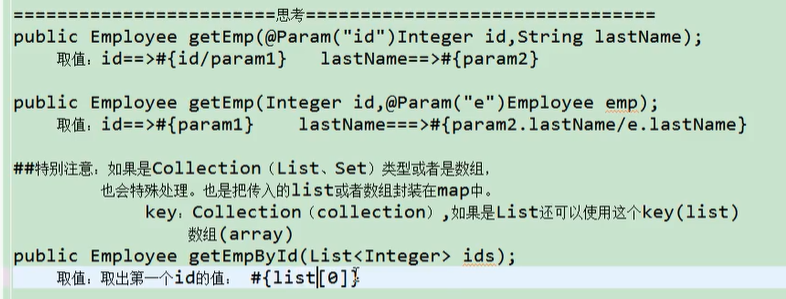

# MyBatis

## 问什么要使用框架

如果不使用框架，而是使用之前JDBC，Dbutils，JdbcTemplate，把SQL查询语句硬编码在Java代码中。会使得SQL语句的修改，优化都需要改动源码。进而导致重新部项目。


## 基本介绍

ORM（Object Relational Mapping）： 对象关系映射，指的是持久化数据和实体对象的映射模式，解决面向对象与关系型数据库存在的互不匹配的现象。将Java Bean映射层数据库里的一条记录。

区别于Hibernate，MyBatis框架是一款半成品软件，我们可以基于这个半成品软件继续开发，来完成我们个性化的需求！


**MyBatis**：

* MyBatis 是一个优秀的基于 java 的持久层框架，它内部封装了 JDBC，使开发者只需关注 SQL 语句本身，而不需要花费精力去处理加载驱动、创建连接、创建 Statement 等过程。

* MyBatis通过 xml 或注解的方式将要执行的各种 Statement 配置起来，并通过 Java 对象和 Statement 中 SQL 的动态参数进行映射生成最终执行的 sql 语句。

* MyBatis 框架执行 SQL 并将结果映射为 Java 对象并返回。采用 ORM 思想解决了实体和数据库映射的问题，对 JDBC 进行了封装，屏蔽了 JDBC 底层 API 的调用细节，使我们不用操作 JDBC API，就可以完成对数据库的持久化操作。

MyBatis官网地址：http://www.mybatis.org/mybatis-3/


## 基本操作

### 配置流程

#### 不使用接口式编程


1. 首先配置全局配置文件

   ```xml
   <?xml version="1.0" encoding="UTF-8" ?>
   <!DOCTYPE configuration
           PUBLIC "-//mybatis.org//DTD Config 3.0//EN"
           "http://mybatis.org/dtd/mybatis-3-config.dtd">
   <configuration>
       <environments default="development">
           <environment id="development">
               <transactionManager type="JDBC"/>
               <dataSource type="POOLED">
   
                   <property name="url" value="jdbc:mysql://localhost:3306/mybatis"/>
                   <property name="username" value="root"/>
                   <property name="password" value="1243"/>
                   <property name="driver" value="com.mysql.jdbc.Driver"/>
   
               </dataSource>
           </environment>
       </environments>
   
   <!--    <mappers>-->
   <!--        <mapper resource="EmployeeMapper.xml"/>-->
   <!--    </mappers>-->
   
   </configuration>
   ```

   

2. 根据xml配置文件（全局配置文件）创建一个SqlSessionFactoyr对象

   ```
   String resource = "mybatis-config.xml";
   InputStream inputStream = Resources.getResourceAsStream(resource);
   SqlSessionFactory sqlSessionFactory = new SqlSessionFactoryBuilder().build(inputStream);
   ```

   

3. 编写sql映射文件，在这个文件中配置了每一个sql，以及sql的封装规则等

   ```xml
   <?xml version="1.0" encoding="UTF-8" ?>
   <!DOCTYPE mapper
           PUBLIC "-//mybatis.org//DTD Mapper 3.0//EN"
           "http://mybatis.org/dtd/mybatis-3-mapper.dtd">
   
   <mapper namespace="com.wenjiefu.mybatis.EmployeeMapper">
   
       <select id="selectEmp" resultType="com.wenjiefu.mybatis.bean.Employee">
           select id, last_name lastName, gender, email from tbl_employee where id = #{id}
       </select>
   
   </mapper>
   ```

   

4. 将sql映射文件注册在全局配置文件中

   ```xml
   <!--<?xml version="1.0" encoding="UTF-8" ?>-->
   <!--<!DOCTYPE configuration-->
   <!--        PUBLIC "-//mybatis.org//DTD Config 3.0//EN"-->
   <!--        "http://mybatis.org/dtd/mybatis-3-config.dtd">-->
   <!--<configuration>-->
   <!--    <environments default="development">-->
   <!--        <environment id="development">-->
   <!--            <transactionManager type="JDBC"/>-->
   <!--            <dataSource type="POOLED">-->
   
   <!--                <property name="url" value="jdbc:mysql://localhost:3306/mybatis"/>-->
   <!--                <property name="username" value="root"/>-->
   <!--                <property name="password" value="1243"/>-->
   <!--                <property name="driver" value="com.mysql.jdbc.Driver"/>-->
   
   <!--            </dataSource>-->
   <!--        </environment>-->
   <!--    </environments>-->
   
       <mappers>
           <mapper resource="EmployeeMapper.xml"/>
       </mappers>
   
   <!--</configuration>-->
   ```

   

5. 写代码，使用sqlSession工程获取到sqlSession对象，并使用它来执行增删改查

   ```java
       @Test
       public void test() throws IOException {
           String resource = "mybatis-config.xml";
           InputStream inputStream = Resources.getResourceAsStream(resource);
           SqlSessionFactory sqlSessionFactory = new SqlSessionFactoryBuilder().build(inputStream);
   
           SqlSession sqlSession = sqlSessionFactory.openSession();
           try {
               //使用全限定名的方式调用sql语句
               Employee employee = sqlSession.selectOne("com.wenjiefu.mybatis.EmployeeMapper.selectEmp", 1);
               System.out.println(employee);
           } finally {
               sqlSession.close();
           }
       }
   ```

#### 使用接口式编程

可以通过给映射器创建接口的方式，不使用全限定名来代用sql语句

1. 首先创建一个接口

   ```java
   package com.wenjiefu.mybatis.dao;
   
   import com.wenjiefu.mybatis.bean.Employee;
   public interface EmployeeMapper {
   
       public Employee getEmpId(Integer id);
   }
   ```

   

2. 将Mapper的命名空间写为接口的全类名，并且select标签的id与接口内定义的方法名要相同

   ```xml
   <?xml version="1.0" encoding="UTF-8" ?>
   <!DOCTYPE mapper
           PUBLIC "-//mybatis.org//DTD Mapper 3.0//EN"
           "http://mybatis.org/dtd/mybatis-3-mapper.dtd">
   
   <mapper namespace="com.wenjiefu.mybatis.dao.EmployeeMapper">
   
       <select id="getEmpId" resultType="com.wenjiefu.mybatis.bean.Employee"> //resultType是返回类的全类名
           select id, last_name lastName, gender, email from tbl_employee where id = #{id}
       </select>
   
   </mapper>
   ```

3. 原理：将接口名字和xml文件的命名空间进行绑定，mybatis就会为接口创建一个代理对象，代理对象去执行增删改查

总结:

- SqlSession代表和数据库的一次会话，用完必须关闭
- SqlSession和Connection一样，都是线程安全的，每次使用都应该去获取一个新的对象
- mapper接口没有实现类，但是Mybatis会为这个接口生成一个代理对象（将接口与xml绑定）
- 两个重要的配置文件
  - mybatis的全局配置文件：数据库连接池信息等
  - sql映射文件：保存了每个sql语句的映射信息

### 相关API

#### Resources

org.apache.ibatis.io.Resources：加载资源的工具类

`InputStream getResourceAsStream(String fileName)`：通过类加载器返回指定资源的字节流

* 参数 fileName 是放在 src 的核心配置文件名：MyBatisConfig.xml

#### SqlSessionFactoryBuilder

org.apache.ibatis.session.SqlSessionFactoryBuilder：构建器，用来获取 SqlSessionFactory 工厂对象

`SqlSessionFactory build(InputStream is)`：通过指定资源的字节输入流获取 SqlSession 工厂对象


#### SqlSessionFactory

org.apache.ibatis.session.SqlSessionFactory：获取 SqlSession 构建者对象的工厂接口

`SqlSession openSession()`：获取 SqlSession 构建者对象，并开启手动提交事务

**`SqlSession openSession(boolean)`：获取 SqlSession 构建者对象，参数为 true 开启自动提交事务**，**如果没有传入true，name需要调用**

​																		**openSeesion.commit()手动提交数据**

#### SqlSession

org.apache.ibatis.session.SqlSession：构建者对象接口，用于执行 SQL、管理事务、接口代理

* SqlSession 代表和数据库的一次会话，用完必须关闭
* **SqlSession 和 connection 一样都是非线程安全，每次使用都应该去获取新的对象**

注：**update 数据需要提交事务，或开启默认提交**

| 方法                                                  | 说明                           |
| ----------------------------------------------------- | ------------------------------ |
| List<E> selectList(String statement,Object parameter) | 执行查询语句，返回List集合     |
| T selectOne(String statement,Object parameter)        | 执行查询语句，返回一个结果对象 |
| int insert(String statement,Object parameter)         | 执行新增语句，返回影响行数     |
| int update(String statement,Object parameter)         | 执行删除语句，返回影响行数     |
| int delete(String statement,Object parameter)         | 执行修改语句，返回影响行数     |
| void commit()                                         | 提交事务                       |
| void rollback()                                       | 回滚事务                       |
| T getMapper(Class<T> cls)                             | 获取指定接口的代理实现类对象   |
| void close()                                          | 释放资源                       |


***


### 映射配置

映射配置文件包含了数据和对象之间的映射关系以及要执行的 SQL 语句，放在src目录下，

命名：StudentMapper.xml

* 映射配置文件的文件头：

  ```xml-dtd
  <?xml version="1.0" encoding="UTF-8" ?>
  <!DOCTYPE mapper
          PUBLIC "-//mybatis.org//DTD Mapper 3.0//EN"
          "http://mybatis.org/dtd/mybatis-3-mapper.dtd">
  ```

* 根标签：
  * <mapper>：核心根标签
  * namespace：属性，名称空间

* 功能标签：

  * < select >：查询功能标签
  * <insert>：新增功能标签
  * <update>：修改功能标签
  * <delete>：删除功能标签
    * id：属性，唯一标识，配合名称空间使用
    
    * resultType：指定结果映射对象类型，和对应的方法的返回值类型(全限定名)保持一致，**但是如果返回值是List则和其泛型保持一致**。如果是没有返回值的语句，可以在接口定义四种类型的返回值（Integer，Long，Boolean，Void）
    
    * parameterType：指定参数映射对象类型，必须和对应的方法的参数类型(全限定名)保持一致
    
    * statementType：可选 STATEMENT，PREPARED 或 CALLABLE，默认值：PREPARED
      * STATEMENT：直接操作 sql，不进行预编译，获取数据：$ Statement
      * PREPARED：预处理参数，进行预编译，获取数据：# PreparedStatement
      * CALLABLE：执行存储过程，CallableStatement
      
    * | `useGeneratedKeys` | （仅适用于 insert 和 update）这会令 MyBatis 使用 JDBC 的 getGeneratedKeys 方法来取出由数据库内部生成的主键（比如：像 MySQL 和 SQL Server 这样的关系型数据库管理系统的自动递增字段），默认值：false。 |
      | ------------------ | ------------------------------------------------------------ |
      | `keyProperty`      | （仅适用于 insert 和 update）指定能够唯一识别对象的属性，MyBatis 会使用 getGeneratedKeys 的返回值或 insert 语句的 selectKey 子元素设置它的值，默认值：未设置（`unset`）。如果生成列不止一个，可以用逗号分隔多个属性名称。 |
    
      ```xml
      <insert id="insertAuthor" useGeneratedKeys="true"
          keyProperty="id">
        insert into Author (username,password,email,bio)
        values (#{username},#{password},#{email},#{bio})
      </insert>
      ```
    
    * 如果想要查询的结果以map的形式返回
    
      ```xml
      方式一
      <!--返回一条记录的map：key是列名，值就是对应的值-->
      <select id="getEmpByIdReturnMap" resultType="map">
          select * from tbl_employee where id=#{id}
      </select>
      
      方式二
      <!--多条记录封装在一个map中，Map<Integer, Employee>键是这条记录的主键，值是记录封装后的JavaBean-->
          //通过注解告诉mybatis封装map时的key
          @MapKey("lastName")
          public Map<Integer, Employee> getEmpByLastNameLikeReturnMap(String lastName);
      
          <!--resultType内要写的是想要返回的元素的类型  -->
          <select id="getEmpByLastNameLikeReturnMap" resultType="com.wenjiefu.mybatis.bean.Employee">
              select * from tbl_employee where last_name like #{lastName}
          </select>
      ```
      
      

* 参数获取方式：
  * SQL 获取参数：#{属性名}

    ```xml-dtd
    <mapper namespace="StudentMapper">
        <select id="selectById" resultType="student" parameterType="int">
    		SELECT * FROM student WHERE id = #{id}
        </select>
    <mapper/>
    ```

### resultMap的使用

为了解决JavaBean的数据模型属性和表的字段不一致的情况，可以有以下三种解决办法

- 在全局配置文件中配置Setting属性

  ```
  <setting name="mapUnderscoreToCamelCase" value="True"/>
  ```

- 在查询语句中把属性作为字段的别名

  ```xml
  <select id="getEmpId" resultType="com.wenjiefu.mybatis.bean.Employee">
      select id, last_name lastName, gender, email from tbl_employee where id = #{id}
  </select>
  ```

- 使用resultMap自定义封装规则

  ```xml
  public class Employee {
      private Integer id;
      private String lastName;
      private String email;
      private String gender;
  
  <!--
      type:需要自定义封装规则的Java类型
      id:该规则的唯一引用id
      -->
  <resultMap id="MyEmp" type="com.wenjiefu.mybatis.bean.Employee">
      <!--
          id定义主键会在底层有优化
          使用id标签指定主键列的封装规则
                  -->
      <id column="id" property="id"/>
      <!--使用result定义普通封装规则        -->
      <result column="last_name" property="lastName"/>
      <!--其他不指定的列会自动封装：但推荐把全部的映射规则都写上，方便后来的检查        -->
      <result column="email" property="email"/>
      <result column="gender" property="gender"/>
  </resultMap>
  
  <select id="getEmpById" resultMap="MyEmp">
      select * from tbl_employee where id = #{id}
  </select>
  ```

在查询结果的封装中经常会出现级联属性的封装，比如Employee类中有它所属的Department

```
public class Employee {
    private Integer id;
    private String lastName;
    private String email;
    private String gender;
    private Department dept;
```

如何在查询出Employee的同时也将它的Department也查询出来，封装到Employee的Department属性中

```xml
<!--方法一-->
<!--    联合查询：级联属性封装结果集-->
<resultMap id="MyDifEmp1" type="com.wenjiefu.mybatis.bean.Employee">
    <id column="id" property="id"/>
    <result column="last_name" property="lastName"/>
    <result column="gender" property="gender"/>
    <result column="did" property="dept.id"/>
    <result column="dept_name" property="dept.departmentName"/>
</resultMap>

<!--方法二，使用Association标签-->
<resultMap id="MyDifEmp2" type="com.wenjiefu.mybatis.bean.Employee">
    <id column="id" property="id"/>
    <result column="last_name" property="lastName"/>
    <result column="gender" property="gender"/>


    <!--使用association可以指定联合的javaBean对象
            propetry="dept":指定哪个属性是联合的对象
            javaType:指定这个属性对象的类型
            -->
    <association property="dept" javaType="com.wenjiefu.mybatis.bean.Department">
        <id column="did" property="id"/>
        <result column="dept_name" property="departmentName"/>
    </association>
</resultMap>

<select id="getEmpAndDeptById" resultMap="MyDifEmp2">
    SELECT e.id id, e.last_name last_name, e.gender gender, e.d_id d_id,
    d.id did, d.dept_name dept_name
    FROM tbl_employee e, tbl_dept d
    WHERE e.d_id = d.id AND e.id = #{id}
</select>
-------------------------------------------------------------------------------------------------
我们还可以使用Association进行分步查询

以下是一个分步查询的例子，
查询：给定员工号，查询它的部门信息。
这个问题可以分成两步，
首先到员工表中查询出id的1的员工的部门号（假设为1）
然后到部门表中查询部门号为1的部门信息

select * from tbl_employee where id= 1;
select * from tbl_dept where id = 1 

<!--使用association进行分步查询
1. 先按照员工id查询员工信息
2. 根据查询员工信息中的d_id值去部门表查出部门信息
3. 部门信息设置到员工中
-->
public interface DepartmentMapper {
    public Department getDeptById(Integer id);
}
----
<select id="getDeptById" resultType="com.wenjiefu.mybatis.bean.Department">
    select id, dept_name departmentName from tbl_dept where id = #{id}
</select>
----
public interface EmployeeMapper {
    public Employee getEmpById(Integer id);
    public Employee getEmpByStep(Integer id);
}
----
<resultMap id="MyEmpByStep" type="com.wenjiefu.mybatis.bean.Employee">
    <id column="id" property="id"/>
    <result column="last_name" property="lastName"/>
    <result column="email" property="email"/>
    <result column="gender" property="gender"/>

    <!--这里，我们希望department信息能够按照id自己查询出来
            属性：selelct，表示当前属性是调用select指定的方法查出的结果
            column:指定将哪一列的值传给这个方法

            流程：使用select指定的方法（传入column指定的这列参数的值）查出对象，并封装给property封装的属性
            -->
    <association property="dept" select="com.wenjiefu.mybatis.dao.DepartmentMapper.getDeptById" column="d_id">

    </association>
</resultMap>
----
<select id="getEmpByStep" resultMap="MyEmpByStep">
    select * from tbl_employee where id = #{id}
</select>


DEBUG 08-05 21:41:44,887 ==>  Preparing: select * from tbl_employee where id = ?   (BaseJdbcLogger.java:145) 
DEBUG 08-05 21:41:44,929 ==> Parameters: 1(Integer)  (BaseJdbcLogger.java:145) 
DEBUG 08-05 21:41:44,956 ====>  Preparing: select id, dept_name departmentName from tbl_dept where id = ?   (BaseJdbcLogger.java:145) 

Employee{id=1, lastName='wenjie', email='wenjie@gamil', gender='1', dept=Department{id=1, departmentName='开发', emps=null}}
                                 
 从上面可以发现，mybatis生成了两个的查询语句

-----------------------------------------------------------------------------------------------
分步查询同时还支持延迟加载
在上面的查询过程中，我们每次查询Employee对象的时候都会将Department对象也查询出来，但是我们不一定每次都要用到Department。
我们希望实现按需查询

使用Association而可以开启延迟查询。通过在全局配置文件的Setting，可以开启延迟查询。
<setting name="lazyLoadingEnabled" value="true"/>
<setting name="aggressiveLazyLoading" value="false"/>
```

如果JavaBean中级联List属性，并且想在查询后将查询结果封装进去的话需要使用Collection标签

```xml
<!--    查询部门的时候，将部门对应的员工也查出来-->
<!--   did  dept_name    || eid  lastName  email         gender  -->
    <resultMap id="MyDept" type="com.wenjiefu.mybatis.bean.Department">
        <id column="did" property="id"/>
        <result column="dept_name" property="departmentName"/>
<!--        collection 定义关联的集合类型的属性的封装规则
              ofType 指定集合里面元素的类型-->
        <collection property="emps" ofType="com.wenjiefu.mybatis.bean.Employee">
<!--            定义这个集合中元素的封装规则-->
            <id column="eid" property="id"/>
            <result column="last_name" property="lastName"/>
            <result column="email" property="email"/>
            <result column="gender" property="gender"/>
        </collection>
    </resultMap>

    <select id="getDeptByIdPlus" resultMap="MyDept">
        SELECT d.id did, d.`dept_name` dept_name,
        e.`id` eid, e.`last_name` lastName, e.email email, e.gender gender

        FROM tbl_dept d
        LEFT JOIN tbl_employee e
        ON d.`id` = e.`d_id`
        WHERE
        d.`id` = 1
    </select>
```

强烈推荐官方文档：https://mybatis.org/mybatis-3/zh/sqlmap-xml.html


***


### 核心配置

核心配置文件包含了 MyBatis 最核心的设置和属性信息，如数据库的连接、事务、连接池信息等。放在src目录下。注意标签需要按照顺序配置

命名：MyBatisConfig.xml

* 核心配置文件的文件头：xml的约束文件

  ```xml-dtd
  <?xml version="1.0" encoding="UTF-8" ?>
  <!DOCTYPE configuration PUBLIC "-//mybatis.org//DTD Config 3.0//EN" "http://mybatis.org/dtd/mybatis-3-config.dtd">
  ```

* 根标签：

  * <configuration>：核心根标签

* 引入连接配置文件：

  * <properties>： mybatis可以使用properties来引入外部properties配置文件的内容，通常用于引入数据库连接配置

    * resource：引入类路径下的资源
    * url：引入磁盘路径或者网络路径下的资源
    
    ```xml-dtd
    <?xml version="1.0" encoding="UTF-8" ?>
    <!DOCTYPE configuration
            PUBLIC "-//mybatis.org//DTD Config 3.0//EN"
            "http://mybatis.org/dtd/mybatis-3-config.dtd">
    <configuration>
    	引入数据源
        <properties resource="dbconfig.properties"></properties>
    
        <environments default="development">
            <environment id="development">
                <transactionManager type="JDBC"/>
                <dataSource type="POOLED">
                    <property name="driver" value="${jdbc.driver}"/>
                    <property name="url" value="${jdbc.url}"/>
                    <property name="username" value="${jdbc.username}"/>
                    <property name="password" value="${jdbc.password}"/>
                </dataSource>
            </environment>
        </environments>
    
        <mappers>
            <mapper resource="EmployeeMapper.xml"/>
        </mappers>
    </configuration>
    ```
    
    

* 调整设置

  * <settings>：可以改变 Mybatis 运行时行为，具体查看官网文档

* 起别名：别名 不区分大小写

  * <typeAliases>：为全类名起别名的父标签。

    * <typeAlias>：为全类名起别名的子标签
      * type：指定全类名      
      * alias：指定别名
      
    * <package>：为指定包下所有类起别名的子标签，别名就是类名，首字母小写

    ```xml-dtd
    <!--起别名-->
    <typeAliases>
    	<typeAlias type="bean.Student" alias="student"/> //为当个类起别名
    
    	<package name="com.seazean.bean"/> //为当前包下的所有类起默认别名
    		<!--二选一-->
    </typeAliase>
    ```
  
  * 自带别名：
  
    | 别名    | 数据类型          |
    | ------- | ----------------- |
    | string  | java.lang.String  |
    | long    | java.lang.Lang    |
    | int     | java.lang.Integer |
    | double  | java.lang.Double  |
    | boolean | java.lang.Boolean |
    | ....    | ......            |


* 配置环境，可以配置多个标签
  * <environments>：配置数据库环境标签。default属性：指定当前是哪个environment
  * <environment>：配置数据库环境子标签。id属性：数据库的唯一标识。配置一个具体的环境必须有以下两个标签。
    * transactionManager：
    * datasource：
  * <transactionManager>：事务管理标签。type属性：默认JDBC事务
  * <dataSoure>：数据源标签。
    * type属性：POOLED使用连接池(mybatis内置); UNPOOLED不使用连接池
  * <property>：数据库连接信息标签。
    * name属性取值：driver，url，username，password
    * value属性取值：与name对应
* 引入映射配置文件

  * <mappers>：引入映射配置文件标签
  * <mapper>：引入映射配置文件子标签
    * resource：属性指定映射配置文件的名称（推荐）
    * url：引用网路路径或者磁盘路径下的 sql 映射文件
    * class：
      * 有sql映射文件，映射文件必须和接口同名，并且放在接口的同一目录下（不推荐）
      * 基于注解，不需要写sql映射文件。将sql语句写在接口对应方法的注解里（不推荐）
  * <package>：批量注册（映射文件和接口需要在同一个包下）（不推荐）


参考官方文档：https://mybatis.org/mybatis-3/zh/configuration.html


***


### 参数配置

传入单个参数：mybatis不会做特殊处理：#{参数名}：取出参数值

传入多个参数：mybatis会做特殊处理

- 多个参数会被封装成一个map。此时#{}就是从map中获取指定的key值，

  - key：param1...paramN

  - value：传入的参数值

    ```xml
        <select id="getEmpByIdAndLastName" resultType="com.wenjiefu.mybatis.bean.Employee">
            slect * from tbl_employee where id = #{param1} and last_name=#{param2}
        </select>
    
    ```

- param不太直白，可以通过命名替换，指定多个参数的情况。然后就可以使用#{对应的key}取出对应的参数值

  ```java
      public Employee getEmpByIdAndLastName(@Param("id") Integer id, @Param("lastName") String lastName);
  
      <select id="getEmpByIdAndLastName" resultType="com.wenjiefu.mybatis.bean.Employee">
          select * from tbl_employee where id = #{id} and last_name=#{lastName}
      </select>
  ```

- 如果多个参数正好是业务逻辑的数据模型，我们就可以直接传入pojo。然后使用#{属性名}取出传入的jojo的属性名

- 如果多个参数不是业务模型的数据，没有对应的pojo，也可以传入一个map，然后用#{key}取出map中对应的值

- 多个参数不是业务模型的数据，但要经常使用，推荐编写一个TO(Transfer Object)数据传输对象（类似于POJO）

  ```
  Page{
  	int index;
  	int size;
  }
  ```

  



**#{}：**占位符，传入的内容会作为字符串，加上引号，以**预编译**的方式传入，将 sql 中的 #{} 替换为 ? 号，调用 PreparedStatement 的 set方法来赋值，有效的防止 SQL 注入，提高系统安全性

#{}内支持更丰富的用法，可以在里面加入除了传入参数以外的更多设置：javaType, jdbcType..

```
#{department, mode=OUT, jdbcType=CURSOR, javaType=ResultSet, resultMap=departmentResultMap}
```

jdbcType通常需要在某种特定条件下设置： JDBC 要求，如果一个列允许使用 null 值，并且会使用值为 null 的参数，就必须要指定 JDBC 类型（jdbcType）。在我们的数据为null的时候，有些数据库可能不能识别mybatis对null的处理（mybatis对于null类型设置为other），比如Oracle，就需要进行以下设置。

```
#{id, jdbcType=null}
```

JdbcType Other类型：无效类型，mybatis对所有的null都映射的是原生jdbc的other类型。

或者 全局中进行配置

```xml
<settings>
    <setting name="jdbcTypeForNull" value="NULL"/>
</settings>
```


**${}：**拼接符，传入的内容会直接替换拼接在sql语句中，不会加上引号，可能存在 sql 注入的安全隐患

* 能用 #{} 的地方就用 #{}，不用或少用 ${}，
* #{}只支持传入的参数进行预编译，在原生JDBC也不支持预编译的地方,必须使用 ${} 的情况：
  * 表名作参数时，如：`SELECT * FROM ${tableName}`
  * order by 时，如：`SELECT * FROM t_user ORDER BY ${columnName}`

* sql 语句使用 #{}，properties 文件内容获取使用 ${} 

### 参数配置的源码分析


****


### 日志文件

在日常开发过程中，排查问题时需要输出 MyBatis 真正执行的 SQL 语句、参数、结果等信息，就可以借助 log4j 的功能来实现执行信息的输出。

* 在核心配置文件根标签内配置 log4j

  ```xml
  <!--配置LOG4J-->
  <settings>
  	<setting name="logImpl" value="log4j"/>
  </settings>
  ```

* 在 src 目录下创建 log4j.properties

  ```properties
  # Global logging configuration
  log4j.rootLogger=DEBUG, stdout
  # Console output...
  log4j.appender.stdout=org.apache.log4j.ConsoleAppender
  log4j.appender.stdout.layout=org.apache.log4j.PatternLayout
  log4j.appender.stdout.layout.ConversionPattern=%5p [%t] - %m%n
  
  #输出到日志文件
    #log4j.appender.file=org.apache.log4j.FileAppender
    #log4j.appender.file.File=../logs/iask.log
    #log4j.appender.file.layout=org.apache.log4j.PatternLayout
    #log4j.appender.file.layout.ConversionPattern=%d{yyyy-MM-dd HH:mm:ss}  %l  %m%n
  ```

* pom.xml

  ```xml
  <dependency>
      <groupId>org.slf4j</groupId>
      <artifactId>slf4j-api</artifactId>
      <version>1.7.21</version>
  </dependency>
  <dependency>
      <groupId>org.slf4j</groupId>
      <artifactId>slf4j-log4j12</artifactId>
      <version>1.7.21</version>
  </dependency>
  ```

  


***


### 代码实现

* 实体类

  ```java
  public class Student {
      private Integer id;
      private String name;
      private Integer age;
      .....
  }
  ```

* StudentMapper

  ```java
  public interface StudentMapper {
      //查询全部
      public abstract List<Student> selectAll();
  
      //根据id查询
      public abstract Student selectById(Integer id);
  
      //新增数据
      public abstract Integer insert(Student stu);
  
      //修改数据
      public abstract Integer update(Student stu);
  
      //删除数据
      public abstract Integer delete(Integer id);
  }
  ```

* config.properties

  ```properties
  driver=com.mysql.jdbc.Driver
  url=jdbc:mysql://192.168.2.184:3306/db11
  username=root
  password=123456
  ```

* MyBatisConfig.xml

  ```xml
  <?xml version="1.0" encoding="UTF-8" ?>
  <!DOCTYPE configuration PUBLIC "-//mybatis.org//DTD Config 3.0//EN" "http://mybatis.org/dtd/mybatis-3-config.dtd">
  
  <!--核心根标签-->
  <configuration>
      <!--引入数据库连接的配置文件-->
      <properties resource="jdbc.properties"/>
      
      <!--配置LOG4J-->
      <settings>
          <setting name="logImpl" value="log4j"/>
      </settings>
      
      <!--起别名-->
      <typeAliases>
          <typeAlias type="bean.Student" alias="student"/>
          <!--<package name="bean"/>-->
      </typeAliases>
  
      <!--配置数据库环境，可以多个环境，default指定哪个-->
      <environments default="mysql">
          <!--id属性唯一标识-->
          <environment id="mysql">
              <!--事务管理，type属性，默认JDBC事务-->
              <transactionManager type="JDBC"></transactionManager>
              <!--数据源信息   type属性连接池-->
              <dataSource type="POOLED">
                  <!--property获取数据库连接的配置信息-->
                  <property name="driver" value="${driver}"/>
                  <property name="url" value="${url}"/>
                  <property name="username" value="${username}"/>
                  <property name="password" value="${password}"/>
              </dataSource>
          </environment>
      </environments>
  
      <!--引入映射配置文件-->
      <mappers>
          <!--mapper引入指定的映射配置 resource属性执行的映射配置文件的名称-->
          <mapper resource="StudentMapper.xml"/>
      </mappers>
  </configuration>
  ```

* StudentMapper.xml

  ```xml
  <?xml version="1.0" encoding="UTF-8" ?>
  <!DOCTYPE mapper
          PUBLIC "-//mybatis.org//DTD Mapper 3.0//EN"
          "http://mybatis.org/dtd/mybatis-3-mapper.dtd">
  
  <mapper namespace="StudentMapper">
      <select id="selectAll" resultType="student">
          SELECT * FROM student
      </select>
  
      <select id="selectById" resultType="student" parameterType="int">
          SELECT * FROM student WHERE id = #{id}
      </select>
  
      <insert id="insert" parameterType="student">
          INSERT INTO student VALUES (#{id},#{name},#{age})
      </insert>
  
      <update id="update" parameterType="student">
          UPDATE student SET name = #{name}, age = #{age} WHERE id = #{id}
      </update>
  
      <delete id="delete" parameterType="student">
          DELETE FROM student WHERE id = #{id}
      </delete>
  
  </mapper>
  ```

* 控制层测试代码：根据id查询

  ```java
  @Test
  public void selectById() throws Exception{
      //1.加载核心配置文件
      InputStream is = Resources.getResourceAsStream("MyBatisConfig.xml");
  
      //2.获取SqlSession工厂对象
      SqlSessionFactory ssf = new SqlSessionFactoryBuilder().build(is);
  
      //3.通过工厂对象获取SqlSession对象
      SqlSession sqlSession = ssf.openSession();
  
      //4.执行映射配置文件中的sql语句，并接收结果
      Student stu = sqlSession.selectOne("StudentMapper.selectById", 3);
  
      //5.处理结果
      System.out.println(stu);
  
      //6.释放资源
      sqlSession.close();
      is.close();
  }
  ```

* 控制层测试代码：新增功能

  ```java
  @Test
  public void insert() throws Exception{
      //1.加载核心配置文件
      //2.获取SqlSession工厂对象
      //3.通过工厂对象获取SqlSession对象
      SqlSession sqlSession = sqlSessionFactory.openSession(true);
  
      //4.执行映射配置文件中的sql语句，并接收结果
      Student stu = new Student(5,"周七",27);
      int result = sqlSession.insert("StudentMapper.insert", stu);
  
      //5.提交事务
      //sqlSession.commit();
  
      //6.处理结果
      System.out.println(result);
  
      //7.释放资源
      sqlSession.close();
      is.close();
  }
  ```


****


### 批量操作

两种方式实现批量操作：

* <settings> 标签属性：这种方式属于全局批量

  ```xml
  <settings>
      <setting name="defaultExecutorType" value="BATCH"/>
  </settings>
  ```

  defaultExecutorType：配置默认的执行器

  * SIMPLE 就是普通的执行器
  * REUSE 执行器会重用预处理语句（PreparedStatement）
  * BATCH 执行器不仅重用语句还会执行批量更新

* SqlSession 会话内批量操作：

  ```java
  public void testBatch() throws IOException{
      SqlSessionFactory sqlSessionFactory = getSqlSessionFactory();
  
      //可以执行批量操作的sqlSession
      SqlSession openSession = sqlSessionFactory.openSession(ExecutorType.BATCH);
      long start = System.currentTimeMillis();
      try{
          EmployeeMapper mapper = openSession.getMapper(EmployeeMapper.class);
          for (int i = 0; i < 10000; i++) {
              mapper.addEmp(new Employee(UUID.randomUUID().toString().substring(0, 5), "b", "1"));
          }
          openSession.commit();
          long end = System.currentTimeMillis();
          //批量：（预编译sql一次==>设置参数===>10000次===>执行1次（类似管道））
          //非批量：（预编译sql=设置参数=执行）==》10000   耗时更多
          System.out.println("执行时长："+(end-start));
      }finally{
          openSession.close();
      }
  }
  ```

* Spring 配置文件方式（applicationContext.xml）：

  ```xml
  <!--配置一个可以进行批量执行的sqlSession  -->
  <bean id="sqlSession" class="org.mybatis.spring.SqlSessionTemplate">
      <constructor-arg name="sqlSessionFactory" ref="sqlSessionFactoryBean"/>
      <constructor-arg name="executorType" value="BATCH"/>
  </bean>
  ```

  ```java
  @Autowired
  private SqlSession sqlSession;
  ```

  


***


## 代理开发

### 代理规则

分层思想：控制层（controller）、业务层（service）、持久层（dao）

调用流程：


传统方式实现 DAO 层，需要写接口和实现类。采用 Mybatis 的代理开发方式实现 DAO 层的开发，只需要编写Mapper 接口（相当于 Dao  接口），由 Mybatis 框架根据接口定义创建接口的动态代理对象。

接口开发方式：

1. 定义接口
2. 操作数据库，mybatis框架根据接口，通过动态代理的方式生成代理对象，负责数据库的crud操作

Mapper 接口开发需要遵循以下规范：

* Mapper.xml 文件中的 namespace 与 DAO 层 mapper 接口的全类名相同

* Mapper.xml 文件中的增删改查标签的id属性和 DAO 层 Mapper 接口方法名相同

* Mapper.xml 文件中的增删改查标签的 parameterType 属性和 DAO 层 Mapper 接口方法的参数相同

* Mapper.xml 文件中的增删改查标签的 resultType 属性和 DAO 层 Mapper 接口方法的返回值相同

  
  
  

***


### 实现原理

通过动态代理开发模式，我们只编写一个接口，不写实现类，通过 **getMapper()** 方法最终获取到 org.apache.ibatis.binding.MapperProxy 代理对象，而这个代理对象是 MyBatis 使用了 JDK 的动态代理技术

动态代理实现类对象在执行方法时最终调用了 **MapperMethod.execute()** 方法，这个方法中通过 switch case 语句根据操作类型来判断是新增、修改、删除、查询操作，最后一步回到了 MyBatis 最原生的 **SqlSession 方式来执行增删改查**。

* 代码实现：

  ```java
  public Student selectById(Integer id) {
      Student stu = null;
      SqlSession sqlSession = null;
      InputStream is = null;
      try{
          //1.加载核心配置文件
          is = Resources.getResourceAsStream("MyBatisConfig.xml");
  
          //2.获取SqlSession工厂对象
          SqlSessionFactory s = new SqlSessionFactoryBuilder().build(is);
  
          //3.通过工厂对象获取SqlSession对象
          sqlSession = s.openSession(true);
  
          //4.获取StudentMapper接口的实现类对象
          StudentMapper mapper = sqlSession.getMapper(StudentMapper.class); 
  
          //5.通过实现类对象调用方法，接收结果
          stu = mapper.selectById(id);
      } catch (Exception e) {
          e.getMessage();
      } finally {
          //6.释放资源
          if(sqlSession != null) {
              sqlSession.close();
          }
          if(is != null) {
              try {
                  is.close();
              } catch (IOException e) {
                  e.printStackTrace();
              }
          }
      }
      //7.返回结果
      return stu;
  }
  ```

  


***


## 结果映射

### 相关标签

<resultType>：返回的是一个集合，要写集合中元素的类型

<resultMap>：返回一条记录的Map，key 是列名，value 是对应的值，用来配置字段和对象属性的映射关系标签，结果映射（和 resultType 二选一）

* id 属性：唯一标识
* type 属性：实体对象类型

<resultMap>内的核心配置文件标签：

* <id>：配置主键映射关系标签。
* <result>：配置非主键映射关系标签
  * column 属性：表中字段名称
  * property 属性： 实体对象变量名称

* <association>：配置被包含对象的映射关系标签，嵌套封装结果集（多对一、一对一）
  *  property 属性：被包含对象的变量名，要进行映射的属性名（Java 中的 Bean 类）
  *  javaType 属性：被包含对象的数据类型，要进行映射的属性的类型

* <collection>：配置被包含集合对象的映射关系标签，嵌套封装结果集（一对多、多对多）
  * property 属性：被包含集合对象的变量名
  * ofType 属性：集合中保存的对象数据类型 

* <discriminator>：鉴别器，用来判断某列的值，根据得到某列的不同值做出不同自定义的封装行为

自定义封装规则可以将数据库中比较复杂的数据类型映射为 javaBean 中的属性


****


### 一对一

一对一实现：

* 数据准备

  ```mysql
  CREATE TABLE person(
  	id INT PRIMARY KEY AUTO_INCREMENT,
  	name VARCHAR(20),
  	age INT
  );
  INSERT INTO person VALUES (NULL,'张三',23),(NULL,'李四',24),(NULL,'王五',25);
  
  CREATE TABLE card(
  	id INT PRIMARY KEY AUTO_INCREMENT,
  	number VARCHAR(30),
  	pid INT,
  	CONSTRAINT cp_fk FOREIGN KEY (pid) REFERENCES person(id)
  );
  INSERT INTO card VALUES (NULL,'12345',1),(NULL,'23456',2),(NULL,'34567',3);
  ```

* bean 类

  ```java
  public class Card {
      private Integer id;     //主键id
      private String number;  //身份证号
      private Person p;       //所属人的对象
      ......
  }
  
  public class Person {
      private Integer id;     //主键id
      private String name;    //人的姓名
      private Integer age;    //人的年龄
  }
  ```

* 配置文件 OneToOneMapper.xml，MyBatisConfig.xml 需要引入（可以把 bean 包下起别名）

  ```xml
  <?xml version="1.0" encoding="UTF-8" ?>
  <!DOCTYPE mapper
          PUBLIC "-//mybatis.org//DTD Mapper 3.0//EN"
          "http://mybatis.org/dtd/mybatis-3-mapper.dtd">
  
  <mapper namespace="OneToOneMapper">
  
      <!--配置字段和实体对象属性的映射关系-->
      <resultMap id="oneToOne" type="card">
         	<!--column 表中字段名称，property 实体对象变量名称-->
          <id column="cid" property="id" />
          <!--column 表中字段名称，property 实体对象变量名称-->
          <result column="number" property="number" />
          <!--
              association：配置被包含对象的映射关系
              property：被包含对象的变量名
              javaType：被包含对象的数据类型
          -->
          <association property="p" javaType="bean.Person">
              <id column="pid" property="id" />
              <result column="name" property="name" />
              <result column="age" property="age" />
          </association>
      </resultMap>
  
      <select id="selectAll" resultMap="oneToOne"> <!--SQL-->
          SELECT c.id cid,number,pid,NAME,age FROM card c,person p WHERE c.pid=p.id
      </select>
  </mapper>
  ```

* 核心配置文件 MyBatisConfig.xml

  ```xml
  <!-- mappers引入映射配置文件 -->
  <mappers>
      <mapper resource="one_to_one/OneToOneMapper.xml"/>
      <mapper resource="one_to_many/OneToManyMapper.xml"/>
      <mapper resource="many_to_many/ManyToManyMapper.xml"/>
  </mappers>
  ```

* 测试类

  ```java
  public class Test01 {
      @Test
      public void selectAll() throws Exception{
          //1.加载核心配置文件
          InputStream is = Resources.getResourceAsStream("MyBatisConfig.xml");
  
          //2.获取SqlSession工厂对象
          SqlSessionFactory ssf = new SqlSessionFactoryBuilder().build(is);
  
          //3.通过工厂对象获取SqlSession对象
          SqlSession sqlSession = ssf.openSession(true);
  
          //4.获取OneToOneMapper接口的实现类对象
          OneToOneMapper mapper = sqlSession.getMapper(OneToOneMapper.class);
  
          //5.调用实现类的方法，接收结果
          List<Card> list = mapper.selectAll();
  
          //6.处理结果
          for (Card c : list) {
              System.out.println(c);
          }
  
          //7.释放资源
          sqlSession.close();
          is.close();
      }
  }
  ```

  

  

***


### 一对多

一对多实现：

* 数据准备

  ```mysql
  CREATE TABLE classes(
  	id INT PRIMARY KEY AUTO_INCREMENT,
  	name VARCHAR(20)
  );
  INSERT INTO classes VALUES (NULL,'程序一班'),(NULL,'程序二班')
  
  CREATE TABLE student(
  	id INT PRIMARY KEY AUTO_INCREMENT,
  	name VARCHAR(30),
  	age INT,
  	cid INT,
  	CONSTRAINT cs_fk FOREIGN KEY (cid) REFERENCES classes(id)
  );
  INSERT INTO student VALUES (NULL,'张三',23,1),(NULL,'李四',24,1),(NULL,'王五',25,2);
  ```

* bean 类

  ```java
  public class Classes {
      private Integer id;     //主键id
      private String name;    //班级名称
      private List<Student> students; //班级中所有学生对象
      ........
  }
  public class Student {
      private Integer id;     //主键id
      private String name;    //学生姓名
      private Integer age;    //学生年龄
  }
  ```

* 映射配置文件

  ```xml
  <mapper namespace="OneToManyMapper">
      <resultMap id="oneToMany" type="bean.Classes">
          <id column="cid" property="id"/>
          <result column="cname" property="name"/>
  
          <!--collection：配置被包含的集合对象映射关系-->
          <collection property="students" ofType="bean.Student">
              <id column="sid" property="id"/>
              <result column="sname" property="name"/>
              <result column="sage" property="age"/>
          </collection>
      </resultMap>
      <select id="selectAll" resultMap="oneToMany"> <!--SQL-->
          SELECT c.id cid,c.name cname,s.id sid,s.name sname,s.age sage FROM classes c,student s WHERE c.id=s.cid
      </select>
  </mapper>
  ```

* 代码实现片段

  ```java
  //4.获取OneToManyMapper接口的实现类对象
  OneToManyMapper mapper = sqlSession.getMapper(OneToManyMapper.class);
  
  //5.调用实现类的方法，接收结果
  List<Classes> classes = mapper.selectAll();
  
  //6.处理结果
  for (Classes cls : classes) {
      System.out.println(cls.getId() + "," + cls.getName());
      List<Student> students = cls.getStudents();
      for (Student student : students) {
          System.out.println("\t" + student);
      }
  }
  ```


***


### 多对多

学生课程例子，中间表不需要 bean 实体类

* 数据准备

  ```mysql
  CREATE TABLE course(
  	id INT PRIMARY KEY AUTO_INCREMENT,
  	name VARCHAR(20)
  );
  INSERT INTO course VALUES (NULL,'语文'),(NULL,'数学');
  
  CREATE TABLE stu_cr(
  	id INT PRIMARY KEY AUTO_INCREMENT,
  	sid INT,
  	cid INT,
  	CONSTRAINT sc_fk1 FOREIGN KEY (sid) REFERENCES student(id),
  	CONSTRAINT sc_fk2 FOREIGN KEY (cid) REFERENCES course(id)
  );
  INSERT INTO stu_cr VALUES (NULL,1,1),(NULL,1,2),(NULL,2,1),(NULL,2,2);
  ```

* bean类

  ```java
  public class Student {
      private Integer id;     //主键id
      private String name;    //学生姓名
      private Integer age;    //学生年龄
      private List<Course> courses;   // 学生所选择的课程集合
  }
  public class Course {
      private Integer id;     //主键id
      private String name;    //课程名称
  }
  ```

* 配置文件

  ```xml
  <mapper namespace="ManyToManyMapper">
      <resultMap id="manyToMany" type="Bean.Student">
          <id column="sid" property="id"/>
          <result column="sname" property="name"/>
          <result column="sage" property="age"/>
  
          <collection property="courses" ofType="Bean.Course">
              <id column="cid" property="id"/>
              <result column="cname" property="name"/>
          </collection>
      </resultMap>
      <select id="selectAll" resultMap="manyToMany"> <!--SQL-->
          SELECT sc.sid,s.name sname,s.age sage,sc.cid,c.name cname FROM student s,course c,stu_cr sc WHERE sc.sid=s.id AND sc.cid=c.id
      </select>
  </mapper>
  ```


***


### 鉴别器

需求：如果查询结果是女性，则把部门信息查询出来，否则不查询 ；如果是男性，把 last_name 这一列的值赋值给emai

```xml
<!-- 
    column：指定要判断的列名 
    javaType：列值对应的java类型
   -->
<discriminator javaType="string" column="gender">
    <!-- 女生 -->
    <!-- resultType不可缺少，也可以使用resutlMap -->
    <case value="0" resultType="com.bean.Employee">
        <association property="dept"
                     select="com.dao.DepartmentMapper.getDeptById"
                     column="d_id">
        </association>
    </case>
    <!-- 男生 -->
    <case value="1" resultType="com.bean.Employee">
        <id column="id" property="id"/>
        <result column="last_name" property="lastName"/>
        <result column="gender" property="gender"/>
    </case>
</discriminator>
```


****


### 延迟加载

#### 两种加载

立即加载：只要调用方法，马上发起查询

延迟加载：在需要用到数据时才进行加载，不需要用到数据时就不加载数据，延迟加载也称懒加载。  

优点： 先从单表查询，需要时再从关联表去关联查询，提高数据库性能，因为查询单表要比关联查询多张表速度要快，节省资源

坏处：只有当需要用到数据时，才会进行数据库查询，这样在大批量数据查询时，查询工作也要消耗时间，所以可能造成用户等待时间变长，造成用户体验下降

核心配置文件

| 标签名                | 描述                                                         | 默认值 |
| --------------------- | ------------------------------------------------------------ | ------ |
| lazyLoadingEnabled    | 延迟加载的全局开关。当开启时，所有关联对象都会延迟加载。特定关联关系中可通过设置 `fetchType` 属性来覆盖该项的开关状态。 | false  |
| aggressiveLazyLoading | 开启时，任一方法的调用都会加载该对象的所有延迟加载属性。否则每个延迟加载属性会按需加载（参考 lazyLoadTriggerMethods） | false  |

```xml
<settings> 
	<setting name="lazyLoadingEnabled" value="true"/> 
    <setting name="aggressiveLazyLoading" value="false"/> 
</settings>
```


***


#### assocation

分布查询：先按照身份 id 查询所属人的 id、然后根据所属人的 id 去查询人的全部信息，这就是分步查询

* 映射配置文件 OneToOneMapper.xml 

  一对一映射：

  * column 属性表示要调用的其它的 select 标签中传入参数
  * select 属性表示调用其它的 select 标签
  * fetchType="lazy" 表示延迟加载（局部配置，只有配置了这个的地方才会延迟加载）

  ```xml
  <mapper namespace="OneToOneMapper">
      <!--配置字段和实体对象属性的映射关系-->
      <resultMap id="oneToOne" type="card">
          <id column="id" property="id" />
          <result column="number" property="number" />
          <association property="p" javaType="bean.Person"
                       column="pid" 
                       select="one_to_one.PersonMapper.findPersonByid"
                       fetchType="lazy">
              		<!--需要配置新的映射文件-->
          </association>
      </resultMap>
  
      <select id="selectAll" resultMap="oneToOne"> 
          SELECT * FROM card <!--查询全部，负责根据条件直接全部加载-->
      </select>
  </mapper>
  ```

* PersonMapper.xml

  ```xml
  <mapper namespace="one_to_one.PersonMapper">
      <select id="findPersonByid" parameterType="int" resultType="person">
          SELECT * FROM person WHERE id=#{pid}
      </select>
  </mapper>
  ```

* PersonMapper.java

  ```java
  public interface PersonMapper {
      /**
       * 为了演示分步查询的一对多另写的一个方法
       */
      User findPersonByid(int id);
  }
  ```

* 测试文件

  ```java
  public class Test01 {
      @Test
      public void selectAll() throws Exception{
          InputStream is = Resources.getResourceAsStream("MyBatisConfig.xml");
          SqlSessionFactory ssf = new SqlSessionFactoryBuilder().build(is);
          SqlSession sqlSession = ssf.openSession(true);
          OneToOneMapper mapper = sqlSession.getMapper(OneToOneMapper.class);
          //调用实现类的方法，接收结果
          List<Card> list = mapper.selectAll();
          
        	//不能遍历，遍历就是相当于使用了该数据，需要加载，不遍历就是没有使用。
          
          //释放资源
          sqlSession.close();
          is.close();
      }
  }
  ```
  
  


***


#### collection

同样在一对多关系配置的 <collection> 结点中配置延迟加载策略，<collection> 结点中也有 select 属性和 column 属性。

* 映射配置文件 OneToManyMapper.xml
  
  一对多映射：
  
  * column 是用于指定使用哪个字段的值作为条件查询
  * select 是用于指定查询账户的唯一标识（账户的dao全限定类名加上方法名称） 
  
  ```xml
  <mapper namespace="OneToManyMapper">
      <resultMap id="oneToMany" type="bean.Classes">
          <id column="id" property="id"/>
          <result column="name" property="name"/>
  
          <!--collection：配置被包含的集合对象映射关系-->
          <collection property="students" ofType="bean.Student"
                      column="id" 
                      select="one_to_one.StudentMapper.findStudentByCid">
          </collection>
      </resultMap>
      <select id="selectAll" resultMap="oneToMany">
        SELECT * FROM classes
      </select>
  </mapper>
  ```
  
* StudentMapper.xml

  ```xml
  <mapper namespace="one_to_one.StudentMapper">
      <select id="findPersonByCid" parameterType="int" resultType="student">
          SELECT * FROM person WHERE cid=#{id}
      </select>
  </mapper>
  ```


****


## 注解开发

### 单表操作

注解可以简化开发操作，省略映射配置文件的编写

常用注解：

* @Select(“查询的 SQL 语句”)：执行查询操作注解
* @Insert(“插入的 SQL 语句”)：执行新增操作注解
* @Update(“修改的 SQL 语句”)：执行修改操作注解
* @Delete(“删除的 SQL 语句”)：执行删除操作注解

参数注解：

* @Param：当 SQL 语句需要多个（大于1）参数时，用来指定参数的对应规则

核心配置文件配置映射关系：

```xml
<mappers>
	<package name="使用了注解的Mapper接口所在包"/>
</mappers>
<!--或者-->
<mappers>
 	<mapper class="包名.Mapper名"></mapper>
</mappers>
```

基本增删改查：

* 创建Mapper接口

  ```java
  package mapper;
  public interface StudentMapper {
      //查询全部
      @Select("SELECT * FROM student")
      public abstract List<Student> selectAll();
  
      //新增数据
      @Insert("INSERT INTO student VALUES (#{id},#{name},#{age})")
      public abstract Integer insert(Student student);
  
      //修改操作
      @Update("UPDATE student SET name=#{name},age=#{age} WHERE id=#{id}")
      public abstract Integer update(Student student);
  
      //删除操作
      @Delete("DELETE FROM student WHERE id=#{id}")
      public abstract Integer delete(Integer id);
  
  }
  ```

* 修改MyBatis的核心配置文件

  ```xml
  <mappers>
  	<package name="mapper"/>
  </mappers>
  ```

* bean类

  ```java
  public class Student {
      private Integer id;
      private String name;
      private Integer age;
  }
  ```

* 测试类

  ```java
  @Test
  public void selectAll() throws Exception{
      //1.加载核心配置文件
      InputStream is = Resources.getResourceAsStream("MyBatisConfig.xml");
  
      //2.获取SqlSession工厂对象
      SqlSessionFactory ssf = new SqlSessionFactoryBuilder().build(is);
  
      //3.通过工厂对象获取SqlSession对象
      SqlSession sqlSession = ssf.openSession(true);
  
      //4.获取StudentMapper接口的实现类对象
      StudentMapper mapper = sqlSession.getMapper(StudentMapper.class);
  
      //5.调用实现类对象中的方法，接收结果
      List<Student> list = mapper.selectAll();
  
      //6.处理结果
      for (Student student : list) {
          System.out.println(student);
      }
      
      //7.释放资源
      sqlSession.close();
      is.close();
  }
  ```


***


### 多表操作

#### 相关注解

实现复杂关系映射之前我们可以在映射文件中通过配置 <resultMap> 来实现，使用注解开发后，可以使用@Results 注解，@Result 注解，@One 注解，@Many 注解组合完成复杂关系的配置

| 注解          | 说明                                                         |
| ------------- | ------------------------------------------------------------ |
| @Results      | 代替<resultMap>标签，注解中使用单个@Result注解或者@Result集合<br/>使用格式：@Results({ @Result(), @Result() })或@Results({ @Result() }) |
| @Result       | 代替<id>和<result>标签，@Result中属性介绍：<br />column：数据库的列名      property：封装类的变量名<br />one：需要使用@One注解（@Result(one = @One)）<br />Many：需要使用@Many注解（@Result(many= @Many)） |
| @One(一对一)  | 代替<association>标签，多表查询的关键，用来指定子查询返回单一对象<br/>select：指定调用Mapper接口中的某个方法<br />使用格式：@Result(column="", property="", one=@One(select="")) |
| @Many(多对一) | 代替<collection>标签，多表查询的关键，用来指定子查询返回对象集合<br />select：指定调用Mapper接口中的某个方法<br />使用格式：@Result(column="", property="", many=@Many(select="")) |


***


#### 一对一

身份证对人

* PersonMapper接口

  ```java
  public interface PersonMapper {
      //根据id查询
      @Select("SELECT * FROM person WHERE id=#{id}")
      public abstract Person selectById(Integer id);
  }
  ```

* CardMapper接口

  ```java
  public interface CardMapper {
      //查询全部
      @Select("SELECT * FROM card")
      @Results({
              @Result(column = "id",property = "id"),
              @Result(column = "number",property = "number"),
              @Result(
                      property = "p",             // 被包含对象的变量名
                      javaType = Person.class,    // 被包含对象的实际数据类型
                      column = "pid",  // 根据查询出的card表中的pid字段来查询person表
                       /* 
                       	one、@One 一对一固定写法
                          select属性：指定调用哪个接口中的哪个方法
                       */
                      one = @One(select = "one_to_one.PersonMapper.selectById")
              )
      })
      public abstract List<Card> selectAll();
  }
  ```

* 测试类（详细代码参考单表操作）

  ```java
  //1.加载核心配置文件
  //2.获取SqlSession工厂对象
  //3.通过工厂对象获取SqlSession对象
  
  //4.获取StudentMapper接口的实现类对象
  CardMapper mapper = sqlSession.getMapper(CardMapper.class);
  //5.调用实现类对象中的方法，接收结果
  List<Card> list = mapper.selectAll();
  ```

  

***


#### 一对多

班级和学生

* StudentMapper接口

  ```java
  public interface StudentMapper {
      //根据cid查询student表  cid是外键约束列
      @Select("SELECT * FROM student WHERE cid=#{cid}")
      public abstract List<Student> selectByCid(Integer cid);
  }
  ```

* ClassesMapper接口

  ```java
  public interface ClassesMapper {
      //查询全部
      @Select("SELECT * FROM classes")
      @Results({
              @Result(column = "id", property = "id"),
              @Result(column = "name", property = "name"),
              @Result(
                      property = "students",  //被包含对象的变量名
                      javaType = List.class,  //被包含对象的实际数据类型
                      column = "id",          //根据id字段查询student表
                      many = @Many(select = "one_to_many.StudentMapper.selectByCid")
              )
      })
      public abstract List<Classes> selectAll();
  }
  ```

* 测试类

  ```java 
  //4.获取StudentMapper接口的实现类对象
  ClassesMapper mapper = sqlSession.getMapper(ClassesMapper.class);
  //5.调用实现类对象中的方法，接收结果
  List<Classes> classes = mapper.selectAll();
  ```

  

***


#### 多对多

学生和课程

* SQL查询语句

  ```mysql
  SELECT DISTINCT s.id,s.name,s.age FROM student s,stu_cr sc WHERE sc.sid=s.id
  SELECT c.id,c.name FROM stu_cr sc,course c WHERE sc.cid=c.id AND sc.sid=#{id}
  ```
  
* CourseMapper接口

  ```java
  public interface CourseMapper {
      //根据学生id查询所选课程
      @Select("SELECT c.id,c.name FROM stu_cr sc,course c WHERE sc.cid=c.id AND sc.sid=#{id}")
      public abstract List<Course> selectBySid(Integer id);
  }
  ```

* StudentMapper接口

  ```java
  public interface StudentMapper {
      //查询全部
      @Select("SELECT DISTINCT s.id,s.name,s.age FROM student s,stu_cr sc WHERE sc.sid=s.id")
      @Results({
              @Result(column = "id",property = "id"),
              @Result(column = "name",property = "name"),
              @Result(column = "age",property = "age"),
              @Result(
                      property = "courses",    //被包含对象的变量名
                      javaType = List.class,  //被包含对象的实际数据类型
                      column = "id", //根据查询出的student表中的id字段查询中间表和课程表
                      many = @Many(select = "many_to_many.CourseMapper.selectBySid")
              )
      })
      public abstract List<Student> selectAll();
  }
  
  ```

* 测试类

  ```java
  //4.获取StudentMapper接口的实现类对象
  StudentMapper mapper = sqlSession.getMapper(StudentMapper.class);
  //5.调用实现类对象中的方法，接收结果
  List<Student> students = mapper.selectAll();
  ```


***


## 缓存机制

### 缓存概述

缓存：缓存就是一块内存空间，保存临时数据

作用：将数据源（数据库或者文件）中的数据读取出来存放到缓存中，再次获取时直接从缓存中获取，可以减少和数据库交互的次数，提升程序的性能

缓存适用：

+ 适用于缓存的：经常查询但不经常修改的，数据的正确与否对最终结果影响不大的
+ 不适用缓存的：经常改变的数据 , 敏感数据（例如：股市的牌价，银行的汇率，银行卡里面的钱）等等

缓存类别：

* 一级缓存：sqlSession 级别的缓存，又叫本地会话缓存，自带的（不需要配置），一级缓存的生命周期与 sqlSession 一致。在操作数据库时需要构造 sqlSession 对象，在对象中有一个数据结构（HashMap）用于存储缓存数据，不同的 sqlSession 之间的缓存数据区域是互相不影响的
* 二级缓存：mapper（namespace）级别的缓存，二级缓存的使用，需要手动开启（需要配置）。多个 SqlSession 去操作同一个 Mapper 的 sql，可以共用二级缓存，二级缓存是跨 SqlSession 的

开启缓存：配置核心配置文件中<settings>标签

* cacheEnabled：true 表示全局性地开启所有映射器配置文件中已配置的任何缓存


参考文章：https://www.cnblogs.com/ysocean/p/7342498.html


***


### 一级缓存

一级缓存是 SqlSession 级别的缓存


工作流程：第一次发起查询用户 id 为 1 的用户信息，先去找缓存中是否有 id 为 1 的用户信息，如果没有，从数据库查询用户信息，得到用户信息，将用户信息存储到一级缓存中；第二次发起查询用户 id 为 1 的用户信息，先去找缓存中是否有 id 为 1 的用户信息，缓存中有，直接从缓存中获取用户信息。

一级缓存的失效：

* SqlSession 不同时
* SqlSession 相同，查询条件不同时（还未缓存该数据）
* SqlSession 相同，手动清除了一级缓存，调用`openSession.clearCache()`
* SqlSession 相同，执行 commit 操作（执行插入、更新、删除），清空 SqlSession 中的一级缓存，这样做的目的为了让缓存中存储的是最新的信息，避免脏读。

测试一级缓存存在

```java
public void testFirstLevelCache(){
    //1. 获取sqlSession对象
    SqlSession sqlSession = SqlSessionFactoryUtils.openSession();
    //2. 通过sqlSession对象获取UserDao接口的代理对象
    UserDao userDao1 = sqlSession.getMapper(UserDao.class);
    //3. 调用UserDao接口的代理对象的findById方法获取信息
	User user1 = userDao1.findById(1);
	System.out.println(user1);
    
    //sqlSession.clearCache() 清空缓存
    
   	UserDao userDao2 = sqlSession.getMapper(UserDao.class);
    User user = userDao.findById(1);
    System.out.println(user2);
    
    //4.测试两次结果是否一样
    System.out.println(user1 == user2);//true
    
    //5. 提交事务关闭资源
    SqlSessionFactoryUtils.commitAndClose(sqlSession);
}
```


****


### 二级缓存

二级缓存是 mapper 的缓存，只要是同一个 mapper 的 SqlSession 就共享二级缓存的内容，并且可以操作二级缓存

工作流程：一个会话查询一条数据，这个数据就会被存放在当前会话的一级缓存中，如果**会话关闭**，一级缓存中的数据会被保存到二级缓存

二级缓存的基本使用：

1. 在 MyBatisConfig.xml 文件开启二级缓存，**cacheEnabled 默认值为 true**，所以这一步可以省略不配置

   ```xml
   <!--配置开启二级缓存-->
   <settings>
       <setting name="cacheEnabled" value="true"/>
   </settings>
   ```

2. 配置 Mapper 映射文件

   `<cache>` 标签表示当前这个 mapper 映射将使用二级缓存，区分的标准就看 mapper 的 namespace 值

   ```xml
   <mapper namespace="dao.UserDao">
       <!--开启user支持二级缓存-->
      	<cache eviction="FIFO" flushInterval="6000" readOnly="" size="1024"/>
   	<cache></cache>则表示所有属性使用默认值
   </mapper>
   ```

   eviction（清除策略）：

   - `LRU` – 最近最少使用：移除最长时间不被使用的对象，默认
   - `FIFO` – 先进先出：按对象进入缓存的顺序来移除它们
   - `SOFT` – 软引用：基于垃圾回收器状态和软引用规则移除对象
   - `WEAK` – 弱引用：更积极地基于垃圾收集器状态和弱引用规则移除对象

   flushInterval（刷新间隔）：可以设置为任意的正整数， 默认情况是不设置，也就是没有刷新间隔，缓存仅仅会在调用语句时刷新

   size（引用数目）：缓存存放多少元素，默认值是 1024

   readOnly（只读）：可以被设置为 true 或 false

   * 只读的缓存会给所有调用者返回缓存对象的相同实例，因此这些对象不能被修改，促进了性能提升
   * 可读写的缓存会（通过序列化）返回缓存对象的拷贝， 速度上会慢一些，但是更安全，因此默认值是 false

   type：指定自定义缓存的全类名，实现 Cache 接口即可

3. 要进行二级缓存的类必须实现 java.io.Serializable 接口，可以使用序列化方式来保存对象。 

   ```java
   public class User implements Serializable{}
   ```

相关属性：

1. select 标签的 useCache 属性

   映射文件中的 `<select>` 标签中设置 `useCache="true"` 代表当前 statement 要使用二级缓存。
   注意：针对每次查询都需要最新的数据 sql，要设置成 useCache=false，禁用二级缓存

   ```xml
   <select id="findAll" resultType="user" useCache="true">
       select * from user
   </select>
   ```

2. 每个增删改标签都有 flushCache 属性，默认为 true，代表在执行增删改之后就会清除一、二级缓存，而查询标签默认值为 false，所以查询不会清空缓存

3. localCacheScope：本地缓存作用域，默认值为 SESSION，当前会话的所有数据保存在会话缓存中，设置为 STATEMENT 禁用一级缓存


***


### 自定义

自定义缓存

```xml
<cache type="com.domain.something.MyCustomCache"/>
```

type 属性指定的类必须实现 org.apache.ibatis.cache.Cache 接口，且提供一个接受 String 参数作为 id 的构造器

```java
public interface Cache {
  String getId();
  int getSize();
  void putObject(Object key, Object value);
  Object getObject(Object key);
  boolean hasKey(Object key);
  Object removeObject(Object key);
  void clear();
}
```

缓存的配置，只需要在缓存实现中添加公有的 JavaBean 属性，然后通过 cache 元素传递属性值，例如在缓存实现上调用一个名为 `setCacheFile(String file)` 的方法：

```xml
<cache type="com.domain.something.MyCustomCache">
  <property name="cacheFile" value="/tmp/my-custom-cache.tmp"/>
</cache>
```

* 可以使用所有简单类型作为 JavaBean 属性的类型，MyBatis 会进行转换。
* 可以使用占位符（如 `${cache.file}`），以便替换成在配置文件属性中定义的值

MyBatis 支持在所有属性设置完毕之后，调用一个初始化方法， 如果想要使用这个特性，可以在自定义缓存类里实现 `org.apache.ibatis.builder.InitializingObject` 接口

```java
public interface InitializingObject {
  void initialize() throws Exception;
}
```

注意：对缓存的配置（如清除策略、可读或可读写等），不能应用于自定义缓存

对某一命名空间的语句，只会使用该命名空间的缓存进行缓存或刷新，在多个命名空间中共享相同的缓存配置和实例，可以使用 cache-ref 元素来引用另一个缓存

```xml
<cache-ref namespace="com.someone.application.data.SomeMapper"/>
```


***


## 构造语句

### 动态SQL

#### 基本介绍

动态 SQL 是 MyBatis 强大特性之一，逻辑复杂时，MyBatis 映射配置文件中，SQL 是动态变化的，所以引入动态 SQL 简化拼装 SQL 的操作

DynamicSQL 包含的标签：

* if
* where
* set
* choose (when、otherwise)
* trim
* foreach

各个标签都可以进行灵活嵌套和组合

OGNL：Object Graphic Navigation Language（对象图导航语言），用于对数据进行访问


参考文章：https://www.cnblogs.com/ysocean/p/7289529.html


***


#### where

<where>：条件标签，有动态条件则使用该标签代替 WHERE 关键字，封装查询条件

作用：如果标签返回的内容是以 AND 或 OR 开头的，标签内会剔除掉

表结构：


****


#### if

基本格式：

```xml
<if test=“条件判断”>
	查询条件拼接
</if>
```

我们根据实体类的不同取值，使用不同的 SQL 语句来进行查询。比如在 id 如果不为空时可以根据 id 查询，如果username 不同空时还要加入用户名作为条件，这种情况在我们的多条件组合查询中经常会碰到。

* UserMapper.xml

  ```xml
  <?xml version="1.0" encoding="UTF-8" ?>
  <!DOCTYPE mapper
          PUBLIC "-//mybatis.org//DTD Mapper 3.0//EN"
          "http://mybatis.org/dtd/mybatis-3-mapper.dtd">
  
  <mapper namespace="mapper.UserMapper">
      <select id="selectCondition" resultType="user" parameterType="user">
          SELECT * FROM user
          <where>
              <if test="id != null ">
                  id = #{id}
              </if>
              <if test="username != null ">
                  AND username = #{username}
              </if>
              <if test="sex != null ">
                  AND sex = #{sex}
              </if>
          </where>
      </select>	
  
  </mapper>
  ```

* MyBatisConfig.xml，引入映射配置文件

  ```xml
  <mappers>
      <!--mapper引入指定的映射配置 resource属性执行的映射配置文件的名称-->
      <mapper resource="UserMapper.xml"/>
  </mappers>
  ```

* DAO层Mapper接口

  ```java
  public interface UserMapper {
      //多条件查询
      public abstract List<User> selectCondition(Student stu);
  }
  ```

* 实现类

  ```java
  public class DynamicTest {
      @Test
      public void selectCondition() throws Exception{
          //1.加载核心配置文件
          InputStream is = Resources.getResourceAsStream("MyBatisConfig.xml");
  
          //2.获取SqlSession工厂对象
          SqlSessionFactory ssf = new SqlSessionFactoryBuilder().build(is);
  
          //3.通过工厂对象获取SqlSession对象
          SqlSession sqlSession = ssf.openSession(true);
  
          //4.获取StudentMapper接口的实现类对象
          UserMapper mapper = sqlSession.getMapper(UserMapper.class);
  
          User user = new User();
          user.setId(2);
          user.setUsername("李四");
          //user.setSex(男); AND 后会自动剔除
  
          //5.调用实现类的方法，接收结果
          List<Student> list = mapper.selectCondition(user);
  
          //6.处理结果
          for (User user : list) {
              System.out.println(user);
          }
          
          //7.释放资源
          sqlSession.close();
          is.close();
      }
  }
  ```

  

***


#### set

<set>：进行更新操作的时候，含有 set 关键词，使用该标签

```xml
<!-- 根据 id 更新 user 表的数据 -->
<update id="updateUserById" parameterType="com.ys.po.User">
    UPDATE user u
        <set>
            <if test="username != null and username != ''">
                u.username = #{username},
            </if>
            <if test="sex != null and sex != ''">
                u.sex = #{sex}
            </if>
        </set>
     WHERE id=#{id}
</update>
```

* 如果第一个条件 username 为空，那么 sql 语句为：update user u set u.sex=? where id=?
* 如果第一个条件不为空，那么 sql 语句为：update user u set u.username = ? ,u.sex = ? where id=?


****


#### choose

假如不想用到所有的查询条件，只要查询条件有一个满足即可，使用 choose 标签可以解决此类问题，类似于 Java 的 switch 语句

标签：<when>，<otherwise>

```xml
<select id="selectUserByChoose" resultType="user" parameterType="user">
    SELECT * FROM user
    <where>
        <choose>
            <when test="id !='' and id != null">
                id=#{id}
            </when>
            <when test="username !='' and username != null">
                AND username=#{username}
            </when>
            <otherwise>
                AND sex=#{sex}
            </otherwise>
        </choose>
    </where>
</select>
```

有三个条件，id、username、sex，只能选择一个作为查询条件

* 如果 id 不为空，那么查询语句为：select * from user where  id=?

* 如果 id 为空，那么看 username 是否为空
  * 如果不为空，那么语句为：select * from user where username=?
  * 如果 username 为空，那么查询语句为 select * from user where sex=?


***


#### trim

trim 标记是一个格式化的标记，可以完成 set 或者是 where 标记的功能，自定义字符串截取

* prefix：给拼串后的整个字符串加一个前缀，trim 标签体中是整个字符串拼串后的结果
* prefixOverrides：去掉整个字符串前面多余的字符
* suffix：给拼串后的整个字符串加一个后缀
* suffixOverrides：去掉整个字符串后面多余的字符

改写 if+where 语句：

```xml
<select id="selectUserByUsernameAndSex" resultType="user" parameterType="com.ys.po.User">
    SELECT * FROM user
    <trim prefix="where" prefixOverrides="and | or">
        <if test="username != null">
            AND username=#{username}
        </if>
        <if test="sex != null">
            AND sex=#{sex}
        </if>
    </trim>
</select>
```

改写 if+set 语句：

```xml
<!-- 根据 id 更新 user 表的数据 -->
<update id="updateUserById" parameterType="com.ys.po.User">
    UPDATE user u
    <trim prefix="set" suffixOverrides=",">
        <if test="username != null and username != ''">
            u.username = #{username},
        </if>
        <if test="sex != null and sex != ''">
            u.sex = #{sex},
        </if>
    </trim>
    WHERE id=#{id}
</update>
```


****


#### foreach

基本格式：

```xml
<foreach>：循环遍历标签。适用于多个参数或者的关系。
    <foreach collection=“”open=“”close=“”item=“”separator=“”>
		获取参数
</foreach>
```

属性：

* collection：参数容器类型， (list-集合， array-数组)
* open：开始的 SQL 语句
* close：结束的 SQL 语句
* item：参数变量名
* separator：分隔符

需求：循环执行 sql 的拼接操作，`SELECT * FROM user WHERE id IN (1,2,5)`

* UserMapper.xml片段

  ```xml
  <select id="selectByIds" resultType="user" parameterType="list">
      SELECT * FROM student
      <where>
          <foreach collection="list" open="id IN(" close=")" item="id" separator=",">
              #{id}
          </foreach>
      </where>
  </select>
  ```

* 测试代码片段

  ```java
  //4.获取StudentMapper接口的实现类对象
  UserMapper mapper = sqlSession.getMapper(UserMapper.class);
  
  List<Integer> ids = new ArrayList<>();
  Collections.addAll(list, 1, 2);
  //5.调用实现类的方法，接收结果
  List<User> list = mapper.selectByIds(ids);
  
  for (User user : list) {
      System.out.println(user);
  }
  ```

  

***


#### SQL片段

将一些重复性的 SQL 语句进行抽取，以达到复用的效果

格式：

```xml
<sql id=“片段唯一标识”>抽取的SQL语句</sql>		<!--抽取标签-->
<include refid=“片段唯一标识”/>				<!--引入标签-->
```

使用：

```xml
<sql id="select">SELECT * FROM user</sql>

<select id="selectByIds" resultType="user" parameterType="list">
    <include refid="select"/>
    <where>
        <foreach collection="list" open="id IN(" close=")" item="id" separator=",">
            #{id}
        </foreach>
    </where>
 </select>
```


****


### 逆向工程

MyBatis 逆向工程，可以针对**单表**自动生成 mybatis 执行所需要的代码（mapper.java、mapper.xml、pojo…）

generatorConfig.xml

```xml
<?xml version="1.0" encoding="UTF-8"?>
<!DOCTYPE generatorConfiguration
  PUBLIC "-//mybatis.org//DTD MyBatis Generator Configuration 1.0//EN"
  "http://mybatis.org/dtd/mybatis-generator-config_1_0.dtd">
 
<generatorConfiguration>
    <context id="testTables" targetRuntime="MyBatis3">
        <commentGenerator>
            <!-- 是否去除自动生成的注释 true：是 ： false:否 -->
            <property name="suppressAllComments" value="true" />
        </commentGenerator>
        <!--数据库连接的信息：驱动类、连接地址、用户名、密码 -->
        <jdbcConnection driverClass="com.mysql.jdbc.Driver"
            connectionURL="jdbc:mysql://localhost:3306/mybatisrelation" userId="root"
            password="root">
        </jdbcConnection>
 
        <!-- 默认false，把JDBC DECIMAL 和 NUMERIC 类型解析为 Integer，为 true时把JDBC DECIMAL和NUMERIC类型解析为java.math.BigDecimal -->
        <javaTypeResolver>
            <property name="forceBigDecimals" value="false" />
        </javaTypeResolver>
 
        <!-- targetProject:生成PO类的位置！！ -->
        <javaModelGenerator targetPackage="com.ys.po"
            targetProject=".\src">
            <!-- enableSubPackages:是否让schema作为包的后缀 -->
            <property name="enableSubPackages" value="false" />
            <!-- 从数据库返回的值被清理前后的空格 -->
            <property name="trimStrings" value="true" />
        </javaModelGenerator>
        <!-- targetProject:mapper映射文件生成的位置！！ -->
        <sqlMapGenerator targetPackage="com.ys.mapper"
            targetProject=".\src">
            <property name="enableSubPackages" value="false" />
        </sqlMapGenerator>
        <!-- targetPackage：mapper接口生成的位置，重要！！ -->
        <javaClientGenerator type="XMLMAPPER"
            targetPackage="com.ys.mapper"
            targetProject=".\src">
            <property name="enableSubPackages" value="false" />
        </javaClientGenerator>
        <!-- 指定数据库表，要生成哪些表，就写哪些表，要和数据库中对应，不能写错！ -->
        <table tableName="items"></table>
        <table tableName="orders"></table>
        <table tableName="orderdetail"></table>
        <table tableName="user"></table>       
    </context>
</generatorConfiguration>
```

生成代码：

```java
public void testGenerator() throws Exception{
    List<String> warnings = new ArrayList<String>();
    boolean overwrite = true;
    //指向逆向工程配置文件
    File configFile = new File(GeneratorTest.class.
                               getResource("/generatorConfig.xml").getFile());
    ConfigurationParser cp = new ConfigurationParser(warnings);
    Configuration config = cp.parseConfiguration(configFile);
    DefaultShellCallback callback = new DefaultShellCallback(overwrite);
    MyBatisGenerator myBatisGenerator = new MyBatisGenerator(config,
                                                             callback, warnings);
    myBatisGenerator.generate(null);

}
```


参考文章：https://www.cnblogs.com/ysocean/p/7360409.html


***


### 构建SQL

#### 基础语法

MyBatis 提供了 org.apache.ibatis.jdbc.SQL 功能类，专门用于构建 SQL 语句    

| 方法                          | 说明                 |
| ----------------------------- | -------------------- |
| SELECT(String... columns)     | 根据字段拼接查询语句 |
| FROM(String... tables)        | 根据表名拼接语句     |
| WHERE(String... conditions)   | 根据条件拼接语句     |
| INSERT_INTO(String tableName) | 根据表名拼接新增语句 |
| INTO_VALUES(String... values) | 根据值拼接新增语句   |
| UPDATE(String table)          | 根据表名拼接修改语句 |
| DELETE_FROM(String table)     | 根据表名拼接删除语句 |

增删改查注解：

* @SelectProvider：生成查询用的 SQL 语句
* @InsertProvider：生成新增用的 SQL 语句
* @UpdateProvider：生成修改用的 SQL 语句注解
* @DeleteProvider：生成删除用的 SQL 语句注解。
  * type 属性：生成 SQL 语句功能类对象 
  * method 属性：指定调用方法


***


#### 基本操作

* MyBatisConfig.xml配置

  ```xml
   <!-- mappers引入映射配置文件 -->
  <mappers>
      <package name="mapper"/>
  </mappers>
  ```

* Mapper类

  ```java
  public interface StudentMapper {
      //查询全部
      @SelectProvider(type = ReturnSql.class, method = "getSelectAll")
      public abstract List<Student> selectAll();
  
      //新增数据
      @InsertProvider(type = ReturnSql.class, method = "getInsert")
      public abstract Integer insert(Student student);
  
      //修改操作
      @UpdateProvider(type = ReturnSql.class, method = "getUpdate")
      public abstract Integer update(Student student);
  
      //删除操作
      @DeleteProvider(type = ReturnSql.class, method = "getDelete")
      public abstract Integer delete(Integer id);
  
  }
  ```

* ReturnSql类

  ```java
  public class ReturnSql {
      //定义方法，返回查询的sql语句
      public String getSelectAll() {
          return new SQL() {
              {
                  SELECT("*");
                  FROM("student");
              }
          }.toString();
      }
  
      //定义方法，返回新增的sql语句
      public String getInsert(Student stu) {
          return new SQL() {
              {
                  INSERT_INTO("student");
                  INTO_VALUES("#{id},#{name},#{age}");
              }
          }.toString();
      }
  
      //定义方法，返回修改的sql语句
      public String getUpdate(Student stu) {
          return new SQL() {
              {
                  UPDATE("student");
                  SET("name=#{name}","age=#{age}");
                  WHERE("id=#{id}");
              }
          }.toString();
      }
  
      //定义方法，返回删除的sql语句
      public String getDelete(Integer id) {
          return new SQL() {
              {
                  DELETE_FROM("student");
                  WHERE("id=#{id}");
              }
          }.toString();
      }
  }
  ```

* 功能实现类

  ```java
  public class SqlTest {	
  	@Test  //查询全部
      public void selectAll() throws Exception{
          //1.加载核心配置文件
          InputStream is = Resources.getResourceAsStream("MyBatisConfig.xml");
  
          //2.获取SqlSession工厂对象
          SqlSessionFactory sqlSessionFactory = new SqlSessionFactoryBuilder().build(is);
  
          //3.通过工厂对象获取SqlSession对象
          SqlSession sqlSession = sqlSessionFactory.openSession(true);
  
          //4.获取StudentMapper接口的实现类对象
          StudentMapper mapper = sqlSession.getMapper(StudentMapper.class);
  
          //5.调用实现类对象中的方法，接收结果
          List<Student> list = mapper.selectAll();
  
          //6.处理结果
          for (Student student : list) {
              System.out.println(student);
          }
  
          //7.释放资源
          sqlSession.close();
          is.close();
      }
      
      @Test  //新增
      public void insert() throws Exception{
          //1 2 3 4获取StudentMapper接口的实现类对象
          StudentMapper mapper = sqlSession.getMapper(StudentMapper.class);
  
          //5.调用实现类对象中的方法，接收结果 ->6 7
          Student stu = new Student(4,"赵六",26);
          Integer result = mapper.insert(stu);
      }
      
      @Test //修改
      public void update() throws Exception{
          //1 2 3 4 5调用实现类对象中的方法，接收结果 ->6 7 
  		Student stu = new Student(4,"赵六wq",36);
          Integer result = mapper.update(stu);
      }
      @Test //删除
      public void delete() throws Exception{
          //1 2 3 4 5 6 7
          Integer result = mapper.delete(4);
      }
  }
  ```


***


## 运行原理

### 运行机制


MyBatis 运行原理：

1. 通过加载 mybatis 全局配置文件以及 mapper 映射文件初始化 configuration 对象和 Executor 对象（通过全局配置文件中的 defaultExecutorType 初始化）

2. 创建一个 defaultSqlSession 对象，将 configuration 和 Executor 对象注入到 defaulSqlSession 对象

3. defaulSqlSession 通过 getMapper() 获取 mapper 接口的代理对象 mapperProxy 

4. 执行增删改查：

   * 通过 defaulSqlSession 中的属性 Executor 创建 statementHandler 对象
   * 创建 statementHandler 对象的同时也创建 parameterHandler 和 resultSetHandler
   * 通过 parameterHandler 设置预编译参数及参数值

   * 调用 statementHandler 执行增删改查

   * 通过 resultsetHandler 封装查询结果

四大对象：

- StatementHandler：处理 sql 语句预编译，设置参数等相关工作
- ParameterHandler：设置预编译参数用的
- ResultHandler：处理结果集
- Executor：执行器，真正进行 java 与数据库交互的对象


参考视频：https://www.bilibili.com/video/BV1mW411M737?p=71


****


### 获取工厂

SqlSessionFactoryBuilder.build(InputStream, String,  Properties)：构建工厂

XMLConfigBuilder.parse()：解析核心配置文件每个标签的信息（**XPath**）

* `parseConfiguration(parser.evalNode("/configuration"))`：读取节点内数据，<configuration>是 MyBatis 配置文件中的顶层标签
* `mapperElement(root.evalNode("mappers"))`：解析 mappers 信息，分为 package 和 单个注册两种
* `Configuration.addMappers()`：将 mapper 接口添加到 mapperRegistry 中，用来**获取代理对象**

* `XMLMapperBuilder.parse()`：解析 mapper 的标签的信息
  * `configurationElement(parser.evalNode("/mapper"))`：解析 mapper 文件，顶层节点 <mapper>
  * `buildStatementFromContext(context.evalNodes("select..."))`：解析操作标签
  * `XMLStatementBuilder.parseStatementNode()`：解析操作标签的所有的属性
  * `builderAssistant.addMappedStatement(...)`：封装成 MappedStatement 对象

return new DefaultSqlSessionFactory(config)：返回工厂对象


总结：解析 xml 是对 Configuration 中的属性进行填充，那么我们同样可以在一个类中创建 Configuration 对象，手动设置其中属性的值来达到配置的效果


***


### 获取会话

DefaultSqlSessionFactory.openSession()：获取 Session 对象，并且创建 Executor 对象

DefaultSqlSessionFactory.openSessionFromDataSource(...)：ExecutorType 为 Executor 的类型，TransactionIsolationLevel 为事务隔离级别，autoCommit 是否开启事务

* `transactionFactory.newTransaction(DataSource, IsolationLevel, boolean`：事务对象

* `configuration.newExecutor(tx, execType)`：根据参数创建指定类型的 Executor
  * 批量操作笔记的部分有讲解到 <setting> 的属性 defaultExecutorType，根据设置的创建对象
  * 二级缓存默认开启，会包装 Executor 对象 `BaseExecutor.setExecutorWrapper(executor)`

 return new DefaultSqlSession(configuration, executor, autoCommit)：返回 DefaultSqlSession 对象


****


### 获取代理

Configuration.getMapper(Class, SqlSession)：获取代理的 mapper 对象

MapperRegistry.getMapper(Class, SqlSession)：MapperRegistry 是 Configuration 属性，在获取工厂对象时初始化

* `(MapperProxyFactory<T>) knownMappers.get(type)`：获取接口信息封装为 MapperProxyFactory 对象
* `mapperProxyFactory.newInstance(sqlSession)`：创建代理对象
  * `new MapperProxy<>(sqlSession, mapperInterface, methodCache)`：包装对象
    * methodCache 是并发安全的 ConcurrentHashMap 集合，存放要执行的方法
    * `MapperProxy<T> implements InvocationHandler` 是一个 InvocationHandler 对象
  * `Proxy.newProxyInstance()`：**JDK 动态代理**创建 MapperProxy 对象


****


### 执行SQL

MapperProxy.invoke()：执行 SQL 语句，Object 类的方法直接执行

cachedMapperMethod(method)：包装成一个 MapperMethod 对象并初始化该对象

MapperMethod.execute()：根据 switch-case 判断使用的什么类型的 SQL 进行逻辑处理

sqlSession.selectOne(String, Object)：查询数据，底层调用 DefaultSqlSession.selectList(String, Object)

configuration.getMappedStatement(statement)：获取执行者对象

executor.query()：开始执行查询语句，参数通过 wrapCollection() 包装成集合类

* `CachingExecutor.query()`：先执行

  * `MappedStatement.getBoundSql(parameterObject)`：**把 parameterObject 封装成 BoundSql**
    构造函数中有：`this.parameterObject = parameterObject`

    

  * `CachingExecutor.createCacheKey()`：创建缓存对象

  * `ms.getCache()`：获取二级缓存，`tcm.getObject(cache, key)`：尝试从**二级缓存**中获取数据

* `BaseExecutor.query()`：

  * `localCache.getObject(key) `：尝试从**本地缓存**（一级缓存）获取数据

* `BaseExecutor.queryFromDatabase()`：开始从数据库获取数据，并放入本地缓存

  * `SimpleExecutor.doQuery()`：执行 query
  * `configuration.newStatementHandler()`：创建 StatementHandler 对象
    * 根据 select 标签的 statementType 属性，根据属性选择创建哪种对象
    * 判断 BoundSql 是否被创建，没有创建会重新封装参数信息到 BoundSql
    * StatementHandler 的构造方法中，**创建了 ParameterHandler 和 ResultSetHandler 对象**
    * `interceptorChain.pluginAll(statementHandler)`：拦截器链
  * `prepareStatement()`：通过 StatementHandler **创建 JDBC 的 Statement 对象**
    * `getConnection()`：获取 JDBC 的 Connection 对象
    * `handler.prepare()`：初始化 Statement 对象
      * `instantiateStatement(Connection connection)`：**Connection**  中的方法实例化对象
        * 获取普通执行者对象：`Connection.createStatement()`
        * 获取预编译执行者对象：`Connection.prepareStatement()`
    * `handler.parameterize()`：进行参数的设置
      * `ParameterHandler.setParameters()`：**通过 ParameterHandler 设置参数**
      * `typeHandler.setParameter()`：**通过 TypeHandler 预编译 SQL**
  * `StatementHandler.query()`：**封装成 JDBC 的 PreparedStatement 执行 SQL**

  * `resultSetHandler.handleResultSets(ps)`：**通过 ResultSetHandler 对象封装结果集**

`return list.get(0)`：返回结果集的第一个数据


****


## 插件使用

### 插件原理

实现原理：插件是按照插件配置顺序创建层层包装对象，执行目标方法的之后，按照逆向顺序执行（栈）


在四大对象创建时：

 * 每个创建出来的对象不是直接返回的，而是 `interceptorChain.pluginAll(parameterHandler)`
 * 获取到所有 Interceptor（插件需要实现的接口），调用 `interceptor.plugin(target)`返回 target 包装后的对象
 * 插件机制可以使用插件为目标对象创建一个代理对象（AOP），代理对象可以拦截到四大对象的每一个执行

```java
@Intercepts(
		{
		@Signature(type=StatementHandler.class,method="parameterize",args=java.sql.Statement.class)
		})
public class MyFirstPlugin implements Interceptor{

	//intercept：拦截目标对象的目标方法的执行；	
	@Override
	public Object intercept(Invocation invocation) throws Throwable {
		System.out.println("MyFirstPlugin...intercept:"+invocation.getMethod());
		//动态的改变一下sql运行的参数：以前1号员工，实际从数据库查询11号员工
		Object target = invocation.getTarget();
		System.out.println("当前拦截到的对象："+target);
		//拿到：StatementHandler==>ParameterHandler===>parameterObject
		//拿到target的元数据
		MetaObject metaObject = SystemMetaObject.forObject(target);
		Object value = metaObject.getValue("parameterHandler.parameterObject");
		System.out.println("sql语句用的参数是："+value);
		//修改完sql语句要用的参数
		metaObject.setValue("parameterHandler.parameterObject", 11);
		//执行目标方法
		Object proceed = invocation.proceed();
		//返回执行后的返回值
		return proceed;
	}

	// plugin：包装目标对象的，为目标对象创建一个代理对象
	@Override
	public Object plugin(Object target) {
		//可以借助 Plugin 的 wrap 方法来使用当前 Interceptor 包装我们目标对象
		System.out.println("MyFirstPlugin...plugin:mybatis将要包装的对象" + target);
		Object wrap = Plugin.wrap(target, this);
		//返回为当前target创建的动态代理
		return wrap;
	}

	// setProperties：将插件注册时的property属性设置进来
	@Override
	public void setProperties(Properties properties) {
		System.out.println("插件配置的信息：" + properties);
	}
}
```

核心配置文件：

```xml
<!--plugins：注册插件  -->
<plugins>
    <plugin interceptor="mybatis.dao.MyFirstPlugin">
        <property name="username" value="root"/>
        <property name="password" value="123456"/>
    </plugin>
</plugins>
```


****


### 分页插件


* 分页可以将很多条结果进行分页显示。如果当前在第一页，则没有上一页。如果当前在最后一页，则没有下一页，需要明确当前是第几页，这一页中显示多少条结果。  
* MyBatis 是不带分页功能的，如果想实现分页功能，需要手动编写 LIMIT 语句，不同的数据库实现分页的 SQL 语句也是不同，手写分页 成本较高。
* PageHelper：第三方分页助手，将复杂的分页操作进行封装，从而让分页功能变得非常简单


***


### 分页操作

开发步骤：

1. 导入 PageHelper 的 Maven 坐标

2. 在 mybatis 核心配置文件中配置 PageHelper 插件

   注意：分页助手的插件配置在通用 mapper 之前

   ```xml
   <plugins>
       <plugin interceptor="com.github.pagehelper.PageInterceptor">
           <!-- 指定方言 -->
       	<property name="dialect" value="mysql"/>
       </plugin> 
   </plugins>
   <mappers>.........</mappers>
   ```

3. 与 MySQL 分页查询页数计算公式不同
   static <E> Page<E> startPage(int pageNum, int pageSize) : pageNum第几页，pageSize页面大小

   ```java
   @Test
   public void selectAll() {
       //第一页：显示2条数据
       PageHelper.startPage(1,2);
       List<Student> students = sqlSession.selectList("StudentMapper.selectAll");
       for (Student student : students) {
           System.out.println(student);
       }
   }
   ```

   

****


### 参数获取

PageInfo构造方法：

* `PageInfo<Student> info = new PageInfo<>(list)` : list 是 SQL 执行返回的结果集合，参考上一节

PageInfo相关API：

1. startPage()：设置分页参数 
2. PageInfo：分页相关参数功能类。 
3. getTotal()：获取总条数 
4. getPages()：获取总页数
5. getPageNum()：获取当前页
6. getPageSize()：获取每页显示条数
7. getPrePage()：获取上一页 
8. getNextPage()：获取下一页 
9. isIsFirstPage()：获取是否是第一页 
10. isIsLastPage()：获取是否是最后一页 


*****


#### 
