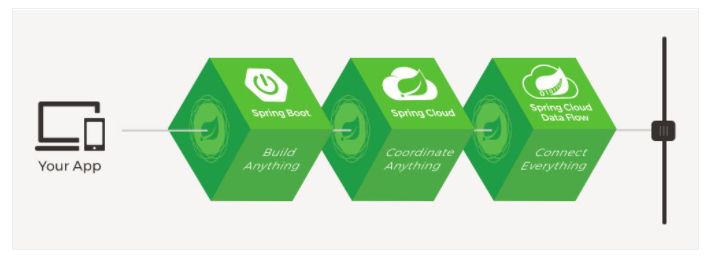
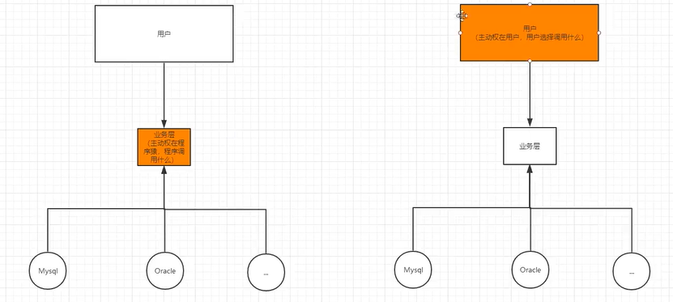
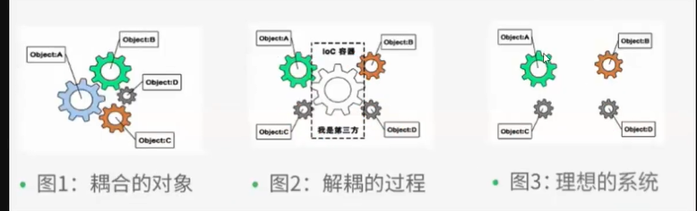

# 1、Spring

## 1.1、简介

- 2002，首次推出Spring框架的雏形：interface21框架
- Spring框架以interface21框架为基础，经过重新设计，不断丰富其内涵，于2004年3月24日发布了1.0版本
- Rod Johnson是Spring Framework的创始人
- 下载地址：https://github.com/spring-projects/spring-framework


```xml
spring-webmvc这个包可以一下子把spring需要的包都到进来，很方便
<!-- https://mvnrepository.com/artifact/org.springframework/spring-webmvc -->
<dependency>
    <groupId>org.springframework</groupId>
    <artifactId>spring-webmvc</artifactId>
    <version>5.2.6.RELEASE</version>
</dependency>

<!-- https://mvnrepository.com/artifact/org.springframework/spring-webmvc -->
<dependency>
    <groupId>org.springframework</groupId>
    <artifactId>spring-jdbc</artifactId>
    <version>5.2.6.RELEASE</version>
</dependency>

```

## 1.2 优点

- Spring是个开源的免费的框架（容器）！
- Spring是个轻量级、非入侵式的框架
- 控制反转，面向切面
- 支持事务的处理，对框架整合的支持

## 1.3 组成


## 1.4 拓展



- Spring Boot
  - 一个快速开发的脚手架
  - 基于SpringBoot可以快速开发单个微服务
  - 约定大于配置
- Spring Cloud
  - Sping Cloud是基于SpringBoot实现的

学习SpringBoot的前提是需要完全掌握Spring以及SpringMVC

弊端：发展了太久后，违背了原来的理念！配置太多了，人称“配置地狱”

# 2、IOC理论推导



原来的代码架构：在传统的多层应用程序中，通常是Web层调用业务层，业务层调用数据访问层。业务层负责处理各种业务逻辑，而数据访问层只负责对数据进行增删改查。

1. UserDAO接口
2. UserDaoImpl实现类
3. UserService业务接口
4. UserServiceImpl业务实现类

在之前的业务中，用户的需求可能会影响原来的代码，我们需要根据用户的需求去修改源代码

我们使用一个Set接口实现使得程序只能被动接收用户需求，可以使得程序的主动性从程序员手上交到用户手上。这就是控制反转

```java
    //private UserDAO userDAO = new UserMySQLImpl;	
	private UserDAO userDAO;
    //利用set进行动态实现值的注入
    public void setUserDAO(UserDAO userDAO) {
        this.userDAO = userDAO;
    }
```

这种思想使得程序员不用管理对象的创建，只要业务的实现。


总结：控制反转IOC（Inversion of Control）是一种设计实现，依赖注入DI（Denpendency Injection）是IOC的一种实现方式。没有使用IOC的程序，对象的创建与对象间的依赖关系完全硬编码在程序中，对象的创建由程序自己控制。控制反转后将对象的创建转移给第三方。所谓控制反转，就是获得依赖的方式反转了。


**控制反转是一种通过描述（XML或注释）并通过第三方去生产或获取特定对象的方式。在Spring中实现控制反转的是IoC容器，其实现方法时依赖注入DI**



# 3、IOC对象创建的过程

总结：在加载xml配置文件后，容器内管理的对象就被创建好放在容器里了，然后调用getBean()方法获取已创建的对象

# 4、Spring配置

## 4.1、别名

```xml
<bean id="user" class="cn.com.infcn.test.User"></bean>
<alias name="user" alias="myUser" />
```

## 4.2、Bean配置

```xml
id:bean的唯一标识符，也就是相当于我们学的对象名
class：bean对象所对应的全限定名：包名+类型名
name：也就是别名，而且name可以同时取多个别名

<bean id="course1" class="com.atguigu.spring5.collectiontype.Course" name="alias">    
    <property name="cname" value="Spring5 框架"></property>
</bean> 
```

## 4.3、import

多个 Spring 配置文件通过 import 方式整合的话，一般用于团队开发

1、配置文件会先合并，后解析，也就是说，无论是命名空间还是配置的内容，都会合并处理。

2、因为多个 Spring 配置文件最终会合并到一起（形成一个 ApplicationContext），因此这些配置中的 bean 都是可以互相引用的。


## 4.4、bena的作用域

| Scope                                                        | Description                                                  |
| :----------------------------------------------------------- | :----------------------------------------------------------- |
| [singleton](https://docs.spring.io/spring-framework/docs/current/reference/html/core.html#beans-factory-scopes-singleton) | (Default) Scopes a single bean definition to a single object instance for each Spring IoC container. |
| [prototype](https://docs.spring.io/spring-framework/docs/current/reference/html/core.html#beans-factory-scopes-prototype) | Scopes a single bean definition to any number of object instances. |
| [request](https://docs.spring.io/spring-framework/docs/current/reference/html/core.html#beans-factory-scopes-request) | Scopes a single bean definition to the lifecycle of a single HTTP request. That is, each HTTP request has its own instance of a bean created off the back of a single bean definition. Only valid in the context of a web-aware Spring `ApplicationContext`. |
| [session](https://docs.spring.io/spring-framework/docs/current/reference/html/core.html#beans-factory-scopes-session) | Scopes a single bean definition to the lifecycle of an HTTP `Session`. Only valid in the context of a web-aware Spring `ApplicationContext`. |
| [application](https://docs.spring.io/spring-framework/docs/current/reference/html/core.html#beans-factory-scopes-application) | Scopes a single bean definition to the lifecycle of a `ServletContext`. Only valid in the context of a web-aware Spring `ApplicationContext`. |
| [websocket](https://docs.spring.io/spring-framework/docs/current/reference/html/web.html#websocket-stomp-websocket-scope) | Scopes a single bean definition to the lifecycle of a `WebSocket`. Only valid in the context of a web-aware Spring `ApplicationContext`. |

**单例模式singleton**

默认设置为单例模式


**原型模式prototype**

```
<bean id="accountService" class="com.something.DefaultAccountService" scope="prototype"/>
```


# 5、依赖注入DI

依赖：Bean对象的创建依赖于容器

注入：Bean对象中的所有属性由容器注入

1. 通过构造器注入
2. 通过set方式注入
3. 其他方式注入：p命名空间和c命名空间

使用p命名空间简化set方式的依赖注入配置

```xml
<beans xmlns="http://www.springframework.org/schema/beans"
    xmlns:xsi="http://www.w3.org/2001/XMLSchema-instance"
    xmlns:p="http://www.springframework.org/schema/p"
    xsi:schemaLocation="http://www.springframework.org/schema/beans
        https://www.springframework.org/schema/beans/spring-beans.xsd">

    <bean name="john-classic" class="com.example.Person">
        <property name="name" value="John Doe"/>
        <property name="spouse" ref="jane"/>
    </bean>

    <bean name="john-modern"
        class="com.example.Person"
        p:name="John Doe"
        p:spouse-ref="jane"/>

    <bean name="jane" class="com.example.Person">
        <property name="name" value="Jane Doe"/>
    </bean>
</beans>
```

使用c命名空间简化构造器方式的依赖注入配置

```xml
<beans xmlns="http://www.springframework.org/schema/beans"
    xmlns:xsi="http://www.w3.org/2001/XMLSchema-instance"
    xmlns:c="http://www.springframework.org/schema/c"
    xsi:schemaLocation="http://www.springframework.org/schema/beans
        https://www.springframework.org/schema/beans/spring-beans.xsd">

    <bean id="beanTwo" class="x.y.ThingTwo"/>
    <bean id="beanThree" class="x.y.ThingThree"/>

    <!-- traditional declaration with optional argument names -->
    <bean id="beanOne" class="x.y.ThingOne">
        <constructor-arg name="thingTwo" ref="beanTwo"/>
        <constructor-arg name="thingThree" ref="beanThree"/>
        <constructor-arg name="email" value="something@somewhere.com"/>
    </bean>

    <!-- c-namespace declaration with argument names -->
    <bean id="beanOne" class="x.y.ThingOne" c:thingTwo-ref="beanTwo"
        c:thingThree-ref="beanThree" c:email="something@somewhere.com"/>

</beans>
```

| Scope                                                        | Description                                                  |
| :----------------------------------------------------------- | :----------------------------------------------------------- |
| [singleton](https://docs.spring.io/spring-framework/docs/current/reference/html/core.html#beans-factory-scopes-singleton) | (Default) Scopes a single bean definition to a single object instance for each Spring IoC container. |
| [prototype](https://docs.spring.io/spring-framework/docs/current/reference/html/core.html#beans-factory-scopes-prototype) | Scopes a single bean definition to any number of object instances. |
| [request](https://docs.spring.io/spring-framework/docs/current/reference/html/core.html#beans-factory-scopes-request) | Scopes a single bean definition to the lifecycle of a single HTTP request. That is, each HTTP request has its own instance of a bean created off the back of a single bean definition. Only valid in the context of a web-aware Spring `ApplicationContext`. |
| [session](https://docs.spring.io/spring-framework/docs/current/reference/html/core.html#beans-factory-scopes-session) | Scopes a single bean definition to the lifecycle of an HTTP `Session`. Only valid in the context of a web-aware Spring `ApplicationContext`. |
| [application](https://docs.spring.io/spring-framework/docs/current/reference/html/core.html#beans-factory-scopes-application) | Scopes a single bean definition to the lifecycle of a `ServletContext`. Only valid in the context of a web-aware Spring `ApplicationContext`. |
| [websocket](https://docs.spring.io/spring-framework/docs/current/reference/html/web.html#websocket-stomp-websocket-scope) | Scopes a single bean definition to the lifecycle of a `WebSocket`. Only valid in the context of a web-aware Spring `ApplicationContext`. |

# 6、Bean的自动装配

- 自动装配是Spring满足bean依赖的一种方式
- Spring会在上下文中自动寻找，并自动给bena装配属性

在Spring中有三种装配方式

- 在xml中显示配置：基于xml的装配是能装配就装配上，如果不能装配上就赋值null
- 在java中显示配置：如果装配不上会报错，可以设置Autowired注解的require属性
- 隐式的自动装配

jdk1.5开始支持注解，Spring2.5开始支持注解

什么是注解 

1. 注解是代码特殊标记，格式：@注解名称(属性名称=属性值, 属性名称=属性值..) 
2. 使用注解，注解作用在类上面，方法上面，属性上面 
3. 使用注解目的：简化 xml 配置 

Spring 从两个角度来实现自动化装配：

- 组件扫描（component scanning）：Spring 会自动发现应用上下文中所创建的 bean。
- 自动装配（autowiring）：Spring 自动满足 bean 之间的依赖。

## 6.1、Bean管理中创建对象提供的注解

- @Component 
- @Service （用在业务逻辑层）
- @Controller （用在Web层）
- @Repository （用在DAO层）

但是四个注解的作用是一样的，可以混用。四个注解功能是一样的，都可以用来创建 bean实例 

1. 如果要使用注解进行Bean管理，首先要引入AOP依赖

   ```
   spring-aop-XXX.RELEASE.jar
   ```

2. 开启组件扫描，告诉Spring容器在哪个包的类上进行扫描。需要引入context名称空间，然后开启组件扫毛

   ```xml
   <?xml version="1.0" encoding="UTF-8"?>
   <beans xmlns="http://www.springframework.org/schema/beans"
       xmlns:xsi="http://www.w3.org/2001/XMLSchema-instance"
       xmlns:context="http://www.springframework.org/schema/context"
       xsi:schemaLocation="http://www.springframework.org/schema/beans
           https://www.springframework.org/schema/beans/spring-beans.xsd
           http://www.springframework.org/schema/context
           https://www.springframework.org/schema/context/spring-context.xsd">
       
   	<!-- 开启组件扫描    
    1 如果扫描多个包，多个包使用逗号隔开  
    2 扫描包上层目录 -->
      	<context:component-scan base-package="com.kuang"></context:component-scan>
   
   
   </beans>
   
   ```

3. 创建类，在类上面添加创建对象的注解

   ```java
   // 在注解里面 value 属性值可以省略不写， 
   // 默认值是类名称，首字母小写 
   //Cat -- cat
   
   @Component(value = "cat") //同等于<bean id="cat" class = "...">
   public class Cat {
   
       public void shut(){
           System.out.println("miao~");
       }
   
       @Override
       public String toString() {
           return "Cat{}";
       }
   }
   ```

   这样就通过注解实现了的类的创建。

**开启组件扫描的细节**

下面这种方式会扫描com.kuang里的所有包

```xml
<context:component-scan base-package="com.atguigu"></context:component-scan> 
```

use-defaultfilters="false"将默认的过滤器关闭

```xml
use-defaultfilters="false"将默认的过滤器关闭
<context:component-scan base-package="com.atguigu" use-defaultfilters="false">     
//加入自己的过滤器，只扫描Controller这个注解
<context:include-filter type="annotation" expression="org.springframework.stereotype.Controller"/>                         
</context:component-scan> 
```

```xml
<context:component-scan base-package="com.atguigu">   
//不扫描Controller这个注解
<context:exclude-filter type="annotation"                             	expression="org.springframework.stereotype.Controller"/> 
</context:component-scan>
```


## 6.2、注解方式注入属性

**@Autowired：根据属性类型进行自动装配** 

1. 首先用注解创建所有对象
2. 在需要装配的属性上加上@autowire注解，注解是使用反射实现的，可以不需要set方法了

**@Qualifier：根据名称进行注入**

这个@Qualifier 注解的使用，和上面@Autowired 一起使用。可以通过名称区分一个类型的多个实现类

```java
@Autowired  
// 根据类型进行注入 
@Qualifier(value = "userDaoImpl1") 
// 根据名称进行注入 
private UserDao userDao;
```

 **@Resource：可以根据类型注入，可以根据名称注入** 

Resource不是spring包内的，不被spirng建议

```java
//@Resource  // 根据类型进行注入
@Resource(name = "userDaoImpl1")  
// 根据名称进行注入
private UserDao userDao;
```

**@Value：注入普通类型属性** 

Autowired，Qualifier，Resource都是用于注入对象属性。而注入普通属性注入用Value属性。


## 6.3、完全注解开发

完全注解开发一般用SpirngBoot实现

1. 创建配置类，替代 xml 配置文件 

   ```java
   @Configuration  
   // 作为配置类，替代 xml 配置文件
   @ComponentScan(basePackages = {"com.atguigu"}) 
   public class SpringConfig { }
   
   ```

2. ```java
   public class Test {
       public static void main(String[] args) {
   
           AnnotationConfigApplicationContext context = new AnnotationConfigApplicationContext(SpringConfig.class);
   
           People people = context.getBean("people", People.class);
           people.catShut();
   
       }
   }
   ```

# 7、AOP

利用 AOP 可以对业务逻辑的各个部分进行隔离，从而使得 业务逻辑各部分之间的耦合度降低，提高程序的可重用性，同时提高了开发的效率。 


## 7.1、代理模式

代理模式能够实现在不修改原有代码的情况下，为项目增添新的功能

### 静态代理

假设现在项目经理有一个需求：在项目现有所有类的方法前后打印日志。

1. 为现有的每一个类都编写一个**对应的**代理类，并且让它实现和目标类相同的接口（假设都有）


2. 在创建代理对象时，通过构造器塞入一个目标对象，然后在代理对象的方法内部调用目标对象同名方法，并在调用前后打印日志。也就是说，**代理对象 = 增强代码 + 目标对象（原对象）**。有了代理对象后，就不用原对象了

   

静态代理的缺陷：

程序员要手动为每一个目标类编写对应的代理类。如果当前系统已经有成百上千个类，工作量太大了。所以，现在我们的努力方向是：如何少写或者不写代理类，却能完成代理功能？


### 动态代理

动态代理的代理类是动态生成的，不需要我们提前写好

Java的对象创建过程


所谓的Class对象，是Class类的实例，而Class类是描述所有类的，比如Person类，Student类


可以看出，要创建一个实例，最关键的就是**得到对应的Class对象**

所以动态代理的思路是：**能否不写代理类，而直接得到代理Class对象，然后根据它创建代理实例（反射）。**那么如果获取代理类的信息呢？接口拥有代理对象和目标对象共同的类信息。所以，我们可以从接口那得到理应由代理类提供的信息。但是还有一个问题是接口无法创建实例。

### JDK的动态代理

JDK提供了java.lang.reflect.InvocationHandler接口和 java.lang.reflect.Proxy类，这两个类相互配合，入口是Proxy，所以我们先聊它。

#### java.lang.reflect.Proxy类

Proxy有个静态方法：getProxyClass(ClassLoader, interfaces)，只要你给它传入类加载器和一组接口，它就给你返回代理Class对象


所以，按我理解，Proxy.getProxyClass()这个方法的本质就是：**以Class造Class。**


## 7.2、Spring中AOP

```
        <!-- https://mvnrepository.com/artifact/org.aspectj/aspectjweaver -->
        <dependency>
            <groupId>org.aspectj</groupId>
            <artifactId>aspectjweaver</artifactId>
            <version>1.9.4</version>
        </dependency>
```


### 通知

通知定义了切面是什么以及何时使用。除了描述切面要完成的工作，通知还解决了何时执行这个工作的问题。它应该应用在某个方法被调用之前？之后？之前和之后都调用？还是只在方法抛出异常时调用？

- 前置通知（Before）：在目标方法被调用之前调用通知功能；
- 后置通知（After）：在目标方法完成之后调用通知，此时不会关心方法的输出是什么；
- 返回通知（After-returning）：在目标方法成功执行之后调用通 知；
- 异常通知（After-throwing）：在目标方法抛出异常后调用通知；
- 环绕通知（Around）：通知包裹了被通知的方法，在被通知的方法调用之前和调用之后执行自定义的行为。

### 连接点：

我们的应用可能也有数以千计的时机应用通知。这些时机被称为连接点。连接点是在应用执行过程中能够插入切面的一个点。这个点可以是调用方法时、抛出异常时、甚至修改一个字段时。切面代码可以利用这些点插入到应用的正常流程之中，并添加新的行为。

### 切点：

如果说通知定义了切面的“什么”和“何时”的话，那么切点就定义了“何处”。切点的定义会匹配通知所要织入的一个或多个连接点。我们通常使用明确的类和方法名称，或是利用正则表达式定义所匹配的类和方法名称来指定这些切点。有些 AOP 框架允许我们创建动态的切点，可以根据运行时的决策（比如方法的参数值）来决定是否应用通知。

### 切面：

 切面是通知和切点的结合。通知和切点共同定义了切面的全部内容 —— 它是什么，在何时和何处完成其功能。

### 织入

织入是把切面应用到目标对象并创建新的代理对象的过程。切面在指定的连接点被织入到目标对象中。在目标对象的生命周期里有多个点可以进行织入：

- 编译期：切面在目标类编译时被织入。这种方式需要特殊的编译器。AspectJ 的织入编译器就是以这种方式织入切面的。
- 类加载期：切面在目标类加载到 JVM 时被织入。这种方式需要特殊的类加载器（ClassLoader），它可以在目标类被引入应用之前增强该目标类的字节码。AspectJ 5 的加载时织入（load-time weaving，LTW）就支持以这种方式织入切面。
- 运行期：切面在应用运行的某个时刻被织入。一般情况下，在织入切面时，AOP 容器会为目标对象动态地创建一个代理对象。Spring AOP 就是以这种方式织入切面的。

## 切点编写

### AspectJ语法

| AspectJ 指示器 | 描 述                                                        |
| -------------- | ------------------------------------------------------------ |
| arg()          | 限制连接点匹配参数为指定类型的执行方法                       |
| @args()        | 限制连接点匹配参数由指定注解标注的执行方法                   |
| execution()    | 用于匹配是连接点的执行方法                                   |
| this()         | 限制连接点匹配AOP代理的bean引用为指定类型的类                |
| target         | 限制连接点匹配目标对象为指定类型的类                         |
| @target()      | 限制连接点匹配特定的执行对象，这些对象对应的类要具有指定类 型的注解 |
| within()       | 限制连接点匹配指定的类型                                     |
| @within()      | 限制连接点匹配指定注解所标注的类型（当使用Spring AOP时，方 法定义在由指定的注解所标注的类里） |
| @annotation    | 限定匹配带有指定注解的连接点                                 |

### 定义切点

```java
package concert;
public interface Performance {
  public void perform();
}
```

Performance 可以代表任何类型的现场表演，如舞台剧、电影或音乐会。假设我们想编写 Performance 的 perform() 方法触发的通知。图 4.4 展现了一个切点表达式，这个表达式能够设置当 perform() 方法执行时触发通知的调用。

.jpg?alt=media&token=0fcf3849-7e53-475b-8f2a-5fc7fe39a8a0)

我们使用 execution() 指示器选择 Performance 的 perform() 方法。方法表达式以 "*" 号开始，表明了我们不关心方法返回值的类型。然后，我们指定了全限定类名和方法名。对于方法参数列表，我们使用两个点号（..）表明切点要选择任意的 perform() 方法，无论该方法的入参是什么。

| 注解            | 通知                                     |
| --------------- | ---------------------------------------- |
| @After          | 通知方法会在目标方法返回或抛出异常后调用 |
| @AfterReturning | 通知方法会在目标方法返回后调用           |
| @AfterThrowing  | 通知方法会在目标方法抛出异常后调用       |
| @Around         | 通知方法会将目标方法封装起来             |
| @Before         | 通知方法会在目标方法调用之前执行         |
