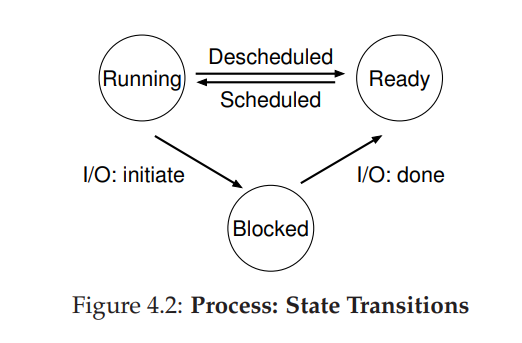

# 操作系统导论


[TOC]


# Introduction 

操作系统的任务

- 虚拟化
  - 虚拟化内存
  - 虚拟化CPU
- 处理多个进程同时工作的并发问题
- 数据持久化

System call and Procedure call： System call会在控制权转移到操作系统的同时提高硬件的特权级别

在发起系统调用时（通常通过一个称为陷阱trap的特殊硬件命令），硬件控制转移到指定的陷阱程序（trap handler），并同时将特权级别提升到内核摩尔是。在内核模式下，操作系统可以完全访问系统的硬件。当操作系统完成请求的服务时，通过特殊的陷阱（return-from-trap）返回。指令讲控制权交换给用户，回到用户模式，

# 进程（Process）

Process 进程：操作系统提供的关于一个正在运行的程序的抽象就是进程

进程的由其机器状态（Machine State）：

- 一个进程使用到的内存
- 一个进程使用到的寄存器，
- 进程使用到的I/O

## 将硬盘里的程序转化为进程


1. 操作系统首先将代码和静态数据（一些初始化变量）加载到内存中，加载到进程的地址空间（进程可以访问内存空间）中
2. 完成加载后，为程序分配运行时栈（run-time stack），分配堆空间
3. 完成I/O的初始化工作
4. 进入main()函数，将CPU控制权交给新创建的进程，程序开始执行

## Process States



- Running：进程在处理器中被执行
- Ready：进程准备被执行，但因为某些原因此时OS选择不在此时运行
- Blocked：进程执行了某种操作，直到其他事件发生时才会准备运行

ready -> running：意味着进程被调度（shceduled）

running -> ready：意味着进程被取消调度（descheduled）

OS的调度决定是由操作系统调度程序完成(OS shceduler)

## 进程API

fork()：被用来创建新的进程。在父进程中被创建的子进程拥有独立的资源（内存，程序指针等等等）。子进程会从fork()函数返回开始执行.子进程得到与父进程用户级虚拟地址空间相同（但是独立）的一份拷贝，包括文本，数据、堆以及用户栈

```
int rc = fork() 
在父进程中 rc 为子进程的PID
在子进程中 rc 为 0
```

wait()：在父进程中调用wait()，当父进程代码运行到wait()时会等待，直到子进程exited后才会返回，然后父进程继续运行

exec()：这个系统调用会从当前进程中读入代码信息和静态代码块。并用这些信息重新覆盖当前进程的代码。并且堆，栈和其他内存空间也会被重新初始化。然后os开始执行新的代码。如果exec()成功调用，则不会再返回到调用它的程序。所以exec()并没有创建新的进程，而是复用原进程


将fork()和exec()相分离的做法使得shell能够在fork()之后和exec()之前进行一些代码处理，完成一些功能或者准备工作。

下面展示模拟shell实现程序输出重定向。在fork()创建子进程后，关闭了标准输出，然后打开了newfile.txt文件，接着再执行exec()这样使得代码的输出被重定向到newfile.txt文件。

```c
1 #include <stdio.h>
2 #include <stdlib.h>
3 #include <unistd.h>
4 #include <string.h>
5 #include <fcntl.h>
6 #include <sys/wait.h>
7
8 int main(int argc, char *argv[]) {
9 int rc = fork();
10 if (rc < 0) {
11 // fork failed
12 fprintf(stderr, "fork failed\n");
13 exit(1);
14 } else if (rc == 0) {
15 // child: redirect standard output to a file
16 close(STDOUT_FILENO);
17 open("./p4.output", O_CREAT|O_WRONLY|O_TRUNC, S_IRWXU);
18
19 // now exec "wc"...
20 char *myargs[3];
21 myargs[0] = strdup("wc"); // program: wc (word count)
22 myargs[1] = strdup("p4.c"); // arg: file to count
23 myargs[2] = NULL; // mark end of array
24 execvp(myargs[0], myargs); // runs word count
25 } else {
26 // parent goes down this path (main)
27 int rc_wait = wait(NULL);
28 }
29 return 0;
30 }


```

进程的控制可以通过信号量（signal）进行

## 机制：受限直接执行

### 受限操作

硬件通过提供不同的执行模式来协助操作系统。以及trap和return-from-trap来进行模式转换。并且还有一些指令来让操作系统告诉硬件trap table在内存中的位置

user mode：用户模式下运行的代码权限受到限制

kernel mode：内核模式下代码拥有高权限，可以做任何事

**usertrap**：位于内核中的一段C代码，判断引起trap的事件类型，并决定如何处理该trap，如跳转到系统调用函数、设备驱动程序等。我们一般也称其为**trap handler**。

机器启动时，机器在内核模式下执行，操作系统第一件做的事就是设置trap table。这样机器就会记住系统调用处理程序的地址。直到下一次重启机器


每个system call 都有一个system-call number。在调用system call后，trap handler会检查system-call noumber是否合法。然后再执行相应相对应的代码。

### 进程切换

**interrup和trap**

 interrup即外中断，指来自处理机和内存外部的中断，包括 I/O 设备发出的 I/O中断、外部信号中断、各种定时器引起的时钟中断以及调试程序中设置的断点等引起的调试中断等。

trap即内中断，主要指在处理机和内存内部产生的中断。它包括程序运算引起的各种错误。软中断是通信进程之间用来模拟硬中断的一种信号通信方式。


**中断和陷阱的主要区别：**

1 、陷阱通常由处理机正在执行的现行指令引起，而中断则是由与现行指令无关的中断源引起的。

2 、陷阱处理程序提供的服务为当前进程所用，而中断处理程序提供的服务则不是为了当前进程的。

问题：在要进行进程切换时，在CPU上运行的是进程而不是OS


协作方式：等待系统调用，在协作调度系统中，OS通过等待系统调用或者非法操作（产生trap）重新获得CPU的控制权

非协作方式：timer interrupt。在启动时，OS告诉硬件timmer interrrupt出现时需要执行的程序（pre-configured intterrupt handler）。然后OS启动timer

### 上下文切换


在切换上下文的过程中，有两种类型的寄存器被保存/恢复。第一种，在发生时钟中断时，当前进程的用户寄存器由硬件隐式保存到该进程的内核栈。第二种是当OS决定从当前进程切换到新的进程时。内核寄存器被OS明确保存到当前进程的进程结构内存中。

# 调度：入门

### Scheduling Metric 1：T(turnaround)


```
T(turnaround) = T(completion) - T(arrival)
T(completion)：job的完成时间
T(arrival): job的到达时间
beacuse all jobs arrive at the same time, so T(arrival) = 0
```

- FIFO：简易好实现，但当进程执行所需时间长度不同时。若先执行长任务再执行短任务会加大平均周转时间T(turnaround moyen)，也就是所谓的护航效应（convoy effect）
- Shortest Job First(STF)：解除假设2，每个任务不再在同一时间到达。SJF效率高于FIFO.

下面是BC先到达，然后A再到达


但是如果A先到达，然后BC再到达。根据假设3，A必须完全运行结束后才能运行BC。则依旧会导致效率低下


- Shortest Time-to-Completion First(STCF)：现在为了优化STF，我们接触假设3，也就是已经运行的job可以暂停。OS现在具有了抢占运行job并决定运行其他job的能力。在任何时候，当有一个新的job到达时，STCF shceduler会在所有job中选择一个时间最短的继续运行。


### Sheduling Metric  2: T(response)

反应时间这个指标是用于体现操作系统的反应速度和交互性。

```
T(response) = T(firstrun) - T(arrival)
We define response time as the time from when the job arrives in a system to the first time it is scheduled.

```

### Round Robin（轮转）

RR对每个job都运行一个特定的time slice。关于time slice时间长度的设定不能太长也不能够太短。如果time slice 太长会降低平均T(response)，而如果time slice太短，那么context switch的时间占比会太高。context witch的时间损耗不仅仅只会涉及到CPU，还会涉及与该job相关的高速缓存等其他片上硬件的状态。


但是RR虽然在T(response)这个指标上有非常好的表现，对于T(touraround)的表现上非常糟糕


总结：在小规模时间内将CPU进行均匀的分配到活动进程之间，会导致类似于tournaroud time的指标表现不佳。这是一组固有的矛盾。

第一类调度程序（SJF， STCF）：优化了周转时间，但是对反应时间表现不佳

第二类调度程序（RR）：优化了反应时间，但是对于周转时间表现不佳

### Incorporating I/O

现在我们解除假设4，也就是说I/O也参与进来。当当前job调用I/O时，cpu需要内的当前job等待直到I/O操作结束后才能够继续运行。


解决办法：以STCF调度策略为基础，将因为A需要调用I/O，将A的每个时间分片看做是单独的任务。在一个A时间分片结束后，因为A需要等待I/O，此时只剩B，这运行B。

# 调度：多级反馈队列


MLFQ：Multi-Level Feedback Queue，当一个任务分多个阶段完成时，便是可以预测的，可以使用此算法。

MLFQ算法首先建立多个不同级别的队列，级别越高运行的优先权越高。然后遵循下面两条运行云泽

- Rule1：If Proprity(A) > Priority(B), A runs(B doesn't)
- Rule 2: If Priority(A) = Priority(B), A & B run in RR

至于如何分配任务的优先级，总体上来说是系统根据任务过去的运行情况进行判断。如果一个任务不断的放弃CPU去等待键盘的输入输出，那么说明这个任务需要高交互性，那么就分配给高优先级。而如果一个任务需要CPU密集运行一个长的时间，那么就分配低的优先级。

## 尝试 1：如何设置优先级

首先我们假设机器上运行的job分为两类

- 一种运行时间不长，但经常放弃CPu等待其他交互行为的任务 -->交互任务
- 一种需要长时间CPU计算，但不在乎交互性的任务 -->计算任务


第一次尝试给出的三个规则

- Rule 3：当一个任务进入系统，它将被放在优先级最高的队列中
- Rule 4a：如果任务用尽了一整个time slice，那么它的优先级会被降低一级
- Rule 4b：如果一个任务在一个time slice运行结束之前放弃CPU，那么它保持当前优先级

**Example 1：只运行计算任务**


**Example 2：一个长时间计算任务，一个短时间计算任务**


整体来说，MFLQ首先假设新进的任务是短时，然后观察其之后的运行状态。如果真的是短时间的任务，那就很快会被运行完，符合STF算法对Turnround的优化原则。如果是计算任务，那么随着它一次次用尽时间片，则很快会被降级。

**Example 3：一个计算任务，一个交互任务**


问题：

- Starvation：如果有非常多的交互型任务，会导致低优先级队列上的计算型任务没有运行的机会，被饿死
- 被戏耍：可以设计在一个time slice内99%计算，1%时间调用I/O的程序从而独占CPU
- 一个job会在运行的时候在计算型任务和交互型任务这两种状态中切换

## 尝试 2 ：提升优先级

为了避免Starvation，我们可以做的是周期性的初始化系统中所有任务的优先级

- Rule 5：在周期S后，将所有任务都转移到最高优先级的栈

Rule解决了一次性同时两个问题

1. 保证进程不会饿死，一个低等级的任务也能够以一种轮转的方式得到CPU的服务
2. 保证了交互式任务能够维持在高优先级的栈，一直得到执行


## 尝试3：更好的计时方式


现在我们还需要解决有人恶意调戏系统的问题（gaming of the shceduler）。回忆一下gaming能够被恶意实现的原因

- Rule 4a：如果任务用尽了一整个time slice，那么它的优先级会被降低一级
- Rule 4b：如果一个任务在一个time slice运行结束之前放弃CPU，那么它保持当前优先级

解决办法：我们现在重写Rule 4

- Rule 4：一旦一个任务被执行，它就会被降一级


# 调度 ： 比例份额

彩票数（ticket）：代表进程占有某个资源的份额，一个进程拥有的彩票数占总彩票数的百分比，就是它占有资源的份额

假设进程A拥有0~74共75张彩票，而进程B拥有75~99共25张彩票


可以看出，彩票调度利用了随机性，使得调度从概率上满足期望的比例，但不能够保证

## 彩票调度

Ticket currency：每个User手握一部分真实彩票，同时他们可以以自己的方式给自己的进程发行自己的彩票。发行的彩票最后会通过转换真实彩票。


彩票转让：一个进程可以暂时的把自己手上的彩票分给其他进程

彩票膨胀：进程可以膨胀自己的彩票数，从而获得更多的CPU资源。且无序和其他进程进行沟通

彩票调度的实现十分简单：一个随机数生成器，一记录系统中所有进程的数据结构（列表），以及彩票的总数


```c
1 // counter: used to track if we've found the winner yet
2 int counter = 0;
3
4 // winner: use some call to a random number generator to
5 // get a value, between 0 and the total # of tickets
6 int winner = getrandom(0, totaltickets);
7
8 // current: use this to walk through the list of jobs
9 node_t *current = head;
10
11 // loop until the sum of ticket values is > the winner
12 while (current) {
13 counter = counter + current->tickets;
14 if (counter > winner)
15 break; // found the winner
16 current = current->next;
17 }
18 // 'current' is the winner: schedule it... 

```

注意，任意更改Job在链表中的顺序并不会影响算法的正确性，因为每个Job被抽中的期望是不变的

为了提高效率，可以将链表按彩票数从大到小排序


## 步长调度（Stride Scheduling）

这是一个具有确定性的公平分配算法

步长Stride：一个User发行总彩票数除以每个进程的有的彩票数。

行程Pass：记录每个进程运行后Pass = Pass + Stride

```c
curr = remove_min(queue); // pick client with min pass
schedule(curr); // run for quantum
curr->pass += curr->stride; // update pass using stride
insert(queue, curr); // return curr to queue
```

假设总彩票数为10000


缺点：需要记录全局状态，有当调度器运行一段时间后，如果新加入一个任务。调度器需要考虑如何分配Pass，如果设置为0就会独占CPU了。而之前的彩票调度不会出现这个问题，它只需要用新进程的票数去更新全局的总票数即可

# 抽象：地址空间

最初，OS只提供常用的库，剩下的内存全分给当前程序。


之后随着发展，使得多个进程的内容可以同时储存在内存中，那么就涉及到了保护的问题。


## 地址空间

我们将对物理内存的抽象称为地址空间。这运行的程序的角度所看到的景象。下面讨论的都是地址空间的景象

我们将一个进程的所需要的内存空间简化为三部分

- Code
- Stack：用于追踪函数的调用和分配本地变量
- Heap：用于动态变量的储存

接下来是一个地址空间的例子


假设 代码是静态不会改变的，被存储在0~1k的地方。接着因为Heap和Stack都有可能增长，则一个放上面，一个放下面，使他们可能向中间增长。

- 当一个用户使用malloc()不断请求地址空间时，Heap就不断增长
- 但用户不断递归时，Stack不断增长

内存虚拟化：在实际物理地址上为多个运行的进程构建一个是有的，可能很大的地址空间的抽象 

总结虚拟化内存的目标

- Transparency透明度：OS虚拟化内存的实现方式对于正在运行的程序不可见
- Efficiency：在时间和空间上的实现需要有效率，这需要硬件的帮助
- Protection：保证进程各干各的，互不干扰

在用户层面上能够看到的地址，全部都是虚拟地址（C语言打印的指针内容）

# 机制：地址转换

基于硬件的地址转换：每个内存引用都会被硬件通过地址转换重定向到真正的物理地址

假设：

- 所有的用户虚拟地址都会在物理内存中被连续储存
- 每个job的地址空间不是太大且都有固定大小


## 动态（基于硬件）重定位

每个 CPU 需要两个硬件寄存器：基址（base）寄存器和界限（bound）寄存 器，有时称为限制（limit）寄存器。他们都是在CPU上的，被称为MMU(Memory management unit)

```
physical address = virtual address + base
```

limit寄存器的作用是保护，确保内存的访问不超过limit

**动态重定位的硬件支持**


**动态重定位的OS支持**


在Limited Direct Excution下Dynamic Relocation 的整个执行过程


从表中可以看出， 我们仍然遵循受限直接访问（limited direct execution）的基本方法，大多数情况下，操作系统 正确设置硬件后，就任凭进程直接运行在 CPU 上，只有进程行为不端时才介入。

# 分段（Segmentation）

利用分段解决将完整地址空间全部放在内存，而Heap和Stack中有非常多空间浪费的问题。

分段：一个段只是 地址空间里的一个连续定长的区域，在典型的地址空间里有 3 个逻辑不同的段：代码、栈 和堆。分段的机制使得操作系统能够将不同的段放到不同的物理内存区域，从而避免了虚 拟地址空间中的未使用部分占用物理内存。


分段索引的实现


```c
1 // get top 2 bits of 14-bit VA
  2 Segment = (VirtualAddress & SEG_MASK) >> SEG_SHIFT
  3 // now get offset
  4 Offset = VirtualAddress & OFFSET_MASK
  5 if (Offset >= Bounds[Segment])
      RaiseException(PROTECTION_FAULT)
    else
      8 PhysAddr = Base[Segment] + Offset 
      9 Register = AccessMemory(PhysAddr)
SEG_MASK = 0X3000, SEG_SHIFT = 12, OFFSET_MASK = 0xFFF 
```

同时，因为Stack和Heap的增长方向不同，所以我们还需要一个bit用来标记当前segment的增长方向


在这个例子中，假设要访问虚拟地址 15KB，它应该映射到物理地址 27KB。该虚拟地 址的二进制形式是：11 1100 0000 0000（十六进制 0x3C00）。硬件利用前两位（11）来指定 段，但然后我们要处理偏移量 3KB。为了得到正确的反向偏移，我们必须从 3KB 中减去最 大的段地址：在这个例子中，段可以是 4KB，因此正确的偏移量是 3KB 减去 4KB，即−1KB。 只要用这个反向偏移量（−1KB）加上基址（28KB），就得到了正确的物理地址 27KB。用 户可以进行界限检查，确保反向偏移量的绝对值小于段的大小。


最后Segmentation带来的需要解决的问题

1. 分段颗粒度选择，较大的颗粒度能够使得OS更好的知道内存的使用情况

2. Free space的处理：过度分段会导致内存中散落着很多未被使用的内存碎块，造成空间的浪费。如果在内存不够用时再进行内存碎块的整理，需要进行大量拷贝工作，很花费时间。

   一种更简单的做法是利用空闲列表管理算法，试图保留大的内存块用于分配。相关的 算法可能有成百上千种，包括传统的最优匹配（best-fit，从空闲链表中找最接近需要分配空 间的空闲块返回）、最坏匹配（worst-fit）、首次匹配（first-fit）以及像伙伴算法（buddy algorithm） [K68]这样更复杂的算法。

分段还是不足以支持更一般化的稀疏地址空间。例如，如果 有一个很大但是稀疏的堆，都在一个逻辑段中，整个堆仍然必须完整地加载到内存中。换 言之，如果使用地址空间的方式不能很好地匹配底层分段的设计目标，分段就不能很好地 工作。因此我们需要找到新的解决方案。

# 空闲空间管理

这章讨论用户层面的两个内存管理函数malloc()和free()

该库管理的空间由于历史原因被称为堆，在堆上管理空闲空间的数据结构通常称为空 闲列表（free list）。该结构包含了管理内存区域中所有空闲块的引用

假设：

- 我们现在讨论的是external fragmentation
- 一块内存一但被分配出去，便不能够再分配给其他进程。不存在竞争情况
- 分配的内存在其生命周期内不会改变大小

## splitting and coalescing（分割与合并）


- 任何大于 10 字节的分配请求都会失败（返回 NULL），因为 没有足够的连续可用空间。而恰好 10 字节的需求可以由两个空闲块中的任何一个满足


- 假设我们只申请一个字节的内存。这种情况下，分配程序会执行所谓的分割（splitting） 动作：它找到一块可以满足请求的空闲空间，将其分割，第一块返回给用户，第二块留在空 闲列表中。


- 在归 还一块空闲内存时，仔细查看要归还的内存块的地址以及邻它的空闲空间块。如果新归还 的空间与一个原有空闲块相邻（或两个，就像这个例子），就将它们合并为一个较大的空闲 块

## 跟踪已分配区域的大小

free(void *ptr)函数并不需要传入分配空间的大小，而仅仅是一个分配空间的指针。大多数分配程序都会在头块（header）中保存一点额外的信息，它在 内存中，通常就在返回的内存块之前。


```c
typedef struct header_t {
 int size;
 int magic;
} header_t;

void free(void *ptr) {
 header_t *hptr = (void *)ptr - sizeof(header_t);
} 
```

到目前为止，我们这个简单的空闲列表还只是一个概念上的存在，它就是一个列表， 描述了堆中的空闲内存块。但如何在空闲内存自己内部建立这样一个列表呢？我们需要在空闲空间本身中建立空闲空间列表。 

首先，空闲list使用LinkedList实现，节点定义如下

```c
typedef struct __node_t {
  int size;
  struct __node_t *next;
} node_t;

```

我们用以下代码获取4096byte内存

```c
// mmap() returns a pointer to a chunk of free space
node_t *head = mmap(NULL, 4096, PROT_READ|PROT_WRITE,
                    MAP_ANON|MAP_PRIVATE, -1, 0);
head->size = 4096 - sizeof(node_t);
head->next = NULL;

```

在进行内存分配后，如下图所示


然后将全部内存free后，如下图所示


虽然整个内存空间是空闲的，但却被分成了小段，因此形成了碎片化的内存空间。解决方 案很简单：遍历列表，合并（merge）相邻块。完成之后，堆又成了一个整体。

## 扩大堆Heap

大多数传统的分配程序会从很小的堆开始，当空间耗尽时，再向操作系统申请更大的空间。通常，这意味着它们进行了某种系统调用（例如，大多数 UNIX 系统中的 sbrk），让堆增 长。操作系统在执行 sbrk 系统调用时，会找到空闲的物理内存页，将它们映射到请求进程的 地址空间中去，并返回新的堆的末尾地址。这时，就有了更大的堆，请求就可以成功满足。

- Best Fit：搜索空闲列表，然后找到一块和要求的内存一样大，或者更大的内存块，然后返回其中最小的（best-fit chunk）
- Worst Fit：与Best fit相反，它搜索所有可能的内存块，然后返回最大的
- First Fit：first fist只只是简单的找到第一个足够满足请求大小的内存块，然后返回。有点在于效率高，不需要遍历整个free list，缺点在于有时会让空闲列表开头的部分有很 多小块
- Next Fit：不同于First fit从free list的头部开始搜索，下次匹配（next fit）算法多维护一个指针， 指向上一次查找结束的位置。其想法是将对空闲空间的查找操作扩散到整个列表中去，避 免对列表开头频繁的分割。这种策略的性能与首次匹配很接它，同样避免了遍历查找。

# 分页：引入

之前讨论的内存分段的方式会导致内存碎片化的问题，会将空间切割成一个个variable-sized的块

现在我们使用分页的方法，将内存切割成fixed-sized的块


**优点**

1. 适应性：一个成熟的分页系统，能够有效率的支持地址空间的抽象，不需要考虑进程是如何使用地址空间的。比如不需要对堆栈的增长方向进行假设
2. 空闲空间管理方便：如上图所示，如果操作系统希望将 64 字节 的小地址空间放到 8 页的物理地址空间中，它只要找到 4 个空闲页。

为了追踪地址空间的虚拟页面在物理内存中的位置，OS通常保存有一个页表（page table），在页表中保存着每个进程的数据结构。

现在进行虚拟地址向物理地址的转换。假设地址空间大小是64bytes，那么我们需要6bit作为虚拟地址（2^6 = 64），每一页的大小为16bytes，一共有四页

```assembly
将虚拟地址存入 exa计寄存器
movl <virtual address>, %eax
```

虚拟地址如下图所示进行划分。VPN（virtual page number）


虚拟地址“21”在虚拟页“01”（或 1）的第 5 个（“0101”）字节处。通过虚拟 页号，我们现在可以检索页表，找到虚拟页 1 所在的物理页面。在上面的页表中，物理帧 号（PFN）（有时也称为物理页号，physical page number 或 PPN）是 7（二进制 111）。因此， 我们可以通过用 PFN 替换 VPN 来转换此虚拟地址， 然后将载入发送给物理内存


请注意，偏移量保持不变（即未翻译），因为偏 移量只是告诉我们页面中的哪个字节是我们想要的。 我们的最终物理地址是 1110101（十进制 117），正是 我们希望加载指令（见图 18.2）获取数据的地方

以上从VPN到PFN的转化，有一个一个前提，说明我们是知道这64bytes地址空间被分为4页在物理地址空间的实际位置的，它应该是被存在page table中。

## 页表中存储的是什么

```
现代操作系统的内存管理子系统中最重要的数据结构之一就是页表（page table）。通常，页表存储
虚拟—物理地址转换（virtual-to-physical address translation），从而让系统知道地址空间的每个页实际驻
留在物理内存中的哪个位置。由于每个地址空间都需要这种转换，因此一般来说，系统中每个进程都有
一个页表。页表的确切结构要么由硬件（旧系统）确定，要么由 OS（现代系统）更灵活地管理。
```

页表可以非常的大。假设，我们的地址空间是32-bit，每一页的内容是4KB（2^12）。那么我们的地址会被分割成20-bit的VPN和12bit的off（10bit是1

KB）

20-bit的VPN表明，对于每一个进程，OS需要管理2^20个页。假设对于每个page table entry（PTE）需要4 bytes空间去存储物理地址转换所需要的信息。那么最后这个页表的大小就是4MB。而因为对于每个进程都需要维护一个页表，如果有100个进程，就需要占据400MB的空间用于地址转换，这是不太可能的。因为页表非常的大，所以，我们没有在 MMU 中利用任何特 殊的片上硬件，来存储当前正在运行的进程的页表，而是 将每个进程的页表存储在内存中。现在让我们假设页表存 在于操作系统管理的物理内存中，稍后我们会看到，很多 操作系统内存本身都可以虚拟化，因此页表可以存储在操 作系统的虚拟内存中（甚至可以交换到磁盘上）。

## 页表的组成

页表：一种能够将虚拟地址（VPN）映射到物理地址（PFN， physical frame numbers）的数据结构

最简单的页表结构是linear page table：就是一个数组。操作系统通过虚拟页号（VPN）检索 该数组，并在该索引处查找页表项（PTE），以便找到期望的物理帧号（PFN）。


```
Figure 18.5 shows an example page table entry from the x86 architecture [I09]. It contains a present bit (P); a read/write bit (R/W) which
determines if writes are allowed to this page; a user/supervisor bit (U/S)
which determines if user-mode processes can access the page; a few bits
(PWT, PCD, PAT, and G) that determine how hardware caching works for
these pages; an accessed bit (A) and a dirty bit (D); and finally, the page
frame number (PFN) itself.
```


- valid bit：用于指示是特定地址转换是否有效，当一个程序开始运行时，它的代码和堆在其 地址空间的一端，栈在另一端。所有未使用的中间空间都将被标记为无效（invalid），如果 进程尝试访问这种内存，就会陷入操作系统，可能会导致该进程终止。因此，有效位对于 支持稀疏地址空间至关重要。通过简单地将地址空间中所有未使用的页面标记为无效，我 们不再需要为这些页面分配物理帧，从而节省大量内存。
- protection bits：用于指示当前页面是否可以读取、写入或执行。同样，以这 些位不允许的方式访问页，会陷入操作系统。
- dirty bit：用于指示页面被带入内存后是否被修改过
- prsent bit：用来只是当前页是在内存中还是在硬盘里
- reference bit：有时用于追踪页是否被访问，也 用于确定哪些页很受欢迎，因此应该保留在内存中

## 简单的分页运行很慢

我们来考虑一个这章讨论的一个地址转换的例子。地址空间大小是64bytes，那么我们需要6bit作为虚拟地址（2^6 = 64），每一页的大小为16bytes，一共有四页

```
movl 21, %eax
```

首先，我们假设硬件会为我们完成地址转换。为了取虚拟地址（21）处的数据内容，系统首先将虚拟地址（21）转化成对应的物理地址（117）。所以在到物理地址117出取内容之前系统首先需要从进程页表中提取正确的页表项，然后才能完成地址转换，从物理内存中载入数据。而为了能够读取页表项，硬件需要找到当前进程的页表。

现在让我们假设一个页表基址寄存器（page-table base register）包含页表的起始位置的物理地址。为了找到想要的 PTE 的位置，硬件将执行以下功能：

```c
VPN = (VirtualAddress & VPN_MASK) >> SHIFT // VPN = 010101->010000->01 对应于第一个虚拟页
PTEAddr = PageTableBaseRegister + (VPN * sizeof(PTE))  //结合虚拟页号和PageTableBaseRegister 就能够找到页表项PTE的地址
```

- VPN_MASK = 0X30(110000)
- SHIFT = 4

```
offset = VirtualAddress & OFFSET_MASK
PhysAddr = (PFN << SHIFT) | offset
```

一旦知道了这个物理地址，硬件就可以从内存中获取 PTE，提取 PFN，并将它与来自 虚拟地址的偏移量连接起来，形成所需的物理地址。具体来说，你可以想象 PFN 被 SHIFT 左移，然后与偏移量进行逻辑或运算，以形成最终地址。然后硬件从真正的物理地址中找到对应的数据，存入exa寄存器

```c
1 // Extract the VPN from the virtual address
2 VPN = (VirtualAddress & VPN_MASK) >> SHIFT
3
4 // Form the address of the page-table entry (PTE)
5 PTEAddr = PTBR + (VPN * sizeof(PTE))
6
7 // Fetch the PTE
8 PTE = AccessMemory(PTEAddr)
9
10 // Check if process can access the page
11 if (PTE.Valid == False)
12 	RaiseException(SEGMENTATION_FAULT)
13 else if (CanAccess(PTE.ProtectBits) == False)
14 	RaiseException(PROTECTION_FAULT)
15 else
16 // Access is OK: form physical address and fetch it
17 	offset = VirtualAddress & OFFSET_MASK
18 	PhysAddr = (PTE.PFN << PFN_SHIFT) | offset
19  Register = AccessMemory(PhysAddr)
```

上面简单的page算法存在两个问题

- 没有经过精心设计的软硬件，导致系统运行缓慢
- 这样的page设置占用了非常多的内存

## 内存追踪例子

我们现在通过一个简单的内存访问示例，来演示使用分页时产生的所有内存访问。代码如下

```c
int array[1000];
...
for (i = 0; i < 1000; i++)
 array[i] = 0;
```

它对应的汇编代码如下

```assembly
0x1024 movl $0x0,(%edi,%eax,4)
0x1028 incl %eax
0x102c cmpl $0x03e8,%eax
0x1030 jne 0x1024 
```

- 第一条指令将零值（显示为$0x0）移动到 数组位置的虚拟内存地址，这个地址是通过取%edi 的内容并将其加上%eax 乘以 4 来计算的。 因此，%edi 保存数组的基址，而%eax 保存数组索引（i）。我们乘以 4，因为数组是一个整 型数组，每个元素的大小为 4 个字节。 

- 第二条指令增加保存在%eax 中的数组索引，第三条指令将该寄存器的内容与十六进制 值 0x03e8 或十进制数 1000 进行比较。如果比较结果显示两个值不相等（这就是 jne 指令测 试），第四条指令跳回到循环的顶部。

然后我们进行一些假设

- 虚拟地址的空间大小为64KB，每一页的大小为1KB

- 页表是线性的（由数组构成），它在物理地址1KB的位置

- 因为每页的大小是1KB，虚拟地址假设1024，在第二页VPN1

- 假设第二页VPN1->PFN4.

- array长度为4000bytes（1000*4），存在虚拟地址4000~44000，也就是VPN39~VPN42.假设他们到物理地址的映射关系如下

  ：(VPN 39 → PFN 7), (VPN 40 → PFN 8), (VPN 41 → PFN 9), (VPN 42 → PFN 10) 

现在我们可以开始内存追踪了：当程序开始运行的时候，每次指令获取会产生两个内存引用。

1. 一个指向页表，用于寻找指令所在的Physical Frame的位置
2. 一个指向指令本身，将其取到CPU中进行执行。

另外还有一个显式的内存引用以 mov 指令的形式呈现。


图 18.7 展示了前 5 次循环迭代的整个过程。最下面的图显示了 y 轴上的指令内存引用 （黑色虚拟地址和右边的实际物理地址）。中间的图以深灰色展示了数组访问（同样，虚拟 在左侧，物理在右侧）；最后，最上面的图展示了浅灰色的页表内存访问（只有物理的，因 为本例中的页表位于物理内存中）。整个追踪的 x 轴显示循环的前 5 个迭代中内存访问。每 个循环有 10 次内存访问，其中包括 4 次取指令，一次显式更新内存，以及 5 次页表访问，为这 4 次获取和一次显式更新进行地址转换。


总结：Page的好处

- 不会像Segmentation那样导致external fragmentation
- 它非常灵活，支持稀疏虚拟地址空间

# 分页：快速转换


上一章说的分页算法存在内存开销大，时间开销大的问题

- 页表信息存在内存中，。理论上需要非常大块内存用于存储页表信息
- 而每次指令都需要进行转换，导致时间开销非常的大

通常优化都需要OS进行参与，而且通常都需要硬件的帮助。我们将使用到TLB（Translation-lookaside buffer），它是MMU（Memory-management unit）的一部分，本质上是一个常用虚拟-物理地址转换的硬件cache。更好的名字是address-translation cache。

对每次内存访问，硬件先 检查 TLB，看看其中是否有期望的转换映射，如果有，就完成转换（很快），不用访问页表 （其中有全部的转换映射）。TLB 带来了巨大的性能提升，实际上，因此它使得虚拟内存成 为可能

## TLB基础算法

```c
1 VPN = (VirtualAddress & VPN_MASK) >> SHIFT
2 (Success, TlbEntry) = TLB_Lookup(VPN)
3 if (Success == True) // TLB Hit
    4 if (CanAccess(TlbEntry.ProtectBits) == True)
    5 Offset = VirtualAddress & OFFSET_MASK
    6 PhysAddr = (TlbEntry.PFN << SHIFT) | Offset
    7 Register = AccessMemory(PhysAddr)
    8 else
    9 RaiseException(PROTECTION_FAULT)
10 else // TLB Miss
    11 PTEAddr = PTBR + (VPN * sizeof(PTE))
    12 PTE = AccessMemory(PTEAddr)
    13 if (PTE.Valid == False)
        14 RaiseException(SEGMENTATION_FAULT)
    15 else if (CanAccess(PTE.ProtectBits) == False)
        16 RaiseException(PROTECTION_FAULT)
    17 else
      18 TLB_Insert(VPN, PTE.PFN, PTE.ProtectBits)
      19 RetryInstruction()

```

硬件算法的大体流程如下：首先从虚拟地址中提取页号（VPN）（见图 19.1 第 1 行）， 然后检查 TLB 是否有该 VPN 的转换映射（第 2 行）。如果有，我们有了 TLB 命中（TLB hit）， 这意味着 TLB 有该页的转换映射。成功！接下来我们就可以从相关的 TLB 项中取出页帧号 （PFN），与原来虚拟地址中的偏移量组合形成期望的物理地址（PA），并访问内存（第 5～7 行），假定保护检查没有失败（第 4 行）。

如果 CPU 没有在 TLB 中找到转换映射（TLB 未命中），我们有一些工作要做。在本例 中，硬件访问页表来寻找转换映射（第 11～12 行），并用该转换映射更新 TLB（第 18 行）， 假设该虚拟地址有效，而且我们有相关的访问权限（第 13、15 行）。上述系列操作开销较 大，主要是因为访问页表需要额外的内存引用（第 12 行）。最后，当 TLB 更新成功后，系 统会重新尝试该指令，这时 TLB 中有了这个转换映射，内存引用得到很快处理。

##  例子： 使用TLB访问数组


前提假设：

- 一个数组存有10个4字节整型数，他们的虚拟地址从100开始
- 虚拟地址空间有8-bit的的VPN，也就是说256个地址
- 一页16byte， 每个byte占有一个地址，所以一共有16个虚拟页，也就是说VPN有4位，那么offset占有剩下的4位

```c
int sum = 0;
for (i = 0; i < 10; i++) {
 sum += a[i];
}
```

简单起见，我们假装循环产生的内存访问只是针对数组（忽略变量 i 和 sum，以及指令 本身）。当访问第一个数组元素（a[0]）时，CPU 会看到载入虚存地址 100。硬件从中提取 VPN（VPN=06），然后用它来检查 TLB，寻找有效的转换映射。假设这里是程序第一次访 问该数组，结果是 TLB 未命中。

 接下来访问 a[1]，这里有好消息：TLB 命中！因为数组的第二个元素在第一个元素之 后，它们在同一页。因为我们之前访问数组的第一个元素时，已经访问了这一页，所以 TLB 中缓存了该页的转换映射。因此成功命中。访问 a[2]同样成功（再次命中），因为它和 a[0]、 a[1]位于同一页。

我们来总结一下这 10 次数组访问操作中 TLB 的行为表现：未命中、命中、命中、未命 中、命中、命中、命中、未命中、命中、命中。命中的次数除以总的访问次数，得到 TLB 命中率（hit rate）为 70%。尽管这不是很高（实际上，我们希望命中率接近 100%），但也不 是零，是零我们就要奇怪了。即使这是程序首次访问该数组，但得益于空间局部性（spatial locality），TLB 还是提高了性能。数组的元素被紧密存放在几页中（即它们在空间中紧密相 邻），因此只有对页中第一个元素的访问才会导致 TLB 未命中

- 如果程序访问的内存都是紧挨在一起的，那么TLB效率会很高，（spatial locality）。同时提高page的大小能够提高hit rate 
- 如果在整个循环结束后，程序又来访问这个数组，则效率会非常高（temporal locality）

所以如果一个程序满足上面两种性质，那么TLb效率会非常高

## 谁处理 TLB Miss？

通常有两种处理方式

- 硬件进行处理：硬件全权处理TLB Miss。硬件必须知道页表在内存中的确切位置（通过页表基址寄存器， page-table base register，在TLB 基础算法代码的第 11 行使用），以及页表的确切格式。发生未命中时， 硬件会“遍历”页表，找到正确的页表项，取出想要的转换映射，用它更新 TLB，并重试 该指令

```c
1 VPN = (VirtualAddress & VPN_MASK) >> SHIFT
  2 (Success, TlbEntry) = TLB_Lookup(VPN)
  3 if (Success == True) // TLB Hit
    4 if (CanAccess(TlbEntry.ProtectBits) == True)
      5 Offset = VirtualAddress & OFFSET_MASK
      6 PhysAddr = (TlbEntry.PFN << SHIFT) | Offset
      7 Register = AccessMemory(PhysAddr)
    8 else
        9 RaiseException(PROTECTION_FAULT)
 10 else // TLB Miss
   11 RaiseException(TLB_MISS)

          Figure 19.3: TLB Control Flow Algorithm (OS Handled)
```


- OS进行处理：更现代的体系结构]，都是精简 指令集计算机，Reduced-Instruction Set Computer，RISC），有所谓的软件管理 TLB（softwaremanaged TLB）。发生 TLB 未命中时，硬件系统会抛出一个异常（见第 11 行），这会 暂停当前的指令流，将特权级提升至内核模式，跳转至陷阱处理程序（trap handler）。接下 来你可能已经猜到了，这个陷阱处理程序是操作系统的一段代码，用于处理 TLB 未命中。 这段代码在运行时，会查找页表中的转换映射，然后用特别的“特权”指令更新 TLB，并 从陷阱返回。此时，硬件会重试该指令（导致 TLB 命中）

  

关于OS处理的一些details

- 从陷阱返回指令和之前不同：在之前的讨论的服务于系统调用的从陷阱返回。

  - 服务于系统调用的从陷阱返回：从陷阱返回应该继续执行陷入操作系统之 后那条指令，就像从函数调用返回后，会继续执行此次调用之后的语句
  - 服务于TLB Miss的从陷阱返回：在从 TLB 未命中的陷阱返回后，硬件必须从导致陷阱的指令继续执行。这次重试因此导致 该指令再次执行，但这次会命中 TLB

  因此，根据陷阱或异常的原因，系统在陷入内核时 必须保存不同的程序计数器，以便将来能够正确地继续执行。

- 在运行 TLB 未命中处理代码时：操作系统需要格外小心避免引起 TLB 未命中的 无限递归。例如，可以把 TLB 未命中陷阱处理程序直接放到物理内存中 [它 们没有映射过（unmapped），不用经过地址转换]。或者在 TLB 中保留一些项，记录永久有 效的地址转换，并将其中一些永久地址转换槽块留给处理代码本身，这些被监听的（wired） 地址转换总是会命中 TLB

## TLB 细节

典型的 TLB 有 32 项、64 项或 128 项，并且是 全相联的（fully associative）。基本上，这就意味着一条地址映射可能存在 TLB 中的任意位 置，硬件会并行地查找 TLB，找到期望的转换映射


```
TLB 的有效位!=页表的有效位
常见的错误是混淆 TLB 的有效位和页表的有效位。在页表中，如果一个页表项（PTE）被标记为无
效，就意味着该页并没有被进程申请使用，正常运行的程序不应该访问该地址。当程序试图访问这样的
页时，就会陷入操作系统，操作系统会杀掉该进程。

TLB 的有效位不同，只是指出 TLB 项是不是有效的地址映射。例如，系统启动时，所有的 TLB 项
通常被初始化为无效状态，因为还没有地址转换映射被缓存在这里。一旦启用虚拟内存，当程序开始运
行，访问自己的虚拟地址，TLB 就会慢慢地被填满，因此有效的项很快会充满 TLB。

TLB 有效位在系统上下文切换时起到了很重要的作用，后面我们会进一步讨论。通过将所有 TLB
项设置为无效，系统可以确保将要运行的进程不会错误地使用前一个进程的虚拟到物理地址转换映射。
```


- TLB 通常有一个有效（valid）位，用来标识该项是不是 有效地转换映射。
- 通常还有一些保护（protection）位，用来标识该页是否有访问权限。例 如，代码页被标识为可读和可执行，而堆的页被标识为可读和可写。
- 还有其他一些位，包 括地址空间标识符（address-space identifier）、脏位（dirty bit）等。

## 问题：上下文切换

因为TLB内储存的虚拟-物理地址转换只对当前运行的进程有效，而对于其他进程则没有意义。所以在发生进程切换时，硬件或操作系统（或二者）必须注意确保即将运行的进程不要误读了之前进程的地址映射。即要防止出现下图的情况


1. 第一种解决方案：在上下文切换时，简单地清空（flush）TLB， 这样在新进程运行前 TLB 就变成了空的。但是，有一定开销：每次进程运行，当它访问数据和代码页时，都会触发 TLB 未命 中。如果操作系统频繁地切换进程，这种开销会很高。
2. 第二种解决方案：为了减少这种开销，一些系统增加了硬件支持，实现跨上下文切换的 TLB 共享。比如 有的系统在 TLB 中添加了一个地址空间标识符（Address Space Identifier，ASID）。可以把 ASID 看作是进程标识符（Process Identifier，PID），但通常比 PID 位数少（PID 一般 32 位， ASID 一般是 8 位）。


# 分页：较小的表

使用TLB解决了页表索引的问题。另一个问题是页表太大，因此消耗的内存太多。

最简单办法是增大每个页的容量，从而减少页的数量。但是增加每一页的容量带来的问题是，internal fragmentation。每一页内部出现浪费的可能性增加。这种方法不被采纳

## 混合方法：分页分段

Whenever you have two reasonable butt diffrent apporaches to someting in life, you should always examine the combination of the two to see if you can obtain the best of both worlds.

下面进行假设我们有16KB的地址空间，每页1KB。虚拟地址和物理地址的映射关系如下图所示。同时我们也能够看在页表中，非常多的页表项是没有被使用的。如果是一个更大的线性页表，那么很可能会有非常多的页表项没有被使用，造成浪费。


我们的杂合方法不是为进程的整个地址空间提供单个页表，而是为每个逻辑分段 提供一个。在这个例子中，我们可能有 3 个页表，地址空间的代码、堆和栈部分各有一个。

 现在，回忆在分段中，有一个基址（base）寄存器，告诉我们每个段在物理内存中的位 置，还有一个界限（bound）或限制（limit）寄存器，告诉我们该段的大小。在杂合方案中， 我们仍然在 MMU 中拥有这些结构。在这里，我们使用

- 基址不是指向段本身，而是保存该 段的页表的物理地址。
- 界限寄存器用于指示页表的结尾（即它有多少有效页）。

假设32bit的虚拟地址空间，一页大小为4KB（2^12）整个地址空间被分为4段。我们只使用 3 个段：一个用于代码，另一个用于堆，还有 一个用于栈。

要确定地址引用哪个段，我们会用地址空间的前两位。假设 00 是未使用的段，01 是代 码段，10 是堆段，11 是栈段。因此，虚拟地址如下所示：


在硬件中，我们假设对于每一个段（code,heap,stack）都有一个base/bounds paris。当一个进程运行时，

- 每个段 的基址寄存器都包含该段的线性页表的物理地址。因此，系统中的每个进程现在都有 3 个与 其关联的页表。在上下文切换时，必须更改这些寄存器，以反映新运行进程的页表的位置。

 TLB 未命中时（假设硬件管理的 TLB，即硬件负责处理 TLB 未命中），硬件使用分 段位（SN）来确定要用哪个基址和界限对。然后硬件将其中的物理地址与 VPN 结合起来， 形成页表项（PTE）的地址：

```c
SN = (VirtualAddress & SEG_MASK) >> SN_SHIFT
VPN = (VirtualAddress & VPN_MASK) >> VPN_SHIFT
AddressOfPTE = Base[SN] + (VPN * sizeof(PTE))

```

它与我们之前在线性页表中看到的几乎完全相同。当然， 唯一的区别是使用 3 个段基址寄存器中的一个，而不是单个页表基址寄存器。与线性页表相比，杂合方法实现了显著的内存节省。栈 和堆之间未分配的页不再占用页表中的空间（仅将其标记为无效）。

但是仍然存在问题：

- 一旦引入分段，就需要假设段的增长方向，需要更多信息。不像纯分页那么灵活

- 尽管大部分内存是以页面大小单位管理的，但页表现在可以是任意 大小（是 PTE 的倍数）。因此，在内存中为它们寻找自由空间更为复杂。

  

## 多层页表

这里提出另一种不依赖分段的方法，但是同样：尝试剔除掉页表汇总没有使用的部分。我们将这种方法称为多级页表（multi-level page table），因为它将线性页表变成了类似树的东西

多级页表的基本思想很简单。首先，将页表分成页大小的单元。然后，如果整页的页 表项（PTE）无效，就完全不分配该页的页表。为了追踪页表的页是否有效（以及如果有效， 它在内存中的位置），使用了名为页目录（page directory）的新结构。页目录因此可以告诉 你页表的页在哪里，或者页表的整个页不包含有效页。


在一个简单的两级页表中，页目录为每页页表包含了一项。它由多个页目录项（Page Directory Entries，PDE）组成。PDE（至少）拥有有效位（valid bit）和页帧号（page frame number， PFN），类似于 PTE。但是，正如上面所暗示的，这个有效位的含义稍有不同：如果 PDE 项 是有效的，则意味着该项指向的页表（通过 PFN）中至少有一页是有效的，即在该 PDE 所 指向的页中，至少一个 PTE，其有效位被设置为 1。如果 PDE 项无效（即等于零），则 PDE 的其余部分没有定义。

相比较于简单的线性页表，多级页表的有点

- 多级页表分配的页表空间，与你正在使用的地址空间内存量成比例。因此它通常很紧 凑，并且支持稀疏的地址空间
- 如果仔细构建，页表的每个部分都可以整齐地放入一页中，从而更容易管理内 存。操作系统可以在需要分配或增长页表时简单地获取下一个空闲页。将它与一个简单的 （非分页）线性页表相比①，后者仅是按 VPN 索引的 PTE 数组。用这样的结构，整个线性页 表必须连续驻留在物理内存中。对于一个大的页表（比如 4MB），找到如此大量的、未使用 的连续空闲物理内存，可能是一个相当大的挑战。有了多级结构，我们增加了一个间接层 （level of indirection），使用了页目录，它指向页表的各个部分。这种间接方式，让我们能够 将页表页放在物理内存的任何地方。

## 一个多级页表的例子

假设有一个16KB（2^14）的内存，也就是有14-bit的虚拟地址空间。

如果使用线性页表，每一页64byte（2^6）。所以可以得出结论，14-bit的虚拟地址空间中，8bit分给VPN，6bit分给offset。那么我们将有2^8个页表项；

在这个例子中，虚拟页 0 和 1 用于代码，虚拟页 4 和 5 用 于堆，虚拟页 254 和 255 用于栈。地址空间的其余页未被使用。


然后我们将上面的线性页表转换成双层页表。首先线性页表一共有256个页表项。假设每个页表项PTE有4byte，那么上面的线性页表需要的内存就有256*4=1KB。又因为每一页有64byte。如果我们将1KB分解成16个64byte的页，每一页存16个PTE

我们现在需要了解：如何获取 VPN，并用它来首先索引 到页目录中，然后再索引到页表的页中。首先我们需要先进入page directory。页目 录需要为页表的每页提供一个项。因此，它有 16 个项。结果，我们需要 4 位 VPN 来索引 目录。我们使用 VPN 的前 4 位，如下所示：


一旦从 VPN 中提取了页目录索引（简称 PDIndex），我们就可以通过简单的计算来找到 页目录项（PDE）的地址：

PDEAddr = PageDirBase +（PDIndex×sizeof（PDE））。这就得到 了页目录，现在我们来看它，在地址转换上取得进一步进展。

我们现在必须从页目录项指向的页表的页中获取 页表项（PTE）。要找到这个 PTE，我们必须使用 VPN 的剩余位索引到页表的部分。这个页表索引（Page-Table Index，PTIndex）可以用来索引页表本身，给出 PTE 的地址：

```
PTEAddr = (PDE.PFN << SHIFT) + (PTIndex * sizeof(PTE)) 
```


回想一下，我们将使用 VPN 的前 4 位来索引页目录。因此，1111 会从上面的页目录中选 择最后一个（第 15 个，如果你从第 0 个开始）。这就指向了位于地址 101 的页表的有效页。 然后，我们使用 VPN 的下 4 位（1110）来索引页表的那一页并找到所需的 PTE。1110 是页面 中的倒数第二（第 14 个）条，并告诉我们虚拟地址空间的页 254 映射到物理页 55。通过连 接 PFN = 55（或十六进制 0x37）和 offset = 000000，可以形成我们想要的物理地址，并向内 存系统发出请求：PhysAddr =（PTE.PFN << SHIFT）+ offset = 00 1101 1100 0000 = 0x0DC0。

## 大于两级的页表

当每一页的容量比较小而总内存比较大的时候，会使用更多级的页表

假设地总空间是30-bit，每页512byte容量。那么21bit虚拟地址，9bit的offset

我们构建多级页表的目标：使页表的每一部分都能放入一个页。到目前为止， 我们只考虑了页表本身。但是，如果页目录太大我们就需要将页目录进行拆分。

为了确定我们需要多少级才能够将页表的所有部分都放到一页，我们从确定一页能够放入多少个页表项开始。一页的大小是512bytes，假设页表PTE大小为4byte，那么一页就能够放128个PTEs。所以，为了索引进一个页表的表的时候，我们需要7biys（2^7 = 128）。


在上面你还可能注意到，多少位留给了（大）页目录：14。如果我们的页目录有 214个项， 那么它不是一个页，而是 128 个，因此我们让多级页表的每一个部分放入一页目标失败了。 为了解决这个问题，我们为树再加一层，将页目录本身拆成多个页，然后在其上添加 另一个页目录，指向页目录的页。


# 交换：机制

增加交换空间让操作系统为多个并发运行的进程都提供巨大地址空间 的假象。多道程序（能够“同时”运行多个程序，更好地利用机器资源）的出现，强烈要 求能够换出一些页，因为早期的机器显然不能将所有进程需要的所有页同时放在内存中。 因此，多道程序和易用性都需要操作系统支持比物理内存更大的地址空间。这是所有现代 虚拟内存系统都会做的事情，也是现在我们要进一步学习的内容。

交换空间（swap space）：在硬盘上开辟一部分空间用于物理页的移入和移出


你可以看到一个 4 页的物理内存和一个 8 页的交换空间。在 这个例子中，3 个进程（进程 0、进程 1 和进程 2）主动共享物理内存。但 3 个中的每一个， 都只有一部分有效页在内存中，剩下的在硬盘的交换空间中。第 4 个进程（进程 3）的所有 页都被交换到硬盘上，因此很清楚它目前没有运行。有一块交换空间是空闲的。

## 存在位

我们回忆一下memory reference 的过程。硬件首先从虚拟地址获得 VPN，检查 TLB 是否匹配（TLB 命中），如果命中，则获得最 终的物理地址并从内存中取回。这希望是常见情形，因为它很快（不需要额外的内存访问）。

如果在 TLB 中找不到 VPN（即 TLB 未命中），则硬件在内存中查找页表（使用页表基 址寄存器），并使用 VPN 查找该页的页表项（PTE）作为索引。如果页有效且存在于物理内 存中，则硬件从 PTE 中获得 PFN，将其插入 TLB，并重试该指令，这次产生 TLB 命中。到 现在为止还挺好。

但是，如果希望允许页交换到硬盘，必须添加更多的机制。具体来说，当硬件在 PTE 中查找时，可能发现页不在物理内存中。硬件（或操作系统，在软件管理 TLB 时）判断是否在内存中的方法，是通过页表项中的一条新信息，即存在位（present bit）。如果存在位设 置为 1，则表示该页存在于物理内存中，并且所有内容都如上所述进行。如果存在位设置为 零，则页不在内存中，而在硬盘上。访问不在物理内存中的页，这种行为通常被称为页缺失（page fault）。

在页错误时，操作系统被唤起来处理页错误。一段称为“页错误处理程序（page-fault handler）”的代码会执行，来处理页错误。

## 缺页（page fault）

在 TLB 未命中的情况下，我们有两种类型的系统：硬件管理的 TLB（硬件 在页表中找到需要的转换映射）和软件管理的 TLB（操作系统执行查找过程）。不论在哪种 系统中，如果页不存在，都由操作系统负责处理页错误。操作系统的页错误处理程序 （page-fault handler）确定要做什么。几乎所有的系统都在软件中处理页错误。即使是硬件管 理的 TLB，硬件也信任操作系统来管理这个重要的任务。

如果一个页不存在，它已被交换到硬盘，在处理页错误的时候，操作系统需要将该页 交换到内存中。那么，问题来了：操作系统如何知道所需的页在哪儿？在许多系统中，页 表是存储这些信息最自然的地方。因此，操作系统可以用 PTE 中的某些位来存储硬盘地址， 这些位通常用来存储像页的 PFN 这样的数据。当操作系统接收到页错误时，它会在 PTE 中 查找地址，并将请求发送到硬盘，将页读取到内存中。、

当硬盘 I/O 完成时，操作系统会更新页表，将此页标记为存在，更新页表项（PTE）的 PFN 字段以记录新获取页的内存位置，并重试指令。下一次重新访问 TLB 还是未命中，然 而这次因为页在内存中，因此会将页表中的地址更新到 TLB 中（也可以在处理页错误时更 新 TLB 以避免此步骤）。最后的重试操作会在 TLB 中找到转换映射，从已转换的内存物理 地址，获取所需的数据或指令。

请注意，当 I/O 在运行时，进程将处于阻塞（blocked）状态。因此，当页错误正常处 理时，操作系统可以自由地运行其他可执行的进程。因为 I/O 操作是昂贵的，一个进程进行 I/O（页错误）时会执行另一个进程，这种交叠（overlap）是多道程序系统充分利用硬件的 一种方式。

## 缺页控制流程


- 第一种情况，该页存在（present）且有效（valid）（第 18～21 行）。在这种情况下，TLB 未 命中处理程序可以简单地从 PTE 中获取 PFN，然后重试指令（这次 TLB 会命中），并因此 继续前面描述的流程。
- 第二种情况（第 22～23 行），页错误处理程序需要运行。虽然这是 进程可以访问的合法页（毕竟是有效的），但它并不在物理内存中
- 。第三种情况，访问的是 一个无效页，可能由于程序中的错误（第 13～14 行）。在这种情况下，PTE 中的其他位都 不重要了。硬件捕获这个非法访问，操作系统陷阱处理程序运行，可能会杀死非法进程。


从图 21.3 的软件控制流中，可以看到为了处理页错误，操作系统大致做了什么。首先， 操作系统必须为将要换入的页找到一个物理帧，如果没有这样的物理帧，我们将不得不等 待交换算法运行，并从内存中踢出一些页，释放帧供这里使用。在获得物理帧后，处理程 序发出 I/O 请求从交换空间读取页。最后，当这个慢操作完成时，操作系统更新页表并重试 指令。重试将导致 TLB 未命中，然后再一次重试时，TLB 命中，此时硬件将能够访问所需 的值

## 什么时候进行页面置换

通常操作系统不会等到内存全部消耗完了才进行页面置换。

为了保证有少量的空闲内存，大多数操作系统会设置高水位线（High Watermark，HW） 和低水位线（Low Watermark，LW），来帮助决定何时从内存中清除页。原理是这样：当操 作系统发现有少于 LW 个页可用时，后台负责释放内存的线程会开始运行，直到有 HW 个 可用的物理页。这个后台线程有时称为交换守护进程（swap daemon）或页守护进程（page daemon）①，它然后会很开心地进入休眠状态，因为它毕竟为操作系统释放了一些内存。

为了配合后台的分页线程，图 21.3 中的控制流需要稍作修改。交换算法需要先简单检 查是否有空闲页，而不是直接执行替换。如果没有空闲页，会通知后台分页线程按需要释 放页。当线程释放一定数目的页时，它会重新唤醒原来的线程，然后就可以把需要的页交 换进内存，继续它的工作。

## Summary

我们介绍了访问超出物理内存大小时的一些概念。要做到这一 点，在页表结构中需要添加额外信息，比如增加一个存在位（present bit，或者其他类似机 制），告诉我们页是不是在内存中。如果不存在，则操作系统页错误处理程序（page-fault handler）会运行以处理页错误（page fault），从而将需要的页从硬盘读取到内存，可能还需 要先换出内存中的一些页，为即将换入的页腾出空间。

 回想一下，很重要的是（并且令人惊讶的是），这些行为对进程都是透明的。对进程而 言，它只是访问自己私有的、连续的虚拟内存。在后台，物理页被放置在物理内存中的任 意（非连续）位置，有时它们甚至不在内存中，需要从硬盘取回。虽然我们希望在一般情 况下内存访问速度很快，但在某些情况下，它需要多个硬盘操作的时间。像执行单条指令 这样简单的事情，在最坏的情况下，可能需要很多毫秒才能完成。

# 交换：策略

先详细描述一下我们要解决的问题。由于内存只包含系统中所 有页的子集，因此可以将其视为系统中虚拟内存页的缓存（cache）。因此，在为这个缓存选 择替换策略时，我们的目标是让缓存未命中（cache miss）最少，即使得从磁盘获取页的次 数最少。或者，可以将目标看成让缓存命中（cache hit）最多，即在内存中找到待访问页的 次数最多。

知道了缓存命中和未命中的次数，就可以计算程序的平均内存访问时间（Average Memory Access Time，AMAT，计算机架构师衡量硬件缓存的指标 [HP06]）。

```
AMAT = TM + (PMiss · TD)
Tm：TM表示访问内存的成本，
TD：表示访问磁盘的成本，
PHit：表示在缓存中找到数据的概率（命中）
PMiss：表示在缓存中找不到数据的概率（未命中）。PHit和 PMiss从 0.0 变化到 1.0，
并且 PMiss + PHit = 1.0。

```

在现代系统中，磁盘访问的成本非常高，即 使很小概率的未命中也会拉低正在运行的程序的总体 AMAT。显然，我们必须尽可能地避 免缓存未命中，避免程序以磁盘的速度运行。要做到这一点，有一种方法就是仔细开发一 个聪明的策略

## 最优替换策略

事实证明，这样一个最优（optimal）策略是 Belady 多年前开发的[B66]（原 来这个策略叫作 MIN）。最优替换策略能达到总体未命中数量最少。Belady 展示了一个简单 的方法（但遗憾的是，很难实现！），即替换内存中在最远将来才会被访问到的页，可以达 到缓存未命中率最低。

## FIFO 和 随机 策略

采用了非常简单的替换策略。例如， 一些系统使用 FIFO（先入先出）替换策略。页在进入系统时，简单地放入一个队列。当发 生替换时，队列尾部的页（“先入”页）被踢出。FIFO 有一个很大的优势：实现相当简单。

另一个类似的替换策略是随机，在内存满的时候它随机选择一个页进行替换。随机具 有类似于 FIFO 的属性。实现我来很简单，但是它在挑选替换哪个页时不够智能。

## LRU算法

页替换策略可以使用的一个历史信息是频率（frequency）。如果一个页被访问了很多次， 也许它不应该被替换，因为它显然更有价值。页更常用的属性是访问的近期性（recency）， 越近被访问过的页，也许再次访问的可能性也就越大。

这一系列的策略是基于人们所说的局部性原则（principle of locality）[D70]，基本上只 是对程序及其行为的观察。这个原理简单地说就是程序倾向于频繁地访问某些代码（例如 循环）和数据结构（例如循环访问的数组）。因此，我们应该尝试用历史数据来确定哪些页 面更重要，并在需要踢出页时将这些页保存在内存中。


我们也应该注意到，与这些算法完全相反的算法也是存在：最经常使用策略（MostFrequently-Used，MFU）和最近使用策略（Most-Recently-Used，MRU）。在大多数情况下 （不是全部！），这些策略效果都不好，因为它们忽视了大多数程序都具有的局部性特点。

## 对LRU算法的近似

从计算开销的角度来看，近似 LRU 更为可行，实际上这也 是许多现代系统的做法。这个想法需要硬件增加一个使用位（use bit，有时称为引用位， reference bit），这种做法在第一个支持分页的系统 Atlas one-level store[KE + 62]中实现。系 统的每个页有一个使用位，然后这些使用位存储在某个地方（例如，它们可能在每个进程 的页表中，或者只在某个数组中）。每当页被引用（即读或写）时，硬件将使用位设置为 1。 但是，硬件不会清除该位（即将其设置为 0），这由操作系统负责。

操作系统如何利用使用位来实现近似 LRU？可以有很多方法，有一个简单的方法称作 时钟算法（clock algorithm）[C69]。想象一下，系统中的所有页都放在一个循环列表中。时 钟指针（clock hand）开始时指向某个特定的页（哪个页不重要）。当必须进行页替换时，操 作系统检查当前指向的页 P 的使用位是 1 还是 0。如果是 1，则意味着页面 P 最近被使用， 因此不适合被替换。然后，P 的使用位设置为 0，时钟指针递增到下一页（P + 1）。该算法 一直持续到找到一个使用位为 0 的页，使用位为 0 意味着这个页最近没有被使用过（在最 坏的情况下，所有的页都已经被使用了，那么就将所有页的使用位都设置为 0）。

实际上，任何周期性 地清除使用位，然后通过区分使用位是 1 和 0 来判定该替换哪个页的方法都是可以的。 Corbato 的时钟算法只是一个早期成熟的算法，并且具有不重复扫描内存来寻找未使用页的 特点，也就是它在最差情况下，只会遍历一次所有内存。


展示了时钟算法的一个变种的行为。该变种在需要进行页替换时随机扫描各页， 如果遇到一个页的引用位为 1，就清除该位（即将它设置为 0）。直到找到一个使用位为 0 的页，将这个页进行替换。如你所见，虽然时钟算法不如完美的 LRU 做得好，但它比不考 虑历史访问的方法要好。

# 并发：介绍

换一个角度来看，每个线 程类似于独立的进程，只有一点区别：它们共享地址空间，从而能够访问相同的数据。

单个线程的状态与进程状态非常类似。线程有一个程序计数器（PC），记录程序 从哪里获取指令。每个线程有自己的一组用于计算的寄存器。所以，如果有两个线程运行 在一个处理器上，从运行一个线程（T1）切换到另一个线程（T2）时，必定发生上下文切 换（context switch）。线程之间的上下文切换类似于进程间的上下文切换。对于进程，我们 将状态保存到进程控制块（Process Control Block，PCB）。现在，我们需要一个或多个线程 控制块（Thread Control Block，TCB），保存每个线程的状态。


但是，与进程相比，线程之 间的上下文切换有一点主要区别：

- 地址空间保持不变（即不需要切换当前使用的页表）。
- 线程和进程之间的另一个主要区别在于栈：每个线程都有一个栈，所有位于栈上的变量、 参数、返回值和其他放在栈上的东西，将被放置在有时称为线程本地（thread-local）存储的 地方，即相关线程的栈


如你所见，线程创建有点像进行函数调用。然而，并不是首先执行函数然后返回给调 用者，而是为被调用的例程创建一个新的执行线程，它可以独立于调用者运行，可能在从 创建者返回之前运行，但也许会晚得多

## 数据共享问题：不可控的调度

我们了解一下编译器为更新计数器生成的代码序列。 在这个例子中，我们只是想给 counter 加上一个数字（1）。因此，做这件事的代码序列可能 看起来像这样（在 x86 中）：

```assembly
mov 0x8049a1c, %eax
add $0x1, %eax
mov %eax, 0x8049a1c
```

- 设想我们的两个线程之一（线程 1）进入这个代码区域，并且因此将要增加一个计数器。 它将 counter 的值（假设它这时是 50）加载到它的寄存器 eax 中。因此，线程 1 的 eax = 50。 然后它向寄存器加 1，因此 eax = 51。现在，一件不幸的事情发生了：时钟中断发生。因此， 操作系统将当前正在运行的线程（它的程序计数器、寄存器，包括 eax 等）的状态保存到线 程的 TCB。

- 现在更糟的事发生了：线程 2 被选中运行，并进入同一段代码。它也执行了第一条指 令，获取计数器的值并将其放入其 eax 中 [请记住：运行时每个线程都有自己的专用寄存器。 上下文切换代码将寄存器虚拟化（virtualized），保存并恢复它们的值]。此时 counter 的值仍 为 50，因此线程 2 的 eax = 50。假设线程 2 执行接下来的两条指令，将 eax 递增 1（因此 eax = 51），然后将 eax 的内容保存到 counter（地址 0x8049a1c）中。因此，全局变量 counter 现 在的值是 51。
- 最后，又发生一次上下文切换，线程 1 恢复运行。还记得它已经执行过 mov 和 add 指 令，现在准备执行最后一条 mov 指令。回忆一下，eax=51。因此，最后的 mov 指令执行， 将值保存到内存，counter 再次被设置为 51。

由于执行这段代码的多个线程可能导致竞争状态，因此我们将此段代码称为临界区 （critical section）。临界区是访问共享变量（或更一般地说，共享资源）的代码片段，一定不 能由多个线程同时执行

我们真正想要的代码就是所谓的互斥（mutual exclusion）。这个属性保证了如果一个线 程在临界区内执行，其他线程将被阻止进入临界区。

In our theme of exploring concurrency, we’ll be using synchronization primitives（同步原语） to turn short sequences of instructions into atomic blocks of execution, but the idea of atomicity is much bigger than that, as we will see.

```
															补充：关键并发术语

临界区、竞态条件、不确定性、互斥执行

这 4 个术语对于并发代码来说非常重要，我们认为有必要明确地指出。 请参阅 Dijkstra 的一些早期
著作[D65，D68]了解更多细节。

 临界区（critical section）是访问共享资源的一段代码，资源通常是一个变量或数据结构。
 
 竞态条件（race condition）出现在多个执行线程大致同时进入临界区时，它们都试图更新共享
的数据结构，导致了令人惊讶的（也许是不希望的）结果。

 不确定性（indeterminate）程序由一个或多个竞态条件组成，程序的输出因运行而异，具体取
决于哪些线程在何时运行。这导致结果不是确定的（deterministic），而我们通常期望计算机系统给出确
定的结果。

 为了避免这些问题，线程应该使用某种互斥（mutual exclusion）原语。这样做可以保证只有一
个线程进入临界区，从而避免出现竞态，并产生确定的程序输出。
```

# 锁

通过对并发的介绍，我们看到了并发编程的一个最基本问题：我们希望原子式执行一 系列指令，但由于单处理器上的中断（或者多个线程在多处理器上并发执行），我们做不到。 本章介绍了锁（lock），直接解决这一问题。程序员在源代码中加锁，放在临界区周围，保 证临界区能够像单条原子指令一样执行。

锁就是一个变量，因此我们需要声明一个某种类型的锁变量（lock variable，如上面的 mutex），才能使用。这个锁变量（简称锁）保存了锁在某一时刻的状态。它要么是可用的 （available，或 unlocked，或 free），表示没有线程持有锁，要么是被占用的（acquired，或 locked， 或 held），表示有一个线程持有锁，正处于临界区。我们也可以保存其他的信息，比如持有 锁的线程，或请求获取锁的线程队列，但这些信息会隐藏起来，锁的使用者不会发现。

lock()和 unlock()函数的语义很简单。调用 lock()尝试获取锁，如果没有其他线程持有锁 （即它是可用的），该线程会获得锁，进入临界区。这个线程有时被称为锁的持有者（owner）。 如果另外一个线程对相同的锁变量（本例中的 mutex）调用 lock()，因为锁被另一线程持有， 该调用不会返回。这样，当持有锁的线程在临界区时，其他线程就无法进入临界区。

锁的持有者一旦调用 unlock()，锁就变成可用了。如果没有其他等待线程（即没有其他 线程调用过 lock()并卡在那里），锁的状态就变成可用了。如果有等待线程（卡在 lock()里）， 其中一个会（最终）注意到（或收到通知）锁状态的变化，获取该锁，进入临界区。

锁为程序员提供了最小程度的调度控制。我们把线程视为程序员创建的实体，但是被 操作系统调度，具体方式由操作系统选择。锁让程序员获得一些控制权。通过给临界区加 锁，可以保证临界区内只有一个线程活跃。锁将原本由操作系统调度的混乱状态变得更为 可控。

**一个锁的评价标准**

- 第一是锁是否能完成它 的基本任务，即提供互斥（mutual exclusion）。最基本的，锁是否有效，能够阻止多个线程 进入临界区？
- 第二是公平性（fairness）。当锁可用时，是否每一个竞争线程有公平的机会抢到锁？是否有竞争锁的线程会饿死（starve），一直 无法获得锁？
- 最后是性能（performance），具体来说，是使用锁之后增加的时间开销
  - 一种是没有竞争的情况，即只有一个线程抢锁、释放锁的开支如何？
  - 另外一种是 一个 CPU 上多个线程竞争，性能如何？
  - 最后一种是多个 CPU、多个线程竞争时的性能。

## 控制中断

最早提供的互斥解决方案之一，就是在临界区关闭中断。这个解决方案是为单处理器 系统开发的。

```c
1 void lock() {
2 	DisableInterrupts();
3 }
4 void unlock() {
5 	EnableInterrupts();
6 } 
```

假设我们运行在这样一个单处理器系统上。通过在进入临界区之前关闭中断（使用特 殊的硬件指令），可以保证临界区的代码不会被中断，从而原子地执行。结束之后，我们重 新打开中断（同样通过硬件指令），程序正常运行。

缺点：

- 这种方法要求我们允许所有调用线程执行特权操作（打 开关闭中断），即信任这种机制不会被滥用。但这可能导致一些问题。比如，第一，一个贪婪的程序可能在它开始时就 调用 lock()，从而独占处理器。更糟的情况是，恶意程序调用 lock()后，一直死循环。后一 种情况，系统无法重新获得控制，只能重启系统。关闭中断对应用要求太多，不太适合作 为通用的同步解决方案。
- 这种方案不支持多处理器。如果多个线程运行在不同的 CPU 上，每个线程都试 图进入同一个临界区，关闭中断也没有作用。线程可以运行在其他处理器上，因此能够进 入临界区。因为不可能把所有核都锁住了
- 第三，关闭中断导致中断丢失，可能会导致严重的系统问题。假如磁盘设备完成了读 取请求，但 CPU 错失了这一事实，那么，操作系统如何知道去唤醒等待读取的进程？
- 最后一个不太重要的原因就是效率低。与正常指令执行相比，现代 CPU 对于关闭和打 开中断的代码执行得较慢。

## 失败的尝试

我们尝试只用一个标志变量来搭建一个锁。并证明这种方法是不行的


基本思想如下：

In this first attempt (Figure 28.1), the idea is quite simple: use a simple variable (flag) to indicate whether some thread has possession of a lock. The first thread that enters the critical section will call lock(), which tests whether the flag is equal to 1 (in this case, it is not), and then sets the flag to 1 to indicate that the thread now holds the lock. When finished with the critical section, the thread calls unlock() and clears the flag, thus indicating that the lock is no longer held. 

If another thread happens to call lock() while that first thread is in the critical section, it will simply spin-wait in the while loop for that thread to call unlock() and clear the flag. Once that first thread does so, the waiting thread will fall out of the while loop, set the flag to 1 for itself, and proceed into the critical section.

上述方法存在两个问题，一个是正确性，另一个是效率


- 关于正确性问题：从上图的例子可以看出，我们可以举出两个线程都将flag设置为1的例子。并且两个线程都绕过了while(flag == 1)的检查，进入和critical section的部分。这使得我们没有满足最基本的要求，提供线程互斥
- 关于效率问题：当一个线程通过等待去获得一个已经被占用的锁，它会不停地去检查标志位。这被称作自旋等待。它在单处理器上消耗特别的高。自旋等待将时间浪费在等待另一个线程释放锁。

## 测试并设置指令（原子交换） 

最简单的硬件支持是测试并设置指令（test-and-set instruction），也叫作原子交换（atomic exchange）。

```c
1 int TestAndSet(int *old_ptr, int new) {
2 		int old = *old_ptr; // fetch old value at old_ptr
3 		*old_ptr = new; // store ’new’ into old_ptr
4 		return old; // return the old value
5 }

1 typedef struct __lock_t {
2 		int flag;
3 } lock_t;
4
5 void init(lock_t *lock) {
6 		// 0: lock is available, 1: lock is held
7 		lock->flag = 0;
8 }
9
10 void lock(lock_t *lock) {
11 		while (TestAndSet(&lock->flag, 1) == 1)
12 		; // spin-wait (do nothing)
13 }
14
15 void unlock(lock_t *lock) {
16 		lock->flag = 0;
17 }

A Simple Spin Lock Using Test-and-set

```

测试并设置指令做了下述事情。它返回 old_ptr 指向的旧值，同时更新为 new 的新值。 当然，关键是这些代码是原子地（atomically）执行。因为既可以测试旧值，又可以设置新 值，所以我们把这条指令叫作“测试并设置”。这一条指令完全可以实现一个简单的自旋锁 （spin lock）

```
自旋锁是计算机科学用于多线程同步的一种锁，线程反复检查锁变量是否可用。由于线程在这一过程中保持执行，因此是一种忙等待。一旦获取了自旋锁，线程会一直保持该锁，直至显式释放自旋锁。

自旋锁避免了进程上下文的调度开销，因此对于线程只会阻塞很短时间的场合是有效的。因此操作系统的实现在很多地方往往用自旋锁。Windows操作系统提供的轻型读写锁（SRW Lock）内部就用了自旋锁。显然，单核CPU不适于使用自旋锁，这里的单核CPU指的是单核单线程的CPU，因为，在同一时间只有一个线程是处在运行状态，假设运行线程A发现无法获取锁，只能等待解锁，但因为A自身不挂起，所以那个持有锁的线程B没有办法进入运行状态，只能等到操作系统分给A的时间片用完，才能有机会被调度。这种情况下使用自旋锁的代价很高。

获取、释放自旋锁，实际上是读写自旋锁的存储内存或寄存器。因此这种读写操作必须是原子的。通常用test-and-set等原子操作来实现。
```

现在我们测试TestAndSet这种方法是如何构建可用的自旋锁的

- 情况1：首先假设一个线程在运行，调用 lock()，没有其 他线程持有锁，所以 flag 是 0。当调用 TestAndSet(flag, 1)方法，返回 0，线程会跳出 while 循环，获取锁。同时也会原子的设置 flag 为 1，标志锁已经被持有。当线程离开临界区，调 用 unlock()将 flag 清理为 0。
- 情况2：第二种场景是，当某一个线程已经持有锁（即 flag 为 1）。本线程调用 lock()，然后调用 TestAndSet(flag, 1)，这一次返回 1。只要另一个线程一直持有锁，TestAndSet()会重复返回 1， 本线程会一直自旋。当 flag 终于被改为 0，本线程会调用 TestAndSet()，返回 0 并且原子地 设置为 1，从而获得锁，进入临界区。

将测试（test 旧的锁值）和设置（set 新的值）合并为一个原子操作之后，我们保证了 只有一个线程能获取锁。这就实现了一个有效的互斥原语！让我们和之前的失败尝试进行一下比较。之前的的例子之所以失败就是因为没有将test 和 set 合成一个事务，导致在test后还没来得及set的时候被其他线程打断。

这是最简单的一种锁，一直自旋，利用 CPU 周期，直到锁可用。在单处理器上，需要抢占式的调度器（preemptive scheduler，即不断通过时钟中断一个线程，运行其他线程）。否则，自旋锁在单 CPU 上无法 使用，因为一个自旋的线程永远不会放弃 CPU。

```
显然，单核CPU不适于使用自旋锁，这里的单核CPU指的是单核单线程的CPU，因为，在同一时间只有一个线程是处在运行状态，假设运行线程A发现无法获取锁，只能等待解锁，但因为A自身不挂起，所以那个持有锁的线程B没有办法进入运行状态，只能等到操作系统分给A的时间片用完，才能有机会被调度。这种情况下使用自旋锁的代价很高。
```


## 评价自旋锁

- Correctness：答案是可以的，自旋锁一次只允许一个线程进入临界区。因此，这是正确的锁。
- Fairness：答案是自旋锁不提供任何公平性保证。实际上，自旋的线程在 竞争条件下可能会永远自旋。自旋锁没有公平性，可能会导致饿死
- Performance：
  - 单核处理器情况：对于自旋锁，在单 CPU 的情况下，性能开销相当大。假设一个线程持有锁进入临界区 时被抢占。调度器可能会运行其他每一个线程（假设有 N−1 个这种线程）。而其他线程都在 竞争锁，都会在放弃 CPU 之前，自旋一个时间片，浪费 CPU 周期。
  - 在多 CPU 上，自旋锁性能不错（如果线程数大致等于 CPU 数）。假设线程 A 在 CPU 1，线程 B 在 CPU 2 竞争同一个锁。线程 A（CPU 1）占有锁时，线程 B 竞争锁就会自 旋（在 CPU 2 上）。然而，临界区一般都很短，因此很快锁就可用，然后线程 B 获得锁。自 旋等待其他处理器上的锁，并没有浪费很多 CPU 周期，因此效果不错。


## 比较与交换

```c
1 int CompareAndSwap(int *ptr, int expected, int new) {
2 		int original = *ptr;
3 		if (original == expected)
4 				*ptr = new;
  5 	return original;
6 }

1 int TestAndSet(int *old_ptr, int new) {
2 		int old = *old_ptr; // fetch old value at old_ptr
3 		*old_ptr = new; // store ’new’ into old_ptr
4 		return old; // return the old value
5 }
```

比较并交换的基本思路是检测 ptr 指向的值是否和 expected 相等；如果是，更新 ptr 所 指的值为新值。否则，什么也不做。不论哪种情况，都返回该内存地址的实际值，让调用 者能够知道执行是否成功。

有了比较并交换指令，就可以实现一个锁，类似于用测试并设置那样。例如，我们只 要用下面的代码替换 lock()函数：

```c
//替换前
10 void lock(lock_t *lock) {
11 		while (TestAndSet(&lock->flag, 1) == 1)
12 		; // spin-wait (do nothing)
13 }

//替换后
1 void lock(lock_t *lock) {
2 		while (CompareAndSwap(&lock->flag, 0, 1) == 1)
3 		; // spin
4 }
```

比较并交换指令比测试并设置更强大。当我们在将来简单探讨 无等待同步（wait-free synchronization）[H91]时，会用到这条指令的强大之处。然而，如果 只用它实现一个简单的自旋锁，它的行为等价于上面分析的自旋锁。

## 链接的加载和条件式存储指令

链接的加载 （load-linked）和条件式存储（store-conditional）可以用来配合使用，实现其他并发结构。

```c
1 int LoadLinked(int *ptr) {
2 		return *ptr;
3 }
4
5 int StoreConditional(int *ptr, int value) {
6 		if (no one has updated *ptr since the LoadLinked to this address) { 
7 				*ptr = value;
8 				return 1; // success!
9 		} else {
10 				return 0; // failed to update
11 		}
12 } 
```

链接的加载指令和典型加载指令类似，都是从内存中取出值存入一个寄存器。关键区 别来自条件式存储（store-conditional）指令，只有上一次加载的地址在期间都没有更新时， 才会成功，（同时更新刚才链接的加载的地址的值）。成功时，条件存储返回 1，并将 ptr 指 的值更新为 value。失败时，返回 0，并且不会更新值。

利用上面两个原语实现锁。lock()代码是唯一有趣的代码。首先，一个线程自旋等待标志被设置为 0（因此表明锁 没有被保持）。一旦如此，线程尝试通过条件存储获取锁。如果成功，则线程自动将标志值 更改为 1，从而可以进入临界区。


请注意条件式存储失败是如何发生的。一个线程调用 lock()，执行了链接的加载指令， 返回 0。在执行条件式存储之前，中断产生了，另一个线程进入 lock 的代码，也执行链接式 加载指令，同样返回 0。现在，两个线程都执行了链接式加载指令，将要执行条件存储。重 点是只有一个线程能够成功更新标志为 1，从而获得锁；第二个执行条件存储的线程会失败（因为另一个线程已经成功执行了条件更新），必须重新尝试获取锁。

## 获取并增加

最后一个硬件原语是获取并增加（fetch-and-add）指令，它能原子地返回特定地址的旧 值，并且让该值自增一。获取并增加的 C 语言伪代码如下：


不是用一个值，这个解决方案使用了 ticket 和 turn 变量来构建锁。基本操作也很简单： 如果线程希望获取锁，首先对一个 ticket 值执行一个原子的获取并相加指令。这个值作为该 线程的“turn”（顺位，即 myturn）。根据全局共享的 lock->turn 变量，当某一个线程的（myturn == turn）时，则轮到这个线程进入临界区。unlock 则是增加 turn，从而下一个等待线程可以 进入临界区。、

不同于之前的方法：本方法能够保证所有线程都能抢到锁。只要一个线程获得了 ticket 值，它最终会被调度。之前的方法则不会保证。比如基于测试并设置的方法，一个线程有 可能一直自旋，即使其他线程在获取和释放锁。

## 自旋过多：怎么办

于硬件的锁简单（只有几行代码）而且有效（如果高兴，你甚至可以写一些代码来 验证），这也是任何好的系统或者代码的特点。但是，某些场景下，这些解决方案会效率低 下。以两个线程运行在单处理器上为例，当一个线程（线程 0）持有锁时，被中断。第二个 线程（线程 1）去获取锁，发现锁已经被持有。因此，它就开始自旋。接着自旋。 然后它继续自旋。最后，时钟中断产生，线程 0 重新运行，它释放锁。最后（比如下 次它运行时），线程 1 不需要继续自旋了，它获取了锁。因此，类似的场景下，一个线程会 一直自旋检查一个不会改变的值，浪费掉整个时间片！如果有 N 个线程去竞争一个锁，情 况会更糟糕。同样的场景下，会浪费 N−1 个时间片，只是自旋并等待一个线程释放该锁。

所以，只有硬件支持是不够的。我们还需要操作系统支持！接下来看一看怎么解决这一问题。

### 简单方法：自旋的线程让出CPU

硬件支持让我们有了很大的进展：我们已经实现了有效、公平（通过 ticket 锁）的锁。 但是，问题仍然存在：如果临界区的线程发生上下文切换，其他线程只能一直自旋，等待 被中断的（持有锁的）进程重新运行。有什么好办法？

```
1 void init() {
2 		flag = 0;
3 }
4
5 void lock() {
6 		while (TestAndSet(&flag, 1) == 1)
7 				yield(); // give up the CPU
8 }
9
10 void unlock() {
11 		flag = 0;
12 }

```

在这种方法中，我们假定操作系统提供原语 yield()，线程可以调用它主动放弃 CPU， 让其他线程运行。线程可以处于 3 种状态之一（运行、就绪和阻塞）。yield()系统调用能够 让运行（running）态变为就绪（ready）态，从而允许其他线程运行。因此，让出线程本质 上取消调度（deschedules）了它自己。

- 考虑在单 CPU 上运行两个线程：在这个例子中，基于 yield 的方法十分有效。一个线程 调用 lock()，发现锁被占用时，让出 CPU，另外一个线程运行，完成临界区。在这个简单的 例子中，让出方法工作得非常好。
- 考虑许多线程（例如 100 个）反复竞争一把锁的情况：况。在这种情况下，一个线 程持有锁，在释放锁之前被抢占，其他 99 个线程分别调用 lock()，发现锁被抢占，然后让 出 CPU。假定采用某种轮转调度程序，这 99 个线程会一直处于运行—让出这种模式，直到 持有锁的线程再次运行。虽然比原来的浪费 99 个时间片的自旋方案要好，但这种方法仍然 成本很高，上下文切换的成本是实实在在的，因此浪费很大。

## 使用队列：休眠替代自旋（没理解）

前面一些方法的真正问题是存在太多的偶然性。调度程序决定如何调度。如果调度不 合理，线程或者一直自旋（第一种方法），或者立刻让出 CPU（第二种方法）。无论哪种方 法，都可能造成浪费，也能防止饿死。

简单起见，我们利用 Solaris 提供的支持，它提供了两个调用：park()能够让调用线程休 眠，unpark(threadID)则会唤醒 threadID 标识的线程。可以用这两个调用来实现锁，让调用 者在获取不到锁时睡眠，在锁可用时被唤醒。

# 基于锁的并发数据结构

我们讨论如何在常见数据结构中使用锁。通过锁可以使数据 结构线程安全（thread safe）。

## 并发计数器：简单但无法扩展

```c
//非并发计数器
1 typedef struct counter_t {
2 		int value;
3 } counter_t;
4
5 void init(counter_t *c) {
6 		c->value = 0;
7 }
8
9 void increment(counter_t *c) {
10 		c->value++;
11 }
12
13 void decrement(counter_t *c) {
14 		c->value--;
15 }
16
17 int get(counter_t *c) {
18 		return c->value;
19 } 

//并发计数器
1 typedef struct counter_t {
2 		int value;
3 		pthread_mutex_t lock;
4 } counter_t;
5
6 void init(counter_t *c) {
7 		c->value = 0;
8 		Pthread_mutex_init(&c->lock, NULL);
9 }
10
11 void increment(counter_t *c) {
12 		Pthread_mutex_lock(&c->lock);
13 		c->value++;
14 		Pthread_mutex_unlock(&c->lock);
15 }
16
17 void decrement(counter_t *c) {
18 		Pthread_mutex_lock(&c->lock);
19 		c->value--;
20 		Pthread_mutex_unlock(&c->lock);
21 }
22
23 int get(counter_t *c) {
24 		Pthread_mutex_lock(&c->lock);
25 		int rc = c->value;
26 		Pthread_mutex_unlock(&c->lock);
27 		return rc;
28 } 
```

为了理解简单方法的性能成本，我们运行一个基准测试，每个线程更新同一个共享计 数器固定次数，然后我们改变线程数。图 29.3 给出了运行 1 个线程到 4 个线程的总耗时， 其中每个线程更新 100 万次计数器。本实验是在 4 核 Intel 2.7GHz i5 CPU 的 iMac 上运行。 通过增加 CPU，我们希望单位时间能够完成更多的任务。


从图 29.3 上方的曲线（标为“精确”）可以看 出，同步的计数器扩展性不好。单线程完成 100 万 次更新只需要很短的时间（大约 0.03s），而两个线 程并发执行，每个更新 100 万次，性能下降很多（超 过 5s！）。线程更多时，性能更差。 

理想情况下，你会看到多处理上运行的多线程 就像单线程一样快。达到这种状态称为完美扩展 （perfect scaling）。虽然总工作量增多，但是并行执 行后，完成任务的时间并没有增加。

## 并发计数器：可扩展的计数 

尽管人们已经开发了多种技术来解决这一问题，我们将介绍一种特定的方法。这个方 法是最近的研究提出的，称为懒惰计数器（sloppy counter）

懒惰计数器通过多个局部计数器和一个全局计数器来实现一个逻辑计数器，其中每个 CPU 核心有一个局部计数器。具体来说，在 4 个 CPU 的机器上，有 4 个局部计数器和 1 个 全局计数器。除了这些计数器，还有锁：每个局部计数器有一个锁，全局计数器有一个。

懒惰计数器的基本思想是这样的。如果一个核心上的线程想增加计数器，那就增加它 的局部计数器，访问这个局部计数器是通过对应的局部锁同步的。因为每个 CPU 有自己的 局部计数器，不同 CPU 上的线程不会竞争，所以计数器的更新操作可扩展性好。

但是，为了保持全局计数器更新（以防某个线程要读取该值），局部值会定期转移给全局 计数器，方法是获取全局锁，让全局计数器加上局部计数器的值，然后将局部计数器置零。

这种局部转全局的频度，取决于一个阈值，这里称为 S（表示 sloppiness）。S 越小，懒 惰计数器则越趋近于非扩展的计数器。S 越大，扩展性越强，但是全局计数器与实际计数的 偏差越大。我们可以抢占所有的局部锁和全局锁（以特定的顺序，避免死锁），以获得精确 值，但这种方法没有扩展性。


在这个例子中，阈值 S 设置为 5，4 个 CPU 上分别有一个线程更新局部计数器 L1,…, L4。随着时间增加，全局计数器 G 的值也 会记录下来。每一段时间，局部计数器可能会增加。如果局部计数值增加到阈值 S，就把局 部值转移到全局计数器，局部计数器清零。


懒惰计数器的代码实现


# 条件变量

在很多情况下，线程需要检查某一条件（condition）满足之后，才会继续运 行。例如，父线程需要检查子线程是否执行完毕 [这常被称为 join()]。这种等待如何实现呢？


我们可以尝试用一个共享变量，如图 30.2 所示。这种解决方案一般能工作，但是效率 低下，因为主线程会自旋检查，浪费 CPU 时间。我们希望有某种方式让父线程休眠，直到 等待的条件满足（即子线程完成执行）。


条件变量：线程可以使用条件变量（condition variable），来等待一个条件变成真。条件变量是一个 显式队列，当某些执行状态（即条件，condition）不满足时，线程可以把自己加入队列，等 待（waiting）该条件。另外某个线程，当它改变了上述状态时，就可以唤醒一个或者多个 等待线程（通过在该条件上发信号），让它们继续执行。

要声明这样的条件变量，只要像这样写：pthread_cond_t c;，这里声明 c 是一个条件变 量（注意：还需要适当的初始化）。条件变量有两种相关操作：wait()和 signal()。线程要睡 眠的时候，调用 wait()。当线程想唤醒等待在某个条件变量上的睡眠线程时，调用 signal()。 具体来说，POSIX 调用如图 30.3 所示。

```c
pthread_cond_wait(pthread_cond_t *c, pthread_mutex_t *m);
pthread_cond_signal(pthread_cond_t *c);
```

我们常简称为 wait()和 signal()。你可能注意到一点，wait()调用有一个参数，它是互斥 量。它假定在 wait()调用时，这个互斥量是已上锁状态。wait()的职责是释放锁，并让调用 线程休眠（原子地）。当线程被唤醒时（在另外某个线程发信号给它后），它必须重新获取 锁，再返回调用者。这样复杂的步骤也是为了避免在线程陷入休眠时，产生一些竞态条件。


对于以上代码，思考两种情况

- 第一种情况是父线程创建出子线程，但自己继续运行（假设只 有一个处理器），然后马上调用 thr_join()等待子线程。在这种情况下，它会先获取锁，检查 子进程是否完成（还没有完成），然后调用 wait()，让自己休眠。子线程最终得以运行，打 印出“child”，并调用 thr_exit()函数唤醒父进程，这段代码会在获得锁后设置状态变量 done， 然后向父线程发信号唤醒它。最后，父线程会运行（从 wait()调用返回并持有锁），释放锁， 打印出“parent:end”。
- 第二种情况是，子线程在创建后，立刻运行，设置变量 done 为 1，调用 signal 函数唤 醒其他线程（这里没有其他线程），然后结束。父线程运行后，调用 thr_join()时，发现 done 已经是 1 了，就直接返回。

为了确保理解 thr_exit()和 thr_join()中每个部分的重要性，我们来看一些其他的实现。 首先，你可能会怀疑状态变量 done 是否需要。代码像下面这样如何？正确吗？

```c
1 void thr_exit() {
2 		Pthread_mutex_lock(&m);
3 		Pthread_cond_signal(&c);
4 		Pthread_mutex_unlock(&m);
5 }
6
7 void thr_join() {
8 		Pthread_mutex_lock(&m);
9 		Pthread_cond_wait(&c, &m);
10 		Pthread_mutex_unlock(&m);
11 }


```

这段代码是有问题的。假设子线程立刻运行，并且调用 thr_exit()。在这种情况下，子 线程发送信号，但此时却没有在条件变量上睡眠等待的线程。父线程运行时，就会调用 wait 并卡在那里，没有其他线程会唤醒它。通过这个例子，你应该认识到变量 done 的重要性， 它记录了线程有兴趣知道的值。睡眠、唤醒和锁都离不开它。

```c
1 void thr_exit() {
2 		done = 1;
3 		Pthread_cond_signal(&c);
4 }
5
6 void thr_join() {
7 		if (done == 0)
8 				Pthread_cond_wait(&c);
9 }
```

我们假设线程在发信号和等待时都不加锁。 会发生什么问题？这里的问题是一个微妙的竞态条件。具体来说，如果父进程调用 thr_join()，然后检查完 done 的值为 0，然后试图睡眠。但在调用 wait 进入睡眠之前，父进程被中断。子线程修改变 量 done 为 1，发出信号，同样没有等待线程。父线程再次运行时，就会长眠不醒，这就惨了。

## 生产者/消费者（有界缓冲区）问题 

假设有一个或多个生产者线程和一个或多个消费者线程。生产者把生成的数据项放入缓冲区；消费者从缓冲区取走数据项，以某种方式消费。

我们在使用管道连接不同程序的输出和输入时，也会使用有界缓冲区，例如 grep foo file.txt | wc -l。这个例子并发执行了两个进程，grep 进程从 file.txt 中查找包括“foo”的行， 写到标准输出；UNIX shell 把输出重定向到管道（通过 pipe 系统调用创建）。管道的另一端 是 wc 进程的标准输入，wc 统计完行数后打印出结果。因此，grep 进程是生产者，wc 是进 程是消费者，它们之间是内核中的有界缓冲区，而你在这个例子里只是一个开心的用户。

因为有界缓冲区是共享资源，所以我们必须通过同步机制来访问它，以免①产生竞态条 件。

首先需要一个共享缓冲区，让生产者放入数据，消费者取出数据。简单起见，我们就 拿一个整数来做缓冲区（你当然可以想到用一个指向数据结构的指针来代替），两个内部函 数将值放入缓冲区，从缓冲区取值。

```c
1 int buffer;
2 int count = 0; // initially, empty
3
4 void put(int value) {
5 		assert(count == 0);
6 		count = 1;
7 		buffer = value;
8 }
9
10 int get() {
11 		assert(count == 1);
12 		count = 0;
13 		return buffer;
14 } 


1 void *producer(void *arg) {
2 		int i;
3 		int loops = (int) arg;
4 		for (i = 0; i < loops; i++) {
5 				put(i);
6 		}
7 }
8
9 void *consumer(void *arg) {
10 		while (1) {
11 				int tmp = get();
12 				printf("%d\n", tmp);
13 		}
	 }
```

仅在 count 为 0 时（即缓冲器为空时），才将数据放 入缓冲器中。仅在计数为 1 时（即缓冲器已满时），才从缓冲器获得数据。如果我们编写同 步代码，让生产者将数据放入已满的缓冲区，或消费者从空的数据获取数据，就做错了（在 这段代码中，断言将触发）。

 这项工作将由两种类型的线程完成，其中一类我们称之为生产者（producer）线程，另 一类我们称之为消费者（consumer）线程。图 30.5 展示了一个生产者的代码，它将一个整 数放入共享缓冲区 loops 次，以及一个消费者，它从该共享缓冲区中获取数据（永远不停），每次打印出从共享缓冲区中提取的数据项。

## 有问题的方案

假设只有一个生产者和一个消费者。显然，put()和 get()函数之中会有临界区，因为 put() 更新缓冲区，get()读取缓冲区。但是，给代码加锁没有用，我们还需别的东西。不奇怪，别 的东西就是某些条件变量。在这个（有问题的）首次尝试中（见图 30.6），我们用了条件变 量 cond 和相关的锁 mutex。


来看看生产者和消费者之间的信号逻辑。当生产者想要填充缓冲区时，它等待缓冲区 变空（p1～p3）。消费者具有完全相同的逻辑，但等待不同的条件——变满（c1～c3）。当只有一个生产者和一个消费者时，图 30.6 中的代码能够正常运行。但如果有超过一 个线程（例如两个消费者），这个方案会有两个严重的问题。哪两个问题？

问题1：

- 它与等待之前的 if 语句有关。假设有两个消费者（Tc1 和 Tc2）， 一个生产者（Tp）。首先，一个消费者（Tc1）先开始执行，它获得锁（c1），检查缓冲区是 否可以消费（c2），然后等待（c3）（这会释放锁）。

- 接着生产者（Tp）运行。它获取锁（p1），检查缓冲区是否满（p2），发现没满就给缓冲 区加入一个数字（p4）。然后生产者发出信号，说缓冲区已满（p5）。关键的是，这让第一 个消费者（Tc1）不再睡在条件变量上，进入就绪队列。Tc1 现在可以运行（但还未运行）。 生产者继续执行，直到发现缓冲区满后睡眠（p6,p1-p3）。

- 这时问题发生了：另一个消费者（Tc2）抢先执行，消费了缓冲区中的值（c1,c2,c4,c5,c6， 跳过了 c3 的等待，因为缓冲区是满的）。现在假设 Tc1 运行，在从 wait 返回之前，它获取了 锁，然后返回。然后它调用了 get() (p4)，但缓冲区已无法消费！断言触发，代码不能像预 期那样工作。显然，我们应该设法阻止 Tc1 去消费，因为 Tc2 插进来，消费了缓冲区中之前 生产的一个值。表 30.1 展示了每个线程的动作，以及它的调度程序状态（就绪、运行、睡 眠）随时间的变化。

  

问题产生的原因很简单：在 Tc1 被生产者唤醒后，但在它运行之前，缓冲区的状态改变 了（由于 Tc2）。发信号给线程只是唤醒它们，暗示状态发生了变化（在这个例子中，就是值 已被放入缓冲区），但并不会保证在它运行之前状态一直是期望的情况。信号的这种释义常 称为 Mesa 语义（Mesa semantic），为了纪念以这种方式建立条件变量的首次研究[LR80]。 另一种释义是 Hoare 语义（Hoare semantic），虽然实现难度大，但是会保证被唤醒线程立刻 执行[H74]。实际上，几乎所有系统都采用了 Mesa 语义。

## 较好但仍有问题的方案：使用 While 语句替代 If 

幸运的是，修复这个问题很简单（见图 30.7）：把 if 语句改为 while。当消费者 Tc1 被唤 醒后，立刻再次检查共享变量（c2）。如果缓冲区此时为空，消费者就会回去继续睡眠（c3）。 生产者中相应的 if 也改为 while（p2）。


由于 Mesa 语义，我们要记住一条关于条件变量的简单规则：总是使用 while 循环（always use while loop）。虽然有时候不需要重新检查条件，但这样做总是安全的，做了就开心了。

我们来确认一下你想得对不对。假设两个消费者（Tc1 和 Tc2）先运行，都睡眠了（c3）。 生产者开始运行，在缓冲区放入一个值，唤醒了一个消费者（假定是 Tc1），并开始睡眠。现 在是一个消费者马上要运行（Tc1），两个线程（Tc2 和 Tp）都等待在同一个条件变量上。问 题马上就要出现了：让人感到兴奋！

消费者 Tc1 醒过来并从 wait()调用返回（c3），重新检查条件（c2），发现缓冲区是满的， 消费了这个值（c4）。这个消费者然后在该条件上发信号（c5），唤醒一个在睡眠的线程。但 是，应该唤醒哪个线程呢？

因为消费者已经清空了缓冲区，很显然，应该唤醒生产者。但是，如果它唤醒了 Tc2（这 绝对是可能的，取决于等待队列是如何管理的），问题就出现了。具体来说，消费者 Tc2 会 醒过来，发现队列为空（c2），又继续回去睡眠（c3）。生产者 Tp 刚才在缓冲区中放了一个 值，现在在睡眠。另一个消费者线程 Tc1 也回去睡眠了。3 个线程都在睡眠，显然是一个缺 陷。


信号显然需要，但必须更有指向性。消费者不应该唤醒消费者，而应该只唤醒生产者，反 之亦然。

## 单值缓冲区的生产者/消费者方案

解决方案也很简单：使用两个条件变量，而不是一个，以便正确地发出信号，在系统 状态改变时，哪类线程应该唤醒。


在上述代码中，生产者线程等待条件变量 empty，发信号给变量 fill。相应地，消费者 线程等待 fill，发信号给 empty。这样做，从设计上避免了上述第二个问题：消费者再也不 会唤醒消费者，生产者也不会唤醒生产者。

## 最终的生产者/消费者方案 

```
																		提示：对条件变量使用 while（不是 if）

多线程程序在检查条件变量时，使用 while 循环总是对的。if 语句可能会对，这取决于发信号的语
义。因此，总是使用 while，代码就会符合预期。


对条件变量使用 while 循环，这也解决了假唤醒（spurious wakeup）的情况。某些线程库中，由于
实现的细节，有可能出现一个信号唤醒两个线程的情况[L11]。再次检查线程的等待条件，假唤醒是另一
个原因。
```

我们现在有了可用的生产者/消费者方案，但不太通用。我们最后的修改是提高并发和 效率。具体来说，增加更多缓冲区槽位，这样在睡眠之前，可以生产多个值。同样，睡眠 之前可以消费多个值。单个生产者和消费者时，这种方案因为上下文切换少，提高了效率。 多个生产者和消费者时，它甚至支持并发生产和消费，从而提高了并发。

幸运的是，和现 有方案相比，改动也很小。 第一处修改是缓冲区结构本身，以及对应的 put()和 get()方法（见图 30.9）。我们还稍稍 修改了生产者和消费者的检查条件，以便决定是否要睡眠。图 30.10 展示了最终的等待和信 号逻辑。生产者只有在缓冲区满了的时候才会睡眠（p2），消费者也只有在队列为空的时候 睡眠（c2）。至此，我们解决了生产者/消费者问题。


## 覆盖条件


从代码中可以看出，当线程调用进入内存分配代码时，它可能会因为内存不足而等待。 相应的，线程释放内存时，会发信号说有更多内存空闲。但是，代码中有一个问题：应该 唤醒哪个等待线程（可能有多个线程）？

考虑以下场景。假设目前没有空闲内存，线程 Ta 调用 allocate(100)，接着线程 Tb 请求 较少的内存，调用 allocate(10)。Ta和 Tb 都等待在条件上并睡眠，没有足够的空闲内存来满 足它们的请求。 

这时，假定第三个线程 Tc调用了 free(50)。遗憾的是，当它发信号唤醒等待线程时，可 能不会唤醒申请 10 字节的 Tb 线程。而 Ta 线程由于内存不够，仍然等待。因为不知道唤醒 哪个（或哪些）线程，所以图中代码无法正常工作。

Lampson 和 Redell 的解决方案也很直接：用 pthread_cond_broadcast()代替上述代码中的 pthread_cond_signal()，唤醒所有的等待线程。这样做，确保了所有应该唤醒的线程都被唤 醒。当然，不利的一面是可能会影响性能，因为不必要地唤醒了其他许多等待的线程，它 们本来（还）不应该被唤醒。这些线程被唤醒后，重新检查条件，马上再次睡眠。

Lampson 和 Redell 把这种条件变量叫作覆盖条件（covering condition），因为它能覆盖 所有需要唤醒线程的场景（保守策略）。成本如上所述，就是太多线程被唤醒。


# 信号量

信号量是操作系统提供的一种协调共享资源访问的方法

通常信号量表示资源的数量，对应的变量是一个整型变量（sem）

信号量是有一个整数值的对象，可以用两个函数来操作它。在 POSIX 标准中，是 sem_wait()和 sem_post()①。因为信号量的初始值能够决定其行为，所以首先要初始化信号量， 才能调用其他函数与之交互

```c
1 #include <semaphore.h>
2 sem_t s;
3 sem_init(&s, 0, 1); 
```

其中申明了一个信号量 s，通过第三个参数，将它的值初始化为 1。sem_init()的第二个 参数，在我们看到的所有例子中都设置为 0，表示信号量是在同一进程的多个线程共享的。

```c
1 int sem_wait(sem_t *s) {
2 		decrement the value of semaphore s by one
3 		wait if value of semaphore s is negative
4 }
5
6 int sem_post(sem_t *s) {
7 		increment the value of semaphore s by one
8 		if there are one or more threads waiting, wake one
9 } 
```

我们应该讨论这些接口的几个突出方面。首先，sem_wait()要么立刻返回（调用 sem_wait() 时，信号量的值大于等于 1），要么会让调用线程挂起，直到之后的一个 post 操作。当然， 也可能多个调用线程都调用 sem_wait()，因此都在队列中等待被唤醒。 

其次，sem_post()并没有等待某些条件满足。它直接增加信号量的值，如果有等待线程， 唤醒其中一个。 

最后，当信号量的值为负数时，这个值就是等待线程的个数[D68b]。虽然这个值通常不 会暴露给信号量的使用者，但这个恒定的关系值得了解，可能有助于记住信号量的工作原理。 

## 二值信号量（锁）

```c
1 sem_t m;
2 sem_init(&m, 0, X); // initialize semaphore to X; what should X be?
3
4 sem_wait(&m);
5 // critical section here
6 sem_post(&m); 
```

我们直接把临界区用一对 sem_wait()/sem_post()环绕。但是，为 了使这段代码正常工作，信号量 m 的初始值（图中初始化为 X）是至关重要的。X 应该是多 少呢。X应该为1

为了说明清楚，我们假设有两个线程的场景

- 第一个场景：第一个线程（线程 0）调用了 sem_wait()， 它把信号量的值减为 0。然后，它只会在值小于 0 时等待。因为值是 0，调用线程从函数返 回并继续，线程 0 现在可以自由进入临界区。线程 0 在临界区中，如果没有其他线程尝试 获取锁，当它调用 sem_post()时，会将信号量重置为 1（因为没有等待线程，不会唤醒其他 线程）。
- 
- 第二个场景：如果线程 0 持有锁（即调用了 sem_wait()之后，调用 sem_post()之前），另一个线程（线 程 1）调用 sem_wait()尝试进入临界区，那么更有趣的情况就发生了。这种情况下，线程 1 把信号量减为−1，然后等待（自己睡眠，放弃处理器）。线程 0 再次运行，它最终调用 sem_post()，将信号量的值增加到 0，唤醒等待的线程（线程 1），然后线程 1 就可以获取锁。 线程 1 执行结束时，再次增加信号量的值，将它恢复为 1。
- 

## 信号量用作命令

信号量也可以用在一个线程暂停执行，等待某一条件成立的场景。例如，一个线程要 等待一个链表非空，然后才能删除一个元素。在这种场景下，通常一个线程等待条件成立， 另外一个线程修改条件并发信号给等待线程，从而唤醒等待线程。因为等待线程在等待某 些条件（condition）发生变化，所以我们将信号量作为条件变量（condition variable）。


然后问题就是如何用信号量来实现这种效果。结果表明，答案也很容易理解。从代码 中可知，父线程调用 sem_wait()，子线程调用 sem_post()，父线程等待子线程执行完成。但 是，问题来了：信号量的初始值应该是多少？应该是0，这样即使在创建子线程后父线程继续执行，当它执行到sem_wait()的时候也会直接休眠


## 生产者/消费者（有界缓冲区）问题

 对于信号量值的初始化是否有一个标准吗？可以这样思考这个问题：思考在初始化之后，你想要能够给予的资源的数量。

### 第一次尝试

第一次尝试解决该问题时，我们用两个信号量 empty 和 full 分别表示缓冲区空或者满。 图 31.5 是 put()和 get()函数，图 31.6 是我们尝试解决生产者/消费者问题的代码。

```c
1 int buffer[MAX];
2 int fill = 0;
3 int use = 0;
4
5 void put(int value) {
6 		buffer[fill] = value; // line f1
7 		fill = (fill + 1) % MAX; // line f2
8 }
9
10 int get() {
11 		int tmp = buffer[use]; // line g1
12 		use = (use + 1) % MAX; // line g2
13 		return tmp;
14 }
                     											图 31.5 put()和 get()函数
1 sem_t empty;
2 sem_t full;
3
4 void *producer(void *arg) {
5 		int i;
6 		for (i = 0; i < loops; i++) {
7 				sem_wait(&empty); // line P1
8 				put(i); // line P2
9 				sem_post(&full); // line P3
10 		}
11 }
12
13 void *consumer(void *arg) {
14 		int i, tmp = 0;
15 		while (tmp != -1) {
16 				sem_wait(&full); // line C1
17 				tmp = get(); // line C2
18 				sem_post(&empty); // line C3
19 				printf("%d\n", tmp);
20 		} 
21 }
22
23 int main(int argc, char *argv[]) {
24 		// ...
25 		sem_init(&empty, 0, MAX); // MAX buffers are empty to begin with...
26 		sem_init(&full, 0, 0); // ... and 0 are full
27 		// ...
28 } 
																			图 31.6 增加 full 和 empty 条件
```

本例中，生产者等待缓冲区为空，然后加入数据。类似地，消费者等待缓冲区变成有 数据的状态，然后取走数据。我们先假设 MAX=1（数组中只有一个缓冲区），验证程序是否有效。

假设有两个线程，一个生产者和一个消费者。我们来看在一个 CPU 上的具体场景。消 费者先运行，执行到 C1 行，调用 sem_wait(&full)。因为 full 初始值为 0，wait 调用会将 full 减为−1，导致消费者睡眠，等待另一个线程调用 sem_post(&full)，符合预期。 

假设生产者然后运行。执行到 P1 行，调用 sem_wait(&empty)。不像消费者，生产者将 继续执行，因为 empty 被初始化为 MAX（在这里是 1）。因此，empty 被减为 0，生产者向 缓冲区中加入数据，然后执行 P3 行，调用 sem_post(&full)，把 full 从−1 变成 0，唤醒消费 者（即将它从阻塞变成就续）。

 在这种情况下，可能会有两种情况。如果生产者继续执行，再次循环到 P1 行，由于 empty 值为 0，它会阻塞。如果生产者被中断，而消费者开始执行，调用 sem_wait(&full)（c1 行）， 发现缓冲区确实满了，消费它。这两种情况都是符合预期的。

因为上面的put操作没有加锁，所以会出现race cocndition：我们来理解该问题。假设两个生产者（Pa 和 Pb）几乎同时调用 put()。当 Pa 先运 行，在 f1 行先加入第一条数据（fill=0），假设 Pa 在将 fill 计数器更新为 1 之前被中断，Pb 开始运行，也在 f1 行给缓冲区的 0 位置加入一条数据，这意味着那里的老数据被覆盖！这 可不行，我们不能让生产者的数据丢失。

### 增加互斥锁

```c
1 void *producer(void *arg) {
2 		int i;
3 		for (i = 0; i < loops; i++) {
4 				sem_wait(&mutex); // Line P0 (NEW LINE)
5 				sem_wait(&empty); // Line P1
6 				put(i); // Line P2
7 				sem_post(&full); // Line P3
8 				sem_post(&mutex); // Line P4 (NEW LINE)
9 		}
10 }
11
12 void *consumer(void *arg) {
13 		int i;
14 		for (i = 0; i < loops; i++) {
15 				sem_wait(&mutex); // Line C0 (NEW LINE)
16 				sem_wait(&full); // Line C1
17 				int tmp = get(); // Line C2
18 				sem_post(&empty); // Line C3
19 				sem_post(&mutex); // Line C4 (NEW LINE)
20 				printf("%d\n", tmp);
21 		}
22 }
```

 死锁定义：死锁是指两个或两个以上的进程在执行过程中，由于竞争资源或者由于彼此通信而造成的一种阻塞的现象，若无外力作用，它们都将无法推进下去。此时称系统处于死锁状态或系统产生了死锁，这些永远在互相等待的进程称为死锁进程。

假设有一个Producer和一个Consumer在一个单核CPU上

情况1：

- consumer先运行，获取mutex锁，运行到c1进入睡眠。
- producer开始运行，获取mutex锁，失败进入睡眠。

假设有两个线程，一个生产者和一个消费者。消 费者首先运行，获得锁（c0 行），然后对 full 信号量执行 sem_wait() （c1 行）。因为还没有 数据，所以消费者阻塞，让出 CPU。但是，重要的是，此时消费者仍然持有锁。 然后生产者运行。

假如生产者能够运行，它就能生产数据并唤醒消费者线程。遗憾的是， 它首先对二值互斥信号量调用 sem_wait()（p0 行）。锁已经被持有，因此生产者也被卡住。 这里出现了一个循环等待。消费者持有互斥量，等待在 full 信号量上。

生产者可以发送 full 信号，却在等待互斥量。因此，生产者和消费者互相等待对方——典型的死锁。


### 最终解决方案

```c
1 void *producer(void *arg) {
2 		int i;
3 		for (i = 0; i < loops; i++) {
4 				sem_wait(&empty); // Line P1
5 				sem_wait(&mutex); // Line P1.5 (MUTEX HERE)
6 				put(i); // Line P2
7 				sem_post(&mutex); // Line P2.5 (AND HERE)
8 				sem_post(&full); // Line P3
9 		}
10 }
11
12 void *consumer(void *arg) {
13 		int i;
14 		for (i = 0; i < loops; i++) {
15 				sem_wait(&full); // Line C1
16 				sem_wait(&mutex); // Line C1.5 (MUTEX HERE)
17 				int tmp = get(); // Line C2
18 				sem_post(&mutex); // Line C2.5 (AND HERE)
19 				sem_post(&empty); // Line C3
20 				printf("%d\n", tmp);
21 		}
22 }
```

可以看到，我们把获取和释放互斥量的操作调整为紧挨着临界区，把 full、empty 的唤醒和等待操作调整到锁 外面。结果得到了简单而有效的有界缓冲区，多线程程序的常用模式。

## 读写锁


- 如果某个线程要更新数据结构，需要调用 rwlock_acquire_lock()获得写锁， 调用 rwlock_release_writelock()释放锁。内部通过一个 writelock 的信号量保证只有一个写者 能获得锁进入临界区，从而更新数据结构。
- 读锁的获取和释放操作更加吸引人。获取读锁时，读者首先要获取 lock，然后增加 reader 变量，追踪目前有多少个读者在访问该数据结构。重要的步骤然后在 rwlock_acquire_readlock() 内发生，当第一个读者获取该锁时。在这种情况下，读者也会获取写锁，即在 writelock 信号 量上调用 sem_wait()，最后调用 sem_post()释放 lock。

一旦一个读者获得了读锁，其他的读者也可以获取这个读锁。但是，想要获取写锁的 线程，就必须等到所有的读者都结束。最后一个退出的写者在“writelock”信号量上调用 sem_post()，从而让等待的写者能够获取该锁

## 哲学家吃饭问题

这个问题的基本情况是（见图 31.10）：假定 有 5 位“哲学家”围着一个圆桌。每两位哲学家 之间有一把餐叉（一共 5 把）。哲学家有时要思 考一会，不需要餐叉；有时又要就餐。而一位哲 学家只有同时拿到了左手边和右手边的两把餐 叉，才能吃到东西。


```c
while (1) {
  think();
  get_forks(p);
  eat();
  put_forks(p);
}
```

根据 Downey 的解决方案[D08]，我们会用一些辅助函数，帮助构建解决方案。它们是：

```c
int left(int p) { return p; }
int right(int p) { return (p + 1) % 5; } 
```

如果哲学家 p 希望用左手边的叉子，他们就调用 left(p)。类似地，右手边的叉子就用 right(p)。模运算解决了最后一个哲学家（p = 4）右手边叉子的编号问题，就是餐叉 0。 我们需要一些信号量来解决这个问题。

假设需要 5 个，每个餐叉一个：sem_t forks[5]。

## 有问题的解决方案

假设我们把每个信号量（在 fork 数组中）都用 1 初始化。同时 假设每个哲学家知道自己的编号（p）。我们可以写出 getforks()和 putforks()函数

```c
1 void getforks() {
2 		sem_wait(forks[left(p)]);
3 		sem_wait(forks[right(p)]);
4 }
5
6 void putforks() {
7 		sem_post(forks[left(p)]);
8 		sem_post(forks[right(p)]);
9 } 
```

这个（有问题的）解决方案背后的思路如下。为了拿到餐叉，我们依次获取每把餐叉 的锁——先是左手边的，然后是右手边的。结束就餐时，释放掉锁。很简单，不是吗？但是， 在这个例子中，简单是有问题的。

这个例子中，简单是有问题的。你能看到问题吗？想一想。 问题是死锁（deadlock）。假设每个哲学家都拿到了左手边的餐叉，他们每个都会阻塞 住，并且一直等待另一个餐叉。具体来说，哲学家 0 拿到了餐叉 0，哲学家 1 拿到了餐叉 1， 哲学家 2 拿到餐叉 2，哲学家 3 拿到餐叉 3，哲学家 4 拿到餐叉 4。所有的餐叉都被占有了， 所有的哲学家都阻塞着，并且等待另一个哲学家占有的餐叉。

## 解决方案：破除依赖

```c
1 void getforks() {
2 		if (p == 4) {
3 		sem_wait(forks[right(p)]);
4 		sem_wait(forks[left(p)]);
5 } else {
6 		sem_wait(forks[left(p)]);
7 		sem_wait(forks[right(p)]);
8 	}
9 } 
```

因为最后一个哲学家会尝试先拿右手边的餐叉，然后拿左手边，所以不会出现每个哲 学家都拿着一个餐叉，卡住等待另一个的情况，等待循环被打破了。

## 线程节流

当一个程序的线程非常的多并且同时运行时可能会造成问题

比如：我们创建100个线程并行处理同一个问题。但是在某一部分的代码需要获取一大部分内存用于计算。我们称这一部分代码为内存密集区域，如果所有的线程都进入了这个区域，会导致内存用尽并从disk交换内存。

那么一个简单的解决方法就是在这个内存密集区域前后加上sem_wai()和sem_post()。然后初始化信号量的值来控制能够进入这个区域的总线程数

## 如何实现信号量

最后，我们用底层的同步原语（锁和条件变量），来实现自己的信号量，名字叫作 Zemaphore。


# 常见的多线程Bug

## 违反原子性Bugs

根据 Lu 等人，更正式的违反原子性的定义是：“违反了多次内存访问中预期的可串行 性（即代码段本意是原子的，但在执行中并没有强制实现原子性）”。在我们的例子中， proc_info 的非空检查和 fputs()调用打印 proc_info 是假设原子的，当假设不成立时，代码 就出问题了。

```c
1 Thread 1::
2 if (thd->proc_info) {
3 		...
4 		fputs(thd->proc_info, ...);
5 		...
6 }
7
8 Thread 2::
9 		thd->proc_info = NULL;

修复后的代码
1 pthread_mutex_t proc_info_lock = PTHREAD_MUTEX_INITIALIZER;
2
3 Thread 1::
4 pthread_mutex_lock(&proc_info_lock);
5 if (thd->proc_info) {
6 		...
7 		fputs(thd->proc_info, ...);
8 		...
9 }
10 pthread_mutex_unlock(&proc_info_lock); 
11
12 Thread 2::
13 pthread_mutex_lock(&proc_info_lock);
14 thd->proc_info = NULL;
15 pthread_mutex_unlock(&proc_info_lock); 
```

## 违反顺序Bugs

违反顺序更正式的定义是：“两个内存访问的预期顺序被打破了（即 A 应该在 B 之前执 行，但是实际运行中却不是这个顺序）”

你可能已经发现，线程 2 的代码中似乎假定变量 mThread 已经被初始化了（不为空）。 然而，如果线程 1 并没有首先执行，线程 2 就可能因为引用空指针奔溃（假设 mThread 初始值为空；否则，可能会产生更加奇怪的问题，因为线程 2 中会读到任意的内存位置 并引用）。

```c
1 Thread 1::
2 void init() {
3 		...
4 		mThread = PR_CreateThread(mMain, ...);
5 		...
6 }
7
8 Thread 2::
9 void mMain(...) {
10 		...
11 		mState = mThread->State;
12 		...
13 } 

修复后的代码
1 pthread_mutex_t mtLock = PTHREAD_MUTEX_INITIALIZER;
2 pthread_cond_t mtCond = PTHREAD_COND_INITIALIZER;
3 int mtInit = 0;
4
5 Thread 1::
6 void init() {
7 		...
8 		mThread = PR_CreateThread(mMain, ...);
9
10 		// signal that the thread has been created...
11 		pthread_mutex_lock(&mtLock);
12 		mtInit = 1;
13 		pthread_cond_signal(&mtCond);
14 		pthread_mutex_unlock(&mtLock);
15 		...
16 }
17
18 Thread 2::
19 void mMain(...) {
20 		...
21 		// wait for the thread to be initialized...
22 		pthread_mutex_lock(&mtLock);
23 		while (mtInit == 0)
24 				pthread_cond_wait(&mtCond, &mtLock);
25 		pthread_mutex_unlock(&mtLock);
26
27 		mState = mThread->State;
28 		...
29 } 

```

在这段修复的代码中，我们增加了一个锁（mtLock）、一个条件变量（mtCond）以及状 态的变量（mtInit）。初始化代码运行时，会将 mtInit 设置为 1，并发出信号表明它已做了这 件事。如果线程 2 先运行，就会一直等待信号和对应的状态变化；如果后运行，线程 2 会 检查是否初始化（即 mtInit 被设置为 1），然后正常运行。请注意，我们可以用 mThread 本 身作为状态变量，但为了简洁，我们没有这样做。当线程之间的顺序很重要时，条件变量 （或信号量）能够解决问题。

## 死锁Bugs

```
Thread 1: Thread 2:
lock(L1); lock(L2);
lock(L2); lock(L1); 
```

这段代码运行时，不是一定会出现死锁的。当线程 1 占有锁 L1，上下文切换到线程 2。 线程 2 锁住 L2，试图锁住 L1。这时才产生了死锁，两个线程互相等待。如图 32.1 所示，其 中的圈（cycle）表明了死锁。


### 死锁发生的条件

- 互斥：线程对于需要的资源进行互斥的访问（例如一个线程抢到锁）。
-  持有并等待：线程持有了资源（例如已将持有的锁），同时又在等待其他资源（例 如，需要获得的锁）。
-  非抢占：线程获得的资源（例如锁），不能被抢占。 
- 循环等待：线程之间存在一个环路，环路上每个线程都额外持有一个资源，而这 个资源又是下一个线程要申请的。

如果这 4 个条件的任何一个没有满足，死锁就不会产生。因此，我们首先研究一下预 防死锁的方法；每个策略都设法阻止某一个条件，从而解决死锁的问题。

## 防止死锁

### 循环等待

也许最实用的预防技术（当然也是经常采用的），就是让代码不会产生循环等待。最直 接的方法就是获取锁时提供一个全序（total ordering）。假如系统共有两个锁（L1 和 L2）， 那么我们每次都先申请 L1 然后申请 L2，就可以避免死锁。这样严格的顺序避免了循环等待， 也就不会产生死锁。

当然，更复杂的系统中不会只有两个锁，锁的全序可能很难做到。因此，偏序（partial ordering）可能是一种有用的方法，安排锁的获取并避免死锁。

你可以想到，全序和偏序都需要细致的锁策略的设计和实现。另外，顺序只是一种约 定，粗心的程序员很容易忽略，导致死锁。最后，有序加锁需要深入理解代码库，了解各 种函数的调用关系，即使一个错误，也会导致“D”字①。

### 持有并等待 

死锁的持有并等待条件，可以通过原子地抢锁来避免

```
1 lock(prevention);
2 lock(L1);
3 lock(L2);
4 ...
5 unlock(prevention); 
```

先抢到 prevention 这个锁之后，代码保证了在抢锁的过程中，不会有不合时宜的线程切 换，从而避免了死锁。当然，这需要任何线程在任何时候抢占锁时，先抢到全局的 prevention 锁。例如，如果另一个线程用不同的顺序抢锁 L1 和 L2，也不会有问题，因为此时，线程已 经抢到了 prevention 锁。 注意，出于某些原因，这个方案也有问题。

和之前一样，它不适用于封装：因为这个 方案需要我们准确地知道要抢哪些锁，并且提前抢到这些锁。因为要提前抢到所有锁（同 时），而不是在真正需要的时候，所以可能降低了并发。

### 非抢占式

在调用 unlock 之前，都认为锁是被占有的，多个抢锁操作通常会带来麻烦，因为我们 等待一个锁时，同时持有另一个锁。很多线程库提供更为灵活的接口来避免这种情况。具 体来说，trylock()函数会尝试获得锁，或者返回−1，表示锁已经被占有。你可以稍后重试 一下。 可以用这一接口来实现无死锁的加锁方法：

```
1 top:
2 lock(L1);
3 if (trylock(L2) == -1) {
4 	unlock(L1);
5 	goto top;
6 } 
```

注意，另一个线程可以使用相同的加锁方式，但是不同的加锁顺序（L2 然后 L1），程 序仍然不会产生死锁。但是会引来一个新的问题：活锁（livelock）。两个线程有可能一直 重复这一序列，又同时都抢锁失败。这种情况下，系统一直在运行这段代码（因此不是死 锁），但是又不会有进展，因此名为活锁。也有活锁的解决方法：例如，可以在循环结束 的时候，先随机等待一个时间，然后再重复整个动作，这样可以降低线程之间的重复互相 干扰。

### 互斥 

# I/O设备

我们先看一个典型系统的架构（见图 36.1）。其中，CPU 通过某种内存 总线（memory bus）或互连电缆连接到系统内存。图像或者其他高性能 I/O 设备通过常规的 I/O 总线（I/O bus）连接到系统，在许多现代系统中会是 PCI 或它的衍生形式。最后，更下 面是外围总线（peripheral bus），比如 SCSI、SATA 或者 USB。它们将最慢的设备连接到系 统，包括磁盘、鼠标及其他类似设备。


## 标准设备


- 第一部分是向系统其他部 分展现的硬件接口（interface）。同软件一样， 硬件也需要一些接口，让系统软件来控制它的 操作。因此，所有设备都有自己的特定接口以 及典型交互的协议。
- 第 2 部分是它的内部结构（internal structure）。这部分包含设备相关的特定实现，负责 具体实现设备展示给系统的抽象接口。非常简单的设备通常用一个或几个芯片来实现它们 的功能。更复杂的设备会包含简单的 CPU、一些通用内存、设备相关的特定芯片，来完成 它们的工作。


一个（简化的）设备接口包含 3 个寄存器：一个状态（status）寄存器， 可以读取并查看设备的当前状态；一个命令（command）寄存器，用于通知设备执行某个具 体任务；一个数据（data）寄存器，将数据传给设备或从设备接收数据。通过读写这些寄存 器，操作系统可以控制设备的行为。 

我们现在来描述操作系统与该设备的典型交互，以便让设备为它做某事。

```
While (STATUS == BUSY)
		; // wait until device is not busy
Write data to DATA register
Write command to COMMAND register
 		(Doing so starts the device and executes the command)
While (STATUS == BUSY)
 		; // wait until device is done with your request 
```

该协议包含 4 步。

1. 第 1 步，操作系统通过反复读取状态寄存器，等待设备进入可以接 收命令的就绪状态。我们称之为轮询（polling）设备（基本上，就是问它正在做什么）。
2. 第 2 步，操作系统下发数据到数据寄存器。例如，你可以想象如果这是一个磁盘，需要多次写 入操作，将一个磁盘块（比如 4KB）传递给设备。如果主 CPU 参与数据移动（就像这个示 例协议一样），我们就称之为编程的 I/O（programmed I/O，PIO）。
3. 第 3 步，操作系统将命令写入命令寄存器；这样设备就知道数据已经准备好了，它应该开始执行命令。
4. 最后一步， 操作系统再次通过不断轮询设备，等待并判断设备是否执行完成命令（有可能得到一个指 示成功或失败的错误码）。

## 利用中断减少 CPU 开销 

中断允许计算与 I/O 重叠（overlap），这是提高 CPU 利用率的关键。


其中，进程 1 在 CPU 上运行一段时间（对应 CPU 那一行上重复的 1），然后发出一个 读取数据的 I/O 请求给磁盘。如果没有中断，那么操作系统就会简单自旋，不断轮询设备状 态，直到设备完成 I/O 操作（对应其中的 p）。当设备完成请求的操作后，进程 1 又可以继 续运行。

 如果我们利用中断并允许重叠，操作系统就可以在等待磁盘操作时做其他事情：


在这个例子中，在磁盘处理进程 1 的请求时，操作系统在 CPU 上运行进程 2。磁盘处 理完成后，触发一个中断，然后操作系统唤醒进程 1 继续运行。这样，在这段时间，无论 CPU 还是磁盘都可以有效地利用

注意，使用中断并非总是最佳方案。

- 假如有一个非常高性能的设备，它处理请求很快： 通常在 CPU 第一次轮询时就可以返回结果。此时如果使用中断，反而会使系统变慢：切换到其他进程，处理中断，再切换回之前的进程代价不小。因此，如果设备非常快，那么最好的 办法反而是轮询。
- 如果设备比较慢，那么采用允许发生重叠的中断更好。
- 如果设备的速度未 知，或者时快时慢，可以考虑使用混合（hybrid）策略，先尝试轮询一小段时间，如果设备没 有完成操作，此时再使用中断。这种两阶段（two-phased）的办法可以实现两种方法的好处。

## 利用 DMA 进行更高效的数据传送 

如果使用编程的 I/O 将一大块数据传给设 备，CPU 又会因为琐碎的任务而变得负载很重，浪费了时间和算力，本来更好是用于运行 其他进程。


DMA（Direct Memory Access）。DMA 引擎是系统中的一个特殊设备， 它可以协调完成内存和设备间的数据传递，不需要 CPU 介入。

 DMA 工作过程如下。为了能够将数据传送给设备，操作系统会通过编程告诉 DMA 引擎数据在内存的位置，要拷贝的大小以及要拷贝到哪个设备。在此之后，操作系统就可以 处理其他请求了。当 DMA 的任务完成后，DMA 控制器会抛出一个中断来告诉操作系统自 己已经完成数据传输。修改后的时间线如下：


从时间线中可以看到，数据的拷贝工作都是由 DMA 控制器来完成的。因为 CPU 在此 时是空闲的，所以操作系统可以让它做一些其他事情，比如此处调度进程 2 到 CPU 来运行。 因此进程 2 在进程 1 再次运行之前可以使用更多的 CPU

## 设备的交互方法

随着技术的不断发展，主要有两种方式来实现与设备的交互。

- 第一种办法相对老一些 （在 IBM 主机中使用了多年），就是用明确的 I/O 指令。这些指令规定了操作系统将数据发 送到特定设备寄存器的方法，从而允许构造上文提到的协议
- 第二种方法是内存映射 I/O（memory- mapped I/O）。通过这种方式，硬件将设备寄存器 作为内存地址提供。当需要访问设备寄存器时，操作系统装载（读取）或者存入（写入） 到该内存地址；然后硬件会将装载/存入转移到设备上，而不是物理内存。

## 纳入操作系统：设备驱动程序

在最底层，操作系统的一部 分软件清楚地知道设备如何工作，我们将这部分软件称为设备驱动程序（device driver），所 有设备交互的细节都封装在其中。


看 Linux 文件系统栈，理解抽象技术如何应用于操作系统的设计和实现。图 36.3 粗略地展示了 Linux 软件的组织方式。可以看出，文件系统（当然也包括在其之上的应 用程序）完全不清楚它使用的是什么类型的磁盘。它只需要简单地向通用块设备层发送读 写请求即可，块设备层会将这些请求路由给对应的设备驱动，然后设备驱动来完成真正的 底层操作。尽管比较简单，但图 36.3 展示了这些细节如何对操作系统的大部分进行隐藏。

# 磁盤驱动器

所有现代驱动器的基本接口都很简单。驱 动器由大量扇区（512 字节块）组成，每个扇区都可以读取或写入。在具有 n 个扇区的磁盘 上，扇区从 0 到 n−1 编号。因此，我们可以将磁盘视为一组扇区，0 到 n−1 是驱动器的地址 空间（address space）。 

多扇区操作是可能的。实际上，许多文件系统一次读取或写入 4KB（或更多）。但是， 在更新磁盘时，驱动器制造商唯一保证的是单个 512 字节的写入是原子的（atomic，即它将 完整地完成或者根本不会完成）。因此，如果发生不合时宜的掉电，则只能完成较大写入的 一部分 [有时称为不完整写入（torn write）]。

我们从一个盘片（platter）开始，它是一个圆形 坚硬的表面，通过引入磁性变化来永久存储数据。磁盘可能有一个或多个盘片。每个盘片 37.3 简单的磁盘驱动器 315 有两面，每面都称为表面。这些盘片通常由一些硬质材料（如铝）制成，然后涂上薄薄的 磁性层，即使驱动器断电，驱动器也能持久存储数据位。

 所有盘片都围绕主轴（spindle）连接在一起，主轴连接到一个电机，以一个恒定（固定） 的速度旋转盘片（当驱动器接通电源时）。旋转速率通常以每分钟转数（Rotations Per Minute， RPM）来测量，典型的现代数值在 7200～15000 RPM 范围内。请注意，我们经常会对单次 旋转的时间感兴趣，例如，以 10000 RPM 旋转的驱动器意味着一次旋转需要大约 6ms。 数据在扇区的同心圆中的每个表面上被编码。我们称这样的同心圆为一个磁道（track）。 一个表面包含数以千计的磁道，紧密地排在一起，数百个磁道只有头发的宽度。


该磁道只有 12 个扇区，每个扇区的大小为 512 字节（典型的扇区大小，回忆一下）， 因此用 0 到 11 的数字表示。这里的单个盘片围绕主轴旋转，电机连接到主轴。当然，磁道 本身并不太有趣，我们希望能够读取或写入这些扇区，因此需要一个连接到磁盘臂上的磁 头

要从表面进行读写操作，我们需要一种机制，使我们能够感应（即读取）磁盘上的磁 性图案，或者让它们发生变化（即写入）。读写过程由磁头（disk head）完成；驱动器的每 个表面有一个这样的磁头。磁头连接到单个磁盘臂（disk arm）上，磁盘臂在表面上移动， 将磁头定位在期望的磁道上。

## 简单硬盘驱动


上面这个磁道进行一些假设：

该磁道只有 12 个扇区，每个扇区的大小为 512 字节（典型的扇区大小，回忆一下）， 因此用 0 到 11 的数字表示。这里的单个盘片围绕主轴旋转，电机连接到主轴。当然，磁道 本身并不太有趣，我们希望能够读取或写入这些扇区，因此需要一个连接到磁盘臂上的磁 头。连接到磁盘臂末端的磁头位于扇形部分 6 的上方，磁盘表面逆时针旋转。

### 单磁道延迟：旋转延迟

在我们的简单磁盘中，磁盘不必做太多工作。具体来说，它必须等待期望的扇区旋转 到磁头下。这种等待在现代驱动器中经常发生，并且是 I/O 服务时间的重要组成部分，它有 一个特殊的名称：旋转延迟（rotational delay，有时称为 rotation delay，尽管听起来很奇怪）。

 在这个例子中，如果完整的旋转延迟是 R，那么磁盘必然产生大约为 R/2 的旋转延迟，以等 待 0 来到读/写磁头下面（如果我们从 6 开始）。对这个单一磁道，最坏情况的请求是第 5 扇 区，这导致接近完整的旋转延迟，才能服务这种请求。 

### 多磁道：寻道时间 

寻道有许多阶段：首先是磁盘臂移动时的加速阶段。然后随着磁盘臂 全速移动而惯性滑动。然后随着磁盘臂减速而减速。最后，在磁头小心地放置在正确的磁 道上时停下来。停放时间（settling time）通常不小，例如 0.5～2ms，因为驱动器必须确定 找到正确的磁道

当扇区 11 经过磁盘磁头时，I/O 的最后阶段将发生，称为传输（transfer），数据从表面 读取或写入表面。因此，我们得到了完整的 I/O 时间图：首先寻道，然后等待转动延迟，最 后传输。

## 磁盘调度

由于 I/O 的高成本，操作系统在决定发送给磁盘的 I/O 顺序方面历来发挥作用。更具体 地说，给定一组 I/O 请求，磁盘调度程序检查请求并决定下一个要调度的请求。

对于磁盘调度，我们可以很好地猜测“任务”（即磁盘请求）需要多长时间。通过估计请求的查找和可能的旋转延迟，磁盘 调度程序可以知道每个请求将花费多长时间，因此（贪婪地）选择先服务花费最少时间的 请求。因此，磁盘调度程序将尝试在其操作中遵循 SJF（最短任务优先）的原则（principle of SJF，shortest job first）。

### SSTF：最短寻道时间优先 

一种早期的磁盘调度方法被称为最短寻道时间优先 （Shortest-Seek-Time-First，SSTF）（也称为最短寻道优先， Shortest-Seek-First，SSF）。SSTF 按磁道对 I/O 请求队列排 序，选择在最近磁道上的请求先完成。但 SSTF 不是万能的，原因如下

- 饥饿（starvation）。想象一下，在我们上面的例子中，是否有对 磁头当前所在位置的内圈磁道有稳定的请求。然后，纯粹的 SSTF 方法将完全忽略对其他磁 道的请求。

### 电梯（又称 SCAN 或 C-SCAN） 

该 算法最初称为 SCAN，简单地以跨越磁道的顺序来服务磁盘请求。我们将一次跨越磁盘称为 扫一遍（sweep）。因此，如果请求的块所属的磁道在这次扫一遍中已经服务过了，它就不会立即处 理，而是排队等待下次扫一遍。

SCAN 有许多变种，所有这些变种都是一样的。

- Coffman 等人引入了 F-SCAN， 它在扫一遍时冻结队列以进行维护[CKR72]。这个操作会将扫一遍期间进入的请求放入队列 中，以便稍后处理。这样做可以避免远距离请求饥饿，延迟了迟到（但更近）请求的服务。
- C-SCAN 是另一种常见的变体，即循环 SCAN（Circular SCAN）的缩写。不是在一个 方向扫过磁盘，该算法从外圈扫到内圈，然后从内圈扫到外圈，如此下去。

缺点：然而，SCAN 及其变种并不是最好的调度技术。特别是，SCAN（甚至 SSTF）实际上 并没有严格遵守 SJF 的原则。具体来说，它们忽视了旋转。

如何同时考虑寻道和旋转，实现更接近 SJF 的算法？？

### SPTF：最短定位时间优先 

最短定位时间优先调度之前（Shortest Positioning Time First，SPTF，有时也称为 最短接入时间优先，Shortest Access Time First，SATF。

这里的情况是旋转与寻道相比的相对时间。如果在我们的例子中，寻道时间远远高于 旋转延迟，那么 SSTF（和变体）就好了。但是，想象一下，如果寻道比旋转快得多。然后， 在我们的例子中，寻道远一点的、在外圈磁道的服务请求 8，比寻道近一点的、在中间磁道 的服务请求 16 更好，后者必须旋转很长的距离才能移到磁头下。

 在现代驱动器中，正如上面所看到的，查找和旋转大致相当（当然，视具体的请求而 定），因此 SPTF 是有用的，它提高了性能。然而，它在操作系统中实现起来更加困难，操 作系统通常不太清楚磁道边界在哪，也不知道磁头当前的位置（旋转到了哪里）。因此，SPTF 通常在驱动器内部执行

### 其他调度问题

在现代系统中，磁盘可以接受多个分离的请求，它们本身具有复杂的内部调度程序（它 们可以准确地实现 SPTF。在磁盘控制器内部，所有相关细节都可以得到，包括精确的磁头 位置）。因此，操作系统调度程序通常会选择它认为最好的几个请求（如 16），并将它们全 部发送到磁盘。磁盘然后利用其磁头位置和详细的磁道布局信息等内部知识，以最佳可能 （SPTF）顺序服务于这些请求。

# 文件和目录

- 第一个是文件（file）。文件就是 一个线性字节数组，每个字节都可以读取或写入。每个文件都有某种低级名称（low-level name），通常是某种数字。用户通常不知道这个名字（我们稍后会看到）。由于历史原因， 文件的低级名称通常称为 inode 号（inode number）。我们将在以后的章节中学习更多关于 inode 的知识。

- 第二个抽象是目录（directory）。一个目录，像一个文件一样，也有一个低级名字（即 inode 号），但是它的内容非常具体：它包含一个（用户可读名字，低级名字）对的列表。例 如，假设存在一个低级别名称为“10”的文件，它的用户可读的名称为“foo”。“foo”所在 的目录因此会有条目（“foo”，“10”），将用户可读名称映射到低级名称。目录中的每个条目 都指向文件或其他目录。通过将目录放入其他目录中，用户可以构建任意的目录树（directory tree，或目录层次结构，directory hierarchy），在该目录树下存储所有文件和目录。

  
  
  

## 创建文件

创建一个文件。这可以通过 open 系统调用完成。通过调 用 open()并传入 O_CREAT 标志，程序可以创建一个新文件。下面是示例代码，用于在当前 工作目录中创建名为“foo”的文件。

```c
int fd = open("foo", O_CREAT | O_WRONLY | O_TRUNC);
```

函数 open()接受一些不同的标志。在本例中

- 程序创建文件（O_CREAT）
- 只能写入该 文件，因为以（O_WRONLY）这种方式打开
- 并且如果该文件已经存在，则首先将其截断 为零字节大小，删除所有现有内容（O_TRUNC）。

open()的一个重要方面是它的返回值：文件描述符（file descriptor）。文件描述符只是一 个整数，是每个进程私有的，在 UNIX 系统中用于访问文件。因此，一旦文件被打开，你 就可以使用文件描述符来读取或写入文件，假定你有权这样做。这样，一个文件描述符就 是一种权限（capability）[L84]，即一个不透明的句柄，它可以让你执行某些操作。

另一种 看待文件描述符的方法，是将它作为指向文件类型对象的指针。一旦你有这样的对象，就 可以调用其他“方法”来访问文件，如 read()和 write()。

正如上面所说，文件file descriptor是基于操作系统中的每个进程进行管理的。这就说明在struct proc中有相关的结构。下面是xv6 kennel的实现

```
struct proc {
		...
		struct file *ofile[NOFILE]; // Open files
		...
};

```

可以看到一个简单的Array记录着在一个进程中哪些文件已经被打开。数组中的每一项都是指向struct file的指针

## 读写文件

我们先读取一个现有的文件。如 果在命令行键入，我们就可以用 cat 程序，将文件的内容显示到屏幕上。

```
prompt> echo hello > foo
prompt> cat foo
hello
prompt> 
```

我们将使用一个非常有用的工具，来跟踪程序所做的系统调用。 在 Linux 上，该工具称为 strace。下面是一个例子，使用 strace 来找出 cat 在做什么（为了可读性删除了一些调用）。

```
prompt> strace cat foo
...
open("foo", O_RDONLY|O_LARGEFILE) = 3
read(3, "hello\n", 4096) = 6
write(1, "hello\n", 6) = 6
hello
read(3, "", 4096) = 0
close(3) = 0
...
prompt> 
```

- cat 做的第一件事是打开文件准备读取。我们应该注意几件事情。首先，该文件仅为读 取而打开（不写入），如 O_RDONLY 标志所示。其次，使用 64 位偏移量（O_LARGEFILE）。 最后，open()调用成功并返回一个文件描述符，其值为 3。
- 为什么第一次调用 open()会返回 3，而不是 0 或 1？事实证明，每个正在 运行的进程已经打开了 3 个文件：标准输入（进程可以读取以接收输入），标准输出（进程 可以写入以便将信息显示到屏幕），以及标准错误（进程可以写入错误消息）。这些分别由 文件描述符 0、1 和 2 表示。因此，当你第一次打开另一个文件时（如上例所示），它几乎 肯定是文件描述符 3。

写入文件是通过一组类似的步骤完成的。首先，打开一个文件准备写入，然后调用 write() 系统调用，对于较大的文件，可能重复调用，然后调用 close()。

```
ASIDE: DATA STRUCTURE — THE OPEN FILE TABLE

Each process maintains an array of file descriptors, each of which refers
to an entry in the system-wide open file table. Each entry in this table
tracks which underlying file the descriptor refers to, the current offset,
and other relevant details such as whether the file is readable or writable.

```

## 非顺序读写

，我们已经讨论了如何读取和写入文件，但所有访问都是顺序的 （sequential）。也就是说，我们从头到尾读取一个文件，或者从头到尾写一个文件。 

但是，有时能够读取或写入文件中的特定偏移量是有用的。例如，如果你在文本文件 上构建了索引并利用它来查找特定单词，最终可能会从文件中的某些随机（random）偏移 量中读取数据。为此，我们将使用 lseek()系统调用。下面是函数原型： 

```
off_t lseek(int fildes, off_t offset, int whence); 
```

- 第一个参数是熟悉的（一个文件描述符）。
- 第二个参数是偏移量，它将文件偏移量定位 到文件中的特定位置。
- 第三个参数，由于历史原因而被称为 whence，明确地指定了搜索的 执行方式。以下摘自手册页：

```
If whence is SEEK_SET, the offset is set to offset bytes.
If whence is SEEK_CUR, the offset is set to its current location plus offset bytes.
If whence is SEEK_END, the offset is set to the size of the file plus offset bytes. 
```

从这段描述中可见，对于每个进程打开的文件，操作系统都会跟踪一个“当前”偏移 量，这将决定在文件中读取或写入时，下一次读取或写入开始的位置。因此，打开文件的 抽象包括它具有当前偏移量，偏移量的更新有两种方式。

- 第一种是当发生 N 个字节的读或 写时，N 被添加到当前偏移。因此，每次读取或写入都会隐式更新偏移量。
- 第二种是明确的 lseek，它改变了上面指定的偏移量。

所以偏移量offset是作为一个重要信息保存在struct file中的，而struct file又保存于struct proc（进程结构体）

```c
struct file {
	int ref;
	char readable;
	char writable;
	struct inode *ip;
	uint off;
};

```

open file table 中储存了所有系统打开的文件，在xv6内核中用了一数组来实现它

```
struct {
		struct spinlock lock;
		struct file file[NFILE];
} ftable;

```

## 获取文件信息

除了文件访问之外，我们还希望文件系统能够保存关于它正在存储的每个文件的大量 信息。我们通常将这些数据称为文件元数据（metadata）。要查看特定文件的元数据，我们 可以使用 stat()或 fstat()系统调用。这些调用将一个路径名（或文件描述符）添加到一个文件 中，并填充一个 stat 结构，如下所示：

```c
struct stat {
 dev_t st_dev; /* ID of device containing file */
 ino_t st_ino; /* inode number */
 mode_t st_mode; /* protection */
 nlink_t st_nlink; /* number of hard links */
 uid_t st_uid; /* user ID of owner */
 gid_t st_gid; /* group ID of owner */
 dev_t st_rdev; /* device ID (if special file) */
 off_t st_size; /* total size, in bytes */
 blksize_t st_blksize; /* blocksize for filesystem I/O */
 blkcnt_t st_blocks; /* number of blocks allocated */
 time_t st_atime; /* time of last access */
 time_t st_mtime; /* time of last modification */
 time_t st_ctime; /* time of last status change */
}; 
```


## 删除文件

但是，如何删除文件？如果用过 UNIX，你可能认为你知道：只需运行程序 rm。但是，rm 使用什么系统调用来删除文件？ 我们再次使用老朋友 strace 来找出答案。下面删除那个讨厌的文件“foo”

```
prompt> strace rm foo
...
unlink("foo") = 0
... 
```

我们从跟踪的输出中删除了一堆不相关的内容，只留下一个神秘名称的系统调用 unlink()。如你所见，unlink()只需要待删除文件的名称，并在成功时返回零。但这引出了一 个很大的疑问：为什么这个系统调用名为“unlink”？为什么不就是“remove”或“delete”？ 要理解这个问题的答案，我们不仅要先了解文件，还有目录。

## 创建目录

除了文件外，还可以使用一组与目录相关的系统调用来创建、读取和删除目录。请注 意，你永远不能直接写入目录。因为目录的格式被视为文件系统元数据，所以你只能间接 更新目录，例如，通过在其中创建文件、目录或其他对象类型。通过这种方式，文件系统 可以确保目录的内容始终符合预期。

要创建目录，可以用系统调用 mkdir()。同名的 mkdir 程序可以用来创建这样一个目录。

```
prompt> strace mkdir foo
...
mkdir("foo", 0777) = 0
...
prompt>
```

## 硬连接（Hard Links）

我们现在回到为什么删除文件是通过 unlink()的问题，理解在文件系统树中创建条目的 新方法，即通过所谓的 link()系统调用。link()系统调用有两个参数：一个旧路径名和一个新 路径名。当你将一个新的文件名“链接”到一个旧的文件名时，你实际上创建了另一种引 用同一个文件的方法。命令行程序 ln 用于执行此操作，如下面的例子所示：

```c
prompt> echo hello > file
prompt> cat file
hello
prompt> ln file file2
prompt> cat file2
hello
```

在这里，我们创建了一个文件，其中包含单词“hello”，并称之为 file。然后，我们用 ln 程序创建了该文件的一个硬链接。在此之后，我们可以通过打开 file 或 file2 来检查文件。

link 只是在要创建链接的目录中创建了另一个名称，并将其指向原有文件的相同 inode 号（即低级别名称）。该文件不以任何方式复制。相反，你现在就有了两个人类可读的名称 （file 和 file2），都指向同一个文件。通过打印每个文件的 inode 号，我们甚至可以在目录中 看到这一点：

```
prompt> ls -i file file2
		67158084 file
		67158084 file2
prompt>
```

通过带-i 标志的 ls，它会打印出每个文件的 inode 编号（以及文件名）。因此，你可以 看到实际上已完成的链接：只是对同一个 inode 号（本例中为 67158084）创建了新的引用。

 现在，你可能已经开始明白 unlink()名称的由来。创建一个文件时，实际上做了两件事。 首先，要构建一个结构（inode），它将跟踪几乎所有关于文件的信息，包括其大小、文件块 在磁盘上的位置等等。其次，将人类可读的名称链接到该文件，并将该链接放入目录中。

在创建文件的硬链接之后，在文件系统中，原有文件名（file）和新创建的文件名（file2） 之间没有区别。实际上，它们都只是指向文件底层元数据的链接，可以在 inode 编号 67158084 中找到。 

因此，为了从文件系统中删除一个文件，我们调用 unlink()。在上面的例子中，我们可 以删除文件名 file，并且仍然毫无困难地访问该文件：

```
prompt> rm file
removed 'file'
prompt> cat file2
hello 
```

这样的结果是因为当文件系统取消链接文件时，它检查 inode 号中的引用计数（reference count）。该引用计数（有时称为链接计数，link count）允许文件系统跟踪有多少不同的文件 名已链接到这个 inode。调用 unlink()时，会删除人类可读的名称（正在删除的文件）与给定 inode 号之间的“链接”，并减少引用计数。只有当引用计数达到零时，文件系统才会释放 inode 和相关数据块，从而真正“删除”该文件。

## 符号链接

还有一种非常有用的链接类型，称为符号链接（symbolic link），有时称为软链接（soft link）。事实表明，硬链接有点局限：你不能创建目录的硬链接（因为担心会在目录树中创 建一个环）。你不能硬链接到其他磁盘分区中的文件（因为 inode 号在特定文件系统中是唯 一的，而不是跨文件系统），等等。因此，人们创建了一种称为符号链接的新型链接。

要创建这样的链接，可以使用相同的程序 ln，但使用-s 标志。下面是一个例子。

```
prompt> echo hello > file
prompt> ln -s file file2
prompt> cat file2
hello 
```

如你所见，创建软链接看起来几乎相同，现在可以通过文件名称 file 以及符号链接名称 file2 来访问原始文件。

```
prompt> echo hello > file
prompt> ln -s file file2
prompt> cat file2
hello
```

但是，除了表面相似之外，符号链接实际上与硬链接完全不同。第一个区别是符号链 接本身实际上是一个不同类型的文件。我们已经讨论过常规文件和目录。符号链接是文件 系统知道的第三种类型。对符号链接运行 stat 揭示了一切。

```
prompt> stat file
... regular file ...
prompt> stat file2
... symbolic link ...
```

运行 ls 也揭示了这个事实。如果仔细观察 ls 输出的长格式的第一个字符，可以看到常 规文件最左列中的第一个字符是“-”，目录是“d”，软链接是“l”。你还可以看到符号链接 的大小（本例中为 4 个字节），以及链接指向的内容（名为 file 的文件）。

```
prompt> ls -al
drwxr-x--- 2 remzi remzi 29 May 3 19:10 ./
drwxr-x--- 27 remzi remzi 4096 May 3 15:14 ../
-rw-r----- 1 remzi remzi 6 May 3 19:10 file
lrwxrwxrwx 1 remzi remzi 4 May 3 19:10 file2 -> file 
```

file2 是 4 个字节，原因在于形成符号链接的方式，即将链接指向文件的路径名作为链 接文件的数据。因为我们链接到一个名为 file 的文件，所以我们的链接文件 file2 很小（4 个字节）。如果链接到更长的路径名，链接文件会更大。

```
prompt> echo hello > alongerfilename
prompt> ln -s alongerfilename file3
prompt> ls -al alongerfilename file3
-rw-r----- 1 remzi remzi 6 May 3 19:17 alongerfilename
lrwxrwxrwx 1 remzi remzi 15 May 3 19:17 file3 -> alongerfilename 
```

最后，由于创建符号链接的方式，有可能造成所谓的悬空引用（dangling reference）。

```
prompt> echo hello > file
prompt> ln -s file file2
prompt> cat file2
hello
prompt> rm file
prompt> cat file2
cat: file2: No such file or directory 
```

正如你在本例中看到的，符号链接与硬链接完全不同，删除名为 file 的原始文件会导致 符号链接指向不再存在的路径名。

## 创建并挂载文件系统

我们现在已经了解了访问文件、目录和特定类型链接的基本接口。但是我们还应该讨 论另一个话题：如何从许多底层文件系统组建完整的目录树。这项任务的实现是先制作文 件系统，然后挂载它们，使其内容可以访问

为了创建一个文件系统，大多数文件系统提供了一个工具，通常名为 mkfs（发音为“make fs”），它就是完成这个任务的。思路如下：作为输入，为该工具提供一个设备（例如磁盘分 区，例如/dev/sda1），一种文件系统类型（例如 ext3），它就在该磁盘分区上写入一个空文件 系统，从根目录开始。mkfs 说，要有文件系统！

但是，一旦创建了这样的文件系统，就需要在统一的文件系统树中进行访问。这个任 务是通过 mount 程序实现的（它使底层系统调用 mount()完成实际工作）。mount 的作用很简 单：以现有目录作为目标挂载点（mount point），本质上是将新的文件系统粘贴到目录树的 这个点上。

这里举个例子可能很有用。想象一下，我们有一个未挂载的 ext3 文件系统，存储在设 备分区/dev/sda1 中，它的内容包括：一个根目录，其中包含两个子目录 a 和 b，每个子目录 依次包含一个名为 foo 的文件。假设希望在挂载点/home/users 上挂载此文件系统。我们会输 入以下命令：

```
prompt> mount -t ext3 /dev/sda1 /home/users 
```

如果成功，mount 就让这个新的文件系统可用了。但是，请注意现在如何访问新的文件 系统。要查看那个根目录的内容，我们将这样使用 ls：

```
prompt> ls /home/users/
a b 
```

如你所见，路径名/home/users/现在指的是新挂载目录的根。同样，我们可以使用路径 名/home/users/a 和/home/users/b 访问文件 a 和 b。最后，可以通过/home/users/a/foo 和/home/users/ b/foo 访问名为 foo 的两个文件。因此 mount 的美妙之处在于：它将所有文件系统统一到一 棵树中，而不是拥有多个独立的文件系统，这让命名统一而且方便。

# 文件系统实现

本章将介绍一个简单的文件系统实现，称为 VSFS（Very Simple File System，简单文件 系统）。它是典型 UNIX 文件系统的简化版本，因此可用于介绍一些基本磁盘结构、访问方 法和各种策略，你可以在当今许多文件系统中看到。

一个文件系统的两个方面

- 第一个方面是文件系统的数据结构（data structure）。换言之，文件系统在磁盘上使用哪 些类型的结构来组织其数据和元数据？我们即将看到的第一个文件系统（包括下面的 VSFS）使用简单的结构，如块或其他对象的数组，而更复杂的文件系统（如 SGI 的 XFS） 使用更复杂的基于树的结构
- 文件系统的第二个方面是访问方法（access method）。如何将进程发出的调用，如 open()、 read()、write()等，映射到它的结构上？在执行特定系统调用期间读取哪些结构？改写哪些 结构？所有这些步骤的执行效率如何？

## 整体组织


我们现在来开发 VSFS 文件系统在磁盘上的数据结构的整体组织。我们需要做的第一件 事是将磁盘分成块（block）。简单的文件系统只使用一种块大小，这里正是这样做的。我们 选择常用的 4KB。

因此，我们对构建文件系统的磁盘分区的看法很简单：一系列块，每块大小为 4KB。 在大小为 N 个 4KB 块的分区中，这些块的地址为从 0 到 N−1。假设我们有一个非常小的磁 盘，只有 64 块：


现在让我们考虑一下，为了构建文件系统，需要在这些块中存储什么。当然，首先想 到的是用户数据。实际上，任何文件系统中的大多数空间都是（并且应该是）用户数据。 我们将用于存放用户数据的磁盘区域称为数据区域（data region），简单起见，将磁盘的固定 部分留给这些块，例如磁盘上 64 个块的最后 56 个：


文件系统必须记录每个文件的信息。该信息是元数据 （metadata）的关键部分，并且记录诸如文件包含哪些数据块（在数据区域中）、文件的大小， 其所有者和访问权限、访问和修改时间以及其他类似信息的事情。为了存储这些信息，文 件系统通常有一个名为 inode 的结构（后面会详细介绍 inode）。

为了存放 inode，我们还需要在磁盘上留出一些空间。我们将这部分磁盘称为 inode 表 （inode table），它只是保存了一个磁盘上 inode 的数组。因此，假设我们将 64 个块中的 5 块 用于 inode，磁盘映像现在看起来如下：


在这里应该指出，inode 通常不是那么大，例如，只有 128 或 256 字节。假设每个 inode 有 256 字节，一个 4KB 块可以容纳 16 个 inode，而我们上面的文件系统则包含 80 个 inode。 在我们简单的文件系统中，建立在一个小小的 64 块分区上，这个数字表示文件系统中可以拥有的最大文件数量。但是请注意，建立在更大磁盘上的相同文件系统可以简单地分配更 大的 inode 表，从而容纳更多文件。

到目前为止，我们的文件系统有了数据块（D）和 inode（I），但还缺一些东西。你可 能已经猜到，还需要某种方法来记录 inode 或数据块是空闲还是已分配。因此，这种分配结 构（allocation structure）是所有文件系统中必需的部分。

当然，可能有许多分配记录方法。例如，我们可以用一个空闲列表（free list），指向第 一个空闲块，然后它又指向下一个空闲块，依此类推。我们选择一种简单而流行的结构， 称为位图（bitmap），一种用于数据区域（数据位图，data bitmap），另一种用于 inode 表（inode 位图，inode bitmap）。位图是一种简单的结构：每个位用于指示相应的对象/块是空闲（0） 还是正在使用（1）。因此新的磁盘布局如下，包含 inode 位图（i）和数据位图（d）：


你可能会注意到，对这些位图使用整个 4KB 块是有点杀鸡用牛刀。这样的位图可以记 录 32KB 对象是否分配，但我们只有 80 个 inode 和 56 个数据块。但是，简单起见，我们就 为每个位图使用整个 4KB 块。

细心的读者可能已经注意到，在极简文件系统的磁盘结构设计中，还有一块。我们将 它保留给超级块（superblock），在下图中用 S 表示。超级块包含关于该特定文件系统的信息， 包括例如文件系统中有多少个 inode 和数据块（在这个例子中分别为 80 和 56）、inode 表的 开始位置（块 3）等等。它可能还包括一些幻数，来标识文件系统类型（在本例中为 VSFS）。


因此，在挂载文件系统时，操作系统将首先读取超级块，初始化各种参数，然后将该 卷添加到文件系统树中。当卷中的文件被访问时，系统就会知道在哪里查找所需的磁盘上 的结构。

## 文件组织 ： inode

文件系统最重要的磁盘结构之一是 inode，几乎所有的文件系统都有类似的结构。名 称 inode 是 index node（索引节点）的缩写，它是由 UNIX 开发人员 Ken Thompson [RT74] 给出的历史性名称，因为这些节点最初放在一个数组中，在访问特定 inode 时会用到该数 组的索引。

每个 inode 都由一个数字（称为 inumber）隐式引用，我们之前称之为文件的低级名称 （low-level name）。在 VSFS（和其他简单的文件系统）中，给定一个 inumber，你应该能够 直接计算磁盘上相应节点的位置。例如，如上所述，获取 VSFS 的 inode 表：大小为 20KB （5 个 4KB 块），因此由 80 个 inode（假设每个 inode 为 256 字节）组成。进一步假设 inode 区域从 12KB 开始（即超级块从 0KB 开始，inode 位图在 4KB 地址，数据位图在 8KB，因 此 inode 表紧随其后）。因此，在 VSFS 中，我们为文件系统分区的开头提供了以下布局（特 写视图）：


要读取 inode 号 32，文件系统首先会计算 inode 区域的偏移量（32×inode 的大小，即 8192），将它加上磁盘 inode 表的起始地址（inodeStartAddr = 12KB），从而得到希望的 inode 块的正确字节地址：20KB。回想一下，磁盘不是按字节可寻址的，而是由大量可寻址扇区 组成，通常是 512 字节。因此，为了获取包含索引节点 32 的索引节点块，文件系统将向节 点（即 40）发出一个读取请求，取得期望的 inode 块。更一般地说，inode 块的扇区地址 iaddr 可以计算如下：

```
blk = (inumber * sizeof(inode_t)) / blockSize;
sector = ((blk * blockSize) + inodeStartAddr) / sectorSize; 
```

在每个 inode 中，实际上是所有关于文件的信息：文件类型（例如，常规文件、目录等）、 大小、分配给它的块数、保护信息（如谁拥有该文件以及谁可以访问它）、一些时间信息（包 括文件创建、修改或上次访问的时间文件下），以及有关其数据块驻留在磁盘上的位置的信 息（如某种类型的指针）。我们将所有关于文件的信息称为元数据（metadata）。实际上，文 件系统中除了纯粹的用户数据外，其他任何信息通常都称为元数据。表 40.1 所示的是 ext2 [P09]的 inode 的例子


## 多级索引

为了支持更大的文件，文件系统设计者必须在 inode 中引入不同的结构。一个常见的思 路是有一个称为间接指针（indirect pointer）的特殊指针。它不是指向包含用户数据的块， 而是指向包含更多指针的块，每个指针指向用户数据。因此，inode 可以有一些固定数量（例 如 12 个）的直接指针和一个间接指针。如果文件变得足够大，则会分配一个间接块（来自 磁盘的数据块区域），并将 inode 的间接指针设置为指向它。假设一个块是 4KB，磁盘地址 是 4 字节，那就增加了 1024 个指针。文件可以增长到（12 + 1024）×4KB，即 4144KB。

## 目录组织

在 VSFS 中（像许多文件系统一样），目录的组织很简单。一个目录基本上只包含一个二 元组（条目名称，inode 号）的列表。对于给定目录中的每个文件或目录，目录的数据块中都 有一个字符串和一个数字。对于每个字符串，可能还有一个长度（假定采用可变大小的名称）。

例如，假设目录 dir（inode 号是 5）中有 3 个文件（foo、bar 和 foobar），它们的 inode 号分别为 12、13 和 24。dir 在磁盘上的数据可能如下所示：


在这个例子中，每个条目都有一个 inode 号，记录长度（名称的总字节数加上所有的剩 余空间），字符串长度（名称的实际长度），最后是条目的名称。请注意，每个目录有两个 额外的条目：.（点）和..（点点）。点目录就是当前目录（在本例中为 dir），而点点是父目 录（在本例中是根目录）。

你可能想知道确切的目录存储在哪里。通常，文件系统将目录视为特殊类型的文件。 因此，目录有一个 inode，位于 inode 表中的某处（inode 表中的 inode 标记为“目录”的类 型字段，而不是“常规文件”）。该目录具有由 inode 指向的数据块（也可能是间接块）。这 些数据块存在于我们的简单文件系统的数据块区域中。我们的磁盘结构因此保持不变。

## 空闲空间管理

文件系统必须记录哪些 inode 和数据块是空闲的，哪些不是，这样在分配新文件或目录 时，就可以为它找到空间。因此，空闲空间管理（free space management）对于所有文件系 统都很重要。在 VSFS 中，我们用两个简单的位图来完成这个任务。

例如，当我们创建一个文件时，我们必须为该文件分配一个 inode。文件系统将通过位 图搜索一个空闲的内容，并将其分配给该文件。文件系统必须将 inode 标记为已使用（用 1）， 并最终用正确的信息更新磁盘上的位图。分配数据块时会发生类似的一组活动。

## 访问路径：读取和写入

对于下面的例子，我们假设文件系统已经挂载，因此超级块已经在内存中。其他所有 内容（如 inode、目录）仍在磁盘上。

### 从磁盘读取文件


在这个简单的例子中，让我们先假设你只是想打开一个文件（例如/foo/bar，读取它， 然后关闭它）。对于这个简单的例子，假设文件的大小只有 4KB（即 1 块）。

1. 当你发出一个 open("/foo/bar", O_RDONLY)调用时，文件系统首先需要找到文件 bar 的 inode，从而获取关于该文件的一些基本信息（权限信息、文件大小等等）。为此，读取和写入必须能够找到 inode，但它现在只有完整的路径名。文件系统必须遍历（traverse）路径名， 从而找到所需的 inode。. 
2. 所有遍历都从文件系统的根开始，即根目录（root directory），它就记为/。因此，文件 系统的第一次磁盘读取是根目录的 inode。但是这个 inode 在哪里？要找到 inode，我们必须 知道它的 i-number。通常，我们在其父目录中找到文件或目录的 i-number。根没有父目录（根 据定义）。因此，根的 inode 号必须是“众所周知的”。在挂载文件系统时，文件系统必须知 道它是什么。在大多数 UNIX 文件系统中，根的 inode 号为 2。因此，要开始该过程，文件 系统会读入 inode 号 2 的块（第一个 inode 块）。
3. 一旦 inode 被读入，文件系统可以在其中查找指向数据块的指针，数据块包含根目录的 内容。因此，文件系统将使用这些磁盘上的指针来读取目录，在这个例子中，寻找 foo 的条 目。通过读入一个或多个目录数据块，它将找到 foo 的条目。一旦找到，文件系统也会找到 下一个需要的 foo 的 inode 号（假定是 44）。
4. 下一步是递归遍历路径名，直到找到所需的 inode。在这个例子中，文件系统读取包含 foo 的 inode 及其目录数据的块，最后找到 bar 的 inode 号。open()的最后一步是将 bar 的 inode 读入内存。然后文件系统进行最后的权限检查，在每个进程的打开文件表中，为此进程分 配一个文件描述符，并将它返回给用户。
5. 打开后，程序可以发出 read()系统调用，从文件中读取。第一次读取（除非 lseek()已被 调用，则在偏移量 0 处）将在文件的第一个块中读取，查阅 inode 以查找这个块的位置。它 也会用新的最后访问时间更新 inode。读取将进一步更新此文件描述符在内存中的打开文件 表，更新文件偏移量，以便下一次读取会读取第二个文件块，等等。

在某个时候，文件将被关闭。这里要做的工作要少得多。很明显，文件描述符应该被 释放，但现在，这就是 FS 真正要做的。没有磁盘 I/O 发生。

整个过程如表 40.3 所示（向下时间递增）。在该表中，打开导致了多次读取，以便最终 找到文件的 inode。之后，读取每个块需要文件系统首先查询 inode，然后读取该块，再使用 写入更新 inode 的最后访问时间字段。

### 写入磁盘


写入文件是一个类似的过程。首先，文件必须打开（如上所述）。其次，应用程序可以 发出 write()调用以用新内容更新文件。最后，关闭该文件。

在该表中，对磁盘的读取和写入放在导致它们发生的系统调用之下，它们可能发生的 大致顺序从表的顶部到底部依次进行。你可以看到创建该文件需要多少工作：在这种情况 下，有 10 次 I/O，用于遍历路径名，然后创建文件。你还可以看到每个分配写入需要 5 次 I/O：一对读取和更新 inode，另一对读取和更新数据位图，最后写入数据本身。文件系统如 何以合理的效率完成这些任务？

## Caching and Buffering

如上面的例子所示，读取和写入文件可能是昂贵的，会导致（慢速）磁盘的许多 I/O。 这显然是一个巨大的性能问题，为了弥补，大多数文件系统积极使用系统内存（DRAM） 来缓存重要的块。

- 现代系统采用动态划分（dynamic partitioning）方法。具体来说，许多现代 操作系统将虚拟内存页面和文件系统页面集成到统一页面缓存中（unified page cache）[S00]。 通过这种方式，可以在虚拟内存和文件系统之间更灵活地分配内存，具体取决于在给定时 间哪种内存需要更多的内存。
- 早期的文件系统因此引入了一个固定大小的缓存（fixed-size cache）来保存常用的块。 正如我们在讨论虚拟内存时一样，LRU 及不同变体策略会决定哪些块保留在缓存中。这个固定大小的缓存通常会在启动时分配，大约占总内存的 10%。

## Surrmery

我们已经看到了构建文件系统所需的基本机制。需要有关于每个文件（元数据）的一 些信息，这通常存储在名为 inode 的结构中。目录只是“存储名称→inode 号”映射的特定 类型的文件。其他结构也是需要的。例如，文件系统通常使用诸如位图的结构，来记录哪 些 inode 或数据块是空闲的或已分配的。

# 局部性和快速文件系统

当 UNIX 操作系统首次引入时，UNIX“魔法师”Ken Thompson 编写了第一个文件系统。 我们称之为“老 UNIX 文件系统”，它非常简单，基本上，它的数据结构在磁盘上看起来像 这样：


超级块（S）包含有关整个文件系统的信息：卷的大小、有多少 inode、指向空闲列表 块的头部的指针等等。磁盘的 inode 区域包含文件系统的所有 inode。最后，大部分磁盘都 被数据块占用。

## 问题：性能不佳

问题是：性能很糟糕。

- 主要问题是老 UNIX 文件系统将磁盘当成随机存取内存。数据遍布各处，而不考虑保 存数据的介质是磁盘的事实，因此具有实实在在的、昂贵的定位成本。例如，文件的数据 块通常离其 inode 非常远，因此每当第一次读取 inode 然后读取文件的数据块（非常常见的 操作）时，就会导致昂贵的寻道。
- 更糟糕的是，文件系统最终会变得非常碎片化（fragmented），因为空闲空间没有得到 精心管理。空闲列表最终会指向遍布磁盘的一堆块，并且随着文件的分配，它们只会占用 下一个空闲块。结果是在磁盘上来回访问逻辑上连续的文件，从而大大降低了性能。
- 另一个问题：原始块大小太小（512 字节）。因此，从磁盘传输数据本质上是低效的。 较小的块是好的，因为它们最大限度地减少了内部碎片（internal fragmentation，块内的浪费）， 但是由于每个块可能需要一个定位开销来访问它，因此传输不佳。

## FFS：磁盘意识是解决方案

伯克利的一个小组决定建立一个更。好、更快的文件系统，他们聪明地称之为快速文件 系统（Fast File System，FFS）。思路是让文件系统的结构和分配策略具有“磁盘意识”，从 而提高性能。


第一步是更改磁盘上的结构。FFS 将磁盘划分为一些分组，称为柱面组（cylinder group， 而一些现代文件系统，如 Linux ext2 和 ext3，就称它们为块组，即 block group）。

现代文件系统并不会去了解文件存储在哪个物理柱面组。硬盘提供了一个逻辑的地址块组。现在文件系统将硬盘组织成块组。每个块组都是硬盘上一块连续的地址空间。


这些分组是 FFS 用于改善性能的核心机制。通过在同一组中放置两个文件，FFS 可以 确保先后访问两个文件不会导致穿越磁盘的长时间寻道。 因此，FFS 需要能够在每个组中分配文件和目录。每个组看起来像这样：


我们现在描述一个柱面组的构成。出于可靠性原因，每个组中都有超级块（super block） 的一个副本（例如，如果一个被损坏或划伤，你仍然可以通过使用其中一个副本来挂载和 访问文件系统）。

在每个组中，我们需要记录该组的 inode 和数据块是否已分配。每组的 inode 位图（inode bitmap，ib）和数据位图（data bitmap，db）起到了这个作用，分别针对每组中的 inode 和数 据块。位图是管理文件系统中可用空间的绝佳方法，因为很容易找到大块可用空间并将其 分配给文件，这可能会避免旧文件系统中空闲列表的某些碎片问题。 

最后，inode 和数据块区域就像之前的极简文件系统一样。像往常一样，每个柱面组的 大部分都包含数据块。

```
		补充：FFS 文件创建
例如，考虑在创建文件时必须更新哪些数据结构。对于这个例子，假设用户创建了一个新文件
/foo/bar.txt，并且该文件长度为一个块（4KB）。该文件是新的，因此需要一个新的 inode。因此，inode
位图和新分配的 inode 都将写入磁盘。该文件中还包含数据，因此也必须分配。因此（最终）将数据位
图和数据块写入磁盘。因此，会对当前柱面组进行至少 4 次写入（回想一下，在写入发生之前，这些写
入可以在存储器中缓冲一段时间）。但这并不是全部！特别是，在创建新文件时，我们还必须将文件放
在文件系统层次结构中。因此，必须更新目录。具体来说，必须更新父目录 foo，以添加 bar.txt 的条目。
此更新可能放入 foo 现有的数据块，或者需要分配新块（包括关联的数据位图）。还必须更新 foo 的 inode，
以反映目录的新长度以及更新时间字段（例如最后修改时间）。总的来说，创建一个新文件需要做很多
工作！也许下次你这样做，你应该更加心怀感激，或者至少感到惊讶，一切都运作良好。
```

## 策略 ：如何分配文件和目录

有了这个分组结构，FFS 现在必须决定，如何在磁盘上放置文件和目录以及相关的元数 据，以提高性能。基本的咒语很简单：相关的东西放一起（以此推论，无关的东西分开放）。

首先是目录的放置。FFS 采用了一种简单的方法：找到分配数量少的柱面组（因为我们希 望跨组平衡目录）和大量的自由 inode（因为我们希望随后能够分配一堆文件），并将目录数据 和 inode 放在该分组中。当然，这里可以使用其他推断方法（例如，考虑空闲数据块的数量）。

对于文件，FFS 做两件事。首先，它确保（在一般情况下）将文件的数据块分配到与其 inode 相同的组中，从而防止 inode 和数据之间的长时间寻道（如在老文件系统中）。其次， 它将位于同一目录中的所有文件，放在它们所在目录的柱面组中。因此，如果用户创建了 4 个文件，/dir1/1.txt、/dir1/2.txt、/dir1/3.txt 和/dir99/4.txt，FFS 会尝试将前 3 个放在一起（同 一组），与第四个远离（它在另外某个组中）。
